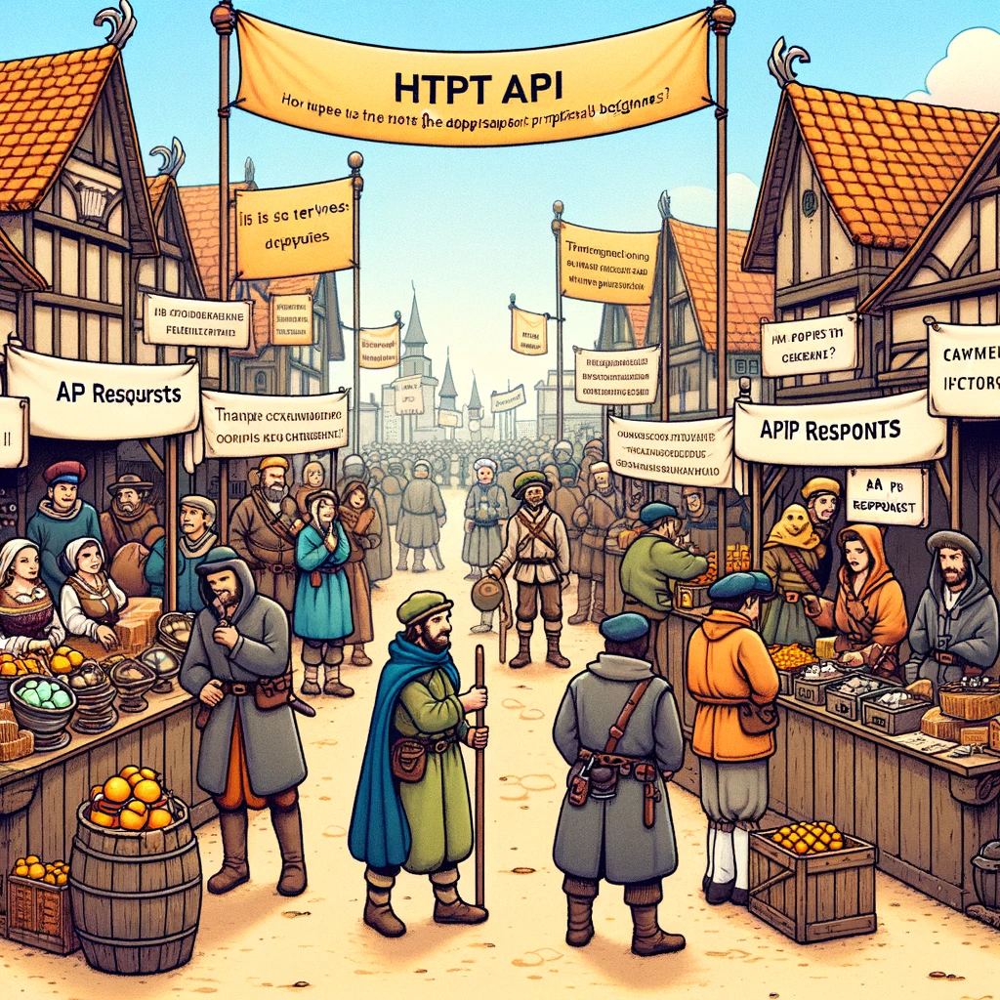
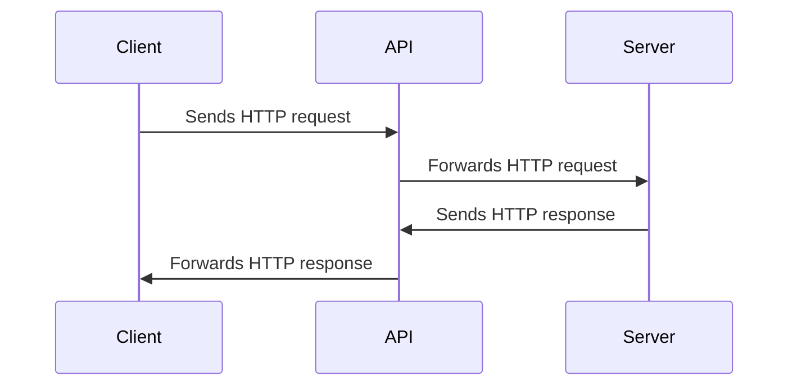

# API - Application Programming Interface

In this chapter, we will cover APIs, their types, resources, responses, and CRUD operations.



Image source: Dall-E by OpenAI

- [API - Application Programming Interface](#api---application-programming-interface)
  - [Learning Outcomes](#learning-outcomes)
  - [Types of Web APIs](#types-of-web-apis)
  - [API Resource](#api-resource)
  - [API Response](#api-response)
  - [CRUD API](#crud-api)

## Learning Outcomes

By the end of this chapter, you will be able to:

- Explain what a web API is and how it works.
- Describe the various types of web APIs, including RESTful APIs, SOAP APIs, and GraphQL APIs.
- Define API resources and URIs.
- Describe the structure of API responses and data formats such as JSON and XML.
- Explain the core operations of a CRUD API and their relationship to HTTP methods.

In the context of this course, we are referring to APIs that operate over the HTTP protocol, known as Web APIs.

A web API represents a programming interface for web applications. It is a collection of protocols, tools, and mechanisms for creating web-based applications that can communicate with each other over the Internet.

Web APIs are typically accessed via HTTP requests and responses, allowing web applications to interact with data and services provided by other applications, often on different servers or in different locations around the world.



## Types of Web APIs

- **RESTful APIs**: Representational State Transfer (REST) is a popular architectural style for creating web APIs that use HTTP requests to fetch and manipulate data. RESTful APIs are designed to be scalable, reliable, and easy to use.
- **SOAP APIs**: Simple Object Access Protocol (SOAP) is another popular protocol for creating web APIs that exchange XML-based messages. SOAP APIs are often used in enterprise-level applications that require complex messaging and transaction support.
- **GraphQL APIs**: GraphQL is a relatively new technology for creating web APIs that allows clients to request only the data they need, rather than retrieving entire resources. GraphQL APIs are commonly used in modern web and mobile applications that require efficient data retrieval and processing.

Web APIs are essential components of modern web development, enabling developers to create complex and feature-rich applications by leveraging the power of the Internet and the collective resources of the global developer community.

## API Resource

In the context of web APIs, a resource is any piece of data or functionality that can be accessed or manipulated over the Internet using a URI (Uniform Resource Identifier) and HTTP requests.

A resource can be anything from a single data unit (e.g., a customer record in a database) to a collection of related items, such as a list of products in an online store. Resources can also include more complex functionalities, such as a search engine or payment gateway.

In a RESTful API, resources are typically represented as nouns in URIs, and HTTP methods (GET, POST, PUT, DELETE, etc.) are used to perform actions on these resources. For example, a typical RESTful API might have URIs like:

- `/customers`
- `/customers/123`
- `/orders/456`
- `/products/search?q=keyword`

In this example, the first URI represents a collection of customers, the second URI represents a specific customer with ID 123, the third URI represents a specific order with ID 456, and the fourth URI represents a search query for products matching the keyword "keyword."

By clearly and consistently defining resources and URIs, web APIs can provide a simple and intuitive interface for accessing data and functionalities over the Internet, making it easier for developers to build web applications that can communicate with other systems and services, regardless of their location or implementation details.

You can find a selection of free public web APIs here: [Public APIs](https://github.com/public-apis/public-apis)

## API Response

Typically, a web API returns data in response to a request, formatted in JSON (JavaScript Object Notation) or XML (Extensible Markup Language). JSON has become the standard response format for web APIs because it is lightweight and easy to read and write. XML is still used in some web APIs, especially SOAP APIs, but it is less common compared to JSON.

A web API response may also contain additional data, such as the status of the request, error messages, metadata, and other useful information. For example, a web API response might include an HTTP status code indicating whether the request was successful, along with an error message explaining why the request failed.

An example of a typical API response might look like this:

```json
{
  "status": 200,
  "message": "OK",
  "data": {
    "id": 123,
    "name": "John Smith",
    "email": "john@smith.com",
    "phone": "555-123-4567"
  }
}
```

In this example, the web API response is a JSON object containing three key-value pairs. The first key-value pair includes the status of the request. The second key-value pair contains a message about the request. The third key-value pair includes the data returned as a result of the request.

If the API response includes a list of data, such as a list of customer records, it might look like this:

```json
{
  "status": 200,
  "message": "OK",
  "data": [
    {
      "id": 123,
      "name": "John Smith",
      "email": "john@smith.com",
      "phone": "555-123-4567"
    },
    {
      "id": 456,
      "name": "Jane Doe",
      "email": "jane@doe.com",
      "phone": "555-987-6543"
    }
  ]
}
```

## CRUD API

`CRUD` is an acronym that stands for the four basic operations that can be performed on data: **Create**, **Read**, **Update**, and **Delete**. These are also the core operations that can be performed using web APIs.

- **Create** - creates a new data record.
- **Read** - retrieves an existing data record.
- **Update** - modifies an existing data record.
- **Delete** - removes an existing data record.

These operations often correlate with HTTP methods used to perform them:

- **Create** - uses the HTTP POST method.
- **Read** - uses the HTTP GET method.
- **Update** - uses the HTTP PUT or PATCH method.
- **Delete** - uses the HTTP DELETE method.
