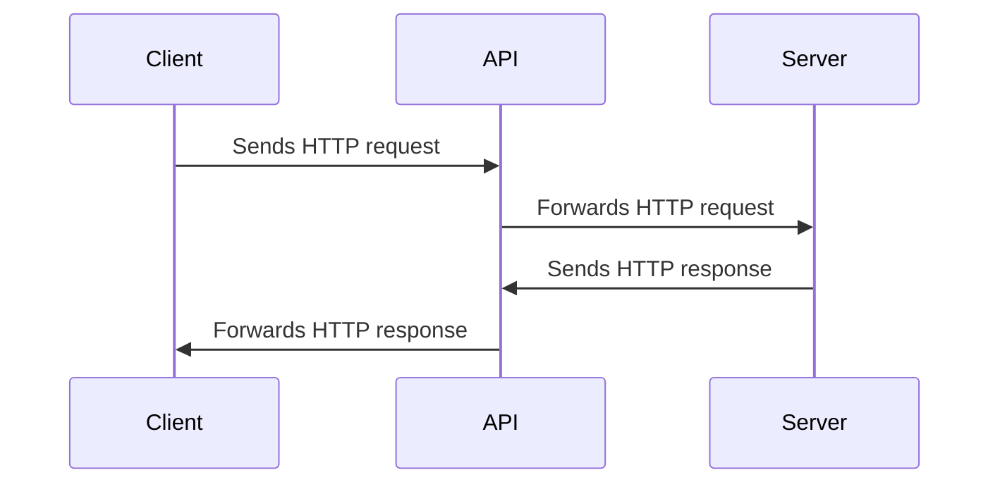

# API -Διεπαφή προγραμματισμού εφαρμογών (Application Programming Interface)

Σε αυτό το κεφάλαιο, θα καλύψουμε τα APIs, τους τύπους τους, τους πόρους, τις απαντήσεις και τις λειτουργίες CRUD.


Image source: Dall-E by OpenAI

- [API - Application Programming Interface](#api---application-programming-interface)
  - [Mαθησιακά αποτελέσματα](#Mαθησιακά-αποτελέσματα)
  - [Τύποι διαδικτυακών APIs](#Τύποι-διαδικτυακών-APIs)
  - [Πόροι API](#Πόροι-API)
  - [API Response](#api-response)
  - [CRUD API](#crud-api)

## Mαθησιακά αποτελέσματα

Στο τέλος αυτού του κεφαλαίου, θα είστε σε θέση να:

- Εξηγήστε τι είναι ένα διαδικτυακό API και πώς λειτουργεί.
- Περιγράψτε τους διάφορους τύπους διαδικτυακών APIs, συμπεριλαμβανομένων των RESTful APIs, SOAP APIs και GraphQL APIs.
- Καθορισμός πόρων και URIs API.
- Περιγράψτε τη δομή των απαντήσεων API και τις μορφές δεδομένων όπως JSON και XML.
- Εξηγήστε τις βασικές λειτουργίες ενός CRUD API και τη σχέση τους με τις μεθόδους HTTP.

Στο πλαίσιο αυτού του μαθήματος, αναφερόμαστε σε API που λειτουργούν μέσω του πρωτοκόλλου HTTP, γνωστά ως API ιστού.

Ένα διαδικτυακό API αντιπροσωπεύει μια διεπαφή προγραμματισμού για διαδικτυακές εφαρμογές. Πρόκειται για μια συλλογή πρωτοκόλλων, εργαλείων και μηχανισμών για τη δημιουργία εφαρμογών που βασίζονται στον ιστό και μπορούν να επικοινωνούν μεταξύ τους μέσω του Διαδικτύου.

Η πρόσβαση στα διαδικτυακά API γίνεται συνήθως μέσω αιτημάτων και απαντήσεων HTTP, επιτρέποντας στις διαδικτυακές εφαρμογές να αλληλεπιδρούν με δεδομένα και υπηρεσίες που παρέχονται από άλλες εφαρμογές, συχνά σε διαφορετικούς διακομιστές ή σε διαφορετικές τοποθεσίες ανά τον κόσμο.



## Τύποι διαδικτυακών APIs

- **RESTful APIs**: Η μεταφορά κατάστασης αναπαράστασης (Representational State Transfer - REST) είναι ένα δημοφιλές αρχιτεκτονικό στυλ για τη δημιουργία διαδικτυακών APIs που χρησιμοποιούν αιτήσεις HTTP για την άντληση και τον χειρισμό δεδομένων. Τα RESTful APIs έχουν σχεδιαστεί για να είναι κλιμακούμενα, αξιόπιστα και εύχρηστα.
- **SOAP APIs**: Το πρωτόκολλο SOAP (Simple Object Access Protocol) είναι ένα άλλο δημοφιλές πρωτόκολλο για τη δημιουργία διαδικτυακών API που ανταλλάσσουν μηνύματα βασισμένα σε XML. Τα API SOAP χρησιμοποιούνται συχνά σε εφαρμογές επιχειρηματικού επιπέδου που απαιτούν πολύπλοκη υποστήριξη μηνυμάτων και συναλλαγών.
- **GraphQL APIs**: Η GraphQL είναι μια σχετικά νέα τεχνολογία για τη δημιουργία διαδικτυακών API που επιτρέπει στους πελάτες να ζητούν μόνο τα δεδομένα που χρειάζονται, αντί να ανακτούν ολόκληρους πόρους. Τα GraphQL APIs χρησιμοποιούνται συνήθως σε σύγχρονες εφαρμογές ιστού και κινητών τηλεφώνων που απαιτούν αποτελεσματική ανάκτηση και επεξεργασία δεδομένων.

Τα web APIs είναι βασικά στοιχεία της σύγχρονης ανάπτυξης ιστοσελίδων, επιτρέποντας στους προγραμματιστές να δημιουργούν σύνθετες και πλούσιες σε χαρακτηριστικά εφαρμογές αξιοποιώντας τη δύναμη του Διαδικτύου και τους συλλογικούς πόρους της παγκόσμιας κοινότητας προγραμματιστών.


## API Resource

Στο πλαίσιο των διαδικτυακών APIs, ένας πόρος είναι οποιοδήποτε κομμάτι δεδομένων ή λειτουργικότητας που μπορεί να προσπελαστεί ή να χειριστεί μέσω του Διαδικτύου χρησιμοποιώντας ένα URI (Uniform Resource Identifier) και αιτήσεις HTTP.

Ένας πόρος μπορεί να είναι οτιδήποτε, από μια μεμονωμένη μονάδα δεδομένων (π.χ. μια εγγραφή πελάτη σε μια βάση δεδομένων) έως μια συλλογή σχετικών στοιχείων, όπως μια λίστα προϊόντων σε ένα ηλεκτρονικό κατάστημα. Οι πόροι μπορούν επίσης να περιλαμβάνουν πιο σύνθετες λειτουργίες, όπως μια μηχανή αναζήτησης ή μια πύλη πληρωμών.

Σε ένα RESTful API, οι πόροι αναπαρίστανται συνήθως ως ουσιαστικά σε URI και οι μέθοδοι HTTP (GET, POST, PUT, DELETE κ.λπ.) χρησιμοποιούνται για την εκτέλεση ενεργειών σε αυτούς τους πόρους. Για παράδειγμα, ένα τυπικό RESTful API μπορεί να έχει URIs όπως:

- `/customers`
- `/customers/123`
- `/orders/456`
- `/products/search?q=keyword`

Σε αυτό το παράδειγμα, το πρώτο URI αντιπροσωπεύει μια συλλογή πελατών, το δεύτερο URI αντιπροσωπεύει έναν συγκεκριμένο πελάτη με αναγνωριστικό 123, το τρίτο URI αντιπροσωπεύει μια συγκεκριμένη παραγγελία με αναγνωριστικό 456 και το τέταρτο URI αντιπροσωπεύει ένα ερώτημα αναζήτησης για προϊόντα που ταιριάζουν με τη λέξη-κλειδί "keyword".

Με τον σαφή και συνεπή ορισμό πόρων και URIs, τα web APIs μπορούν να παρέχουν μια απλή και διαισθητική διεπαφή για την πρόσβαση σε δεδομένα και λειτουργίες μέσω του Διαδικτύου, διευκολύνοντας τους προγραμματιστές να δημιουργούν web εφαρμογές που μπορούν να επικοινωνούν με άλλα συστήματα και υπηρεσίες, ανεξάρτητα από την τοποθεσία ή τις λεπτομέρειες υλοποίησής τους.

Μπορείτε να βρείτε μια επιλογή από δωρεάν δημόσια διαδικτυακά API εδώ: [Public APIs](https://github.com/public-apis/public-apis)

## API Response

Συνήθως, ένα διαδικτυακό API επιστρέφει δεδομένα ως απάντηση σε ένα αίτημα, μορφοποιημένα σε JSON (JavaScript Object Notation) ή XML (Extensible Markup Language). Το JSON έχει γίνει η τυπική μορφή απόκρισης για web APIs επειδή είναι ελαφρύ και εύκολο στην ανάγνωση και τη συγγραφή. Η XML εξακολουθεί να χρησιμοποιείται σε ορισμένα web APIs, ιδίως σε SOAP APIs, αλλά είναι λιγότερο διαδεδομένη σε σύγκριση με το JSON.

Μια απόκριση web API μπορεί επίσης να περιέχει πρόσθετα δεδομένα, όπως η κατάσταση της αίτησης, μηνύματα σφάλματος, μεταδεδομένα και άλλες χρήσιμες πληροφορίες. Για παράδειγμα, μια απόκριση web API μπορεί να περιλαμβάνει έναν κωδικό κατάστασης HTTP που υποδεικνύει αν η αίτηση ήταν επιτυχής, μαζί με ένα μήνυμα σφάλματος που εξηγεί γιατί η αίτηση απέτυχε.

Ένα παράδειγμα τυπικής απόκρισης API μπορεί να μοιάζει ως εξής:


```json
{
  "status": 200,
  "message": "OK",
  "data": {
    "id": 123,
    "name": "John Smith",
    "email": "john@smith.com",
    "phone": "555-123-4567"
  }
}
```

Σε αυτό το παράδειγμα, η απόκριση web API είναι ένα αντικείμενο JSON που περιέχει τρία ζεύγη κλειδιών-τιμών. Το πρώτο ζεύγος κλειδιών-τιμών περιλαμβάνει την κατάσταση της αίτησης. Το δεύτερο ζεύγος κλειδιών-τιμών περιέχει ένα μήνυμα σχετικά με την αίτηση. Το τρίτο ζεύγος κλειδιών-τιμών περιλαμβάνει τα δεδομένα που επιστρέφονται ως αποτέλεσμα της αίτησης.

Εάν η απόκριση API περιλαμβάνει μια λίστα δεδομένων, όπως μια λίστα με εγγραφές πελατών, μπορεί να μοιάζει με αυτό:

```json
{
  "status": 200,
  "message": "OK",
  "data": [
    {
      "id": 123,
      "name": "John Smith",
      "email": "john@smith.com",
      "phone": "555-123-4567"
    },
    {
      "id": 456,
      "name": "Jane Doe",
      "email": "jane@doe.com",
      "phone": "555-987-6543"
    }
  ]
}
```

## CRUD API

Το «CRUD» είναι ένα ακρωνύμιο που συμβολίζει τις τέσσερις βασικές πράξεις που μπορούν να εκτελεστούν σε δεδομένα: **Create**, **Read**, **Update**, και **Delete**. Αυτές είναι επίσης οι βασικές λειτουργίες που μπορούν να εκτελεστούν με τη χρήση APIs ιστού.

- **Create** - δημιουργεί ένα νέο αρχείο δεδομένων.
- **Read** - ανακτά ένα υπάρχον αρχείο δεδομένων.
- **Update** - τροποποιεί ένα υπάρχον αρχείο δεδομένων.
- **Delete** - διαγράφει ένα υπάρχον αρχείο δεδομένων.

Αυτές οι λειτουργίες συχνά συσχετίζονται με τις μεθόδους HTTP που χρησιμοποιούνται για την εκτέλεσή τους:

- **Create** - χρησιμοποιεί τη μέθοδο HTTP POST.
- **Read** - χρησιμοποιεί τη μέθοδο HTTP GET.
- **Update** - χρησιμοποιεί τη μέθοδο HTTP PUT ή PATCH.
- **Delete** - χρησιμοποιεί τη μέθοδο HTTP DELETE.
