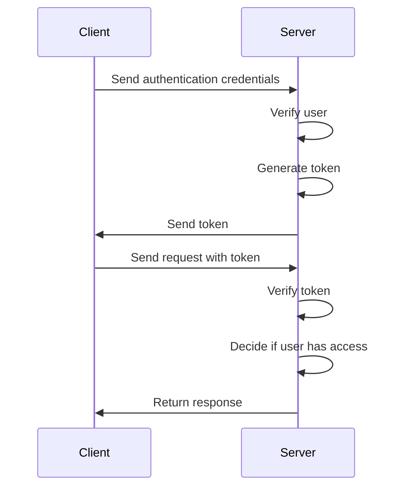

# Αυθεντικοποίηση και Eξουσιοδότηση (Authentication and Authorization)

In this section, we will discuss the concepts and processes of authentication and authorization. Authentication is the process by which a user verifies their identity in a system, while authorization determines what actions a user is allowed to perform.

Image source: Dall-E by OpenAI

- [Αυθεντικοποίηση και Eξουσιοδότηση (Authentication and Authorization)](#Αυθεντικοποίηση-και-Eξουσιοδότηση (Authentication and Authorization))
  - [Learning Outcomes](#learning-outcomes)
  - [Authentication](#authentication)
  - [Authorization](#authorization)
  - [General Overview of Authentication and Authorization](#general-overview-of-authentication-and-authorization)
  - [Authentication and Authorization Process in Front-End Applications](#authentication-and-authorization-process-in-front-end-applications)
  - [Authentication and Authorization Process in Back-End Applications](#authentication-and-authorization-process-in-back-end-applications)

## Learning Outcomes

By the end of this section, students should be able to:

- Explain the concepts of authentication and authorization.
- Describe the processes of authentication and authorization.

## Authentication

Authentication is the process by which one entity (user, system, or object) verifies the identity of another entity, typically based on some type of credentials:

- Something you know (e.g., password, PIN, CAPTCHA, security question);
- Something you have (e.g., ID card, bank card, phone number, email, hardware token, password card, certificate);
- Something you are (e.g., fingerprint, facial recognition, iris structure).

## Authorization

Authorization is the process that grants (or denies) access to (network) resources. For example, most e-commerce security systems rely on a two-step process. First, authentication checks whether the user is indeed who they claim to be, followed by authorization, which allows the user to access designated resources.

[Source](https://sisu.ut.ee/autentimine/m%C3%B5isted)

## General Overview of Authentication and Authorization

When we have an application or API with different users, we likely need to assign different roles to those users. For instance, an API might need a separate administrator role to make changes to user data or other system settings that an average user should not access.

The user authentication process typically follows these steps:

1. The user submits their authentication credentials (e.g., username and password) to the server.
2. The server checks if the provided username and password are correct.
3. The server also verifies the user's permissions (e.g., user, admin).
4. If authentication is successful, the server generates a token for the user, which is sent back to the client for future authentication. The token typically includes the user identifier, user role or permissions, and an expiration time.
5. The user sends the token with each subsequent request, allowing the server to identify the user and their permissions.
6. The server verifies the token and decides if the user has the right to make the requested action.
7. If the user has the right, the request is processed accordingly.
8. If the user does not have the right, the request returns an appropriate error message or status.
9. The authentication token expires after a certain period, and the user must re-authenticate to receive a new token.

## Authentication and Authorization Process in Front-End Applications

From the front-end perspective, we need to provide the user with a way to enter their username and password (or another authentication method) and then send this data to the server. If authentication is successful, the server sends back an authentication token, which must be stored and sent with each request.

For example, the token is typically stored in the user's browser's `localStorage` or `sessionStorage` object. When the user closes the browser or tab, the `sessionStorage` object is cleared, but the `localStorage` object remains even when the browser is closed and reopened.

## Authentication and Authorization Process in Back-End Applications

From the back-end perspective, we need to create server-side functionality to receive user authentication credentials, verify them, and generate an authentication token. The server must also be able to check the token sent with each request and decide if the user has the right to perform the requested action.

In this course, we will use the `JWT` (JSON Web Token) technology for generating and verifying tokens. JWT is a standard that defines a compact and self-contained way to securely transmit information as a JSON object.

When generating the JWT, a secret key is used, which is kept only on the server side and is used to sign the token. Once signed, the token cannot be modified without altering the signature, ensuring the token's authenticity.

To verify the token, we use the same secret key to decode the token and check if it is valid and the user is authenticated.

We implement the token verification using a middleware function that checks each request and decides whether the user has the right to perform the requested action. This function can be applied to any routes where we want to enforce authentication and authorization.
