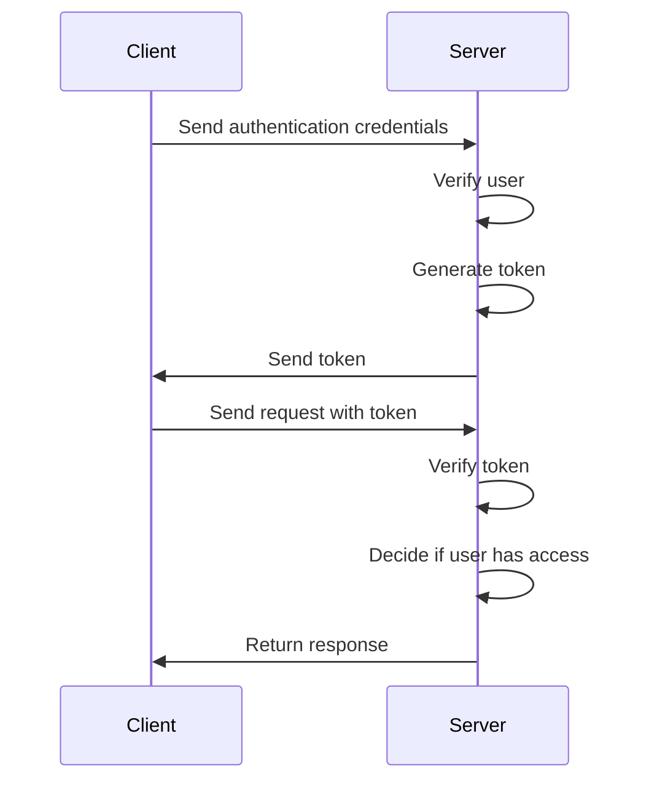

# Αυθεντικοποίηση και Eξουσιοδότηση (Authentication and Authorization)

Σε αυτή την ενότητα, θα συζητήσουμε τις έννοιες και τις διαδικασίες της αυθεντικοποίησης και της εξουσιοδότησης. Η αυθεντικοποίηση είναι η διαδικασία με την οποία ένας χρήστης επαληθεύει την ταυτότητά του σε ένα σύστημα, ενώ η εξουσιοδότηση καθορίζει ποιες ενέργειες επιτρέπεται να εκτελεί ένας χρήστης.

Image source: Dall-E by OpenAI

- [Αυθεντικοποίηση και Eξουσιοδότηση (Authentication and Authorization)](#Αυθεντικοποίηση-και-Eξουσιοδότηση (Authentication and Authorization))
  - [Μαθησιακά αποτελέσματα](#Μαθησιακά-αποτελέσματα)
  - [Αυθεντικοποίηση (Authentication)](#Αυθεντικοποίηση (Authentication))
  - [Εξουσιοδότηση (Authorization)](#Εξουσιοδότηση (Authorization))
  - [Γενική επισκόπηση της αυθεντικοποίησης και εξουσιοδότησης](#Γενική-επισκόπηση-της-αυθεντικοποίησης-και-εξουσιοδότηση)
  - [Διαδικασία ελέγχου ταυτότητας και εξουσιοδότησης σε εφαρμογές Front-End](#Διαδικασία-ελέγχου-ταυτότητας-και-εξουσιοδότησης-σε-εφαρμογές-Front--End)
  - [Διαδικασία ελέγχου ταυτότητας και εξουσιοδότησης σε εφαρμογές Back-End](#Διαδικασία-ελέγχου-ταυτότητας-και-εξουσιοδότησης-σε-εφαρμογές-Back--End)

## Μαθησιακά αποτελέσματα

Στο τέλος αυτής της ενότητας, οι μαθητές θα πρέπει να είναι σε θέση να:

- Να εξηγούν τις έννοιες της αυθεντικοποίησης και της εξουσιοδότησης.
- Να περιγράφουν τις διαδικασίες αυθεντικοποίησης και εξουσιοδότησης.

## Αυθεντικοποίηση (Authentication)

Αυθεντικοποίηση είναι η διαδικασία με την οποία μια οντότητα (χρήστης, σύστημα ή αντικείμενο) επαληθεύει την ταυτότητα μιας άλλης οντότητας, συνήθως βάσει κάποιου τύπου διαπιστευτηρίων:

- Κάτι που γνωρίζετε (π.χ. κωδικός πρόσβασης, PIN, CAPTCHA, ερώτηση ασφαλείας),
- Κάτι που έχετε (π.χ. ταυτότητα, τραπεζική κάρτα, αριθμός τηλεφώνου, ηλεκτρονικό ταχυδρομείο, κουπόνι υλικού, κάρτα κωδικού πρόσβασης, πιστοποιητικό),
- Κάτι που είστε (π.χ. δακτυλικό αποτύπωμα, αναγνώριση προσώπου, δομή ίριδας).

## Εξουσιοδότηση (Authorization)

Η εξουσιοδότηση είναι η διαδικασία που χορηγεί (ή αρνείται) την πρόσβαση σε πόρους (δικτύου). Για παράδειγμα, τα περισσότερα συστήματα ασφαλείας ηλεκτρονικού εμπορίου βασίζονται σε μια διαδικασία δύο βημάτων. Αρχικά, η αυθεντικοποίηση ελέγχει αν ο χρήστης είναι όντως αυτός που ισχυρίζεται ότι είναι, και ακολουθεί η εξουσιοδότηση, η οποία επιτρέπει στον χρήστη να έχει πρόσβαση σε καθορισμένους πόρους.

[Source](https://sisu.ut.ee/autentimine/m%C3%B5isted)

## Γενική επισκόπηση της αυθεντικοποίησης και εξουσιοδότησης

Όταν έχουμε μια εφαρμογή ή ένα API με διαφορετικούς χρήστες, είναι πιθανό να χρειαστεί να αναθέσουμε διαφορετικούς ρόλους σε αυτούς τους χρήστες. Για παράδειγμα, ένα API μπορεί να χρειάζεται έναν ξεχωριστό ρόλο διαχειριστή για να πραγματοποιεί αλλαγές στα δεδομένα των χρηστών ή σε άλλες ρυθμίσεις του συστήματος στις οποίες ένας μέσος χρήστης δεν πρέπει να έχει πρόσβαση.

Η διαδικασία ελέγχου ταυτότητας χρήστη ακολουθεί συνήθως τα εξής βήματα:

1. Ο χρήστης υποβάλλει στον διακομιστή τα διαπιστευτήρια πιστοποίησής του (π.χ. όνομα χρήστη και κωδικό πρόσβασης).
2. Ο διακομιστής ελέγχει αν το όνομα χρήστη και ο κωδικός πρόσβασης που παρέχονται είναι σωστά.
3. Ο διακομιστής ελέγχει επίσης τα δικαιώματα του χρήστη (π.χ. χρήστης, διαχειριστής).
4. Εάν ο έλεγχος ταυτότητας είναι επιτυχής, ο διακομιστής δημιουργεί ένα token για τον χρήστη, το οποίο αποστέλλεται πίσω στον πελάτη για μελλοντικό έλεγχο ταυτότητας. Το token τυπικά περιλαμβάνει το αναγνωριστικό χρήστη, το ρόλο ή τα δικαιώματα του χρήστη και έναν χρόνο λήξης.
5. Ο χρήστης στέλνει το token με κάθε επόμενη αίτηση, επιτρέποντας στον διακομιστή να αναγνωρίζει τον χρήστη και τα δικαιώματά του.
6. Ο διακομιστής επαληθεύει το token και αποφασίζει αν ο χρήστης έχει το δικαίωμα να προβεί στη ζητούμενη ενέργεια.
7. Εάν ο χρήστης έχει το δικαίωμα, το αίτημα επεξεργάζεται αναλόγως.
8. Εάν ο χρήστης δεν έχει το δικαίωμα, η αίτηση επιστρέφει ένα κατάλληλο μήνυμα σφάλματος ή κατάσταση.
9. Το κουπόνι ελέγχου ταυτότητας λήγει μετά από ένα ορισμένο χρονικό διάστημα και ο χρήστης πρέπει να πραγματοποιήσει εκ νέου έλεγχο ταυτότητας για να λάβει ένα νέο κουπόνι.

## Διαδικασία ελέγχου ταυτότητας και εξουσιοδότησης σε εφαρμογές Front-End

Από τη σκοπιά του front-end, πρέπει να παρέχουμε στο χρήστη έναν τρόπο να εισάγει το όνομα χρήστη και τον κωδικό πρόσβασής του (ή άλλη μέθοδο ελέγχου ταυτότητας) και στη συνέχεια να στείλουμε αυτά τα δεδομένα στο διακομιστή. Εάν ο έλεγχος ταυτότητας είναι επιτυχής, ο διακομιστής στέλνει πίσω ένα διακριτικό ελέγχου ταυτότητας, το οποίο πρέπει να αποθηκεύεται και να αποστέλλεται με κάθε αίτηση.

Για παράδειγμα, το token αποθηκεύεται συνήθως στο αντικείμενο `localStorage` ή `sessionStorage` του προγράμματος περιήγησης του χρήστη. Όταν ο χρήστης κλείνει το πρόγραμμα περιήγησης ή την καρτέλα, το αντικείμενο `sessionStorage` διαγράφεται, αλλά το αντικείμενο `localStorage` παραμένει ακόμη και όταν το πρόγραμμα περιήγησης κλείνει και ανοίγει ξανά.

## Διαδικασία ελέγχου ταυτότητας και εξουσιοδότησης σε εφαρμογές Back-End

Από τη σκοπιά του back-end, πρέπει να δημιουργήσουμε μια λειτουργικότητα στην πλευρά του διακομιστή για να λαμβάνουμε τα διαπιστευτήρια πιστοποίησης ταυτότητας του χρήστη, να τα επαληθεύουμε και να δημιουργούμε ένα διακριτικό ελέγχου ταυτότητας. Ο διακομιστής πρέπει επίσης να είναι σε θέση να ελέγχει το token που αποστέλλεται με κάθε αίτηση και να αποφασίζει αν ο χρήστης έχει το δικαίωμα να εκτελέσει τη ζητούμενη ενέργεια.

Σε αυτό το μάθημα, θα χρησιμοποιήσουμε την τεχνολογία `JWT` (JSON Web Token) για τη δημιουργία και την επαλήθευση μαρκών. Το JWT είναι ένα πρότυπο που ορίζει έναν συμπαγή και αυτόνομο τρόπο ασφαλούς μετάδοσης πληροφοριών ως αντικείμενο JSON.

Κατά τη δημιουργία του JWT, χρησιμοποιείται ένα μυστικό κλειδί, το οποίο διατηρείται μόνο στην πλευρά του διακομιστή και χρησιμοποιείται για την υπογραφή του token. Μόλις υπογραφεί, το token δεν μπορεί να τροποποιηθεί χωρίς να τροποποιηθεί η υπογραφή, εξασφαλίζοντας την αυθεντικότητα του token.

Για να επαληθεύσουμε το token, χρησιμοποιούμε το ίδιο μυστικό κλειδί για να αποκωδικοποιήσουμε το token και να ελέγξουμε αν είναι έγκυρο και αν ο χρήστης έχει πιστοποιηθεί.

Υλοποιούμε την επαλήθευση του token χρησιμοποιώντας μια λειτουργία ενδιάμεσου λογισμικού που ελέγχει κάθε αίτηση και αποφασίζει αν ο χρήστης έχει το δικαίωμα να εκτελέσει τη ζητούμενη ενέργεια. Αυτή η συνάρτηση μπορεί να εφαρμοστεί σε οποιεσδήποτε διαδρομές όπου θέλουμε να επιβάλλουμε την αυθεντικοποίηση και την εξουσιοδότηση.
