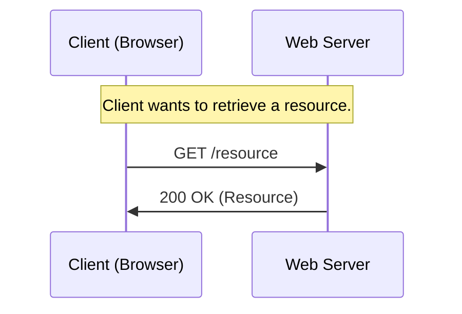
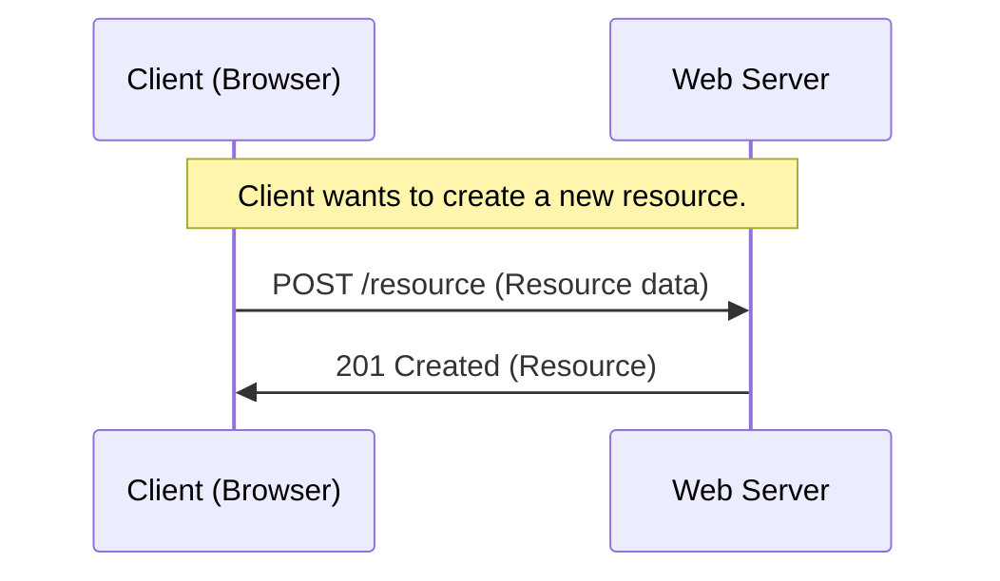
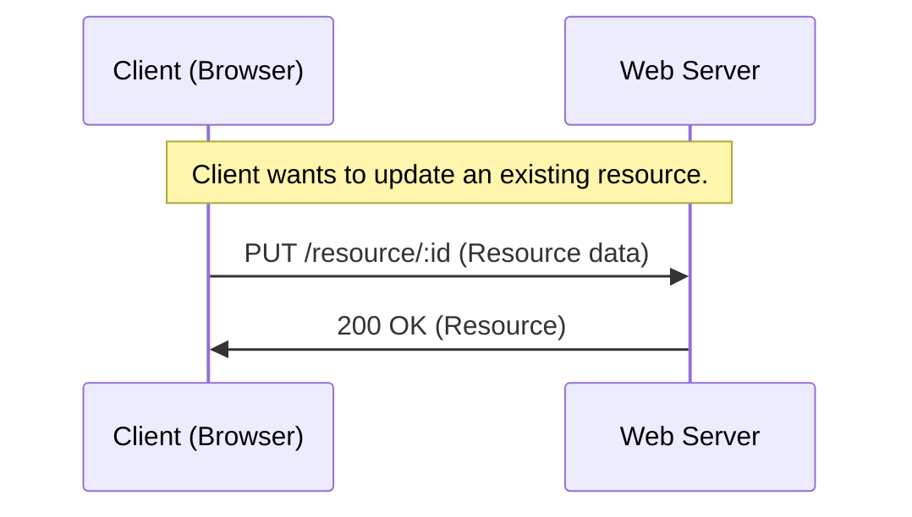
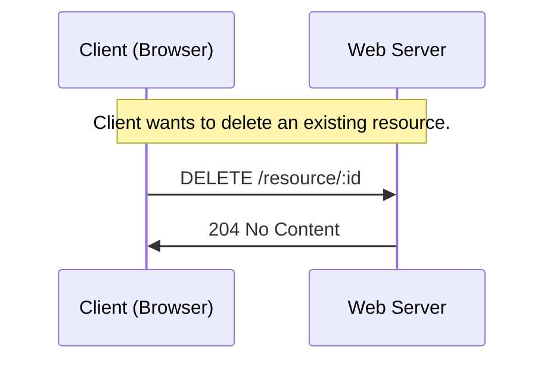
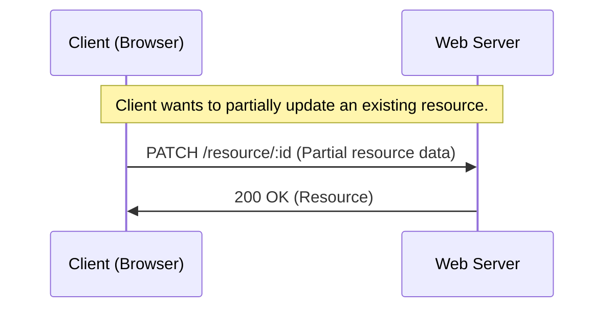

# HTTP Request Methods

Σε αυτό το κεφάλαιο, θα συζητήσουμε τις διάφορες μεθόδους αίτησης HTTP που χρησιμοποιούνται για την αλληλεπίδραση με APIs ιστού.

Image source: Dall-E by OpenAI

- [HTTP Request Methods](#http-request-methods)
  - [GET](#get)
  - [POST](#post)
  - [PUT](#put)
  - [DELETE](#delete)
  - [PATCH](#patch)
  - [OPTIONS](#options)
    - [Πηγές](#Πηγές)

Οι μέθοδοι αίτησης HTTP χρησιμοποιούνται για να υποδείξουν την επιθυμητή ενέργεια που πρέπει να εκτελεστεί σε έναν πόρο που προσδιορίζεται από το URI (Uniform Resource Identifier) στην αίτηση HTTP.

## GET

**GET**: Η μέθοδος GET χρησιμοποιείται για την ανάκτηση ενός πόρου από το διακομιστή. Είναι μια ασφαλής και ιδιοσυγκρασιακή μέθοδος, πράγμα που σημαίνει ότι πολλαπλές πανομοιότυπες αιτήσεις έχουν το ίδιο αποτέλεσμα με μια απλή αίτηση. Η απάντηση σε ένα αίτημα GET περιλαμβάνει συνήθως τον αιτούμενο πόρο ή την αναπαράστασή του στο σώμα του μηνύματος.

Σε αυτό το παράδειγμα, ο πελάτης στέλνει μια αίτηση `HTTP GET` στο διακομιστή για να ανακτήσει έναν πόρο. Ο διακομιστής απαντά με τον κωδικό κατάστασης `200 OK` μαζί με τον ζητούμενο πόρο.

## POST

**POST**: Η μέθοδος POST χρησιμοποιείται για την αποστολή δεδομένων στο διακομιστή για τη δημιουργία ή την ενημέρωση ενός πόρου. Δεν είναι ιδιοπαθής, πράγμα που σημαίνει ότι πολλαπλές πανομοιότυπες αιτήσεις μπορεί να έχουν διαφορετικά αποτελέσματα. Η απάντηση σε ένα αίτημα POST περιλαμβάνει συνήθως την αναπαράσταση του δημιουργημένου ή ενημερωμένου πόρου στο σώμα του μηνύματος.

Σε αυτό το παράδειγμα, ο πελάτης στέλνει μια αίτηση `HTTP POST` στο διακομιστή για τη δημιουργία ενός νέου πόρου, παρέχοντας τα απαραίτητα δεδομένα στο σώμα της αίτησης. Ο διακομιστής απαντά με τον κωδικό κατάστασης `201 Created` μαζί με τον πρόσφατα δημιουργημένο πόρο.

## PUT

**PUT**: Η μέθοδος PUT χρησιμοποιείται για την ενημέρωση ενός υπάρχοντος πόρου στο διακομιστή. Είναι idempotent, που σημαίνει ότι πολλαπλά πανομοιότυπα αιτήματα έχουν το ίδιο αποτέλεσμα με ένα μόνο αίτημα. Η απάντηση σε ένα αίτημα PUT περιλαμβάνει συνήθως την αναπαράσταση του ενημερωμένου πόρου στο σώμα του μηνύματος.

Σε αυτό το παράδειγμα, ο πελάτης στέλνει μια αίτηση `HTTP PUT` στον διακομιστή για να ενημερώσει έναν υπάρχοντα πόρο, παρέχοντας τα απαραίτητα δεδομένα στο σώμα της αίτησης. Ο διακομιστής απαντά με τον κωδικό κατάστασης `200 OK` μαζί με τον ενημερωμένο πόρο.

## DELETE

**DELETE**: Η μέθοδος DELETE χρησιμοποιείται για την αφαίρεση ενός πόρου από το διακομιστή. Είναι idempotent, που σημαίνει ότι πολλαπλά πανομοιότυπα αιτήματα έχουν το ίδιο αποτέλεσμα με ένα μόνο αίτημα. Η απάντηση σε μια αίτηση DELETE περιλαμβάνει συνήθως ένα μήνυμα επιβεβαίωσης στο σώμα του μηνύματος.

Σε αυτό το παράδειγμα, ο πελάτης στέλνει μια αίτηση `HTTP DELETE` στον διακομιστή για να διαγράψει έναν υπάρχοντα πόρο. Ο διακομιστής επεξεργάζεται την αίτηση, διαγράφει τον πόρο και απαντά με κωδικό κατάστασης `204 No Content`.

## PATCH

**PATCH**: Η μέθοδος PATCH χρησιμοποιείται για τη μερική ενημέρωση ενός υπάρχοντος πόρου στο διακομιστή. Δεν είναι ιδιοπαθής, πράγμα που σημαίνει ότι πολλαπλές πανομοιότυπες αιτήσεις μπορεί να έχουν διαφορετικά αποτελέσματα. Η απάντηση σε ένα αίτημα PATCH περιλαμβάνει συνήθως την αναπαράσταση του ενημερωμένου πόρου στο σώμα του μηνύματος.

Σε αυτό το παράδειγμα, ο πελάτης στέλνει μια αίτηση «HTTP PATCH» στο διακομιστή για να ενημερώσει μερικώς έναν υπάρχοντα πόρο, παρέχοντας μόνο τα απαραίτητα δεδομένα που πρέπει να τροποποιηθούν στο σώμα της αίτησης. Ο διακομιστής επεξεργάζεται την αίτηση, ενημερώνει μερικώς τον πόρο και απαντά με κωδικό κατάστασης `200 OK` μαζί με τον ενημερωμένο πόρο.

## OPTIONS

Η μέθοδος OPTIONS χρησιμοποιείται για την ανάκτηση των διαθέσιμων επιλογών για έναν πόρο. Είναι μια ασφαλής και ιδιοσυγκρασιακή μέθοδος, που σημαίνει ότι πολλαπλές πανομοιότυπες αιτήσεις έχουν το ίδιο αποτέλεσμα με μια απλή αίτηση. Η απάντηση σε μια αίτηση OPTIONS περιλαμβάνει συνήθως πληροφορίες σχετικά με τις υποστηριζόμενες μεθόδους, επικεφαλίδες και άλλες επιλογές για τον πόρο.

Αυτές οι μέθοδοι αίτησης HTTP επιτρέπουν στους πελάτες να αλληλεπιδρούν με τους πόρους του διακομιστή με έναν τυποποιημένο και συνεπή τρόπο, ανεξάρτητα από τις συγκεκριμένες λεπτομέρειες υλοποίησης του διακομιστή.

### Πηγές

- [HTTP Methods - MDN](https://developer.mozilla.org/en-US/docs/Web/HTTP/Methods)
