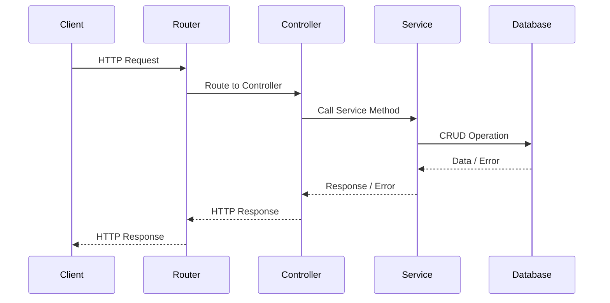

# API Structuring

Σε αυτό το μάθημα, θα εξερευνήσουμε τη διάρθρωση API και τη σημασία της. Η σωστή διάρθρωση του API καθιστά το API πιο ευανάγνωστο, διαχειρίσιμο και τροποποιήσιμο.

- [API Structuring](#api-structuring)
  - [Μαθησιακά αποτελέσματα](#Μαθησιακά-αποτελέσματα)
  - [Γιατί είναι σημαντική η διάρθρωση API;](#Γιατί-είναι-σημαντική-η-διάρθρωση-API)
  - [Μοντέλα](#Μοντέλα)
  - [Ελεγκτές](#Ελεγκτές)
  - [Υπηρεσίες](#Υπηρεσίες)
  - [Routers](#routers)
  - [Διάγραμμα ροής](#Διάγραμμα-ροής)

## Μαθησιακά αποτελέσματα

Στο τέλος αυτού του μαθήματος, θα είστε σε θέση να:

- Να εξηγήσετε γιατί η δόμηση API είναι σημαντική.
- Να περιγράψετε τις αρχές της δόμησης API, όπως τα μοντέλα, οι ελεγκτές, οι υπηρεσίες και οι δρομολογητές.
- Να εξηγείτε πώς η δόμηση του API βοηθά στην καλύτερη διαχείριση και ανάπτυξη του API.

## Γιατί είναι σημαντική η διάρθρωση API;

Εάν όλος ο κώδικας API είναι γραμμένος σε ένα μόνο αρχείο, η ανάγνωση, η διαχείριση και η τροποποίησή του γίνεται γρήγορα δύσκολη. Επομένως, είναι καλή πρακτική να χωρίζετε το API σε διαφορετικές ενότητες, καθεμία από τις οποίες ασχολείται με μια συγκεκριμένη πτυχή.

Υπάρχουν αρκετοί διαφορετικοί τρόποι και αρχές για τη δόμηση ενός API, αλλά γενικά, οι πιο σημαντικές πτυχές είναι ότι το API είναι ευανάγνωστο, διαχειρίσιμο και τροποποιήσιμο.

Σε αυτό το υλικό, θα χρησιμοποιήσουμε τις ακόλουθες αρχές για τη δόμηση του API:

- Κάθε πόρος χωρίζεται σε τουλάχιστον τέσσερις ενότητες: `model`, `controller`, `service` και `router`.
- Κάθε ενότητα βρίσκεται σε ξεχωριστό αρχείο.
- Κάθε ενότητα που σχετίζεται με τον πόρο βρίσκεται σε έναν κατάλογο με το όνομα του πόρου.

Για παράδειγμα:

```text
src
├───components
│   ├───users
│   │   ├───usersControllers.js
│   │   ├───usersModels.js
│   │   ├───usersRouters.js
│   │   └───usersServices.js
│   └───...
app.js
...
```

## Μοντέλα

Ένα μοντέλο είναι μια ενότητα που περιγράφει τη δομή ενός πόρου. Χρησιμοποιώντας ένα μοντέλο, μπορείτε να ορίσετε ποια πεδία έχει ένας πόρος, ποια πεδία είναι υποχρεωτικά, ποια προαιρετικά κ.ο.κ.

## Ελεγκτές

Οι ελεγκτές λειτουργούν ως ενδιάμεσοι μεταξύ των αιτήσεων και των απαντήσεων HTTP και της λογικής της εφαρμογής. Συνήθως, οι ελεγκτές είναι υπεύθυνοι για τις ακόλουθες εργασίες:

- **Αίτημα επικύρωσης δεδομένων**: Είναι σωστές οι ληφθείσες παράμετροι, το σώμα ή οι επικεφαλίδες της αίτησης;
- **Δρομολόγηση αιτήσεων**: Προώθηση του αιτήματος στην κατάλληλη υπηρεσία ή υπηρεσία για περαιτέρω επεξεργασία.
- **Διαχείριση σφαλμάτων**: Έλεγχος της ύπαρξης και της ορθότητας των δεδομένων που επιστρέφονται από την υπηρεσία. Εάν προκύψει σφάλμα, μορφοποιήστε το ως κατάλληλη απόκριση σφάλματος HTTP.
- **Μορφοποίηση απάντησης**: Διαμόρφωση των δεδομένων που λαμβάνονται από την υπηρεσία σε κατάλληλη απόκριση HTTP.
- **Καταγραφή αιτημάτων/απαντήσεων**:Καταγραφή αιτημάτων και απαντήσεων όταν είναι απαραίτητο.
- **Ασφάλεια**: Εφαρμογή ελέγχου ταυτότητας και εξουσιοδότησης όπως απαιτείται.

Αυτές οι λειτουργίες και δραστηριότητες μπορεί να ποικίλλουν ανάλογα με τις απαιτήσεις της εφαρμογής και ορισμένες λειτουργίες μπορούν να ανατεθούν σε ενδιάμεσο λογισμικό.

## Υπηρεσίες

Οι υπηρεσίες περιέχουν επιχειρησιακή λογική ή λογική εφαρμογής και επομένως είναι ανεξάρτητες από τους ελεγκτές. Οι υπηρεσίες ασχολούνται με εργασίες όπως:

- **Data Management**: Εκτέλεση λειτουργιών CRUD (Δημιουργία, ανάγνωση, ενημέρωση, διαγραφή) σε μια βάση δεδομένων ή άλλη πηγή δεδομένων.
- **Business Rules**: Υπολογισμοί, επικύρωση ή μετασχηματισμός δεδομένων κ.λπ.
- **Third-party Integration**: Σύνδεση με υπηρεσίες/API τρίτων για ανάκτηση/αποστολή δεδομένων.
- **Cache Management**: Βελτίωση των επιδόσεων με χρήση προσωρινής αποθήκευσης.
- **Error Handling**: Διαχείριση σφαλμάτων και διαβίβασή τους στον ελεγκτή.

## Routers

Οι δρομολογητές είναι μονάδες που είναι υπεύθυνες για την καθοδήγηση των αιτήσεων στον κατάλληλο ελεγκτή. Ένας δρομολογητής εξετάζει για ποιον πόρο και ποια μέθοδο αίτησης προορίζεται η αίτηση και την κατευθύνει στον αντίστοιχο ελεγκτή πόρων.

## Διάγραμμα ροής

Το παράδειγμα που αναφέρθηκε προηγουμένως απεικονίζεται στο ακόλουθο διάγραμμα:



1. **Client**: Ο χρήστης ή το σύστημα που στέλνει ένα αίτημα HTTP στο API.
2. **Router**: Ο δρομολογητής αποφασίζει ποιος ελεγκτής θα χειριστεί την αίτηση.
3. **Controller**: Ο ελεγκτής επικυρώνει την αίτηση και καλεί την κατάλληλη υπηρεσία.
4. **Service**: Η υπηρεσία περιέχει επιχειρησιακή λογική και λογική εφαρμογής και αλληλεπιδρά με τη βάση δεδομένων ή άλλο πόρο.
5. **Database**: Η βάση δεδομένων από την οποία η υπηρεσία ανακτά ή αποθηκεύει δεδομένα.

- Ο πελάτης στέλνει ένα αίτημα HTTP, το οποίο φτάνει πρώτα στον δρομολογητή.
- Ο δρομολογητής κατευθύνει το αίτημα στον κατάλληλο ελεγκτή.
- Ο ελεγκτής καλεί την κατάλληλη μέθοδο υπηρεσίας.
- Η υπηρεσία εκτελεί την απαραίτητη λειτουργία CRUD στη βάση δεδομένων.
- Η βάση δεδομένων απαντά στην υπηρεσία, η οποία με τη σειρά της προωθεί αυτές τις πληροφορίες ή το σφάλμα στον ελεγκτή.
- Ο ελεγκτής μορφοποιεί και αποστέλλει την απάντηση HTTP, η οποία περνάει από τον δρομολογητή και επιστρέφει στον πελάτη.
