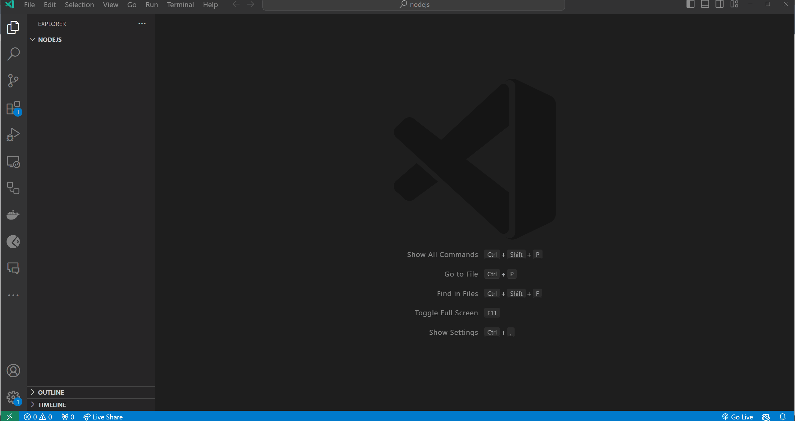
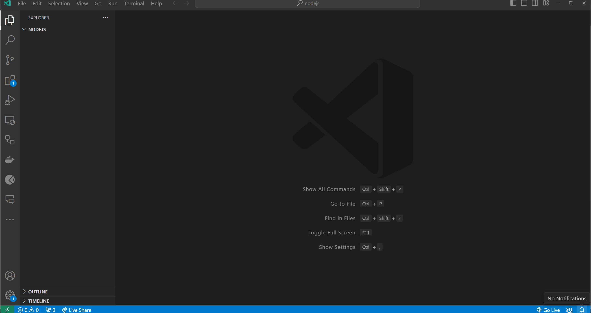
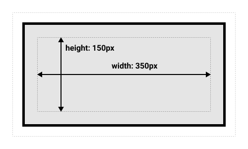

# Cascading Style Sheets (CSS)

Σε αυτό τη θεματική ενότητα, θα μάθουμε για τα Cascading Style Sheets (CSS).

- [Cascading Style Sheets (CSS)](#cascading-style-sheets-css)
  - [Μαθησιακά αποτελέσματα](#Μαθησιακά-αποτελέσματα)
  - [Τι είναι η CSS;](#Τι-είναι-η-CSS)
  - [Επιλογείς](#Επιλογείς)
    - [Επιλογείς ετικέτας](#Επιλογείς-ετικέτας)
    - [Επιλογείς κλάσης](#Επιλογείς-κλάσης)
    - [Επιλογείς ID](#Επιλογείς-ID)
    - [Επιλογείς γνωρισμάτων](#Επιλογείς-γνωρισμάτων)
    - [Επιλογείς ψευδο-κλάσης](#Επιλογείς-ψευδο--κλάσης)
  - [Ιδιότητες](#properties)
  - [Τιμές](#values)
  - [Μονάδες](#units)
    - [Απόλυτες μονάδες](#Απόλυτες-μονάδες)
    - [Σχετικές μονάδες](#Σχετικές-μονάδες)
    - [Τιμές που δεν απαιτούν μονάδες](#Τιμές-που-δεν-απαιτούν-μονάδες)
  - [Χρώματα](#Χρώματα)
    - [Ονόματα χρωμάτων](#Ονόματα-χρωμάτων)
    - [RGB](#rgb)
    - [Δεκαεξαδικό Σύστημα](#Δεκαεξαδικό-Σύστημα)
    - [RGBA](#rgba)
  - [Πώς να εφαρμόζετε CSS στην HTML](#Πώς-να-εφαρμόζετε-CSS-στην-HTML)
    - [Ενσωματωμένη CSS](#inline-css)
    - [Εσωτερική CSS](#internal-css)
    - [Εξωτερική CSS](#external-css)
  - [Συνδυασμός διαφορετικών τρόπων εφαρμογής CSS στην HTML](#Συνδυασμός-διαφορετικών-τρόπων-εφαρμογής-CSS-στην-HTMLl)
  - [Μοντέλο Box](#Μοντέλο-Box)
    - [Τυπικό μοντέλο Box](#πρότυπο-μοντέλο-box)
    - [Εναλλακτικό μοντέλο box](#Εναλλακτικό-μοντέλο-box)
  - [Ασκήσεις](#Ασκήσεις)
    - [Άσκηση 1 - Βασική διαμόρφωση CSS](#Άσκηση-1---Βασική-διαμόρφωση-CSS)
    - [Άσκηση 2: Δημιουργία μιας απλής γραμμής πλοήγησης](#Άσκηση-2-:-Δημιουργία-μιας-απλής-γραμμής-πλοήγησης)
    - [Άσκηση 3: Διαμόρφωση μιας ενότητας περιεχομένου με στήλες](#Άσκηση-3:-Διαμόρφωση-μιας-ενότητας-περιεχομένου-με-στήλες)

## Μαθησιακά αποτελέσματα

Αφού ολοκληρώσετε αυτό τη θεματική ενότητα, θα είστε σε θέση να:

- Εξηγήστε τι είναι το CSS και πώς χρησιμοποιείται για τη διαμόρφωση στοιχείων HTML.
- Χρήση επιλογέων CSS για την επιλογή στοιχείων HTML.
- Χρησιμοποιήστε ιδιότητες CSS για να καθορίσετε τον τρόπο με τον οποίο θα πρέπει να διαμορφωθούν τα επιλεγμένα στοιχεία HTML.
- Χρησιμοποιήστε τιμές CSS για να καθορίσετε την τιμή μιας ιδιότητας CSS.
- Χρησιμοποιήστε μονάδες CSS για να καθορίσετε το μέγεθος ενός στοιχείου.
- Χρησιμοποιήστε τα χρώματα CSS για να καθορίσετε το χρώμα ενός στοιχείου.
- Εφαρμόστε CSS στην HTML χρησιμοποιώντας inline CSS, internal CSS και external CSS.
- Συνδυάστε διαφορετικούς τρόπους εφαρμογής των CSS στην HTML.
- Εξηγήστε τι είναι το μοντέλο κουτιού και πώς χρησιμοποιείται για τη διάταξη των στοιχείων HTML.
- Εξηγήστε τη διαφορά μεταξύ του τυπικού μοντέλου κουτιού και του εναλλακτικού μοντέλου κουτιού.
- Χρησιμοποιήστε το τυπικό μοντέλο πλαισίου και το εναλλακτικό μοντέλο πλαισίου για τη διάταξη των στοιχείων HTML.


## Τι είναι η CSS?

Η CSS είναι μια γλώσσα που χρησιμοποιείται για τη διαμόρφωση στοιχείων HTML. Χρησιμοποιείται για την προσθήκη χρωμάτων, γραμματοσειρών, διατάξεων και άλλων στοιχείων σε ιστοσελίδες. Η CSS είναι μια τεχνολογία ακρογωνιαίος λίθος του Παγκόσμιου Ιστού, μαζί με την HTML και τη JavaScript.

Η CSS έχει σχεδιαστεί για να επιτρέπει το διαχωρισμό της παρουσίασης και του περιεχομένου, συμπεριλαμβανομένης της διάταξης, των χρωμάτων και των γραμματοσειρών. Αυτός ο διαχωρισμός βελτιώνει την προσβασιμότητα του περιεχομένου, παρέχει μεγαλύτερη ευελιξία και έλεγχο στον καθορισμό των γνωρισμάτων παρουσίασης, επιτρέπει σε πολλές ιστοσελίδες να μοιράζονται τη μορφοποίηση καθορίζοντας τα σχετικά CSS σε ξεχωριστό αρχείο `.css` και μειώνει την πολυπλοκότητα και την επανάληψη στο δομικό περιεχόμενο.

Όταν η HTML περιγράφει τη δομή μιας ιστοσελίδας, η CSS περιγράφει τον τρόπο με τον οποίο αυτή η δομή πρέπει να φαίνεται. Η CSS είναι μια γλώσσα φύλλων στυλ που σας επιτρέπει να καθορίσετε τον τρόπο με τον οποίο θα πρέπει να εμφανίζονται τα στοιχεία της ιστοσελίδας σας. Χρησιμοποιείται για τη διαμόρφωση των ιστοσελίδων που έχουν γραφτεί σε HTML.

Για παράδειγμα, αν θέλετε να αλλάξετε το χρώμα του κειμένου στην ιστοσελίδα σας, μπορείτε να χρησιμοποιήσετε CSS για να το κάνετε αυτό. Μπορείτε επίσης να χρησιμοποιήσετε CSS για να αλλάξετε το μέγεθος της γραμματοσειράς, την οικογένεια γραμματοσειράς, το χρώμα φόντου, το χρώμα των περιθωρίων, το πλάτος των περιθωρίων, το στυλ των περιθωρίων κ.λπ:

Όταν παίρνουμε ένα απλό έγγραφο HTML και του προσθέτουμε κάποια CSS, έχουμε το ακόλουθο αποτέλεσμα:

```html
<!DOCTYPE html>
<html>
  <head>
    <title>Η πρώτη μου ιστοσελίδα</title>
    <style>
      p {
        color: red;
        font-size: 20px;
        font-family: Arial, Helvetica, sans-serif;
        background-color: yellow;
        border-color: black;
        border-width: 1px;
        border-style: solid;
      }
    </style>
  </head>
  <body>
    <p>Hello, World!</p>
  </body>

```
Η σελίδα του παραδείγματος θα έμοιαζε ως εξής:

<p style="color: red; font-size: 20px; font-family: Arial, Helvetica, sans-serif; background-color: yellow; border-color: black; border-width: 1px; border-style: solid;">Hello, World!</p>

## Επιλογείς

Όταν θέλουμε να εφαρμόσουμε κάποιο στυλ σε ένα στοιχείο HTML, πρέπει πρώτα να επιλέξουμε αυτό το στοιχείο για να καθορίσουμε ποιο στοιχείο θέλουμε να διαμορφώσουμε. Μπορούμε να επιλέξουμε ένα στοιχείο HTML χρησιμοποιώντας έναν επιλογέα CSS. Οι επιλογείς CSS χρησιμοποιούνται για την επιλογή των στοιχείων HTML που θέλετε να διαμορφώσετε. Οι επιλογείς καθιστούν το CSS πιο ισχυρό, επιτρέποντάς σας να στοχεύετε συγκεκριμένα στοιχεία στην ιστοσελίδα σας. Για παράδειγμα, μπορούμε να επιλέξουμε στοιχεία HTML με βάση τα:

- tag name;
- class name;
- id;
- attribute;
- pseudo-class;
- κλπ.

Όταν γράφουμε CSS, πρέπει να καθορίσουμε δύο πράγματα: έναν επιλογέα και ένα μπλοκ δήλωσης. Ο επιλογέας χρησιμοποιείται για την επιλογή των στοιχείων HTML που θέλουμε να διαμορφώσουμε. Το μπλοκ δήλωσης χρησιμοποιείται για να καθορίσουμε τους κανόνες CSS που θα εφαρμοστούν στα επιλεγμένα στοιχεία HTML. Το μπλοκ δήλωσης περικλείεται σε τεθλασμένες αγκύλες `{}`. Μέσα στις αγκύλες, μπορούμε να καθορίσουμε έναν ή περισσότερους κανόνες CSS. Κάθε κανόνας CSS αποτελείται από μια ιδιότητα και μια τιμή. Η ιδιότητα ακολουθείται από μια άνω και κάτω τελεία `:` και η τιμή ακολουθείται από μια άνω τελεία `;`.

### Επιλογείς ετικέτας

Οι επιλογείς ετικέτας χρησιμοποιούνται για την επιλογή στοιχείων HTML με βάση το όνομα της ετικέτας τους. Οι επιλογείς δεν λαμβάνουν υπόψη τα κεφαλαία , πράγμα που σημαίνει ότι τα `p`, `P` είναι όλοι ο ίδιος επιλογέας. Για παράδειγμα, αν θέλουμε να επιλέξουμε όλα τα στοιχεία `<p>` στην ιστοσελίδα μας, μπορούμε να χρησιμοποιήσουμε τον ακόλουθο επιλογέα:

```css
p {
  color: red;
}
```

Σε αυτό το παράδειγμα, ο επιλογέας για τα στοιχεία `<p>` είναι `p`. Ο επιλογέας ακολουθείται από μια σειρά από άγκριστρα`{}`. Μέσα στις άγκριστρα, προσδιορίσαμε έναν κανόνα CSS που θα εφαρμοστεί σε όλα τα στοιχεία `<p>` στην ιστοσελίδα μας. Ο κανόνας CSS αποτελείται από μια ιδιότητα και μια τιμή. Σε αυτό το παράδειγμα, η ιδιότητα είναι `color` και η τιμή είναι `red`. Η ιδιότητα ακολουθείται από μια άνω και κάτω τελεία `:` και η τιμή ακολουθείται από μια άνω τελεία `;`.


### Επιλογείς κλάσης

Αν θέλουμε να επιλέξουμε όλα τα στοιχεία με `class=«my-class»`, μπορούμε να χρησιμοποιήσουμε τον ακόλουθο επιλογέα:


```css
.my-class {
  /* CSS rules */
}
```

Οι επιλογείς κλάσεων ξεκινούν με μια τελεία `.` ακολουθούμενη από το όνομα της κλάσης. Σε αυτό το παράδειγμα, το όνομα της κλάσης είναι `my-class`.

### Επιλογείς ID

Αν θέλουμε να επιλέξουμε όλα τα στοιχεία με `id=«my-id»`, μπορούμε να χρησιμοποιήσουμε τον ακόλουθο επιλογέα:

```css
#my-id {
  /* CSS rules */
}
```

Οι επιλογείς ID ξεκινούν με έναν κατακερματισμό `#` ακολουθούμενο από το όνομα ID. Σε αυτό το παράδειγμα, το όνομα ID είναι `my-id`.

### Επιλογείς γνωρισμάτων

Αν θέλουμε να επιλέξουμε όλα τα στοιχεία με `attribute=«value»`, μπορούμε να χρησιμοποιήσουμε τον ακόλουθο επιλογέα:

```css
[attribute="value"] {
  /* CSS rules */
}
```

Οι επιλογείς χαρακτηριστικών ξεκινούν με μια τετράγωνη αγκύλη `[` ακολουθούμενη από το όνομα του χαρακτηριστικού, ακολουθούμενη από ένα σύμβολο ισότητας `=`, ακολουθούμενη από την τιμή του χαρακτηριστικού, ακολουθούμενη από μια τετράγωνη αγκύλη κλεισίματος `]`. Σε αυτό το παράδειγμα, το όνομα του χαρακτηριστικού είναι `attribute` και η τιμή του χαρακτηριστικού είναι `value`.

### Επιλογείς ψευδο-κλάσης

Οι επιλογείς ψευδο-κλάσης χρησιμοποιούνται για την επιλογή στοιχείων HTML με βάση την κατάστασή τους. Για παράδειγμα, αν θέλουμε να επιλέξουμε όλα τα στοιχεία «<a>» που τοποθετούνται, μπορούμε να χρησιμοποιήσουμε τον ακόλουθο επιλογέα:

```css
a:hover {
  /* CSS rules */
}
```
Πρώτα καθορίζουμε τον επιλογέα (`a`), στη συνέχεια καθορίζουμε την ψευδοκλάση (`:hover`). Ο επιλογέας και η ψευδοκλάση χωρίζονται με άνω και κάτω τελεία `:`.

Οι πιο συνηθισμένες ψευδο-κλάσεις είναι:

- `:active` - επιλέγει τον ενεργό σύνδεσμο,
- `:focus` -επιλέγει το στοιχείο που έχει εστιάσει,
- `:hover` - επιλέγει το στοιχείο που βρίσκεται σε αιώρηση,
- `:link` - επιλέγει όλες τους μη επισκεφθείς συνδέσμους,
- `:visited` - επιλέγει όλους τους συνδέσμους που έχετε επισκεφτεί,
- `:first-child` - επιλέγει το πρώτο παιδί ενός στοιχείου,
- κλπ.

Ο πλήρης κατάλογος των επιλογέων CSS μπορεί να βρεθεί [εδώ](https://developer.mozilla.org/en-US/docs/Web/CSS/CSS_selectors)

## Ιδιότητες

Οι ιδιότητες CSS χρησιμοποιούνται για να καθορίσουν τον τρόπο με τον οποίο θα πρέπει να διαμορφωθούν τα επιλεγμένα στοιχεία HTML. Κάθε ιδιότητα CSS έχει ένα όνομα και μια τιμή. Το όνομα ακολουθείται από μια άνω και κάτω τελεία `:` και η τιμή ακολουθείται από μια άνω και κάτω τελεία `;`. Για παράδειγμα, αν θέλουμε να αλλάξουμε το χρώμα του κειμένου στην ιστοσελίδα μας, μπορούμε να χρησιμοποιήσουμε τον ακόλουθο κανόνα CSS:

```css
p {
  color: red;
}
```

**Αποτέλεσμα:**
<p style="color: red">Hello, World!</p>

Σε αυτό το παράδειγμα, η ιδιότητα είναι `color` και η τιμή είναι `red`. Η ιδιότητα ακολουθείται από άνω και κάτω τελεία `:` και η τιμή ακολουθείται από άνω και κάτω τελεία `;`.

Υπάρχουν πολλές διαφορετικές ιδιότητες CSS. Μερικές από τις πιο συνηθισμένες ιδιότητες CSS είναι οι εξής:

- `color` - καθορίζει το χρώμα του κειμένου,
- `font-size` - καθορίζει το μέγεθος γραμματοσειράς του κειμένου,
- `font-family` - καθορίζει την επιλογή της γραμματοσειράς του κειμένου,
- `background-color` - καθορίζει το χρώμα φόντου ενός στοιχείου,
- `border-color` - καθορίζει το χρώμα του περιγράμματος ενός στοιχείου,
- `border-width` - καθορίζει το πλάτος των περιθωρίων ενός στοιχείου,
- `border-style` - καθορίζει το στυλ περιγράμματος ενός στοιχείου,
- `border` - καθορίζει το περίγραμμα ενός στοιχείου (συντόμευση της ιδιότητας),
- `width` - καθορίζει το πλάτος ενός στοιχείου,
- `height` - καθορίζει το ύψος ενός στοιχείου,
- `margin` - καθορίζει το περιθώριο ενός στοιχείου,
- `padding` - καθορίζει το γέμισμα ενός στοιχείου,
- `text-align` - καθορίζει την οριζόντια στοίχιση του κειμένου,
- `vertical-align` - καθορίζει την κατακόρυφη στοίχιση του κειμένου,
- `display` - καθορίζει τη συμπεριφορά εμφάνισης ενός στοιχείου,
- `position` - καθορίζει τη θέση ενός στοιχείου,
- etc

Ο πλήρης κατάλογος των ιδιοτήτων CSS μπορεί να βρεθεί [εδώ](https://developer.mozilla.org/en-US/docs/Web/CSS/Reference)

## Τιμές

CSS values are used to specify the value of a CSS property. Each CSS value has a name and a value. The name is followed by a colon `:` and the value is followed by a semicolon `;`. For example, if we want to change the color of the text on our web page, we can use the following CSS rule:

```css
p {
  color: blue;
  size: 20px;
  font-family: Arial, Helvetica, sans-serif;
}
```

**Αποτέλεσμα:**
<p style="color: blue; size: 20px; font-family: Arial, Helvetica, sans-serif">Hello, World!</p>

Σε αυτό το παράδειγμα υπάρχει ένας κανόνας CSS με τρεις ιδιότητες, οι οποίες εφαρμόζονται για όλες τις παραγράφους στην ιστοσελίδα: `color`, `size` και `font-family`. Κάθε ιδιότητα έχει μια τιμή. Η τιμή της ιδιότητας `color` είναι `blue`. Η τιμή της ιδιότητας `size` είναι `20px`. Η τιμή της ιδιότητας `font-family` είναι `Arial, Helvetica, sans-serif`.

> Υπάρχουν πολλαπλές τιμές για την ιδιότητα `font-family`. Το πρόγραμμα περιήγησης θα χρησιμοποιήσει την πρώτη τιμή που είναι διαθέσιμη στον υπολογιστή του χρήστη. Εάν καμία από τις γραμματοσειρές δεν είναι διαθέσιμη, το πρόγραμμα περιήγησης θα χρησιμοποιήσει την προεπιλεγμένη γραμματοσειρά του υπολογιστή του χρήστη.

Ένα άλλο παράδειγμα χρήσης πολλαπλών τιμών για μια ιδιότητα CSS είναι η ιδιότητα `border`. Η ιδιότητα `border` είναι μια συντομογραφία για τον καθορισμό των ιδιοτήτων `border-width`, `border-style` και `border-color`. Για παράδειγμα, αν θέλουμε να καθορίσουμε το περίγραμμα ενός στοιχείου, μπορούμε να χρησιμοποιήσουμε τον ακόλουθο κανόνα CSS:

```css
p {
  border: 1px solid black;
}
```
Σε αυτό το παράδειγμα, η ιδιότητα `border` έχει τρεις τιμές: `1px`, `solid` και `black`. Η πρώτη τιμή (`1px`) καθορίζει το πλάτος του πλαισίου. Η δεύτερη τιμή (`solid`) καθορίζει το στυλ των συνόρων. Η τελευταία τιμή (`black`) καθορίζει το χρώμα των συνόρων.

**Αποτέλεσμα**
<p style="border: 1px solid black">Hello, World!</p>

## Μονάδες

Οι μονάδες CSS χρησιμοποιούνται για τον καθορισμό του μεγέθους ενός στοιχείου. Υπάρχουν δύο τύποι μονάδων CSS: «απόλυτες μονάδες» και «σχετικές μονάδες».

### Απόλυτες μονάδες

Οι απόλυτες μονάδες είναι σταθερές μονάδες. Δεν είναι σχετικές με τίποτα. Για παράδειγμα, αν θέλουμε να καθορίσουμε το πλάτος ενός στοιχείου χρησιμοποιώντας μια απόλυτη μονάδα, μπορούμε να χρησιμοποιήσουμε τον ακόλουθο κανόνα CSS:

```css
p {
  width: 100px;
}
```

Σε αυτό το παράδειγμα, το πλάτος του στοιχείου είναι `100px`. Το πλάτος δεν είναι σχετικό με τίποτα. Είναι σταθερό στα `100px`.

Μερικές από τις πιο συνηθισμένες απόλυτες μονάδες είναι οι εξής:

- `cm` - εκατοστά - 1cm = 37.8px;
- `mm` - χιλιοστά - 1mm = 3.78px;
- `Q` - τέταρτο του χιλιοστού - 1Q = 0.95px;
- `in` - ίντσες - 1in = 96px;
- `pc` - picas - 1pc = 16px;
- `pt` - points - 1pt = 1.33px;
- `px` - pixels - 1px = 1/96th of 1in;

Συνήθως χρησιμοποιούμε το «px» ως απόλυτη μονάδα.

### Σχετικές μονάδες

Οι σχετικές μονάδες είναι σχετικές με κάτι άλλο (στοιχείο-γονέας, στοιχείο-ρίζας κ.λπ.). Για παράδειγμα, αν θέλουμε να καθορίσουμε το πλάτος ενός στοιχείου χρησιμοποιώντας μια σχετική μονάδα, μπορούμε να χρησιμοποιήσουμε τον ακόλουθο κανόνα CSS:

```css
p {
  width: 100%;
}
```

Σε αυτό το παράδειγμα, το πλάτος του στοιχείου είναι `100%`. Το πλάτος είναι σχετικό με το πλάτος του στοιχείου-γονέα. Εάν το πλάτος του στοιχείου-γονέα είναι `100px`, το πλάτος του στοιχείου θα είναι `100px`. Εάν το πλάτος του γονικού στοιχείου είναι `200px`, το πλάτος του στοιχείου θα είναι `200px`. Εάν το πλάτος του γονικού στοιχείου είναι `300px`, το πλάτος του στοιχείου θα είναι `300px`. Και ούτω καθεξής.

Μερικές από τις πιο συνηθισμένες σχετικές μονάδες είναι οι εξής:

- `%` - ποσοστό,
- `em` - μέγεθος γραμματοσειράς του γονικού στοιχείου,
- `rem` - μέγεθος γραμματοσειράς του ριζικού στοιχείου,
- `vw` - 1% του πλάτους του παραθύρου προβολής,
- `vh` - 1% του ύψους του παραθύρου προβολής,
- `vmin` - 1% του πλάτους ή του ύψους του παραθύρου προβολής, όποιο από τα δύο είναι μικρότερο,
- `vmax` - 1% του πλάτους ή του ύψους του παραθύρου προβολής, όποιο από τα δύο είναι μεγαλύτερο,
- κλπ.

### Τιμές που δεν απαιτούν μονάδες

Ορισμένες τιμές δεν απαιτούν μονάδες. Για παράδειγμα, αν θέλουμε να καθορίσουμε την αδιαφάνεια ενός στοιχείου, μπορούμε να χρησιμοποιήσουμε τον ακόλουθο κανόνα CSS:

```css
p {
  opacity: 0.5;
}
```
**Αποτέλεσμα:**
<p style="opacity: 0.5">Hello, World!</p>

Σε αυτό το παράδειγμα, η διαφάνεια του στοιχείου είναι «0,5». Η διαφάνεια δεν είναι σχετική με τίποτα. Είναι σταθερή στο «0,5».

Μερικές από τις πιο συνηθισμένες τιμές που δεν απαιτούν μονάδες είναι οι εξής:

- `opacity` - καθορίζει την διαφάνεια ενός στοιχείου,
- `z-index` - καθορίζει τη σειρά στοίβας ενός στοιχείου,
- `order` - καθορίζει τη σειρά ενός στοιχείου,
- κλπ.

## Χρώματα

Τα χρώματα χρησιμοποιούνται για τον καθορισμό του χρώματος ενός στοιχείου. Υπάρχουν πολλοί διαφορετικοί τρόποι για να καθορίσετε τα χρώματα στα CSS. Μερικοί από τους πιο συνηθισμένους τρόπους είναι οι εξής:

- `color name` - for example, `red`, `green`, `blue`, etc;
- `rgb` - for example, `rgb(255, 0, 0)`, `rgb(0, 255, 0)`, `rgb(0, 0, 255)`, etc;
- `hexadecimal` - for example, `#ff0000`, `#00ff00`, `#0000ff`, etc;
- `rgba` - for example, `rgba(255, 0, 0, 0.5)`, `rgba(0, 255, 0, 0.5)`, `rgba(0, 0, 255, 0.5)`, etc;

### Ονόματα χρωμάτων

Υπάρχουν πολλά ονόματα χρωμάτων στα CSS. Μερικά από τα πιο συνηθισμένα ονόματα χρωμάτων είναι:

- `red` - κόκκινο χρώμα,
- `green` - πράσινο χρώμα,
- `blue` - μπλε χρώμα,
- `yellow` - κίτρινο χρώμα,
- `orange` - πορτοκαλί χρώμα,
- `purple` - μοβ χρώμα,
- `pink` - ροζ χρώμα,
- `black` - μαύρο χρώμα,
- `white` - λευκό χρώμα,
- κλπ

Ο πλήρης κατάλογος με τα ονόματα των χρωμάτων μπορεί να βρεθεί [εδώ](https://developer.mozilla.org/en-US/docs/Web/CSS/named-colors)

### RGB

RGB σημαίνει «κόκκινο», «πράσινο» και «μπλε». Είναι ένα μοντέλο χρώματος που χρησιμοποιείται για να καθορίσει την ποσότητα του κόκκινου, του πράσινου και του μπλε σε ένα χρώμα. Κάθε χρώμα έχει μια τιμή μεταξύ `0` και `255`. Για παράδειγμα, αν θέλουμε να καθορίσουμε το πράσινο χρώμα, μπορούμε να χρησιμοποιήσουμε το ακόλουθο χρώμα RGB:

```css
p {
  color: rgb(0, 255, 0);
}
```
**Αποτέλεσμα:**
<p style="color: rgb(0, 255, 0)">Hello, World!</p>

Σε αυτό το παράδειγμα, το χρώμα του στοιχείου είναι `rgb(255, 0, 0, 0)`. Ο πρώτος αριθμός (`255`) καθορίζει την ποσότητα του κόκκινου στο χρώμα. Ο δεύτερος αριθμός (`0`) καθορίζει την ποσότητα του πράσινου στο χρώμα. Ο τελευταίος αριθμός (`0`) καθορίζει την ποσότητα του μπλε στο χρώμα. Σε αυτό το παράδειγμα, η ποσότητα του κόκκινου είναι `255`, η ποσότητα του πράσινου είναι `0` και η ποσότητα του μπλε είναι `0`. Αυτό σημαίνει ότι το χρώμα είναι κόκκινο.
Some of the most common RGB colors are:

- `rgb(255, 0, 0)` - red color;
- `rgb(0, 255, 0)` - green color;
- `rgb(0, 0, 255)` - blue color;
- `rgb(255, 255, 0)` - yellow color;
- `rgb(255, 165, 0)` - orange color;
- `rgb(128, 0, 128)` - purple color;
- `rgb(255, 192, 203)` - pink color;
- `rgb(0, 0, 0)` - black color;
- `rgb(255, 255, 255)` - white color;
- etc

### Δεκαεξαδικό Σύστημα

Το δεκαεξαδικό σημαίνει βάση 16. Είναι ένα σύστημα αριθμών με 16 διαφορετικά ψηφία. Τα πρώτα 10 ψηφία είναι από το «0» έως το «9», όπως ακριβώς και στο δεκαδικό σύστημα που έχουμε συνηθίσει. Αλλά τα επόμενα 6 ψηφία είναι από το «a» έως το «f», τα οποία αντιπροσωπεύουν δεκαδικά ψηφία από το «11» έως το «16». Είναι δύσκολο να διαβάσουμε δεκαεξαδικούς αριθμούς, οπότε μπορούμε να χρησιμοποιήσουμε [αριθμομηχανές](https://www.binaryhexconverter.com/hex-to-decimal-converter) αν πρέπει να μετατρέψουμε δεκαεξαδικούς αριθμούς σε δεκαδικούς αριθμούς.

Όπως και στο RGB, έτσι και στα δεκαεξαδικά χρώματα, μπορούμε να καθορίσουμε την ποσότητα του κόκκινου, του πράσινου και του μπλε σε ένα χρώμα. Κάθε χρώμα έχει μια τιμή μεταξύ `00` (0 στο δεκαδικό σύστημα) και `ff` (255 στο δεκαδικό σύστημα). Για παράδειγμα, αν θέλουμε να καθορίσουμε το κόκκινο χρώμα, μπορούμε να χρησιμοποιήσουμε το ακόλουθο δεκαεξαδικό χρώμα:

```css
p {
  color: #ff0000;
}
```
**Αποτέλεσμα:**
<p style="color: #ff0000">Hello, World!</p>

Σε αυτό το παράδειγμα, το χρώμα του στοιχείου είναι `#ff0000`. Οι δύο πρώτοι χαρακτήρες (`ff`) καθορίζουν την ποσότητα του κόκκινου στο χρώμα. Οι δύο δεύτεροι χαρακτήρες (`00`) καθορίζουν την ποσότητα του πράσινου στο χρώμα. Οι δύο τελευταίοι χαρακτήρες (`00`) καθορίζουν την ποσότητα του μπλε στο χρώμα. Σε αυτό το παράδειγμα, η ποσότητα του κόκκινου είναι `ff`, η ποσότητα του πράσινου είναι `00` και η ποσότητα του μπλε είναι `00`. Αυτό σημαίνει ότι το χρώμα είναι κόκκινο.

Μερικά από τα πιο συνηθισμένα δεκαεξαδικά χρώματα είναι τα εξής:

- `#ff0000` - κόκκινο χρώμα,
- `#00ff00` - πράσινο χρώμα,
- `#0000ff` - μπλε χρώμα,
- `#ffff00` - κίτρινο χρώμα,
- `#ffa500` - πορτοκαλί χρώμα,
- `#800080` - μοβ χρώμα,
- `#ffc0cb` - ροζ χρώμα,
- `#000000` - μαύρο χρώμα,
- `#ffffff` - μαύρο χρώμα,
- κλπ

Βασικά, το HEX είναι απλώς ένας συντομότερος τρόπος για να γράψετε RGB. Για παράδειγμα, το `rgb(255, 0, 0, 0)` είναι το ίδιο με το `#ff0000`. Το `rgb(0, 255, 0)` είναι το ίδιο με το `#00ff00`. Το `rgb(0, 0, 255)` είναι το ίδιο με το `#0000ff`. Το `rgb(255, 255, 0)` είναι το ίδιο με το `#ffff00`. Το `rgb(255, 165, 0)` είναι το ίδιο με το `#ffa500`. Το `rgb(128, 0, 128)` είναι το ίδιο με το `#800080`. Το `rgb(255, 192, 203)` είναι το ίδιο με το `#ffc0cb`. Το `rgb(0, 0, 0, 0)` είναι το ίδιο με το `#000000`. Το `rgb(255, 255, 255, 255)` είναι το ίδιο με το `#ffffffff`.

Μπορούμε να χρησιμοποιήσουμε [HEX Calculator](https://www.w3schools.com/colors/colors_hexadecimal.asp) για να βρείτε δεκαεξαδικά χρώματα.

### RGBA

RGBA σημαίνει «κόκκινο», «πράσινο», «μπλε» και «άλφα». Είναι ένα μοντέλο χρώματος που χρησιμοποιείται για να καθορίσει την ποσότητα του κόκκινου, του πράσινου, του μπλε και του άλφα σε ένα χρώμα. Κάθε χρώμα έχει μια τιμή μεταξύ `0` και `255`. Το άλφα έχει τιμή μεταξύ `0` και `1`. Alpha σημαίνει αδιαφάνεια. Το `0` σημαίνει πλήρως διαφανές και το `1` σημαίνει πλήρως αδιαφανές. Για παράδειγμα, αν θέλουμε να καθορίσουμε το κόκκινο χρώμα, μπορούμε να χρησιμοποιήσουμε το ακόλουθο χρώμα RGBA:
```css
p {
  color: rgba(255, 0, 0, 0.5);
}
```
**Αποτέλεσμα:**
<p style="color: rgba(255, 0, 0, 0.5)">Hello, World!</p>
Σε αυτό το παράδειγμα, το χρώμα του στοιχείου είναι `rgba(255, 0, 0, 0, 0.5)`. Ο πρώτος αριθμός (`255`) καθορίζει την ποσότητα του κόκκινου στο χρώμα. Ο δεύτερος αριθμός (`0`) καθορίζει την ποσότητα του πράσινου στο χρώμα. Ο τελευταίος αριθμός (`0`) καθορίζει την ποσότητα του μπλε στο χρώμα. Ο τελευταίος αριθμός (`0.5`) καθορίζει την ποσότητα του άλφα στο χρώμα.

Για να συγκρίνουμε την τιμή Alpha, μπορούμε να την αλλάξουμε σε `1` και να δούμε τη διαφορά:

```css
p {
  color: rgba(255, 0, 0, 1);
}
```

**Αποτέλεσμα:**
<p style="color: rgba(255, 0, 0, 1)">Hello, World!</p>

## Πώς να εφαρμόζετε CSS στην HTML

Υπάρχουν τρεις τρόποι εφαρμογής των CSS στην HTML:

- Ενσωματωμένη  CSS,
- εσωτερική CSS,
- εξωτερική CSS,

### Ενσωματωμένη CSS

Το Ενσωματωμένη CSS χρησιμοποιείται για την εφαρμογή CSS σε ένα μόνο στοιχείο HTML. Για παράδειγμα, αν θέλουμε να αλλάξουμε το χρώμα μιας μεμονωμένης παραγράφου, μπορούμε να χρησιμοποιήσουμε τον ακόλουθο κώδικα HTML:

```html
<p style="color: red">Hello, World!</p>
```

Σε αυτό το παράδειγμα, χρησιμοποιήσαμε το χαρακτηριστικό `style` για να εφαρμόσουμε CSS στο στοιχείο `<p>`. Το χαρακτηριστικό `style` ακολουθείται από ένα σύνολο διπλών εισαγωγικών `«»`. Μέσα στα διπλά εισαγωγικά, καθορίσαμε τους κανόνες CSS που θα εφαρμοστούν στο στοιχείο `<p>`. Οι κανόνες CSS αποτελούνται από μια ιδιότητα και μια τιμή. Σε αυτό το παράδειγμα, η ιδιότητα είναι `color` και η τιμή είναι `red`.


### Εσωτερική CSS

Η εσωτερική CSS χρησιμοποιείται για την εφαρμογή της CSS σε μία μόνο σελίδα HTML. Για παράδειγμα, αν θέλουμε να αλλάξουμε το χρώμα όλων των παραγράφων σε μια μόνο σελίδα HTML, μπορούμε να χρησιμοποιήσουμε τον ακόλουθο κώδικα HTML:

```html
<!DOCTYPE html>
<html>
  <head>
    <title>My First Web Page</title>
    <style>
      p {
        color: red;
      }
    </style>
  </head>
  <body>
    <p>Hello, World!</p>
  </body>
</html>
```



Σε αυτό το παράδειγμα, χρησιμοποιήσαμε την ετικέτα `<style>` για να εφαρμόσουμε CSS στη σελίδα HTML. Η ετικέτα `<style>` ακολουθείται από μια σειρά από τεθλασμένες αγκύλες `{}`. Μέσα στις αγκύλες, καθορίσαμε τους κανόνες CSS που θα εφαρμοστούν στη σελίδα HTML. Σε αυτό το παράδειγμα, εφαρμόζουμε κόκκινο χρώμα σε όλες τις παραγράφους της σελίδας HTML.

### Εξωτερική CSS

Η εξωτερική CSS χρησιμοποιείται για την εφαρμογή CSS σε πολλαπλές σελίδες HTML. Για παράδειγμα, αν θέλουμε να αλλάξουμε το χρώμα όλων των παραγράφων σε πολλαπλές σελίδες HTML, μπορούμε να χρησιμοποιήσουμε τον ακόλουθο κώδικα HTML:

```html
<!DOCTYPE html>
<html>
  <head>
    <title>My First Web Page</title>
    <link rel="stylesheet" href="style.css">
  </head>
  <body>
    <p>Hello, World!</p>
  </body>
</html>
```
`style.css` file:
```css
p {
  color: red;
}
```


Σε αυτό το παράδειγμα, χρησιμοποιήσαμε την ετικέτα `<link>` για να εφαρμόσουμε CSS στη σελίδα HTML. Η ετικέτα `<link>` ακολουθείται από ένα σύνολο διπλών εισαγωγικών `«»`. Μέσα στα διπλά εισαγωγικά, καθορίσαμε τη διαδρομή προς το αρχείο CSS. Σε αυτό το παράδειγμα, η διαδρομή προς το αρχείο CSS είναι `style.css`.

Στο αρχείο `style.css`, καθορίσαμε τους κανόνες CSS που θα εφαρμοστούν στη σελίδα HTML. Σε αυτό το παράδειγμα, εφαρμόζουμε κόκκινο χρώμα σε όλες τις παραγράφους της σελίδας HTML.

## Συνδυασμός διαφορετικών τρόπων εφαρμογής CSS στην HTML

Μπορούμε να συνδυάσουμε και τους τρεις τρόπους για να εφαρμόσουμε CSS στην HTML. Για παράδειγμα, αν θέλουμε να αλλάξουμε το χρώμα μιας παραγράφου, μπορούμε να χρησιμοποιήσουμε τον ακόλουθο κώδικα HTML:

```html
<!DOCTYPE html>
<html>
  <head>
    <title>My First Web Page</title>
    <style>
      p {
        color: red;
      }
    </style>
  </head>
  <body>
    <p>Hello, World!</p>
    <p style="color: blue">Hello, World!</p>
  </body>
</html>
```

Η κλιμάκωση στα CSS σημαίνει ότι τα στυλ εφαρμόζονται με συγκεκριμένη σειρά. Η σειρά έχει ως εξής:

1. Προεπιλογή προγράμματος περιήγησης,
2.  Εξωτερικό style sheet;
3. Εσωτερικό φύλλο στυλ (στην ενότητα `<head>`),
4. Ενσωματωμένο στυλ (μέσα σε ένα στοιχείο HTML),

Στο προηγούμενο παράδειγμα, το χρώμα της δεύτερης παραγράφου είναι «μπλε». Αυτό οφείλεται στο γεγονός ότι το inline στυλ εφαρμόζεται μετά το εσωτερικό φύλλο στυλ.

## Μοντέλο Box 

Το μοντέλο κουτιού CSS είναι ένας ορθογώνιος σχεδιασμός διάταξης για στοιχεία HTML. Αποτελείται από τέσσερα μέρη: `content`, `paddding`, `border` και `margin`. Το `content` είναι το πραγματικό περιεχόμενο του στοιχείου. Το `padding` είναι ο χώρος μεταξύ του περιεχομένου και του περιθωρίου. Το `border` είναι το περίγραμμα του στοιχείου. Το `margin` είναι το διάστημα μεταξύ του περιθωρίου και του επόμενου στοιχείου.

![Μοντέλο Box].(BoxModel.png)
[Πηγή εικόνας](https://developer.mozilla.org/en-US/docs/Learn/CSS/Building_blocks/The_box_model/box-model.png)

### Τυπικό μοντέλο Box

Το τυπικό μοντέλο πλαισίου είναι το προεπιλεγμένο μοντέλο πλαισίου στο CSS. Χρησιμοποιείται από τα περισσότερα προγράμματα περιήγησης. Στο πρότυπο μοντέλο πλαισίου, το πλάτος και το ύψος ενός στοιχείου υπολογίζονται ως εξής:

- `width = content width + padding left + padding right + border left + border right`;
- `height = content height + padding top + padding bottom + border top + border bottom`;

If we assume a box has a following CSS rules:

```css
.box {
  width: 350px;
  height: 150px;
  margin: 10px;
  padding: 25px;
  border: 5px solid black;
}
```

The width and height of the box will be calculated as follows:

- `width = 350px + 25px + 25px + 5px + 5px = 410px`;
- `height = 150px + 25px + 25px + 5px + 5px = 210px`;


[Image source](https://developer.mozilla.org/en-US/docs/Learn/CSS/Building_blocks/The_box_model/standard-box-model.png)

> The width and height of an element does not include the margin.

### Alternative box model

In the alternative box model, the width is the width of the content and the height is the height of the content. The padding, border, and margin are added to the width and height. In the alternative box model, the width and height of an element are calculated as follows:

- `width = content width`;
- `height = content height`;

If we assume a box has a sam CSS rules as before:

```css
.box {
  width: 350px;
  height: 150px;
  margin: 10px;
  padding: 25px;
  border: 5px solid black;
}
```

The width and height of the box will be calculated as follows:

- `width = 350px`;
- `height = 150px`;


[Image source](https://developer.mozilla.org/en-US/docs/Learn/CSS/Building_blocks/The_box_model/alternate-box-model.png)

To turn on the alternative model for an element, set `box-sizing: border-box` on it:

```css
.box {
  box-sizing: border-box;
}
```

To use the alternative box model for all of your elements (which is a common choice among developers), set the box-sizing property on the <html> element and set all other elements to inherit that value:

```css
html {
  box-sizing: border-box;
}

*, *::before, *::after {
  box-sizing: inherit;
}
```

You can read more about box model [here](https://developer.mozilla.org/en-US/docs/Learn/CSS/Building_blocks/The_box_model)

## Exercises

Create `index.html` and `style.css` files. Link `style.css` file to `index.html` file. Use `style.css` file to write CSS code. Use `index.html` file to write HTML code.

Test your code by opening `index.html` file in your browser.

Try to solve exercises without looking at the solutions. If you get stuck, you can look at the solutions.

### Exercise 1 - Basic CSS Styling

**Objective**: Apply fundamental styles to HTML elements.

**Description**: Create an HTML file with a `h1` tag for a title, a `p` tag for a paragraph, and a `div` element. Write a CSS file to style these elements. Change the color and font size of the `h1` tag. For the paragraph, set a different `font-family` and `color`. Give the `div` a solid border, set a background color, and adjust its padding.

**Expected Tasks**:

- Style the `h1` tag with a specific color and font size.
- Apply a different `font-family` and `color` to the paragraph.
- Give the `div` a `border`, `background color`, and `padding`.

> Hint: Use `border` property to give the `div` a solid border with a specific width and color.

<details>
<summary>Solution</summary>

```html
<!DOCTYPE html>
<html>
  <head>
    <title>Basic CSS Styling</title>
    <link rel="stylesheet" href="style.css">
  </head>
  <body>
    <h1>Hello, World!</h1>
    <p>This is a paragraph.</p>
    <div>This is a div.</div>
  </body>
</html>
```

```css
h1 {
  color: red;
  font-size: 50px;
}

p {
  font-family: Arial, Helvetica, sans-serif;
  color: blue;
}

div {
  border: 5px solid black;
  background-color: yellow;
  padding: 25px;
}
```
</details>

### Exercise 2: Creating a Simple Navigation Bar

**Objective**: Style a basic horizontal navigation bar.

**Description**: Design a basic webpage with a navigation bar consisting of unordered list items. The navigation bar should be horizontal, with each list item displayed inline. Style the list items to have padding, a border, and a background color. When hovering over a list item, change its background color.

**Expected Tasks**:
- Apply styling (padding, border, background color) to list items.
- Change the background color of list items on hover

> Hint: Use `list-style-type: none` to remove the bullet points from the list items.
>
> Hint: Use `display: inline` or `display: inline-block` to align list items horizontally.
>
> Hint: Use `:hover` pseudo-class to change the background color of list items on hover.

<details>
<summary>Solution</summary>

```html
<!DOCTYPE html>
<html>
  <head>
    <title>Creating a Simple Navigation Bar</title>
    <link rel="stylesheet" href="style.css">
  </head>
  <body>
    <ul>
      <li>Home</li>
      <li>About</li>
      <li>Contact</li>
    </ul>
  </body>
</html>
```

```css
ul {
  list-style-type: none;
  margin: 0;
  padding: 0;
}

li {
  display: inline-block;
  padding: 10px;
  border: 1px solid black;
  background-color: yellow;
}

li:hover {
  background-color: red;
}
```
</details>

### Exercise 3: Styling a Content Section with Columns

**Objective**: Create a content area divided into columns.

**Description**: Build a section of a webpage intended to display content in three columns. Use `div` elements to represent each column. Style each `div` so they have a border, padding, and a fixed width, and are arranged side by side.

**Expected Tasks**:
- Create three `div` elements to serve as columns.
- Style the `divs` with a border, padding, and set a fixed width in percentage.
- Use `float` or `display: inline-block` to position the `divs` side by side.

