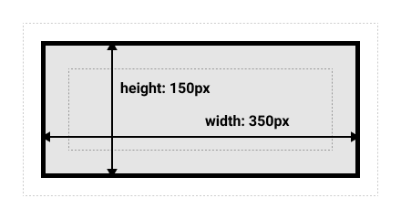

# Cascading Style Sheets (CSS)

Σε αυτό τη θεματική ενότητα, θα μάθουμε για τα Cascading Style Sheets (CSS).

- [Cascading Style Sheets (CSS)](#cascading-style-sheets-css)
  - [Μαθησιακά αποτελέσματα](#Μαθησιακά-αποτελέσματα)
  - [Τι είναι η CSS;](#Τι-είναι-η-CSS)
  - [Επιλογείς](#Επιλογείς)
    - [Επιλογείς ετικέτας](#Επιλογείς-ετικέτας)
    - [Επιλογείς κλάσης](#Επιλογείς-κλάσης)
    - [Επιλογείς ID](#Επιλογείς-ID)
    - [Επιλογείς γνωρισμάτων](#Επιλογείς-γνωρισμάτων)
    - [Επιλογείς ψευδο-κλάσης](#Επιλογείς-ψευδο--κλάσης)
  - [Ιδιότητες](#properties)
  - [Τιμές](#values)
  - [Units](#units)
    - [Απόλυτες μονάδες](#Απόλυτες-μονάδες)
    - [Σχετικές μονάδες](#Σχετικές-μονάδες)
    - [Τιμές που δεν απαιτούν μονάδες](#Τιμές-που-δεν-απαιτούν-μονάδες)
  - [Χρώματα](#Χρώματα)
    - [Ονόματα χρωμάτων](#Ονόματα-χρωμάτων)
    - [RGB](#rgb)
    - [Δεκαεξαδικό Σύστημα](#Δεκαεξαδικό-Σύστημα)
    - [RGBA](#rgba)
  - [Πώς να εφαρμόζετε CSS στην HTML](#Πώς-να-εφαρμόζετε-CSS-στην-HTML)
    - [Inline CSS](#inline-css)
    - [Internal CSS](#internal-css)
    - [External CSS](#external-css)
  - [Combining different ways to apply CSS to HTML](#combining-different-ways-to-apply-css-to-html)
  - [Box Model](#box-model)
    - [Standard box model](#standard-box-model)
    - [Alternative box model](#alternative-box-model)
  - [Exercises](#exercises)
    - [Exercise 1 - Basic CSS Styling](#exercise-1---basic-css-styling)
    - [Exercise 2: Creating a Simple Navigation Bar](#exercise-2-creating-a-simple-navigation-bar)
    - [Exercise 3: Styling a Content Section with Columns](#exercise-3-styling-a-content-section-with-columns)

## Μαθησιακά αποτελέσματα

Αφού ολοκληρώσετε αυτό τη θεματική ενότητα, θα είστε σε θέση να:

- Εξηγήστε τι είναι το CSS και πώς χρησιμοποιείται για τη διαμόρφωση στοιχείων HTML.
- Χρήση επιλογέων CSS για την επιλογή στοιχείων HTML.
- Χρησιμοποιήστε ιδιότητες CSS για να καθορίσετε τον τρόπο με τον οποίο θα πρέπει να διαμορφωθούν τα επιλεγμένα στοιχεία HTML.
- Χρησιμοποιήστε τιμές CSS για να καθορίσετε την τιμή μιας ιδιότητας CSS.
- Χρησιμοποιήστε μονάδες CSS για να καθορίσετε το μέγεθος ενός στοιχείου.
- Χρησιμοποιήστε τα χρώματα CSS για να καθορίσετε το χρώμα ενός στοιχείου.
- Εφαρμόστε CSS στην HTML χρησιμοποιώντας inline CSS, internal CSS και external CSS.
- Συνδυάστε διαφορετικούς τρόπους εφαρμογής των CSS στην HTML.
- Εξηγήστε τι είναι το μοντέλο κουτιού και πώς χρησιμοποιείται για τη διάταξη των στοιχείων HTML.
- Εξηγήστε τη διαφορά μεταξύ του τυπικού μοντέλου κουτιού και του εναλλακτικού μοντέλου κουτιού.
- Χρησιμοποιήστε το τυπικό μοντέλο πλαισίου και το εναλλακτικό μοντέλο πλαισίου για τη διάταξη των στοιχείων HTML.


## Τι είναι η CSS?

Η CSS είναι μια γλώσσα που χρησιμοποιείται για τη διαμόρφωση στοιχείων HTML. Χρησιμοποιείται για την προσθήκη χρωμάτων, γραμματοσειρών, διατάξεων και άλλων στοιχείων σε ιστοσελίδες. Η CSS είναι μια τεχνολογία ακρογωνιαίος λίθος του Παγκόσμιου Ιστού, μαζί με την HTML και τη JavaScript.

Η CSS έχει σχεδιαστεί για να επιτρέπει το διαχωρισμό της παρουσίασης και του περιεχομένου, συμπεριλαμβανομένης της διάταξης, των χρωμάτων και των γραμματοσειρών. Αυτός ο διαχωρισμός βελτιώνει την προσβασιμότητα του περιεχομένου, παρέχει μεγαλύτερη ευελιξία και έλεγχο στον καθορισμό των γνωρισμάτων παρουσίασης, επιτρέπει σε πολλές ιστοσελίδες να μοιράζονται τη μορφοποίηση καθορίζοντας τα σχετικά CSS σε ξεχωριστό αρχείο `.css` και μειώνει την πολυπλοκότητα και την επανάληψη στο δομικό περιεχόμενο.

Όταν η HTML περιγράφει τη δομή μιας ιστοσελίδας, η CSS περιγράφει τον τρόπο με τον οποίο αυτή η δομή πρέπει να φαίνεται. Η CSS είναι μια γλώσσα φύλλων στυλ που σας επιτρέπει να καθορίσετε τον τρόπο με τον οποίο θα πρέπει να εμφανίζονται τα στοιχεία της ιστοσελίδας σας. Χρησιμοποιείται για τη διαμόρφωση των ιστοσελίδων που έχουν γραφτεί σε HTML.

Για παράδειγμα, αν θέλετε να αλλάξετε το χρώμα του κειμένου στην ιστοσελίδα σας, μπορείτε να χρησιμοποιήσετε CSS για να το κάνετε αυτό. Μπορείτε επίσης να χρησιμοποιήσετε CSS για να αλλάξετε το μέγεθος της γραμματοσειράς, την οικογένεια γραμματοσειράς, το χρώμα φόντου, το χρώμα των περιθωρίων, το πλάτος των περιθωρίων, το στυλ των περιθωρίων κ.λπ:

Όταν παίρνουμε ένα απλό έγγραφο HTML και του προσθέτουμε κάποια CSS, έχουμε το ακόλουθο αποτέλεσμα:

```html
<!DOCTYPE html>
<html>
  <head>
    <title>Η πρώτη μου ιστοσελίδα</title>
    <style>
      p {
        color: red;
        font-size: 20px;
        font-family: Arial, Helvetica, sans-serif;
        background-color: yellow;
        border-color: black;
        border-width: 1px;
        border-style: solid;
      }
    </style>
  </head>
  <body>
    <p>Hello, World!</p>
  </body>

```
Η σελίδα του παραδείγματος θα έμοιαζε ως εξής:

<p style="color: red; font-size: 20px; font-family: Arial, Helvetica, sans-serif; background-color: yellow; border-color: black; border-width: 1px; border-style: solid;">Hello, World!</p>

## Επιλογείς

Όταν θέλουμε να εφαρμόσουμε κάποιο στυλ σε ένα στοιχείο HTML, πρέπει πρώτα να επιλέξουμε αυτό το στοιχείο για να καθορίσουμε ποιο στοιχείο θέλουμε να διαμορφώσουμε. Μπορούμε να επιλέξουμε ένα στοιχείο HTML χρησιμοποιώντας έναν επιλογέα CSS. Οι επιλογείς CSS χρησιμοποιούνται για την επιλογή των στοιχείων HTML που θέλετε να διαμορφώσετε. Οι επιλογείς καθιστούν το CSS πιο ισχυρό, επιτρέποντάς σας να στοχεύετε συγκεκριμένα στοιχεία στην ιστοσελίδα σας. Για παράδειγμα, μπορούμε να επιλέξουμε στοιχεία HTML με βάση τα:

- tag name;
- class name;
- id;
- attribute;
- pseudo-class;
- κλπ.

Όταν γράφουμε CSS, πρέπει να καθορίσουμε δύο πράγματα: έναν επιλογέα και ένα μπλοκ δήλωσης. Ο επιλογέας χρησιμοποιείται για την επιλογή των στοιχείων HTML που θέλουμε να διαμορφώσουμε. Το μπλοκ δήλωσης χρησιμοποιείται για να καθορίσουμε τους κανόνες CSS που θα εφαρμοστούν στα επιλεγμένα στοιχεία HTML. Το μπλοκ δήλωσης περικλείεται σε τεθλασμένες αγκύλες `{}`. Μέσα στις αγκύλες, μπορούμε να καθορίσουμε έναν ή περισσότερους κανόνες CSS. Κάθε κανόνας CSS αποτελείται από μια ιδιότητα και μια τιμή. Η ιδιότητα ακολουθείται από μια άνω και κάτω τελεία `:` και η τιμή ακολουθείται από μια άνω τελεία `;`.

### Επιλογείς ετικέτας

Οι επιλογείς ετικέτας χρησιμοποιούνται για την επιλογή στοιχείων HTML με βάση το όνομα της ετικέτας τους. Οι επιλογείς δεν λαμβάνουν υπόψη τα κεφαλαία , πράγμα που σημαίνει ότι τα `p`, `P` είναι όλοι ο ίδιος επιλογέας. Για παράδειγμα, αν θέλουμε να επιλέξουμε όλα τα στοιχεία `<p>` στην ιστοσελίδα μας, μπορούμε να χρησιμοποιήσουμε τον ακόλουθο επιλογέα:

```css
p {
  color: red;
}
```

Σε αυτό το παράδειγμα, ο επιλογέας για τα στοιχεία `<p>` είναι `p`. Ο επιλογέας ακολουθείται από μια σειρά από άγκριστρα`{}`. Μέσα στις άγκριστρα, προσδιορίσαμε έναν κανόνα CSS που θα εφαρμοστεί σε όλα τα στοιχεία `<p>` στην ιστοσελίδα μας. Ο κανόνας CSS αποτελείται από μια ιδιότητα και μια τιμή. Σε αυτό το παράδειγμα, η ιδιότητα είναι `color` και η τιμή είναι `red`. Η ιδιότητα ακολουθείται από μια άνω και κάτω τελεία `:` και η τιμή ακολουθείται από μια άνω τελεία `;`.


### Επιλογείς κλάσης

Αν θέλουμε να επιλέξουμε όλα τα στοιχεία με `class=«my-class»`, μπορούμε να χρησιμοποιήσουμε τον ακόλουθο επιλογέα:


```css
.my-class {
  /* CSS rules */
}
```

Οι επιλογείς κλάσεων ξεκινούν με μια τελεία `.` ακολουθούμενη από το όνομα της κλάσης. Σε αυτό το παράδειγμα, το όνομα της κλάσης είναι `my-class`.

### Επιλογείς ID

Αν θέλουμε να επιλέξουμε όλα τα στοιχεία με `id=«my-id»`, μπορούμε να χρησιμοποιήσουμε τον ακόλουθο επιλογέα:

```css
#my-id {
  /* CSS rules */
}
```

Οι επιλογείς ID ξεκινούν με έναν κατακερματισμό `#` ακολουθούμενο από το όνομα ID. Σε αυτό το παράδειγμα, το όνομα ID είναι `my-id`.

### Επιλογείς γνωρισμάτων

Αν θέλουμε να επιλέξουμε όλα τα στοιχεία με `attribute=«value»`, μπορούμε να χρησιμοποιήσουμε τον ακόλουθο επιλογέα:

```css
[attribute="value"] {
  /* CSS rules */
}
```

Οι επιλογείς χαρακτηριστικών ξεκινούν με μια τετράγωνη αγκύλη `[` ακολουθούμενη από το όνομα του χαρακτηριστικού, ακολουθούμενη από ένα σύμβολο ισότητας `=`, ακολουθούμενη από την τιμή του χαρακτηριστικού, ακολουθούμενη από μια τετράγωνη αγκύλη κλεισίματος `]`. Σε αυτό το παράδειγμα, το όνομα του χαρακτηριστικού είναι `attribute` και η τιμή του χαρακτηριστικού είναι `value`.

### Επιλογείς ψευδο-κλάσης

Οι επιλογείς ψευδο-κλάσης χρησιμοποιούνται για την επιλογή στοιχείων HTML με βάση την κατάστασή τους. Για παράδειγμα, αν θέλουμε να επιλέξουμε όλα τα στοιχεία «<a>» που τοποθετούνται, μπορούμε να χρησιμοποιήσουμε τον ακόλουθο επιλογέα:

```css
a:hover {
  /* CSS rules */
}
```
Πρώτα καθορίζουμε τον επιλογέα (`a`), στη συνέχεια καθορίζουμε την ψευδοκλάση (`:hover`). Ο επιλογέας και η ψευδοκλάση χωρίζονται με άνω και κάτω τελεία `:`.

Οι πιο συνηθισμένες ψευδο-κλάσεις είναι:

- `:active` - επιλέγει τον ενεργό σύνδεσμο,
- `:focus` -επιλέγει το στοιχείο που έχει εστιάσει,
- `:hover` - επιλέγει το στοιχείο που βρίσκεται σε αιώρηση,
- `:link` - επιλέγει όλες τους μη επισκεφθείς συνδέσμους,
- `:visited` - επιλέγει όλους τους συνδέσμους που έχετε επισκεφτεί,
- `:first-child` - επιλέγει το πρώτο παιδί ενός στοιχείου,
- κλπ.

Ο πλήρης κατάλογος των επιλογέων CSS μπορεί να βρεθεί [εδώ](https://developer.mozilla.org/en-US/docs/Web/CSS/CSS_selectors)

## Ιδιότητες

Οι ιδιότητες CSS χρησιμοποιούνται για να καθορίσουν τον τρόπο με τον οποίο θα πρέπει να διαμορφωθούν τα επιλεγμένα στοιχεία HTML. Κάθε ιδιότητα CSS έχει ένα όνομα και μια τιμή. Το όνομα ακολουθείται από μια άνω και κάτω τελεία `:` και η τιμή ακολουθείται από μια άνω και κάτω τελεία `;`. Για παράδειγμα, αν θέλουμε να αλλάξουμε το χρώμα του κειμένου στην ιστοσελίδα μας, μπορούμε να χρησιμοποιήσουμε τον ακόλουθο κανόνα CSS:

```css
p {
  color: red;
}
```

**Αποτέλεσμα:**
<p style="color: red">Hello, World!</p>

Σε αυτό το παράδειγμα, η ιδιότητα είναι `color` και η τιμή είναι `red`. Η ιδιότητα ακολουθείται από άνω και κάτω τελεία `:` και η τιμή ακολουθείται από άνω και κάτω τελεία `;`.

Υπάρχουν πολλές διαφορετικές ιδιότητες CSS. Μερικές από τις πιο συνηθισμένες ιδιότητες CSS είναι οι εξής:

- `color` - καθορίζει το χρώμα του κειμένου,
- `font-size` - καθορίζει το μέγεθος γραμματοσειράς του κειμένου,
- `font-family` - καθορίζει την επιλογή της γραμματοσειράς του κειμένου,
- `background-color` - καθορίζει το χρώμα φόντου ενός στοιχείου,
- `border-color` - καθορίζει το χρώμα του περιγράμματος ενός στοιχείου,
- `border-width` - καθορίζει το πλάτος των περιθωρίων ενός στοιχείου,
- `border-style` - καθορίζει το στυλ περιγράμματος ενός στοιχείου,
- `border` - καθορίζει το περίγραμμα ενός στοιχείου (συντόμευση της ιδιότητας),
- `width` - καθορίζει το πλάτος ενός στοιχείου,
- `height` - καθορίζει το ύψος ενός στοιχείου,
- `margin` - καθορίζει το περιθώριο ενός στοιχείου,
- `padding` - καθορίζει το γέμισμα ενός στοιχείου,
- `text-align` - καθορίζει την οριζόντια στοίχιση του κειμένου,
- `vertical-align` - καθορίζει την κατακόρυφη στοίχιση του κειμένου,
- `display` - καθορίζει τη συμπεριφορά εμφάνισης ενός στοιχείου,
- `position` - καθορίζει τη θέση ενός στοιχείου,
- etc

Ο πλήρης κατάλογος των ιδιοτήτων CSS μπορεί να βρεθεί [εδώ](https://developer.mozilla.org/en-US/docs/Web/CSS/Reference)

## Τιμές

CSS values are used to specify the value of a CSS property. Each CSS value has a name and a value. The name is followed by a colon `:` and the value is followed by a semicolon `;`. For example, if we want to change the color of the text on our web page, we can use the following CSS rule:

```css
p {
  color: blue;
  size: 20px;
  font-family: Arial, Helvetica, sans-serif;
}
```

**Αποτέλεσμα:**
<p style="color: blue; size: 20px; font-family: Arial, Helvetica, sans-serif">Hello, World!</p>

Σε αυτό το παράδειγμα υπάρχει ένας κανόνας CSS με τρεις ιδιότητες, οι οποίες εφαρμόζονται για όλες τις παραγράφους στην ιστοσελίδα: `color`, `size` και `font-family`. Κάθε ιδιότητα έχει μια τιμή. Η τιμή της ιδιότητας `color` είναι `blue`. Η τιμή της ιδιότητας `size` είναι `20px`. Η τιμή της ιδιότητας `font-family` είναι `Arial, Helvetica, sans-serif`.

> Υπάρχουν πολλαπλές τιμές για την ιδιότητα `font-family`. Το πρόγραμμα περιήγησης θα χρησιμοποιήσει την πρώτη τιμή που είναι διαθέσιμη στον υπολογιστή του χρήστη. Εάν καμία από τις γραμματοσειρές δεν είναι διαθέσιμη, το πρόγραμμα περιήγησης θα χρησιμοποιήσει την προεπιλεγμένη γραμματοσειρά του υπολογιστή του χρήστη.

Ένα άλλο παράδειγμα χρήσης πολλαπλών τιμών για μια ιδιότητα CSS είναι η ιδιότητα `border`. Η ιδιότητα `border` είναι μια συντομογραφία για τον καθορισμό των ιδιοτήτων `border-width`, `border-style` και `border-color`. Για παράδειγμα, αν θέλουμε να καθορίσουμε το περίγραμμα ενός στοιχείου, μπορούμε να χρησιμοποιήσουμε τον ακόλουθο κανόνα CSS:

```css
p {
  border: 1px solid black;
}
```
Σε αυτό το παράδειγμα, η ιδιότητα `border` έχει τρεις τιμές: `1px`, `solid` και `black`. Η πρώτη τιμή (`1px`) καθορίζει το πλάτος του πλαισίου. Η δεύτερη τιμή (`solid`) καθορίζει το στυλ των συνόρων. Η τελευταία τιμή (`black`) καθορίζει το χρώμα των συνόρων.

**Αποτέλεσμα**
<p style="border: 1px solid black">Hello, World!</p>

## Μονάδες

Οι μονάδες CSS χρησιμοποιούνται για τον καθορισμό του μεγέθους ενός στοιχείου. Υπάρχουν δύο τύποι μονάδων CSS: «απόλυτες μονάδες» και «σχετικές μονάδες».

### Απόλυτες μονάδες

Οι απόλυτες μονάδες είναι σταθερές μονάδες. Δεν είναι σχετικές με τίποτα. Για παράδειγμα, αν θέλουμε να καθορίσουμε το πλάτος ενός στοιχείου χρησιμοποιώντας μια απόλυτη μονάδα, μπορούμε να χρησιμοποιήσουμε τον ακόλουθο κανόνα CSS:

```css
p {
  width: 100px;
}
```

Σε αυτό το παράδειγμα, το πλάτος του στοιχείου είναι `100px`. Το πλάτος δεν είναι σχετικό με τίποτα. Είναι σταθερό στα `100px`.

Μερικές από τις πιο συνηθισμένες απόλυτες μονάδες είναι οι εξής:

- `cm` - εκατοστά - 1cm = 37.8px;
- `mm` - χιλιοστά - 1mm = 3.78px;
- `Q` - τέταρτο του χιλιοστού - 1Q = 0.95px;
- `in` - ίντσες - 1in = 96px;
- `pc` - picas - 1pc = 16px;
- `pt` - points - 1pt = 1.33px;
- `px` - pixels - 1px = 1/96th of 1in;

Συνήθως χρησιμοποιούμε το «px» ως απόλυτη μονάδα.

### Σχετικές μονάδες

Relative units are relative to something else (parent element, root element, etc.). For example, if we want to specify the width of an element using a relative unit, we can use the following CSS rule:

```css
p {
  width: 100%;
}
```

In this example, the width of the element is `100%`. The width is relative to the width of the parent element. If the width of the parent element is `100px`, the width of the element will be `100px`. If the width of the parent element is `200px`, the width of the element will be `200px`. If the width of the parent element is `300px`, the width of the element will be `300px`. And so on.

Some of the most common relative units are:

- `%` - percent;
- `em` - font size of the parent element;
- `rem` - font size of the root element;
- `vw` - 1% of the viewport width;
- `vh` - 1% of the viewport height;
- `vmin` - 1% of the viewport width or height, whichever is smaller;
- `vmax` - 1% of the viewport width or height, whichever is larger;
- etc.

### Values that does not require units

Some values does not require units. For example, if we want to specify the opacity of an element, we can use the following CSS rule:

```css
p {
  opacity: 0.5;
}
```
**Result:**
<p style="opacity: 0.5">Hello, World!</p>

In this example, the opacity of the element is `0.5`. The opacity is not relative to anything. It is fixed at `0.5`.

Some of the most common values that does not require units are:

- `opacity` - specifies the opacity of an element;
- `z-index` - specifies the stack order of an element;
- `order` - specifies the order of an element;
- etc.

## Colors

Colors are used to specify the color of an element. There are many different ways to specify colors in CSS. Some of the most common ways are:

- `color name` - for example, `red`, `green`, `blue`, etc;
- `rgb` - for example, `rgb(255, 0, 0)`, `rgb(0, 255, 0)`, `rgb(0, 0, 255)`, etc;
- `hexadecimal` - for example, `#ff0000`, `#00ff00`, `#0000ff`, etc;
- `rgba` - for example, `rgba(255, 0, 0, 0.5)`, `rgba(0, 255, 0, 0.5)`, `rgba(0, 0, 255, 0.5)`, etc;

### Color names

There are lot of color names in CSS. Some of the most common color names are:

- `red` - red color;
- `green` - green color;
- `blue` - blue color;
- `yellow` - yellow color;
- `orange` - orange color;
- `purple` - purple color;
- `pink` - pink color;
- `black` - black color;
- `white` - white color;
- etc

Full list of color names can be found [here](https://developer.mozilla.org/en-US/docs/Web/CSS/named-colors)

### RGB

RGB stands for `red`, `green`, and `blue`. It is a color model that is used to specify the amount of red, green, and blue in a color. Each color has a value between `0` and `255`. For example, if we want to specify the color green, we can use the following RGB color:

```css
p {
  color: rgb(0, 255, 0);
}
```
**Result:**
<p style="color: rgb(0, 255, 0)">Hello, World!</p>

In this example, the color of the element is `rgb(255, 0, 0)`. The first number (`255`) specifies the amount of red in the color. The second number (`0`) specifies the amount of green in the color. The last number (`0`) specifies the amount of blue in the color. In this example, the amount of red is `255`, the amount of green is `0`, and the amount of blue is `0`. This means that the color is red.

Some of the most common RGB colors are:

- `rgb(255, 0, 0)` - red color;
- `rgb(0, 255, 0)` - green color;
- `rgb(0, 0, 255)` - blue color;
- `rgb(255, 255, 0)` - yellow color;
- `rgb(255, 165, 0)` - orange color;
- `rgb(128, 0, 128)` - purple color;
- `rgb(255, 192, 203)` - pink color;
- `rgb(0, 0, 0)` - black color;
- `rgb(255, 255, 255)` - white color;
- etc

### Hexadecimal

Hexadecimal means base 16. It is a number system with 16 different digits. First 10 digits are from `0` to `9` just lice in decimal system we are used to. But next 6 digits are from `a` to `f`, which are representing decimal digits from `11` to `16`. It is difficult to read hexadecimal numbers, so we can use [calculators](https://www.binaryhexconverter.com/hex-to-decimal-converter) if we need to convert hexadecimal numbers to decimal numbers.

As in RGB, also in hexadecimal colors, we can specify the amount of red, green, and blue in a color. Each color has a value between `00` (0 in decimal system) and `ff` (255 in decimal system). For example, if we want to specify the color red, we can use the following hexadecimal color:

```css
p {
  color: #ff0000;
}
```
**Result:**
<p style="color: #ff0000">Hello, World!</p>

In this example, the color of the element is `#ff0000`. The first two characters (`ff`) specify the amount of red in the color. The second two characters (`00`) specify the amount of green in the color. The last two characters (`00`) specify the amount of blue in the color. In this example, the amount of red is `ff`, the amount of green is `00`, and the amount of blue is `00`. This means that the color is red.

Some of the most common hexadecimal colors are:

- `#ff0000` - red color;
- `#00ff00` - green color;
- `#0000ff` - blue color;
- `#ffff00` - yellow color;
- `#ffa500` - orange color;
- `#800080` - purple color;
- `#ffc0cb` - pink color;
- `#000000` - black color;
- `#ffffff` - white color;
- etc

Basically, HEX is just a shorter way to write RGB. For example, `rgb(255, 0, 0)` is the same as `#ff0000`. `rgb(0, 255, 0)` is the same as `#00ff00`. `rgb(0, 0, 255)` is the same as `#0000ff`. `rgb(255, 255, 0)` is the same as `#ffff00`. `rgb(255, 165, 0)` is the same as `#ffa500`. `rgb(128, 0, 128)` is the same as `#800080`. `rgb(255, 192, 203)` is the same as `#ffc0cb`. `rgb(0, 0, 0)` is the same as `#000000`. `rgb(255, 255, 255)` is the same as `#ffffff`.

We can use [HEX Calculator](https://www.w3schools.com/colors/colors_hexadecimal.asp) to find hexadecimal colors.

### RGBA

RGBA stands for `red`, `green`, `blue`, and `alpha`. It is a color model that is used to specify the amount of red, green, blue, and alpha in a color. Each color has a value between `0` and `255`. Alpha has a value between `0` and `1`. Alpha means opacity. `0` means fully transparent and `1` means fully opaque. For example, if we want to specify the color red, we can use the following RGBA color:

```css
p {
  color: rgba(255, 0, 0, 0.5);
}
```
**Result:**
<p style="color: rgba(255, 0, 0, 0.5)">Hello, World!</p>

In this example, the color of the element is `rgba(255, 0, 0, 0.5)`. The first number (`255`) specifies the amount of red in the color. The second number (`0`) specifies the amount of green in the color. The last number (`0`) specifies the amount of blue in the color. The last number (`0.5`) specifies the amount of alpha in the color.

To compare Alpha value, we can change it to `1` and see the difference:

```css
p {
  color: rgba(255, 0, 0, 1);
}
```

**Result:**
<p style="color: rgba(255, 0, 0, 1)">Hello, World!</p>

## How to apply CSS to HTML

There are three ways to apply CSS to HTML:

- inline CSS;
- internal CSS;
- external CSS;

### Inline CSS

Inline CSS is used to apply CSS to a single HTML element. For example, if we want to change the color of a single paragraph, we can use the following HTML code:

```html
<p style="color: red">Hello, World!</p>
```

In this example, we used the `style` attribute to apply CSS to the `<p>` element. The `style` attribute is followed by a set of double quotes `""`. Inside the double quotes, we specified the CSS rules that will be applied to the `<p>` element. The CSS rules consists of a property and a value. In this example, the property is `color` and the value is `red`.


### Internal CSS

Internal CSS is used to apply CSS to a single HTML page. For example, if we want to change the color of all paragraphs on a single HTML page, we can use the following HTML code:

```html
<!DOCTYPE html>
<html>
  <head>
    <title>My First Web Page</title>
    <style>
      p {
        color: red;
      }
    </style>
  </head>
  <body>
    <p>Hello, World!</p>
  </body>
</html>
```


In this example, we used the `<style>` tag to apply CSS to the HTML page. The `<style>` tag is followed by a set of curly braces `{}`. Inside the curly braces, we specified the CSS rules that will be applied to the HTML page. In this example, we apply red color to all paragraphs on the HTML page.

### External CSS

External CSS is used to apply CSS to multiple HTML pages. For example, if we want to change the color of all paragraphs on multiple HTML pages, we can use the following HTML code:

```html
<!DOCTYPE html>
<html>
  <head>
    <title>My First Web Page</title>
    <link rel="stylesheet" href="style.css">
  </head>
  <body>
    <p>Hello, World!</p>
  </body>
</html>
```
`style.css` file:
```css
p {
  color: red;
}
```


In this example, we used the `<link>` tag to apply CSS to  HTML page. The `<link>` tag is followed by a set of double quotes `""`. Inside the double quotes, we specified the path to the CSS file. In this example, the path to the CSS file is `style.css`.

In `style.css` file, we specified the CSS rules that will be applied to the HTML page. In this example, we apply red color to all paragraphs on the HTML page.


## Combining different ways to apply CSS to HTML

We can combine all three ways to apply CSS to HTML. For example, if we want to change the color of a single paragraph, we can use the following HTML code:

```html
<!DOCTYPE html>
<html>
  <head>
    <title>My First Web Page</title>
    <style>
      p {
        color: red;
      }
    </style>
  </head>
  <body>
    <p>Hello, World!</p>
    <p style="color: blue">Hello, World!</p>
  </body>
</html>
```

Cascading in CSS means that the styles are applied in a specific order. The order is as follows:

1. Browser default;
2. External style sheet;
3. Internal style sheet (in the `<head>` section);
4. Inline style (inside an HTML element);

In previous example, the color of the second paragraph is `blue`. This is because the inline style is applied after the internal style sheet.

## Box Model

The CSS box model is a rectangular layout design for HTML elements. It consists of four parts: `content`, `padding`, `border`, and `margin`. The `content` is the actual content of the element. The `padding` is the space between the content and the border. The `border` is the border of the element. The `margin` is the space between the border and the next element.


[Image source](https://developer.mozilla.org/en-US/docs/Learn/CSS/Building_blocks/The_box_model/box-model.png)

### Standard box model

The standard box model is the default box model in CSS. It is used by most browsers. In the standard box model, the width and height of an element are calculated as follows:

- `width = content width + padding left + padding right + border left + border right`;
- `height = content height + padding top + padding bottom + border top + border bottom`;

If we assume a box has a following CSS rules:

```css
.box {
  width: 350px;
  height: 150px;
  margin: 10px;
  padding: 25px;
  border: 5px solid black;
}
```

The width and height of the box will be calculated as follows:

- `width = 350px + 25px + 25px + 5px + 5px = 410px`;
- `height = 150px + 25px + 25px + 5px + 5px = 210px`;


[Image source](https://developer.mozilla.org/en-US/docs/Learn/CSS/Building_blocks/The_box_model/standard-box-model.png)

> The width and height of an element does not include the margin.

### Alternative box model

In the alternative box model, the width is the width of the content and the height is the height of the content. The padding, border, and margin are added to the width and height. In the alternative box model, the width and height of an element are calculated as follows:

- `width = content width`;
- `height = content height`;

If we assume a box has a sam CSS rules as before:

```css
.box {
  width: 350px;
  height: 150px;
  margin: 10px;
  padding: 25px;
  border: 5px solid black;
}
```

The width and height of the box will be calculated as follows:

- `width = 350px`;
- `height = 150px`;


[Image source](https://developer.mozilla.org/en-US/docs/Learn/CSS/Building_blocks/The_box_model/alternate-box-model.png)

To turn on the alternative model for an element, set `box-sizing: border-box` on it:

```css
.box {
  box-sizing: border-box;
}
```

To use the alternative box model for all of your elements (which is a common choice among developers), set the box-sizing property on the <html> element and set all other elements to inherit that value:

```css
html {
  box-sizing: border-box;
}

*, *::before, *::after {
  box-sizing: inherit;
}
```

You can read more about box model [here](https://developer.mozilla.org/en-US/docs/Learn/CSS/Building_blocks/The_box_model)

## Exercises

Create `index.html` and `style.css` files. Link `style.css` file to `index.html` file. Use `style.css` file to write CSS code. Use `index.html` file to write HTML code.

Test your code by opening `index.html` file in your browser.

Try to solve exercises without looking at the solutions. If you get stuck, you can look at the solutions.

### Exercise 1 - Basic CSS Styling

**Objective**: Apply fundamental styles to HTML elements.

**Description**: Create an HTML file with a `h1` tag for a title, a `p` tag for a paragraph, and a `div` element. Write a CSS file to style these elements. Change the color and font size of the `h1` tag. For the paragraph, set a different `font-family` and `color`. Give the `div` a solid border, set a background color, and adjust its padding.

**Expected Tasks**:

- Style the `h1` tag with a specific color and font size.
- Apply a different `font-family` and `color` to the paragraph.
- Give the `div` a `border`, `background color`, and `padding`.

> Hint: Use `border` property to give the `div` a solid border with a specific width and color.

<details>
<summary>Solution</summary>

```html
<!DOCTYPE html>
<html>
  <head>
    <title>Basic CSS Styling</title>
    <link rel="stylesheet" href="style.css">
  </head>
  <body>
    <h1>Hello, World!</h1>
    <p>This is a paragraph.</p>
    <div>This is a div.</div>
  </body>
</html>
```

```css
h1 {
  color: red;
  font-size: 50px;
}

p {
  font-family: Arial, Helvetica, sans-serif;
  color: blue;
}

div {
  border: 5px solid black;
  background-color: yellow;
  padding: 25px;
}
```
</details>

### Exercise 2: Creating a Simple Navigation Bar

**Objective**: Style a basic horizontal navigation bar.

**Description**: Design a basic webpage with a navigation bar consisting of unordered list items. The navigation bar should be horizontal, with each list item displayed inline. Style the list items to have padding, a border, and a background color. When hovering over a list item, change its background color.

**Expected Tasks**:
- Apply styling (padding, border, background color) to list items.
- Change the background color of list items on hover

> Hint: Use `list-style-type: none` to remove the bullet points from the list items.
>
> Hint: Use `display: inline` or `display: inline-block` to align list items horizontally.
>
> Hint: Use `:hover` pseudo-class to change the background color of list items on hover.

<details>
<summary>Solution</summary>

```html
<!DOCTYPE html>
<html>
  <head>
    <title>Creating a Simple Navigation Bar</title>
    <link rel="stylesheet" href="style.css">
  </head>
  <body>
    <ul>
      <li>Home</li>
      <li>About</li>
      <li>Contact</li>
    </ul>
  </body>
</html>
```

```css
ul {
  list-style-type: none;
  margin: 0;
  padding: 0;
}

li {
  display: inline-block;
  padding: 10px;
  border: 1px solid black;
  background-color: yellow;
}

li:hover {
  background-color: red;
}
```
</details>

### Exercise 3: Styling a Content Section with Columns

**Objective**: Create a content area divided into columns.

**Description**: Build a section of a webpage intended to display content in three columns. Use `div` elements to represent each column. Style each `div` so they have a border, padding, and a fixed width, and are arranged side by side.

**Expected Tasks**:
- Create three `div` elements to serve as columns.
- Style the `divs` with a border, padding, and set a fixed width in percentage.
- Use `float` or `display: inline-block` to position the `divs` side by side.

