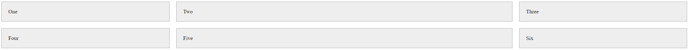
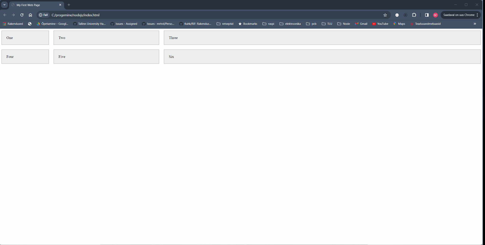
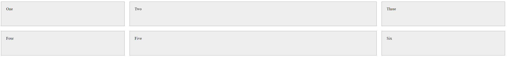
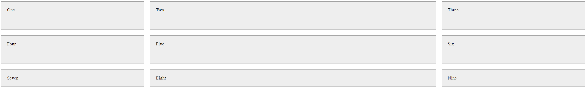
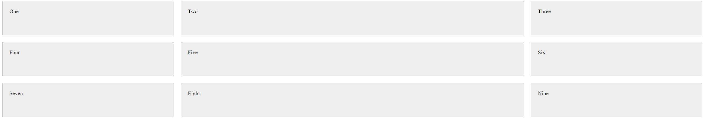
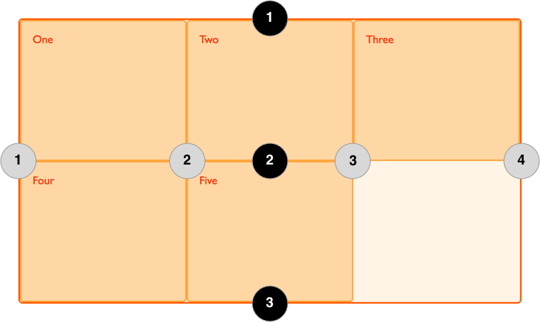
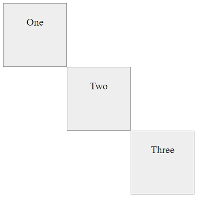

# Grid

Σε αυτό τη θεματική ενότητα, θα μάθουμε για τα βασικά στοιχεία του CSS Grid.

## Μαθησιακά αποτελέσματα

Αφού ολοκληρώσετε αυτό το κεφάλαιο, θα είστε σε θέση να:


## Τι είναι το CSS Grid;

Το CSS Grid είναι ένα σύστημα διάταξης που σας επιτρέπει να δημιουργείτε πολύπλοκες διατάξεις με ευκολία. Είναι ένα δισδιάστατο σύστημα, που σημαίνει ότι μπορεί να χειριστεί τόσο στήλες όσο και γραμμές, σε αντίθεση με το flexbox που είναι σε μεγάλο βαθμό ένα μονοδιάστατο σύστημα. Το CSS Grid υποστηρίζεται από όλα τα σύγχρονα προγράμματα περιήγησης.

Το Grid παρέχει ένα σύστημα διάταξης βασισμένο σε πλέγμα, με γραμμές και στήλες, διευκολύνοντας τον σχεδιασμό ιστοσελίδων χωρίς να χρειάζεται να χρησιμοποιείτε floats και τοποθέτηση. Προσφέρει ένα νέο επίπεδο ευελιξίας και ελέγχου στις διατάξεις σελίδων CSS.

Βασικά μπορούμε να σκεφτούμε το CSS Grid ως έναν πίνακα, όπου μπορούμε να ορίσουμε τον αριθμό των γραμμών και των στηλών και στη συνέχεια να τοποθετήσουμε στοιχεία μέσα στον πίνακα. Τα στοιχεία μπορούν να καλύπτουν πολλαπλές γραμμές και στήλες και μπορούν να τοποθετηθούν οπουδήποτε μέσα στον πίνακα.

## Γιατί να χρησιμοποιήσετε το CSS Grid;

- **Δισδιάστατη Διάταξη**: Το πλέγμα σας επιτρέπει να εργάζεστε ταυτόχρονα με γραμμές και στήλες, κάτι που δεν είναι δυνατό με το Flexbox (ένα μονοδιάστατο σύστημα).
- **Σταθερά και Ευέλικτα Μεγέθη Τροχιάς**:Μπορείτε να ορίσετε πλέγμα με σταθερά μεγέθη τροχιάς - όπου το μέγεθος των τροχιών ορίζεται σε εικονοστοιχεία, ή ευέλικτα μεγέθη τροχιάς - όπου το μέγεθος των τροχιών ορίζεται σε ποσοστά ή κλάσματα του διαθέσιμου χώρου.
- **Έλεγχος και Ακρίβεια**: You can precisely place and size grid items within the grid container using line numbers, names, or by targeting grid areas.
- **Ανταποκρινόμενος Σχεδιασμός**: Απλοποιεί τη δημιουργία σχεδίων που ανταποκρίνονται στις ανάγκες του χρήστη. Τα στοιχεία του πλέγματος μπορούν να αναδιατάσσονται και να αλλάζουν μέγεθος εύκολα καθώς αλλάζει το παράθυρο προβολής, χωρίς να αλλάζει η HTML.
- **Δημιουργία Πρόσθετων Διαδρομών**: Μπορείτε να δημιουργήσετε πρόσθετες διαδρομές (γραμμές και στήλες) αυτόματα στο δοχείο πλέγματος, χωρίς να αλλάξετε την HTML.
- **Απλοποιεί πολύπλοκες διατάξεις**: Είναι ιδανικό για σύνθετες διατάξεις που ήταν δύσκολο να επιτευχθούν με παλαιότερες ιδιότητες CSS, μειώνοντας την ανάγκη για πρόσθετη σήμανση ή πολύπλοκο scripting.
- **Υποστήριξη Προγράμματος Περιήγησης**: Τα σύγχρονα προγράμματα περιήγησης, συμπεριλαμβανομένων των τελευταίων εκδόσεων των Chrome, Firefox, Safari και Edge, υποστηρίζουν το Grid, καθιστώντας το ευρέως χρησιμοποιήσιμο στην τρέχουσα ανάπτυξη ιστοσελίδων.

> Οι διαδρομές πλέγματος είναι οι στήλες και οι γραμμές του πλέγματος. Μια διαδρομή πλέγματος μπορεί να είναι μια στήλη ή μια γραμμή.

## Πώς να χρησιμοποιήσετε το CSS Grid

### Δοχείο πλέγματος

Για να δημιουργήσουμε ένα πλέγμα, πρέπει πρώτα να ορίσουμε ένα δοχείο πλέγματος. Ένα δοχείο πλέγματος είναι ένα στοιχείο που περιέχει ένα πλέγμα. Για να δημιουργήσουμε ένα δοχείο πλέγματος, πρέπει να ορίσουμε την ιδιότητα `display` του στοιχείου σε `grid` ή `inline-grid`.

```css
.container {
  display: grid;
}
```

Τώρα δημιουργούμε στοιχεία HTML μέσα στο δοχείο και αυτά θα γίνουν στοιχεία πλέγματος. Προσθέτουμε το `class=«container»` στο στοιχείο `div` για να το κάνουμε ένα δοχείο πλέγματος. Όλα τα στοιχεία μέσα στο δοχείο θα γίνουν στοιχεία πλέγματος. Προσθέτουμε επίσης `class=«item»` σε κάθε στοιχείο `div`, ώστε να μπορούμε να τα διαμορφώσουμε.

```html
<body>
  <div class="container"> <!-- Grid Container -->
    <div class="item">One</div> <!-- Grid Item -->
    <div class="item">Two</div>
    <div class="item">Three</div>
    <div class="item">Four</div>
    <div class="item">Five</div>
    <div class="item">Six</div>
  </div>
</body>
```

Για λόγους επίδειξης, θα προσθέσουμε μερικά στυλ στα στοιχεία του πλέγματος.

```css
.item {
  background-color: #eee;
  border: 1px solid #999;
  padding: 20px;
}
```

Το δοχείο πλέγματος μας μοιάζει τώρα με αυτό:


### Στήλες πλέγματος

Από προεπιλογή, ο περιέκτης πλέγματος θα εμφανίζει τα στοιχεία πλέγματος σε μία μόνο στήλη. Για να δημιουργήσουμε ένα πλέγμα με πολλαπλές στήλες, πρέπει να ορίσουμε τον αριθμό των στηλών στο δοχείο πλέγματος χρησιμοποιώντας την ιδιότητα `grid-template-columns`.

```css
.container {
  display: grid;
  grid-template-columns: 200px 200px 200px;
}
```

Η ιδιότητα `grid-template-columns` ορίζει τον αριθμό των στηλών στο δοχείο πλέγματος και το πλάτος κάθε στήλης. Στο παραπάνω παράδειγμα, έχουμε ορίσει τρεις στήλες, η καθεμία με πλάτος 200 pixels.

Τώρα το δοχείο πλέγματος μας έχει την εξής μορφή:


Όπως βλέπουμε, τώρα έχουμε τρεις στήλες με σταθερό πλάτος στήλης. Οι στήλες έχουν πλάτος 200 pixels. Αν προσθέσουμε περισσότερα στοιχεία πλέγματος, θα τοποθετηθούν αυτόματα στην επόμενη γραμμή.

Αν θέλουμε δυναμικά πλάτη στηλών, μπορούμε να χρησιμοποιήσουμε ποσοστά ή κλάσματα του διαθέσιμου χώρου αντί για σταθερά πλάτη. Τα κλάσματα καθορίζονται χρησιμοποιώντας τη μονάδα `fr`. Για παράδειγμα, αν θέλουμε οι στήλες να καταλαμβάνουν ίσο χώρο, μπορούμε να χρησιμοποιήσουμε `1fr` για κάθε στήλη.

```css
.container {
  display: grid;
  grid-template-columns: 1fr 1fr 1fr;
}
```
Τώρα το δοχείο πλέγματος μας μοιάζει με αυτό:


Όπως βλέπουμε, τώρα οι στήλες μας καταλαμβάνουν όλο το χώρο στο δοχείο πλέγματος.

Για να κάνουμε τα πράγματα να φαίνονται λίγο πιο όμορφα, θα προσθέσουμε κάποιο κενό μεταξύ των στοιχείων του πλέγματος. Το κενό είναι ο χώρος μεταξύ των στοιχείων του πλέγματος. Μπορούμε να προσθέσουμε κενό μεταξύ των στοιχείων του πλέγματος χρησιμοποιώντας την ιδιότητα `gap`.

Επίσης, ας κάνουμε τα πράγματα λίγο πιο ενδιαφέροντα αλλάζοντας τις στήλες ώστε να έχουν διαφορετικό πλάτος - ας κάνουμε την πρώτη στήλη 1fr, τη δεύτερη στήλη 2fr και την τρίτη στήλη 1fr.

Αυτό σημαίνει ότι η πρώτη στήλη θα καταλαμβάνει το 1/4 του διαθέσιμου χώρου, η δεύτερη στήλη θα καταλαμβάνει τα 2/4 του διαθέσιμου χώρου και η τρίτη στήλη θα καταλαμβάνει το 1/4 του διαθέσιμου χώρου.

```css
.container {
  display: grid;
  grid-template-columns: 1fr 2fr 1fr;
  gap: 20px;
}
```

Τώρα το δοχείο πλέγματος μας μοιάζει με αυτό:



Μπορούμε επίσης να συνδυάσουμε σταθερά πλάτη και δυναμικά πλάτη. Για παράδειγμα, αν θέλουμε η πρώτη στήλη να έχει πλάτος 200 pixels, η δεύτερη στήλη να καταλαμβάνει το 1/4 του διαθέσιμου χώρου και η τρίτη στήλη να καταλαμβάνει τα 3/4 του διαθέσιμου χώρου, μπορούμε να το κάνουμε ως εξής:

```css
.container {
  display: grid;
  grid-template-columns: 200px 1fr 3fr;
  gap: 20px;
}
```
Τώρα το πλέγμα μας έχει μία στήλη σταθερού πλάτους και δύο στήλες δυναμικού πλάτους. Αυτό που κάνει τα πράγματα ενδιαφέροντα είναι ότι οι στήλες δυναμικού πλάτους θα καταλάβουν τον διαθέσιμο χώρο αφού ληφθεί υπόψη η στήλη σταθερού πλάτους και αν αλλάξουμε το μέγεθος του παραθύρου του προγράμματος περιήγησης, οι στήλες δυναμικού πλάτους θα αλλάξουν το μέγεθος ανάλογα.



## 'Αρρητα και ρητά πλέγματα

Στα παραπάνω παραδείγματά μας, ορίσαμε τον αριθμό των στηλών στο δοχείο πλέγματος χρησιμοποιώντας την ιδιότητα `grid-template-columns`. Αυτές οι στήλες ονομάζονται σαφείς στήλες. Μια σαφή στήλη είναι μια στήλη που δημιουργείται από τον προγραμματιστή. Αλλά στα παραδείγματά μας, έχουμε επίσης γραμμές, αλλά δεν έχουμε ορίσει τον αριθμό των γραμμών στο δοχείο grid. Αυτές οι γραμμές αποτελούν μέρος του άρρητου πλέγματος.


Μπορούμε να δημιουργήσουμε ένα ρητό πλέγμα καθορίζοντας τον αριθμό των γραμμών και των στηλών στο δοχείο πλέγματος χρησιμοποιώντας τις ιδιότητες `grid-template-columns` και `grid-template-rows`.

```css
.container {
  display: grid;
  grid-template-columns: 1fr 2fr 1fr;
  grid-template-rows: 100px 100px;
  gap: 20px;
}
```
Τώρα το δοχείο πλέγματος μας μοιάζει με αυτό:



Όπως βλέπουμε, τώρα έχουμε ένα ρητό πλέγμα με δύο γραμμές και τρεις στήλες. Η πρώτη γραμμή έχει ύψος 100 pixels, η δεύτερη γραμμή έχει ύψος 100 pixels, η πρώτη στήλη είναι το 1/4 του διαθέσιμου χώρου, η δεύτερη στήλη είναι τα 2/4 του διαθέσιμου χώρου και η τρίτη στήλη είναι το 1/4 του διαθέσιμου χώρου.

Τι γίνεται όμως αν προσθέσουμε περισσότερα στοιχεία πλέγματος; Ας προσθέσουμε τρία ακόμη στοιχεία πλέγματος στο δοχείο πλέγματος.

```html
<body>
  <div class="container">
    <div class="item">One</div>
    <div class="item">Two</div>
    <div class="item">Three</div>
    <div class="item">Four</div>
    <div class="item">Five</div>
    <div class="item">Six</div>
    <div class="item">Seven</div>
    <div class="item">Eight</div>
    <div class="item">Nine</div>
  </div>
</body>
```

Όπως βλέπουμε, τώρα έχουμε τρεις γραμμές, αλλά έχουμε ορίσει μόνο δύο γραμμές στο δοχείο πλέγματος. Η τρίτη σειρά είναι μέρος του άρρητου πλέγματος. Τοάρρητο πλέγμα δημιουργείται αυτόματα όταν προσθέτουμε περισσότερα στοιχεία πλέγματος από όσα έχουμε ορίσει γραμμές και στήλες στο δοχείο πλέγματος. Μπορούμε επίσης να δούμε, ότι τα στοιχεία πλέγματος στο άρρητο πλέγμα δεν έχουν το ίδιο ύψος με τα στοιχεία πλέγματος στο ρητό πλέγμα.




Μπορούμε επίσης να ορίσουμε το ύψος των γραμμών στο έμμεσο πλέγμα χρησιμοποιώντας την ιδιότητα `grid-auto-rows`.
```css
.container {
  display: grid;
  grid-template-columns: 1fr 2fr 1fr;
  grid-auto-rows: 100px;
  gap: 20px;
}
```



## Τοποθέτηση στοιχείων πλέγματος

Αν θέλουμε περισσότερο έλεγχο στην τοποθέτηση των στοιχείων του πλέγματος, μπορούμε να χρησιμοποιήσουμε τις ιδιότητες `grid-column-start`, `grid-column-end`, `grid-row-start` και `grid-row-end`. Αυτές οι ιδιότητες μας επιτρέπουν να καθορίσουμε πού θα πρέπει να αρχίζει και να τελειώνει ένα στοιχείο πλέγματος.

Αλλά πριν μπορέσουμε να χρησιμοποιήσουμε αυτές τις ιδιότητες, πρέπει να καταλάβουμε πώς είναι δομημένο το πλέγμα. Το πλέγμα είναι δομημένο σε στήλες και γραμμές. Κάθε στήλη και γραμμή έχει μια γραμμή αρχής και μια γραμμή τέλους. Η γραμμή έναρξης είναι η γραμμή όπου ξεκινάει η στήλη ή η γραμμή και η γραμμή τέλους είναι η γραμμή όπου τελειώνει η στήλη ή η γραμμή. Οι γραμμές είναι αριθμημένες ξεκινώντας από το 1 και ανεβαίνοντας προς τα πάνω. Οι γραμμές αριθμούνται από αριστερά προς τα δεξιά για τις στήλες και από πάνω προς τα κάτω για τις γραμμές.


[Image Source](https://developer.mozilla.org/en-US/docs/Web/CSS/CSS_grid_layout/Basic_concepts_of_grid_layout)

Μπορούμε να χρησιμοποιήσουμε τις ιδιότητες `grid-column-start` και `grid-column-end` για να καθορίσουμε πού θα πρέπει να αρχίζει και να τελειώνει οριζόντια ένα στοιχείο πλέγματος. Μπορούμε να χρησιμοποιήσουμε τις ιδιότητες `grid-row-start` και `grid-row-end` για να καθορίσουμε πού θα πρέπει να ξεκινά και να τελειώνει ένα στοιχείο πλέγματος κάθετα.

Για παράδειγμα, αν θέλουμε να δημιουργήσουμε ένα πλέγμα 3x3 και να τοποθετήσουμε τρία στοιχεία στο πλέγμα έτσι ώστε το πρώτο στοιχείο να βρίσκεται στην πρώτη γραμμή και την πρώτη στήλη, το δεύτερο στοιχείο στη δεύτερη γραμμή και τη δεύτερη στήλη και το τρίτο στοιχείο στην τρίτη γραμμή και την τρίτη στήλη, μπορούμε να το κάνουμε ως εξής:

```html
<body>
  <div class="container">
    <div class="item box-1">One</div>
    <div class="item box-2">Two</div>
    <div class="item box-3">Three</div>
  </div>
</body>
```

```css
.container {
  display: grid;
  grid-template-columns: 100px 100px 100px;
  grid-template-rows: 100px 100px 100px;
}

.item {
  background-color: #eee;
  border: 1px solid #999;
  padding: 20px;
  text-align: center;
}

.box-1 {
  grid-column: 1 / 2;
  grid-row: 1 / 2;
}

.box-2 {
  grid-column: 2 / 3;
  grid-row: 2 / 3;
}

.box-3 {
  grid-column: 3 / 4;
  grid-row: 3 / 4;
}
```
Όπως μπορούμε να δούμε από το παράδειγμα, έπρεπε να δημιουργήσουμε στοιχεία με κλάσεις `box-1`, `box-2` και `box-3` για να μπορούμε να τα διαμορφώσουμε ξεχωριστά. Το πρώτο στοιχείο τοποθετείται από την πρώτη γραμμή της πρώτης στήλης στη δεύτερη γραμμή της πρώτης στήλης και από την πρώτη γραμμή της πρώτης γραμμής στη δεύτερη γραμμή της πρώτης γραμμής. Τα υπόλοιπα στοιχεία τοποθετούνται με τον ίδιο τρόπο, αλλά σε διαφορετικές στήλες και γραμμές.



Ένα ακόμη παράδειγμα:

```css
.box-1 {
  grid-column: 1 / 2;
  grid-row: 1 / 4;
}

.box-2 {
  grid-column: 2 / 3;
  grid-row: 2 / 4;
}

.box-3 {
  grid-column: 3 / 4;
  grid-row: 1 / 3;
}
```


Υπάρχουν πολλά περισσότερα στο CSS Grid από αυτά που καλύψαμε εδώ. Έχουμε μόνο ξύσει την επιφάνεια του CSS Grid. Αν θέλετε να μάθετε περισσότερα για το CSS Grid, δείτε το [CSS Grid Layout](https://developer.mozilla.org/en-US/docs/Web/CSS/CSS_Grid_Layout) τεκμηρίωση στο MDN.

## Ασκήσεις

Δημιουργήστε τα αρχεία `index.html` και `style.css`. Συνδέστε το αρχείο `style.css` με το αρχείο `index.html`. Χρησιμοποιήστε το αρχείο `style.css` για να γράψετε κώδικα CSS. Χρησιμοποιήστε το αρχείο `index.html` για να γράψετε κώδικα HTML.

Δοκιμάστε τον κώδικά σας ανοίγοντας το αρχείο `index.html` στο πρόγραμμα περιήγησής σας.

Προσπαθήστε να λύσετε ασκήσεις χωρίς να κοιτάξετε τις λύσεις. Αν κολλήσετε, μπορείτε να δείτε τις λύσεις.

### Άσκηση 1: Δημιουργία πλέγματος

**Στόχος**: Δημιουργήστε μια απλή διάταξη πλέγματος με τέσσερις στήλες ίσου πλάτους.

**Περιγραφή**: Σχεδιάστε μια διάταξη ιστοσελίδας που περιέχει ένα πλέγμα με τέσσερις στήλες. Κάθε στήλη πρέπει να έχει το ίδιο πλάτος. Θα πρέπει να υπάρχει κενό `10px` μεταξύ των στηλών. Μπορείτε να χρησιμοποιήσετε στοιχεία div για το δοχείο του πλέγματος και τα στοιχεία του πλέγματος. Διαμορφώστε τα στοιχεία του πλέγματος με διαφορετικά χρώματα φόντου για οπτική διάκριση.

> Συμβουλή: Χρησιμοποιήστε την ιδιότητα `grid-template-columns` για να ορίσετε τον αριθμό των στηλών και το πλάτος τους.
>
> Συμβουλή: Χρησιμοποιήστε την ιδιότητα `gap` για να προσθέσετε κενό μεταξύ των στηλών.
>
> Συμβουλή: Χρησιμοποιήστε την ιδιότητα `background-color` για να προσθέσετε χρώμα φόντου στα στοιχεία του πλέγματος.

<details>
<summary>Άσκηση 1 Επίλυση</summary>

```html
<!DOCTYPE html>
<html lang="en">
<head>
  <meta charset="UTF-8">
  <meta name="viewport" content="width=device-width, initial-scale=1.0">
  <link rel="stylesheet" href="style.css">
  <title>Document</title>
</head>
<body>
  <div class="container">
    <div class="item item-1">One</div>
    <div class="item item-2">Two</div>
    <div class="item item-3">Three</div>
    <div class="item item-4">Four</div>
  </div>
</body>
</html>
```

```css
.container {
  display: grid;
  grid-template-columns: 1fr 1fr 1fr 1fr;
  gap: 10px;
}

.item {
  padding: 20px;
  text-align: center;
}

.item-1 {
  background-color: #eee;
}

.item-2 {
  background-color: #ddd;
}

.item-3 {
  background-color: #ccc;
}

.item-4 {
  background-color: #bbb;
}
```


</details>

### Άσκηση 2: Δημιουργία ενός καρό πλέγματος

**Στόχος**: Δημιουργήστε μια καρό διάταξη πλέγματος με τέσσερις στήλες και τέσσερις γραμμές με ίσο πλάτος και ύψος. Κάντε το να μοιάζει με σκακιέρα. Αυτό σημαίνει ότι η πρώτη σειρά θα πρέπει να έχει ένα μαύρο κελί στην πρώτη στήλη, ένα λευκό κελί στη δεύτερη στήλη, ένα μαύρο κελί στην τρίτη στήλη και ένα λευκό κελί στην τέταρτη στήλη. Η δεύτερη σειρά θα πρέπει να έχει ένα λευκό κελί στην πρώτη στήλη, ένα μαύρο κελί στη δεύτερη στήλη, ένα λευκό κελί στην τρίτη στήλη και ένα μαύρο κελί στην τέταρτη στήλη. Και ούτω καθεξής.

**Περιγραφή**: Σχεδιάστε μια διάταξη ιστοσελίδας που περιέχει ένα πλέγμα με τέσσερις στήλες και τέσσερις γραμμές. Κάθε στήλη και γραμμή θα πρέπει να έχει το ίδιο πλάτος και ύψος. Μπορείτε να χρησιμοποιήσετε στοιχεία div για τον περιέκτη του πλέγματος και τα στοιχεία του πλέγματος. Διαμορφώστε τα στοιχεία του πλέγματος έτσι ώστε να μοιάζουν με σκακιέρα.

> Συμβουλή: Χρησιμοποιήστε την ιδιότητα `grid-template-columns` για να ορίσετε τον αριθμό των στηλών και το πλάτος τους.
>
> Συμβουλή: Χρησιμοποιήστε την ιδιότητα `grid-template-rows` για να ορίσετε τον αριθμό των γραμμών και το ύψος τους.

<details>
<summary>Άσκηση 2 Επίλυση</summary>

```html
<!DOCTYPE html>
<html lang="en">
<head>
  <meta charset="UTF-8">
  <meta name="viewport" content="width=device-width, initial-scale=1.0">
  <link rel="stylesheet" href="style.css">
  <title>Document</title>
</head>
<body>
  <div class="container">
    <div class="item item-1"></div>
    <div class="item item-2"></div>
    <div class="item item-3"></div>
    <div class="item item-4"></div>
    <div class="item item-5"></div>
    <div class="item item-6"></div>
    <div class="item item-7"></div>
    <div class="item item-8"></div>
    <div class="item item-9"></div>
    <div class="item item-10"></div>
    <div class="item item-11"></div>
    <div class="item item-12"></div>
    <div class="item item-13"></div>
    <div class="item item-14"></div>
    <div class="item item-15"></div>
    <div class="item item-16"></div>
  </div>
</body>
</html>
```

```css
.container {
  display: grid;
  grid-template-columns: 60px 60px 60px 60px;
  grid-template-rows: 60px 60px 60px 60px;
}

.item-1,
.item-3,
.item-6,
.item-8,
.item-9,
.item-11,
.item-14,
.item-16 {
  background-color: #000;
}

.item-2,
.item-4,
.item-5,
.item-7,
.item-10,
.item-12,
.item-13,
.item-15 {
  background-color: #fff;
}
```

> Σημείωση: Υπάρχουν πολλοί διαφορετικοί τρόποι επίλυσης αυτής της άσκησης. Αυτός είναι μόνο ένας από αυτούς.
>
> Σημείωση: Μπορείτε επίσης να χρησιμοποιήσετε τη συνάρτηση `repeat()` για να απλοποιήσετε τη λύση. Για παράδειγμα, `grid-template-columns: repeat(4, 60px);` θα δημιουργήσει τέσσερις στήλες με πλάτος 60 pixels.

</details>
