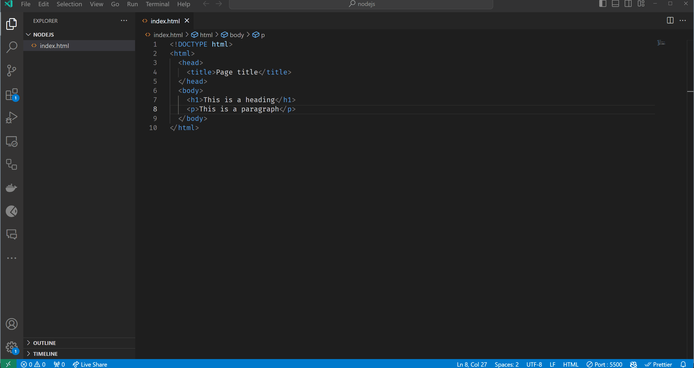

# HTML

Σε αυτό το μάθημα, θα μάθουμε για τη γλώσσα σήμανσης υπερκειμένου (HTML).

  - [HTML](#HTML)
  - [Μαθησιακά αποτελέσματα](#Μαθησιακά-αποτελέσματα)
  - [Βασικά στοιχεία HTML](#Βασικά-στοιχεία-HTML)
  - [HTML Tags](#html-tags)
  - [Στοιχεία HTML](#Στοιχεία-HTML)
  - [Ενσωματωμένα στοιχεία HTML](#Ενσωματωμένα-στοιχεία-HTML)
  - [HTML Attributes](#html-attributes)
  - [HTML Document Structure](#html-document-structure)
  - [HTML Document Metadata](#html-document-metadata)
  - [How to write HTML?](#how-to-write-html)
  - [How to run HTML?](#how-to-run-html)
  - [Exercises](#exercises)
    - [Exercise 1 - Basic HTML Page Structure](#exercise-1---basic-html-page-structure)
    - [Exercise 2 - HTML Lists](#exercise-2---html-lists)
    - [Exercise 3 - HTML Table and Links](#exercise-3---html-table-and-links)


## Μαθησιακά αποτελέσματα

Αφού ολοκληρώσετε αυτό το μάθημα, θα είστε σε θέση να:

- Εξηγήσετε τι είναι η HTML,
- Εξηγήσετε τι είναι οι ετικέτες HTML,
- Εξηγήσετε τι είναι τα στοιχεία HTML,
- Εξηγήσετε τι είναι τα χαρακτηριστικά της HTML,
- Εξηγήσετε ποια είναι η δομή του εγγράφου HTML,
- Εξηγήστε τι είναι τα μεταδεδομένα εγγράφων HTML,
- Γράψτε ένα απλό έγγραφο HTML,
- Εκτελέσετε το έγγραφο HTML σε ένα πρόγραμμα περιήγησης ιστού.


## Βασικά στοιχεία HTML

HTML σημαίνει Hyper Text Markup Language. Η γλώσσα σήμανσης σημαίνει ότι, αντί να χρησιμοποιείτε μια γλώσσα προγραμματισμού για να γράφετε οδηγίες για να τις ακολουθεί ο υπολογιστής, χρησιμοποιείτε ετικέτες για να προσδιορίζετε διαφορετικούς τύπους περιεχομένου. Είναι η τυπική γλώσσα σήμανσης για τη δημιουργία ιστοσελίδων. Η HTML περιγράφει τη δομή μιας ιστοσελίδας. Η HTML αποτελείται από μια σειρά στοιχείων, τα οποία χρησιμοποιείτε για να περικλείετε ή να τυλίγετε διάφορα μέρη του περιεχομένου, ώστε να το κάνετε να εμφανίζεται με έναν συγκεκριμένο τρόπο ή να ενεργεί με έναν συγκεκριμένο τρόπο. Οι ετικέτες που περικλείουν μπορούν να κάνουν μια λέξη ή μια εικόνα υπερσύνδεσμο προς κάπου αλλού, να κάνουν λέξεις πλάγιες, να κάνουν τη γραμματοσειρά μεγαλύτερη ή μικρότερη κ.ο.κ.

Στην HTML δεν λέτε στον υπολογιστή τι να κάνει, αλλά τι είναι κάτι. Για παράδειγμα, μπορείτε να πείτε "αυτή είναι μια παράγραφος", "αυτή είναι μια επικεφαλίδα", "αυτός είναι ένας σύνδεσμος", κ.λπ. Το πρόγραμμα περιήγησης γνωρίζει τότε πώς να εμφανίσει το περιεχόμενο που γράψατε. Διαφορετικοί φυλλομετρητές μπορεί να το εμφανίζουν με διαφορετικό τρόπο, αλλά όλοι γνωρίζουν τι είναι. Για παράδειγμα, ένα πρόγραμμα περιήγησης μπορεί να εμφανίζει μια παράγραφο με διαφορετική γραμματοσειρά από ένα άλλο πρόγραμμα περιήγησης, αλλά και οι δύο γνωρίζουν ότι πρόκειται για παράγραφο.

## HTML Tags

Οι ετικέτες (tags) της HTML είναι ονόματα στοιχείων που περιβάλλονται από γωνιακές αγκύλες - στην HTML, η ετικέτα χρησιμοποιείται για τη δημιουργία στοιχείων HTML, τα οποία αποτελούν τα δομικά στοιχεία των σελίδων HTML. Οι ετικέτες HTML είναι λέξεις-κλειδιά (ονόματα ετικετών) που περιβάλλονται από αγκύλες:

```html
<tagname></tagname>
```

Οι ετικέτες HTML συνήθως έρχονται σε ζεύγη όπως `<p>` και `</p>`. Η πρώτη ετικέτα σε ένα ζευγάρι είναι η ετικέτα έναρξης, η δεύτερη ετικέτα είναι η ετικέτα τέλους. Η ετικέτα τέλους είναι γραμμένη όπως η ετικέτα έναρξης, αλλά με μια πρόσθια κάθετο πριν από το όνομα της ετικέτας. Υπάρχουν ορισμένες ετικέτες HTML που δεν έχουν ετικέτα τέλους, όπως η ετικέτα `<br>` (που υποδηλώνει αλλαγή γραμμής).
Υπάρχουν πολλές διαφορετικές ετικέτες HTML. Ορισμένες ετικέτες HTML χρησιμοποιούνται για την εμφάνιση ή τη μορφοποίηση κειμένου, ορισμένες ετικέτες HTML χρησιμοποιούνται για την εμφάνιση εικόνων, ορισμένες ετικέτες HTML χρησιμοποιούνται για την εμφάνιση πινάκων, ορισμένες ετικέτες HTML χρησιμοποιούνται για την εμφάνιση φορμών κ.λπ. Ο πλήρης κατάλογος των ετικετών HTML μπορεί να βρεθεί [εδώ](https://developer.mozilla.org/en-US/docs/Web/HTML/Element).

Είναι δύσκολο να αναφερθούν οι πιο συνηθισμένες ετικέτες HTML, επειδή εξαρτάται από το τι προσπαθείτε να κάνετε. Υπάρχουν όμως κάποιες ετικέτες HTML, οι οποίες χρησιμοποιούνται πολύ συχνά. Για παράδειγμα:

- `<h1>` χρησιμοποιείται για τη δημιουργία μιας επικεφαλίδας πρώτου επιπέδου,
- `<p>` χρησιμοποιείται για τη δημιουργία μιας παραγράφου,
- `<div>` χρησιμοποιείται για τη δημιουργία ενός τμήματος ή μιας ενότητας σε ένα έγγραφο HTML,
- `<a>` χρησιμοποιείται για τη δημιουργία ενός υπερσυνδέσμου,
- `` χρησιμοποιείται για την εμφάνιση μιας εικόνας,
- `<table>` χρησιμοποιείται για τη δημιουργία ενός πίνακα,
- `<form>` χρησιμοποιείται για τη δημιουργία μιας φόρμας,
- `<input>` χρησιμοποιείται για τη δημιουργία ενός πεδίου εισαγωγής,
- `<button>` χρησιμοποιείται για τη δημιουργία ενός κουμπιού,
- `<ul>` χρησιμοποιείται για τη δημιουργία μιας μη ταξινομημένης λίστας,
- `<ol>` χρησιμοποιείται για τη δημιουργία μιας διατεταγμένης λίστας,
- `<li>` χρησιμοποιείται για τη δημιουργία ενός στοιχείου λίστας,
- κ.λπ.

##  Στοιχεία HTML 

Ένα στοιχείο HTML ορίζεται από μια ετικέτα έναρξης, κάποιο περιεχόμενο και μια ετικέτα λήξης:

```html
<tagname>Το περιεχόμενο τοποθετείται εδώ...</tagname>
```
> Οι ετικέτες χρησιμοποιούνται για να χαρακτηρίζουν την αρχή και το τέλος ενός στοιχείου HTML. Το περιεχόμενο του στοιχείου είναι ό,τι βρίσκεται μεταξύ της ετικέτας αρχής και του τέλους, συμπεριλαμβανομένης της ετικέτας αρχής και τέλους.

Για παράδειγμα, ο ακόλουθος κώδικας HTML ορίζει μια επικεφαλίδα πρώτου επιπέδου και ένα στοιχείο παραγράφου:

```html
<h1>Αυτή είναι μια επικεφαλίδα.</h1>
<p>Αυτή είναι μια παράγραφος.</p>
```

Η ετικέτα `<h1>` ορίζει μια επικεφαλίδα πρώτου επιπέδου. Η ετικέτα `<p>` ορίζει μια παράγραφο.

Τα προγράμματα περιήγησης δεν εμφανίζουν τις ετικέτες HTML, αλλά τις χρησιμοποιούν για να αποδώσουν το περιεχόμενο της σελίδας. Στο Google Chrome αυτός ο κώδικας θα εμφανιστεί ως εξής:


Όπως μπορείτε να δείτε, η ετικέτα `<h1>` κάνει το κείμενο μεγαλύτερο και έντονο, και η ετικέτα `<p>` προσθέτει λίγο χώρο πάνω και κάτω από την παράγραφο.

## Ενσωματωμένα στοιχεία HTML

Τα στοιχεία HTML μπορούν να είναι ένθετα (τα στοιχεία μπορεί να περιέχουν στοιχεία). Τα περισσότερα στοιχεία HTML μπορούν να είναι ένθετα (εκτός από ορισμένα στοιχεία HTML, όπως η ετικέτα `<br>`. Για παράδειγμα, ο ακόλουθος κώδικας HTML ορίζει μια επικεφαλίδα και ένα στοιχείο παραγράφου πρώτου επιπέδου και το στοιχείο παραγράφου περιέχει ένα στοιχείο σύνδεσης:

```html
<h1>Αυτή είναι μια επικεφαλίδα.</h1>
<p>Αυτή είναι μια παράγραφος.
  <a href="https://www.google.com/">Google</a>
</p>
```
Η ένθεση στοιχείων HTML είναι πολύ συνηθισμένη. Για παράδειγμα, το στοιχείο `<body>` περιέχει όλα τα περιεχόμενα ενός εγγράφου HTML και το στοιχείο `<head>` περιέχει όλα τα μεταδεδομένα ενός εγγράφου HTML. Η ένθεση χρησιμοποιείται επίσης για την ομαδοποίηση στοιχείων μαζί. Για παράδειγμα, το στοιχείο `<ul>` περιέχει όλα τα στοιχεία λίστας (στοιχεία `<li>`) μιας μη ταξινομημένης λίστας (στοιχείο `<ul>`). Για παράδειγμα:

```html
<ul>
  <li>Στοιχείο 1</li>
  <li>Στοιχείο 2</li>
</ul>

<ol>
  <li>Στοιχείο 1</li>
  <li>Στοιχείο 2</li>
</ol>
```

Ένα άλλο παράδειγμα ένθετων στοιχείων HTML θα ήταν ένας πίνακας. Ένας πίνακας περιέχει γραμμές (στοιχεία `<tr>`). Η πρώτη γραμμή του πίνακα περιέχει επικεφαλίδες πίνακα (στοιχεία `<th>`) και οι υπόλοιπες γραμμές περιέχουν κελιά πίνακα (στοιχεία `<td>`). Για παράδειγμα:

```html
<table>
  <tr>
    <th>Επικεφαλίδα 1</th>
    <th>Επικεφαλίδα 2</th>
  </tr>
  <tr>
    <td>Κελί 1</td>
    <td>Κελί 2</td>
  </tr>
  <tr>
    <td>Κελί 3</td>
    <td>Κελί 4</td>
  </tr>
</table>
```

Το παράδειγμα πίνακα θα εμφανιζόταν στο Google Chrome ως εξής:


## Χαρακτηριστικά HTML

Τα χαρακτηριστικά HTML είναι ειδικές λέξεις που χρησιμοποιούνται μέσα στην ετικέτα start για τον έλεγχο της συμπεριφοράς του στοιχείου. Τα χαρακτηριστικά HTML χρησιμοποιούνται για την παροχή πρόσθετων πληροφοριών σχετικά με τα στοιχεία HTML. Τα χαρακτηριστικά HTML καθορίζονται πάντα στην ετικέτα start. Τα χαρακτηριστικά HTML εμφανίζονται σε ζεύγη ονόματος/τιμής όπως: `name="value"`.

For example, the following HTML code defines a first level heading with an id attribute:

```html
<h1 id="heading">This is a heading</h1>
```

The `id` attribute specifies a unique id for an HTML element. The value of the `id` attribute must be unique within the HTML document. The `id` attribute is used to identify the element when linking (using a fragment identifier), scripting, or styling (with CSS).

There are some tags, which usually have some attributes. For example, the `<a>` tag is used to create a hyperlink, and it usually has an `href` attribute, which specifies the URL of the page the link goes to. The `` tag is used to display an image, and it usually has an `src` attribute, which specifies the URL of the image to be displayed. For `img` tag the `alt` attribute is also usually used, which specifies an alternate text for an image, if the image cannot be displayed.

```html
<a href="https://www.google.com/">Google</a>

```

Most common HTML attributes can be found [here](https://developer.mozilla.org/en-US/docs/Web/HTML/Attributes).

## HTML Document Structure

An HTML document is a file containing HTML code. An HTML document is made up of the following parts:

- HTML document declaration;
- HTML document root element;
- HTML document head;
- HTML document body.

The HTML document declaration is the first line of the HTML document. It tells the browser that the document is an HTML document. The HTML document declaration is not an HTML tag. It is an instruction to the browser. The HTML document declaration is written like this:

```html
<!DOCTYPE html>
```

The HTML document root element `html` is the outermost element in an HTML document. It is the parent of all other elements in the HTML document. It means that all other elements in the HTML document are descendants of the HTML document root element. The HTML document root element is written like this:

```html
<html>
  ...
</html>
```

The HTML document `head` is the first part of the HTML document. It is the part of the HTML document that is not displayed in the browser window. It is used to specify information about the HTML document, such as the title of the HTML document, the character encoding of the HTML document, etc. The HTML document `head` is written like this:

```html
<head>
  <title>Page Title</title>
</head>
```

The HTML document `body` is the second part of the HTML document. It is the part of the HTML document that is displayed in the browser window. All visible content of the HTML document is written in the HTML document `body`. The HTML document `body` is written like this:

```html
<body>
  <h1>This is a heading</h1>
  <p>This is a paragraph.</p>
</body>
```

If we put all these parts together, we get the following HTML document:

```html
<!DOCTYPE html>
<html>
  <head>
    <title>Page Title</title>
  </head>
  <body>
    <h1>This is a heading</h1>
    <p>This is a paragraph.</p>
  </body>
</html>
```
It is important to note that all HTML elements are descendants of the HTML document root element. 

## HTML Document Metadata

HTML document metadata is data about the HTML document. HTML document metadata is used by browsers (how to display content or reload page), search engines (keywords), etc. HTML document metadata is specified in the HTML document `head`, it is using `meta` tags and attributes. For example:

```html
<head>
  <title>Page Title</title>
  <meta charset="UTF-8">
  <meta name="description" content="Free Web tutorials">
  <meta name="keywords" content="HTML, CSS, JavaScript">
  <meta name="author" content="John Doe">
</head>
```

- `<title>` tag specifies the title of the HTML document.
- `<meta charset="UTF-8">` tag specifies the character encoding of the HTML document.
- `<meta name="description" content="Free Web tutorials">` tag specifies the description of the HTML document.
- `<meta name="keywords" content="HTML, CSS, JavaScript">` tag specifies the keywords of the HTML document.
- `<meta name="author" content="John Doe">` tag specifies the author of the HTML document.

> HTML metadata is not mandatory, but it is recommended to use it in every HTML document.

You can read more about HTML metadata [here](https://developer.mozilla.org/en-US/docs/Learn/HTML/Introduction_to_HTML/The_head_metadata_in_HTML).

## How to write HTML?

HTML is a text-based markup language. It means, that HTML document is a text file, which contains HTML code. So, to write HTML, we need a text editor. There are many different text editors available, including `Notepad++`, `Sublime Text`, `Atom`, `Visual Studio Code`, etc. You can use any of these text editors to write HTML. In this course we'll use `Visual Studio Code` to write HTML.

To start writing HTML, we need to create an HTML document. An HTML document is a text file with `.html` extension. We can create an HTML document using any text editor. For example, we can create an HTML document called `index.html` using `Visual Studio Code`:


As we can see, if we are using `Visual Studio Code` or other code editor, editors are usually can help us to write HTML. For example, if we type `<h1>` tag, editor will automatically add `</h1>` tag. Also, if we type `` tag, editor will automatically add `>` at the end of the tag. Editor will also provide us with suggestions, if we don't remember the name of the tag or attribute.

Actually, we can write HTML using any text editor, even `Notepad`. But, if we are using `Notepad`, we need to remember all the tags and attributes, and we need to type all the tags and attributes manually. So, it is better to use a code editor, which can help us to write HTML.

## How to run HTML?

To run HTML, we need a web browser. There are many different web browsers available, including `Google Chrome`, `Mozilla Firefox`, `Microsoft Edge`, `Opera`, `Safari`, etc. You can use any of these web browsers to run HTML. In this course we'll use `Google Chrome` to run HTML.

To run HTML, we need to open HTML document in a web browser. We can open HTML document in a web browser by double-clicking on the HTML document. Then the computer will open the HTML document in the default web browser:



## Exercises

Try to solve exercises by yourself before checking the solution.

Always test your code to see if it works the way you want.

### Exercise 1 - Basic HTML Page Structure

**Objective**: Create a basic HTML page with standard elements.

**Description**: Create an HTML page (`index.html`) that includes the basic structure: `doctype`, `html`, `head`, and `body` tags. Inside the `body`, add a `h1` tag with the text "Welcome to My Webpage!", followed by a `p` (paragraph) tag with a brief introduction about yourself or a topic of your choice.

Open the HTML page in a web browser to see the result.

Result should look something like this:


<details>
  <summary>Solution</summary>

  ```html
  <!DOCTYPE html>
  <html>
    <head>
      <title>My Webpage</title>
    </head>
    <body>
      <h1>Welcome to My Webpage!</h1>
      <p>My name is John Doe.</p>
    </body>
  </html>
  ```

</details>

### Exercise 2 - HTML Lists

**Objective**: Use HTML to create `ordered` and `unordered` lists.

**Description**: Expand the `index.html` page. Add an `unordered` list (bulleted list) of your favorite hobbies. Then, add an `ordered` list (numbered list) of steps to perform one of those hobbies.

> Hint: Use the `ul` and `ol` tags to create unordered and ordered lists, respectively. Use the `li` tag to create list items inside the `ul` and `ol` tags.
>
> Hint: You can use different levels of headings to separate the two lists.

Result should look something like this:


<details>
  <summary>Solution</summary>

  ```html
  <!DOCTYPE html>
  <html>
    <head>
      <title>My Webpage</title>
    </head>
    <body>
      <h1>Welcome to My Webpage!</h1>
      <p>My name is John Doe.</p>
      <h2>My Hobbies</h2>
      <ul>
        <li>Reading</li>
        <li>Writing</li>
        <li>Programming</li>
      </ul>
      <h2>How to Read a Book</h2>
      <ol>
        <li>Open the book</li>
        <li>Read the book</li>
        <li>Close the book</li>
      </ol>
    </body>
  </html>
  ```
</details>

### Exercise 3 - HTML Table and Links

**Objective**: Create a table and add hyperlinks.

**Description**: Further expand the `index.html` page. Create a table that lists at least three items (e.g., books, movies, recipes), including columns for the item's `name`, a brief `description`, and a `year` or a relevant date. Then, add `hyperlinks` to external websites with more information about each item.

> Hint: Use the `table`, `tr`, `th`, and `td` tags to create a table with rows and columns.
>
> Hint: Use the `a` tag with `src` attribute to create hyperlinks.

Test the hyperlinks by clicking on them.

Result should look something like this:


<details>
  <summary>Solution</summary>

  ```html
  <!DOCTYPE html>
  <html>
    <head>
      <title>My Webpage</title>
    </head>
    <body>
      <h1>Welcome to My Webpage!</h1>
      <p>My name is John Doe.</p>
      <h2>My Hobbies</h2>
      <ul>
        <li>Reading</li>
        <li>Writing</li>
        <li>Programming</li>
      </ul>
      <h2>How to Read a Book</h2>
      <ol>
        <li>Open the book</li>
        <li>Read the book</li>
        <li>Close the book</li>
      </ol>
      <h2>My Favorite Books</h2>
      <table>
        <tr>
          <th>Name</th>
          <th>Description</th>
          <th>Year</th>
        </tr>
        <tr>
          <td><a href="https://en.wikipedia.org/wiki/The_Lord_of_the_Rings">The Lord of the Rings</a></td>
          <td>A fantasy novel</td>
          <td>1954</td>
        </tr>
        <tr>
          <td><a href="https://en.wikipedia.org/wiki/The_Hobbit">The Hobbit</a></td>
          <td>A fantasy novel</td>
          <td>1937</td>
        </tr>
        <tr>
          <td><a href="https://en.wikipedia.org/wiki/The_Silmarillion">The Silmarillion</a></td>
          <td>A collection of mythopoeic works</td>
          <td>1977</td>
        </tr>
      </table>
    </body>
  </html>
  ```
</details>
