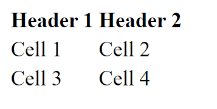

# HTML

Σε αυτό το μάθημα, θα μάθουμε για τη γλώσσα σήμανσης υπερκειμένου (HTML).

  - [HTML](#HTML)
  - [Μαθησιακά αποτελέσματα](#Μαθησιακά-αποτελέσματα)
  - [Βασικά στοιχεία HTML](#Βασικά-στοιχεία-HTML)
  - [HTML Tags](#html-tags)
  - [Στοιχεία HTML](#Στοιχεία-HTML)
  - [Ενσωματωμένα στοιχεία HTML](#Ενσωματωμένα-στοιχεία-HTML)
  - [Χαρακτηριστικά HTML](#Χαρακτηριστικά-HTML)
  - [Δομή εγγράφου HTML](#Δομή-εγγράφου-HTML)
  - [Μεταδεδομένα εγγράφου HTML](#Μεταδεδομένα-εγγράφου-HTML)
  - [Πώς να γράψετε HTML;](#Πώς-να-γράψετε-HTML-;)
  - [Πώς να εκτελέσετε την HTML;](#Πώς-να-εκτελέσετε-την-HTML-;)
  - [Ασκήσεις](#Ασκήσεις)
    - [Άσκηση 1 - Βασική δομή σελίδας HTML](#Άσκηση-1---Βασική-δομή-σελίδας-HTML)
    - [Άσκηση 2 - Λίστες HTML](#Άσκηση-2---Λίστες-HTML)
    - [Άσκηση 3 - Πίνακας HTML και σύνδεσμοι](#Άσκηση-3---Πίνακας-HTML-και-σύνδεσμοι)


## Μαθησιακά αποτελέσματα

Αφού ολοκληρώσετε αυτό το μάθημα, θα είστε σε θέση να:

- Εξηγήσετε τι είναι η HTML,
- Εξηγήσετε τι είναι οι ετικέτες HTML,
- Εξηγήσετε τι είναι τα στοιχεία HTML,
- Εξηγήσετε τι είναι τα χαρακτηριστικά της HTML,
- Εξηγήσετε ποια είναι η δομή του εγγράφου HTML,
- Εξηγήστε τι είναι τα μεταδεδομένα εγγράφων HTML,
- Γράψτε ένα απλό έγγραφο HTML,
- Εκτελέσετε το έγγραφο HTML σε ένα πρόγραμμα περιήγησης ιστού.


## Βασικά στοιχεία HTML

HTML σημαίνει Hyper Text Markup Language. Η γλώσσα σήμανσης σημαίνει ότι, αντί να χρησιμοποιείτε μια γλώσσα προγραμματισμού για να γράφετε οδηγίες για να τις ακολουθεί ο υπολογιστής, χρησιμοποιείτε ετικέτες για να προσδιορίζετε διαφορετικούς τύπους περιεχομένου. Είναι η τυπική γλώσσα σήμανσης για τη δημιουργία ιστοσελίδων. Η HTML περιγράφει τη δομή μιας ιστοσελίδας. Η HTML αποτελείται από μια σειρά στοιχείων, τα οποία χρησιμοποιείτε για να περικλείετε ή να τυλίγετε διάφορα μέρη του περιεχομένου, ώστε να το κάνετε να εμφανίζεται με έναν συγκεκριμένο τρόπο ή να ενεργεί με έναν συγκεκριμένο τρόπο. Οι ετικέτες που περικλείουν μπορούν να κάνουν μια λέξη ή μια εικόνα υπερσύνδεσμο προς κάπου αλλού, να κάνουν λέξεις πλάγιες, να κάνουν τη γραμματοσειρά μεγαλύτερη ή μικρότερη κ.ο.κ.

Στην HTML δεν λέτε στον υπολογιστή τι να κάνει, αλλά τι είναι κάτι. Για παράδειγμα, μπορείτε να πείτε "αυτή είναι μια παράγραφος", "αυτή είναι μια επικεφαλίδα", "αυτός είναι ένας σύνδεσμος", κ.λπ. Το πρόγραμμα περιήγησης γνωρίζει τότε πώς να εμφανίσει το περιεχόμενο που γράψατε. Διαφορετικοί φυλλομετρητές μπορεί να το εμφανίζουν με διαφορετικό τρόπο, αλλά όλοι γνωρίζουν τι είναι. Για παράδειγμα, ένα πρόγραμμα περιήγησης μπορεί να εμφανίζει μια παράγραφο με διαφορετική γραμματοσειρά από ένα άλλο πρόγραμμα περιήγησης, αλλά και οι δύο γνωρίζουν ότι πρόκειται για παράγραφο.

## HTML Tags

Οι ετικέτες (tags) της HTML είναι ονόματα στοιχείων που περιβάλλονται από γωνιακές αγκύλες - στην HTML, η ετικέτα χρησιμοποιείται για τη δημιουργία στοιχείων HTML, τα οποία αποτελούν τα δομικά στοιχεία των σελίδων HTML. Οι ετικέτες HTML είναι λέξεις-κλειδιά (ονόματα ετικετών) που περιβάλλονται από αγκύλες:

```html
<tagname></tagname>
```

Οι ετικέτες HTML συνήθως έρχονται σε ζεύγη όπως `<p>` και `</p>`. Η πρώτη ετικέτα σε ένα ζευγάρι είναι η ετικέτα έναρξης, η δεύτερη ετικέτα είναι η ετικέτα τέλους. Η ετικέτα τέλους είναι γραμμένη όπως η ετικέτα έναρξης, αλλά με μια πρόσθια κάθετο πριν από το όνομα της ετικέτας. Υπάρχουν ορισμένες ετικέτες HTML που δεν έχουν ετικέτα τέλους, όπως η ετικέτα `<br>` (που υποδηλώνει αλλαγή γραμμής).
Υπάρχουν πολλές διαφορετικές ετικέτες HTML. Ορισμένες ετικέτες HTML χρησιμοποιούνται για την εμφάνιση ή τη μορφοποίηση κειμένου, ορισμένες ετικέτες HTML χρησιμοποιούνται για την εμφάνιση εικόνων, ορισμένες ετικέτες HTML χρησιμοποιούνται για την εμφάνιση πινάκων, ορισμένες ετικέτες HTML χρησιμοποιούνται για την εμφάνιση φορμών κ.λπ. Ο πλήρης κατάλογος των ετικετών HTML μπορεί να βρεθεί [εδώ](https://developer.mozilla.org/en-US/docs/Web/HTML/Element).

Είναι δύσκολο να αναφερθούν οι πιο συνηθισμένες ετικέτες HTML, επειδή εξαρτάται από το τι προσπαθείτε να κάνετε. Υπάρχουν όμως κάποιες ετικέτες HTML, οι οποίες χρησιμοποιούνται πολύ συχνά. Για παράδειγμα:

- `<h1>` χρησιμοποιείται για τη δημιουργία μιας επικεφαλίδας πρώτου επιπέδου,
- `<p>` χρησιμοποιείται για τη δημιουργία μιας παραγράφου,
- `<div>` χρησιμοποιείται για τη δημιουργία ενός τμήματος ή μιας ενότητας σε ένα έγγραφο HTML,
- `<a>` χρησιμοποιείται για τη δημιουργία ενός υπερσυνδέσμου,
- `` χρησιμοποιείται για την εμφάνιση μιας εικόνας,
- `<table>` χρησιμοποιείται για τη δημιουργία ενός πίνακα,
- `<form>` χρησιμοποιείται για τη δημιουργία μιας φόρμας,
- `<input>` χρησιμοποιείται για τη δημιουργία ενός πεδίου εισαγωγής,
- `<button>` χρησιμοποιείται για τη δημιουργία ενός κουμπιού,
- `<ul>` χρησιμοποιείται για τη δημιουργία μιας μη ταξινομημένης λίστας,
- `<ol>` χρησιμοποιείται για τη δημιουργία μιας διατεταγμένης λίστας,
- `<li>` χρησιμοποιείται για τη δημιουργία ενός στοιχείου λίστας,
- κ.λπ.

##  Στοιχεία HTML 

Ένα στοιχείο HTML ορίζεται από μια ετικέτα έναρξης, κάποιο περιεχόμενο και μια ετικέτα λήξης:

```html
<tagname>Το περιεχόμενο τοποθετείται εδώ...</tagname>
```
> Οι ετικέτες χρησιμοποιούνται για να χαρακτηρίζουν την αρχή και το τέλος ενός στοιχείου HTML. Το περιεχόμενο του στοιχείου είναι ό,τι βρίσκεται μεταξύ της ετικέτας αρχής και του τέλους, συμπεριλαμβανομένης της ετικέτας αρχής και τέλους.

Για παράδειγμα, ο ακόλουθος κώδικας HTML ορίζει μια επικεφαλίδα πρώτου επιπέδου και ένα στοιχείο παραγράφου:

```html
<h1>This is a heading.</h1>
<p>This is a paragraph.</p>
```

Η ετικέτα `<h1>` ορίζει μια επικεφαλίδα πρώτου επιπέδου. Η ετικέτα `<p>` ορίζει μια παράγραφο.

Τα προγράμματα περιήγησης δεν εμφανίζουν τις ετικέτες HTML, αλλά τις χρησιμοποιούν για να αποδώσουν το περιεχόμενο της σελίδας. Στο Google Chrome αυτός ο κώδικας θα εμφανιστεί ως εξής:


Όπως μπορείτε να δείτε, η ετικέτα `<h1>` κάνει το κείμενο μεγαλύτερο και έντονο, και η ετικέτα `<p>` προσθέτει λίγο χώρο πάνω και κάτω από την παράγραφο.

## Ενσωματωμένα στοιχεία HTML

Τα στοιχεία HTML μπορούν να είναι ένθετα (τα στοιχεία μπορεί να περιέχουν στοιχεία). Τα περισσότερα στοιχεία HTML μπορούν να είναι ένθετα (εκτός από ορισμένα στοιχεία HTML, όπως η ετικέτα `<br>`. Για παράδειγμα, ο ακόλουθος κώδικας HTML ορίζει μια επικεφαλίδα και ένα στοιχείο παραγράφου πρώτου επιπέδου και το στοιχείο παραγράφου περιέχει ένα στοιχείο σύνδεσης:

```html
<h1>Αυτή είναι μια επικεφαλίδα.</h1>
<p>Αυτή είναι μια παράγραφος.
  <a href="https://www.google.com/">Google</a>
</p>
```
Η ένθεση στοιχείων HTML είναι πολύ συνηθισμένη. Για παράδειγμα, το στοιχείο `<body>` περιέχει όλα τα περιεχόμενα ενός εγγράφου HTML και το στοιχείο `<head>` περιέχει όλα τα μεταδεδομένα ενός εγγράφου HTML. Η ένθεση χρησιμοποιείται επίσης για την ομαδοποίηση στοιχείων μαζί. Για παράδειγμα, το στοιχείο `<ul>` περιέχει όλα τα στοιχεία λίστας (στοιχεία `<li>`) μιας μη ταξινομημένης λίστας (στοιχείο `<ul>`). Για παράδειγμα:

```html
<ul>
  <li>Στοιχείο 1</li>
  <li>Στοιχείο 2</li>
</ul>

<ol>
  <li>Στοιχείο 1</li>
  <li>Στοιχείο 2</li>
</ol>
```

Ένα άλλο παράδειγμα ένθετων στοιχείων HTML θα ήταν ένας πίνακας. Ένας πίνακας περιέχει γραμμές (στοιχεία `<tr>`). Η πρώτη γραμμή του πίνακα περιέχει επικεφαλίδες πίνακα (στοιχεία `<th>`) και οι υπόλοιπες γραμμές περιέχουν κελιά πίνακα (στοιχεία `<td>`). Για παράδειγμα:

```html
<table>
  <tr>
    <th>Heading 1</th>
    <th>Heading 2</th>
  </tr>
  <tr>
    <td>Cell 1</td>
    <td>Cell 2</td>
  </tr>
  <tr>
    <td>Cell 3</td>
    <td>Cell 4</td>
  </tr>
</table>
```

Το παράδειγμα πίνακα θα εμφανιζόταν στο Google Chrome ως εξής:



## Χαρακτηριστικά HTML

Τα χαρακτηριστικά HTML είναι ειδικές λέξεις που χρησιμοποιούνται μέσα στην ετικέτα start για τον έλεγχο της συμπεριφοράς του στοιχείου. Τα χαρακτηριστικά HTML χρησιμοποιούνται για την παροχή πρόσθετων πληροφοριών σχετικά με τα στοιχεία HTML. Τα χαρακτηριστικά HTML καθορίζονται πάντα στην ετικέτα start. Τα χαρακτηριστικά HTML εμφανίζονται σε ζεύγη ονόματος/τιμής όπως: `name="τιμή"`.

Για παράδειγμα, ο ακόλουθος κώδικας HTML ορίζει μια επικεφαλίδα πρώτου επιπέδου με ένα χαρακτηριστικό id:

```html
<h1 id="επικεφαλίδα">Αυτή είναι μια επικεφαλίδα</h1>
```

Το χαρακτηριστικό `id` καθορίζει ένα μοναδικό αναγνωριστικό για ένα στοιχείο HTML. Η τιμή του χαρακτηριστικού `id` πρέπει να είναι μοναδική εντός του εγγράφου HTML. Το χαρακτηριστικό `id` χρησιμοποιείται για την αναγνώριση του στοιχείου κατά τη σύνδεση (με χρήση αναγνωριστικού τμήματος), τη δημιουργία σεναρίων ή τη διαμόρφωση (με CSS).

Υπάρχουν κάποιες ετικέτες, οι οποίες συνήθως έχουν κάποια χαρακτηριστικά. Για παράδειγμα, η ετικέτα «<a>» χρησιμοποιείται για τη δημιουργία μιας υπερσύνδεσης και συνήθως έχει ένα χαρακτηριστικό `href`, το οποίο καθορίζει τη διεύθυνση URL της σελίδας στην οποία πηγαίνει ο σύνδεσμος. Η ετικέτα `` χρησιμοποιείται για την εμφάνιση μιας εικόνας και συνήθως έχει ένα χαρακτηριστικό `src`, το οποίο καθορίζει τη διεύθυνση URL της εικόνας που θα εμφανίζεται. Για την ετικέτα `img` συνήθως χρησιμοποιείται επίσης το χαρακτηριστικό `alt`, το οποίο καθορίζει ένα εναλλακτικό κείμενο για μια εικόνα, εάν η εικόνα δεν μπορεί να εμφανιστεί.

```html
<a href="https://www.google.com/">Google</a>

```

Τα πιο συνηθισμένα χαρακτηριστικά HTML μπορείτε να τα βρείτε [εδώ](https://developer.mozilla.org/en-US/docs/Web/HTML/Attributes).

## Δομή εγγράφου HTML

Ένα έγγραφο HTML είναι ένα αρχείο που περιέχει κώδικα HTML. Ένα έγγραφο HTML αποτελείται από τα ακόλουθα μέρη:

- Δήλωση εγγράφου HTML,
- Στοιχείο ρίζας εγγράφου HTML,
- Κεφαλή εγγράφου HTML,
- Σώμα εγγράφου HTML.

Η δήλωση εγγράφου HTML είναι η πρώτη γραμμή του εγγράφου HTML. Λέει στο πρόγραμμα περιήγησης ότι το έγγραφο είναι έγγραφο HTML. Η δήλωση εγγράφου HTML δεν είναι ετικέτα HTML. Είναι μια οδηγία προς το πρόγραμμα περιήγησης. Η δήλωση εγγράφου HTML γράφεται ως εξής:

```html
<!DOCTYPE html>
```

Το  στοιχείο ρίζα του εγγράφου HTML `html` είναι το εξωτερικό στοιχείο ενός εγγράφου HTML. Είναι ο γονέας όλων των άλλων στοιχείων του εγγράφου HTML. Αυτό σημαίνει ότι όλα τα άλλα στοιχεία στο έγγραφο HTML είναι απόγονοι του στοιχείου ρίζας του εγγράφου HTML. Το στοιχείο ρίζα εγγράφου HTML γράφεται ως εξής:

```html
<html>
  ...
</html>
```

Η «κεφαλή» του εγγράφου HTML είναι το πρώτο μέρος του εγγράφου HTML. Είναι το μέρος του εγγράφου HTML που δεν εμφανίζεται στο παράθυρο του προγράμματος περιήγησης. Χρησιμοποιείται για τον καθορισμό πληροφοριών σχετικά με το έγγραφο HTML, όπως ο τίτλος του εγγράφου HTML, η κωδικοποίηση χαρακτήρων του εγγράφου HTML κ.λπ. Η «κεφαλή» του εγγράφου HTML γράφεται ως εξής:

```html
<head>
  <title>Page Title</title>
</head>
```

Το «σώμα» του εγγράφου HTML είναι το δεύτερο μέρος του εγγράφου HTML. Είναι το μέρος του εγγράφου HTML που εμφανίζεται στο παράθυρο του προγράμματος περιήγησης. Όλο το ορατό περιεχόμενο του εγγράφου HTML γράφεται στο έγγραφο HTML `body`. Το έγγραφο HTML `body` γράφεται ως εξής:

```html
<body>
  <h1>This is a heading</h1>
  <p>This is a paragraph.</p>
</body>
```

Αν βάλουμε όλα αυτά τα μέρη μαζί, θα έχουμε το ακόλουθο έγγραφο HTML:

```html
<!DOCTYPE html>
<html>
  <head>
    <title>Page Title</title>
  </head>
  <body>
    <h1>This is a heading</h1>
    <p>This is a paragraph.</p>
  </body>
</html>
```
Είναι σημαντικό να σημειωθεί ότι όλα τα στοιχεία HTML είναι απόγονοι του στοιχείου ρίζα του εγγράφου HTML. 

## Μεταδεδομένα εγγράφου HTML

Τα μεταδεδομένα εγγράφου HTML είναι δεδομένα σχετικά με το έγγραφο HTML. Τα μεταδεδομένα του εγγράφου HTML χρησιμοποιούνται από τα προγράμματα περιήγησης (τρόπος εμφάνισης του περιεχομένου ή επαναφόρτωσης της σελίδας), τις μηχανές αναζήτησης (λέξεις-κλειδιά) κ.λπ. Τα μεταδεδομένα του εγγράφου HTML καθορίζονται στην «κεφαλή» του εγγράφου HTML, χρησιμοποιώντας τις ετικέτες και τα χαρακτηριστικά «meta». Για παράδειγμα:

```html
<head>
  <title>Page Title</title>
  <meta charset="UTF-8">
  <meta name="description" content="Free Web tutorials">
  <meta name="keywords" content="HTML, CSS, JavaScript">
  <meta name="author" content="John Doe">
</head>
```

- `<title>` προσδιορίζει τον τίτλο του εγγράφου HTML.
- `<meta charset="UTF-8">` προσδιορίζει την κωδικοποίηση χαρακτήρων του εγγράφου HTML.
- `<meta name="description" content="Free Web tutorials">` προσδιορίζει την περιγραφή του εγγράφου HTML.
- `<meta name="keywords" content="HTML, CSS, JavaScript">` προσδιορίζει τις λέξεις-κλειδιά του εγγράφου HTML.
- `<meta name="author" content="John Doe">` προσδιορίζει τον συγγραφέα του εγγράφου HTML.

> Τα μεταδεδομένα HTML δεν είναι υποχρεωτικά, αλλά συνιστάται η χρήση τους σε κάθε έγγραφο HTML.

Μπορείτε να διαβάσετε περισσότερα για τα μεταδεδομένα HTML [εδώ](https://developer.mozilla.org/en-US/docs/Learn/HTML/Introduction_to_HTML/The_head_metadata_in_HTML).

## Πώς να γράψετε HTML;

Η HTML είναι μια γλώσσα σήμανσης βασισμένη σε κείμενο. Αυτό σημαίνει ότι το έγγραφο HTML είναι ένα αρχείο κειμένου, το οποίο περιέχει κώδικα HTML. Έτσι, για να γράψουμε HTML, χρειαζόμαστε έναν επεξεργαστή κειμένου. Υπάρχουν πολλοί διαφορετικοί διαθέσιμοι επεξεργαστές κειμένου, συμπεριλαμβανομένων των `Notepad++`, `Sublime Text`, `Atom`, `Visual Studio Code`, κ.λπ. Μπορείτε να χρησιμοποιήσετε οποιοδήποτε από αυτά τα προγράμματα επεξεργασίας κειμένου για να γράψετε HTML. Σε αυτό το μάθημα θα χρησιμοποιήσουμε το `Visual Studio Code` για να γράψουμε HTML.

Για να ξεκινήσουμε να γράφουμε HTML, πρέπει να δημιουργήσουμε ένα έγγραφο HTML. Ένα έγγραφο HTML είναι ένα αρχείο κειμένου με επέκταση `.html`. Μπορούμε να δημιουργήσουμε ένα έγγραφο HTML χρησιμοποιώντας οποιονδήποτε επεξεργαστή κειμένου. Για παράδειγμα, μπορούμε να δημιουργήσουμε ένα έγγραφο HTML με όνομα `index.html` χρησιμοποιώντας το `Visual Studio Code`:


Όπως μπορούμε να δούμε, εάν χρησιμοποιούμε "Visual Studio Code" ή άλλο πρόγραμμα επεξεργασίας κώδικα, οι επεξεργαστές συνήθως μπορούν να μας βοηθήσουν να γράψουμε HTML. Για παράδειγμα, αν πληκτρολογήσουμε ετικέτα `<h1>`, ο επεξεργαστής θα προσθέσει αυτόματα την ετικέτα `</h1>`. Επίσης, αν πληκτρολογήσουμε ετικέτα ``, το πρόγραμμα επεξεργασίας θα προσθέσει αυτόματα `>` στο τέλος της ετικέτας. Το πρόγραμμα επεξεργασίας θα μας παρέχει επίσης προτάσεις, εάν δεν θυμόμαστε το όνομα της ετικέτας ή του χαρακτηριστικού.

Στην πραγματικότητα, μπορούμε να γράψουμε HTML χρησιμοποιώντας οποιοδήποτε πρόγραμμα επεξεργασίας κειμένου, ακόμα και το "Notepad". Ωστόσο, εάν χρησιμοποιούμε το "Notepad", πρέπει να θυμόμαστε όλες τις ετικέτες και τα χαρακτηριστικά και πρέπει να πληκτρολογούμε όλες τις ετικέτες και τα χαρακτηριστικά με μη αυτόματο τρόπο. Επομένως, είναι καλύτερο να χρησιμοποιήσουμε έναν επεξεργαστή κώδικα, ο οποίος μπορεί να μας βοηθήσει να γράψουμε HTML.

## Πώς να εκτελέσετε την HTML;

Για την εκτέλεση της HTML, χρειαζόμαστε ένα πρόγραμμα περιήγησης στο διαδίκτυο. Υπάρχουν πολλά διαφορετικά προγράμματα περιήγησης ιστού, όπως το `Google Chrome`, `Mozilla Firefox`, `Microsoft Edge`, `Opera`, `Safari` κ.λπ. Μπορείτε να χρησιμοποιήσετε οποιοδήποτε από αυτά τα προγράμματα περιήγησης ιστού για να εκτελέσετε HTML. Σε αυτό το μάθημα θα χρησιμοποιήσουμε το `Google Chrome` για την εκτέλεση της HTML.

Για να εκτελέσουμε την HTML, πρέπει να ανοίξουμε το έγγραφο HTML σε ένα πρόγραμμα περιήγησης ιστού. Μπορούμε να ανοίξουμε το έγγραφο HTML σε ένα πρόγραμμα περιήγησης ιστού κάνοντας διπλό κλικ στο έγγραφο HTML. Στη συνέχεια, ο υπολογιστής θα ανοίξει το έγγραφο HTML στο προεπιλεγμένο πρόγραμμα περιήγησης ιστού:


## Ασκήσεις

Προσπαθήστε να λύσετε τις ασκήσεις μόνοι σας πριν ελέγξετε τη λύση.

Να δοκιμάζετε πάντα τον κώδικά σας για να δείτε αν λειτουργεί όπως θέλετε.

### Άσκηση 1 - Βασική δομή σελίδας HTML

**Στόχος**: Δημιουργήστε μια βασική σελίδα HTML με τυποποιημένα στοιχεία.

**Περιγραφή**: Δημιουργήστε μια σελίδα HTML (`index.html`) που περιλαμβάνει τη βασική δομή: ετικέτες `doctype`, `html`, `head` και `body`. Μέσα στο `body`, προσθέστε μια ετικέτα `h1` με το κείμενο «Welcome to My Webpage!», ακολουθούμενη από μια ετικέτα `p` (paragraph) με μια σύντομη εισαγωγή για τον εαυτό σας ή για ένα θέμα της επιλογής σας.

Ανοίξτε τη σελίδα HTML σε ένα πρόγραμμα περιήγησης ιστού για να δείτε το αποτέλεσμα.

Το αποτέλεσμα θα πρέπει να μοιάζει κάπως έτσι:


<details>
  <summary>Λύση</summary>

  ```html
  <!DOCTYPE html>
  <html>
    <head>
      <title>My Webpage</title>
    </head>
    <body>
      <h1>Welcome to My Webpage!</h1>
      <p>My name is John Doe.</p>
    </body>
  </html>
  ```

</details>

### Άσκηση 2 - Λίστες HTML

**Στόχος**: Χρησιμοποιήστε την HTML για να δημιουργήσετε «ταξινομημένες» και «μη ταξινομημένες» λίστες.

**Περιγραφή**: Αναπτύξτε τη σελίδα «index.html». Προσθέστε μια λίστα «μη ταξινομημένη» (bulleted list) με τα αγαπημένα σας χόμπι. Στη συνέχεια, προσθέστε μια «ταξινομημένη» λίστα (αριθμημένη λίστα) με τα βήματα για την εκτέλεση ενός από αυτά τα χόμπι.

> Συμβουλή: Χρησιμοποιήστε τις ετικέτες `ul` και `ol` για να δημιουργήσετε μη ταξινομημένες και ταξινομημένες λίστες, αντίστοιχα. Χρησιμοποιήστε την ετικέτα `li` για να δημιουργήσετε στοιχεία λίστας μέσα στις ετικέτες `ul` και `ol`.
>
> Συμβουλή: Μπορείτε να χρησιμοποιήσετε διαφορετικά επίπεδα επικεφαλίδων για να διαχωρίσετε τις δύο λίστες.

Το αποτέλεσμα θα πρέπει να μοιάζει κάπως έτσι:


<details>
  <summary>Λύση</summary>

  ```html
  <!DOCTYPE html>
  <html>
    <head>
      <title>My Webpage</title>
    </head>
    <body>
      <h1>Welcome to My Webpage!</h1>
      <p>My name is John Doe.</p>
      <h2>My Hobbies</h2>
      <ul>
        <li>Reading</li>
        <li>Writing</li>
        <li>Programming</li>
      </ul>
      <h2>How to Read a Book</h2>
      <ol>
        <li>Open the book</li>
        <li>Read the book</li>
        <li>Close the book</li>
      </ol>
    </body>
  </html>
  ```
</details>

### Άσκηση 3 - Πίνακας HTML και σύνδεσμοι

**Στόχος**: Δημιουργήστε έναν πίνακα και προσθέστε υπερσυνδέσμους.

**Περιγραφή**: Επεκτείνετε περαιτέρω τη σελίδα «index.html». Δημιουργήστε έναν πίνακα που απαριθμεί τουλάχιστον τρία στοιχεία (π.χ. βιβλία, ταινίες, συνταγές), περιλαμβάνοντας στήλες για το «όνομα» του στοιχείου, μια σύντομη «περιγραφή» και ένα «έτος» ή μια σχετική ημερομηνία. Στη συνέχεια, προσθέστε «υπερσυνδέσμους» προς εξωτερικούς δικτυακούς τόπους με περισσότερες πληροφορίες για κάθε στοιχείο.

> Συμβουλή: Χρησιμοποιήστε τις ετικέτες `table`, `tr`, `th` και `td` για να δημιουργήσετε έναν πίνακα με γραμμές και στήλες.
>
> Συμβουλή: Χρησιμοποιήστε την ετικέτα `a` με το χαρακτηριστικό `src` για να δημιουργήσετε υπερσυνδέσμους.

Δοκιμάστε τους υπερσυνδέσμους κάνοντας κλικ πάνω τους.

Το αποτέλεσμα θα πρέπει να μοιάζει κάπως έτσι:


<details>
  <summary>Λύση</summary>

  ```html
  <!DOCTYPE html>
  <html>
    <head>
      <title>My Webpage</title>
    </head>
    <body>
      <h1>Welcome to My Webpage!</h1>
      <p>My name is John Doe.</p>
      <h2>My Hobbies</h2>
      <ul>
        <li>Reading</li>
        <li>Writing</li>
        <li>Programming</li>
      </ul>
      <h2>How to Read a Book</h2>
      <ol>
        <li>Open the book</li>
        <li>Read the book</li>
        <li>Close the book</li>
      </ol>
      <h2>My Favorite Books</h2>
      <table>
        <tr>
          <th>Name</th>
          <th>Description</th>
          <th>Year</th>
        </tr>
        <tr>
          <td><a href="https://en.wikipedia.org/wiki/The_Lord_of_the_Rings">The Lord of the Rings</a></td>
          <td>A fantasy novel</td>
          <td>1954</td>
        </tr>
        <tr>
          <td><a href="https://en.wikipedia.org/wiki/The_Hobbit">The Hobbit</a></td>
          <td>A fantasy novel</td>
          <td>1937</td>
        </tr>
        <tr>
          <td><a href="https://en.wikipedia.org/wiki/The_Silmarillion">The Silmarillion</a></td>
          <td>A collection of mythopoeic works</td>
          <td>1977</td>
        </tr>
      </table>
    </body>
  </html>
  ```
</details>
