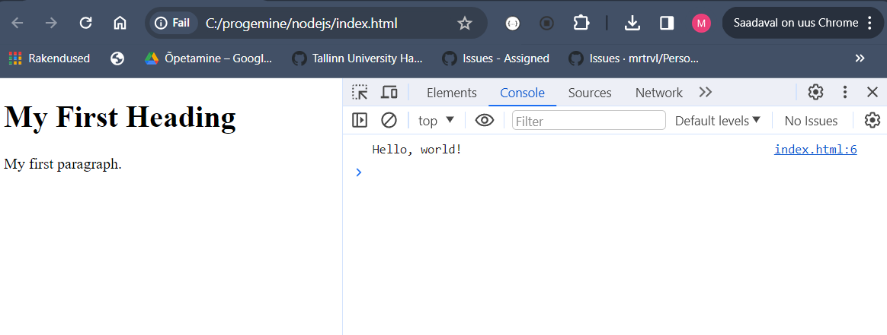

# Javascript στο πρόγραμμα περιήγησης

Σε αυτό το θέμα θα μάθουμε για τη Javascript στο πρόγραμμα περιήγησης και πώς να συμπεριλάβετε τη Javascript σε αρχεία HTML.

- [Javascript στο πρόγραμμα περιήγησης](#Javascript-στο-πρόγραμμα-περιήγησης)
  - [Μαθησιακά αποτελέσματα](#Μαθησιακά-αποτελέσματα)
  - [Διαφορά μεταξύ Node.js και Javascript του προγράμματος περιήγησης](#Διαφορά-μεταξύ-Node.js-και-Javascript-του-προγράμματος-περιήγησης)
  - [Συμπεριλαμβανομένης της Javascript στην HTML](#Συμπεριλαμβανομένης-της-Javascript-στην-HTML)
    - [Χρήση της ετικέτας `<script>`](#Χρήση-της-ετικέτας-`<script>`)
    - [Χρήση του χαρακτηριστικού `src`](#Χρήση-του-χαρακτηριστικού-`src`)
  - [Είσοδος και έξοδος στο πρόγραμμα περιήγησης Javascript](#Είσοδος-και-έξοδος-στο-πρόγραμμα-περιήγησης-Javascript)
    - [Συνάρτηση `prompt()`](#Συνάρτηση-`prompt()`)
    - [Συνάρτηση `alert()`](#Συνάρτηση-`alert()`)
  - [Ασκήσεις](#Ασκήσεις)
    - [Άσκηση 1: Βασικός χαιρετισμός χρήστη](#Άσκηση-1-:-Βασικός-χαιρετισμός-χρήστη)
    - [Άσκηση 2: Απλό μαθηματικό κουίζ](#Άσκηση-2-:-Απλό-μαθηματικό-κουίζ)
    - [Άσκηση 3: Έλεγχος ηλικιακής κατηγορίας](#Άσκηση-3-:-Έλεγχος-ηλικιακής-κατηγορίας)


## Μαθησιακά αποτελέσματα

Αφού ολοκληρώσετε αυτό το θέμα, θα είστε σε θέση να:

- Να περιγράψετε τη διαφορά μεταξύ του Node.js και της Javascript του προγράμματος περιήγησης.
- Να συμπεριλαμβάνετε Javascript στην HTML.
- Να λαμβάνετε την είσοδο του χρήστη και να εμφανίζετε την έξοδο σε Javascript του προγράμματος περιήγησης.
- Να χρησιμοποιείτε τις συναρτήσεις `prompt()` και `alert()`.

## Διαφορά μεταξύ Node.js και Browser Javascript

Η κύρια διαφορά είναι ότι το Node.js είναι ένα περιβάλλον εκτέλεσης της Javascript, ενώ η Javascript του προγράμματος περιήγησης είναι μια μηχανή Javascript. Η μηχανή Javascript είναι ένα πρόγραμμα που εκτελεί κώδικα Javascript. Το περιβάλλον εκτέλεσης Javascript είναι ένα πρόγραμμα που εκτελεί κώδικα Javascript και παρέχει πρόσθετες δυνατότητες, όπως πρόσβαση στο σύστημα αρχείων, στο δίκτυο κ.λπ.

Για παράδειγμα, η Javascript στο πρόγραμμα περιήγησης δεν μπορεί να έχει πρόσβαση στο σύστημα αρχείων, ενώ το Node.js μπορεί. Η Javascript στο πρόγραμμα περιήγησης μπορεί να έχει πρόσβαση στο DOM, ενώ το Node.js όχι.

Υπάρχουν διαφορετικά παγκόσμια αντικείμενα στο Node.js και στη Javascript του προγράμματος περιήγησης. Για παράδειγμα, τα αντικείμενα `window` και `document` είναι διαθέσιμα στην Javascript του προγράμματος περιήγησης, αλλά όχι στο Node.js. Το αντικείμενο `process` είναι διαθέσιμο στο Node.js, αλλά όχι στο πρόγραμμα περιήγησης Javascript.

- Το αντικείμενο `window` είναι το παγκόσμιο αντικείμενο στο πρόγραμμα περιήγησης Javascript. Αντιπροσωπεύει το παράθυρο του προγράμματος περιήγησης. Διαθέτει ιδιότητες και μεθόδους που επιτρέπουν την πρόσβαση στο παράθυρο του προγράμματος περιήγησης και στο περιεχόμενό του.
- Το αντικείμενο `document` είναι το παγκόσμιο αντικείμενο στη Javascript του προγράμματος περιήγησης. Αντιπροσωπεύει το DOM. Διαθέτει ιδιότητες και μεθόδους που επιτρέπουν την πρόσβαση στο DOM και το περιεχόμενό του.
- Το αντικείμενο `process` είναι το παγκόσμιο αντικείμενο στο Node.js. Διαθέτει ιδιότητες και μεθόδους που επιτρέπουν την πρόσβαση στη διεργασία Node.js και στο περιεχόμενό της.

Η σύνταξη της Javascript είναι η ίδια και στα δύο περιβάλλοντα.

## Συμπεριλαμβάνοντας Javascript στην HTML

Οι φυλλομετρητές μπορούν να εκτελέσουν κώδικα Javascript που περιλαμβάνεται σε αρχεία HTML. Υπάρχουν δύο τρόποι για να συμπεριλάβετε κώδικα Javascript σε αρχεία HTML:

- χρησιμοποιώντας την ετικέτα `<script>`,
- χρησιμοποιώντας το χαρακτηριστικό `src`.

### Χρήση της ετικέτας `<script>`

Ο κώδικας Javascript μπορεί να συμπεριληφθεί σε αρχεία HTML χρησιμοποιώντας την ετικέτα `<script>`. Η ετικέτα `<script>` μπορεί να τοποθετηθεί στην ενότητα `<head>` ή `<body>` του αρχείου HTML. Ο κώδικας Javascript που περιλαμβάνεται στο τμήμα `<head>` εκτελείται πριν από τη φόρτωση του αρχείου HTML. Ο κώδικας Javascript που περιλαμβάνεται στην ενότητα `<body>` εκτελείται μετά τη φόρτωση του αρχείου HTML.

```html
<!DOCTYPE html>
<html>
<head>
    <title>Page Title</title>
    <script>
        console.log('Hello, world!');
    </script>
</head>
<body>
    <h1>My First Heading</h1>
    <p>My first paragraph.</p>
</body>
</html>
```
> Σημείωση: στο πρόγραμμα περιήγησης Javascript, μπορούμε να δούμε την έξοδο της `console.log()` στην κονσόλα του προγράμματος περιήγησης. Για να ανοίξετε την κονσόλα του προγράμματος περιήγησης, πατήστε `F12` ή `Ctrl+Shift+I` στους Chrome, Firefox ή Edge.
> 

### Χρήση του χαρακτηριστικού `src`

Ο κώδικας Javascript μπορεί να συμπεριληφθεί από εξωτερικά αρχεία Javascript χρησιμοποιώντας το χαρακτηριστικό `src`. Το χαρακτηριστικό `src` μπορεί να χρησιμοποιηθεί με την ετικέτα `<script>`. Ο κώδικας Javascript που περιλαμβάνεται με τη χρήση του χαρακτηριστικού `src` εκτελείται μετά τη φόρτωση του αρχείου HTML.

```html
<!DOCTYPE html>
<html>
<head>
    <title>Page Title</title>
    <script src="script.js"></script>
</head>
<body>
    <h1>My First Heading</h1>
    <p>My first paragraph.</p>
</body>
</html>
```

## Είσοδος και έξοδος στο πρόγραμμα περιήγησης Javascript

Υπάρχουν διάφοροι τρόποι για να λαμβάνετε την είσοδο του χρήστη και να εμφανίζετε την έξοδο στο πρόγραμμα περιήγησης Javascript. Οι κύριες αλληλεπιδράσεις με τον χρήστη γίνονται με τη χρήση του DOM. Χρησιμοποιώντας το DOM μπορούμε να διαβάσουμε και να τροποποιήσουμε το περιεχόμενο των στοιχείων HTML, όπως διάφορα στοιχεία εισόδου, παραγράφους, επικεφαλίδες κ.λπ. Αλλά για τα πρώτα βήματα, μπορούμε να χρησιμοποιήσουμε τις συναρτήσεις `prompt()` και `alert()`.

### Συνάρτηση `prompt()`

Η συνάρτηση `prompt()` εμφανίζει ένα παράθυρο διαλόγου που ζητάει από τον χρήστη να εισάγει δεδομένα. Λαμβάνει ένα όρισμα, το οποίο είναι το κείμενο που θα εμφανιστεί στο πλαίσιο διαλόγου. Επιστρέφει το κείμενο που εισήγαγε ο χρήστης στο πλαίσιο διαλόγου.

```js
let name = prompt('Enter your name:');
console.log('Hello, ' + name + '!');
```

### Συνάρτηση `alert()`

Η συνάρτηση `alert()` εμφανίζει ένα παράθυρο διαλόγου που εμφανίζει ένα μήνυμα στο χρήστη. Λαμβάνει ένα όρισμα, το οποίο είναι το κείμενο που θα εμφανιστεί στο πλαίσιο διαλόγου.

```js
alert('Hello, world!');
```

Συνήθως δεν χρησιμοποιούμε τις συναρτήσεις `prompt()` και `alert()` στην Javascript του προγράμματος περιήγησης και χρησιμοποιούμε το DOM. Είναι όμως χρήσιμες για τα πρώτα βήματα.

## Ασκήσεις

Γράψτε έναν κώδικα Javascript σε ένα ξεχωριστό αρχείο και συμπεριλάβετε τον σε ένα αρχείο HTML χρησιμοποιώντας το χαρακτηριστικό `src`.

Προσπαθήστε να λύσετε τις ασκήσεις χωρίς να κοιτάξετε τη λύση. Αν κολλήσετε, μπορείτε να δείτε τη λύση.

Να δοκιμάζετε πάντα τον κώδικά σας για να δείτε αν λειτουργεί όπως αναμένεται.

### Άσκηση 1: Βασικός χαιρετισμός χρήστη

**Στόχος**: Ζητήστε από τον χρήστη το όνομά του και υποδεχτείτε τον με ένα εξατομικευμένο μήνυμα.

**Περιγραφή**: Γράψτε ένα σενάριο JavaScript που χρησιμοποιεί το `prompt` για να ρωτήσει τον χρήστη για το όνομά του. Στη συνέχεια, χρησιμοποιήστε το `alert` για να εμφανίσετε ένα μήνυμα χαιρετισμού που περιλαμβάνει το όνομά του.

**Αναμενόμενη συμπεριφορά**: Το πρόγραμμα περιήγησης εμφανίζει πρώτα μια προτροπή για το όνομα του χρήστη και στη συνέχεια εμφανίζει μια ειδοποίηση με ένα μήνυμα χαιρετισμού χρησιμοποιώντας το όνομα που δόθηκε.

<details>

<summary>Λύση</summary>
`app.js`:

```js
// Use prompt to ask the user's name and store it in a variable
const userName = prompt('What is Your name?');

// Use alert to display a greeting message
alert(`Hello, ${userName}!`);
```

`index.html`:

```html
<!DOCTYPE html>
<html>
<head>
    <title>Greeting page</title>
    <script src="app.js"></script>
</head>
<body>
    <h1>This is greeting page</h1>
</body>
</html>
```

</details>

### ### Άσκηση 2: Απλό μαθηματικό κουίζ

**Στόχος**: Θέστε στο χρήστη μια βασική μαθηματική ερώτηση και δώστε ανατροφοδότηση με βάση την απάντησή του.

**Περιγραφή**: Χρησιμοποιήστε το `prompt` για να θέσετε στο χρήστη μια απλή μαθηματική ερώτηση (π.χ., «Πόσο είναι 2 + 3;»). Ελέγξτε αν η απάντηση είναι σωστή. Χρησιμοποιήστε το `alert` για να του δώσετε την κατάλληλη ανατροφοδότηση. Αν είναι σωστός, εμφανίστε ένα συγχαρητήριο μήνυμα- αν είναι λανθασμένος, εμφανίστε τη σωστή απάντηση.

**Αναμενόμενη συμπεριφορά**: Ο χρήστης καλείται να απαντήσει σε μια μαθηματική ερώτηση και στη συνέχεια λαμβάνει ανατροφοδότηση με βάση την απάντησή του.


<details>
<summary>Λύση </summary>

`app.js`:

```js
// Ask a simple math question
const userAnswer = prompt('What is 2 + 3?');

// Check the answer and provide feedback
if (parseInt(userAnswer) === 5) {
    alert('Correct! Well done.');
} else {
    alert('Incorrect. The correct answer is 5.');
}
```

> Σημείωση: Η συνάρτηση `parseInt()` μετατρέπει μια συμβολοσειρά σε ακέραιο αριθμό. Για παράδειγμα, η συνάρτηση `parseInt('5')` επιστρέφει `5`. Θα πρέπει να χρησιμοποιήσουμε τη συνάρτηση `parseInt()` επειδή η συνάρτηση `prompt()` επιστρέφει μια συμβολοσειρά.

`index.html`:

```html
<!DOCTYPE html>
<html>
<head>
    <title>Math Quiz</title>
    <script src="app.js"></script>
</head>
<body>
    <h1>This is math quiz</h1>
</body>
</html>
```
</details>

### Άσκηση 3: Έλεγχος ηλικιακής κατηγορίας

**Στόχος**: Καθορίστε την ηλικιακή κατηγορία του χρήστη με βάση την ηλικία που εισάγει.

**Περιγραφή**:Χρησιμοποιήστε το `prompt` για να ρωτήσετε τον χρήστη για την ηλικία του. Ανάλογα με την ηλικία που εισάγει, χρησιμοποιήστε το `alert` για να τον ενημερώσετε για την ηλικιακή του κατηγορία (π.χ. παιδί, έφηβος, ενήλικας).

**Αναμενόμενη συμπεριφορά**: Ο χρήστης ερωτάται για την ηλικία του και λαμβάνει μια ειδοποίηση που υποδεικνύει την ηλικιακή του κατηγορία.
