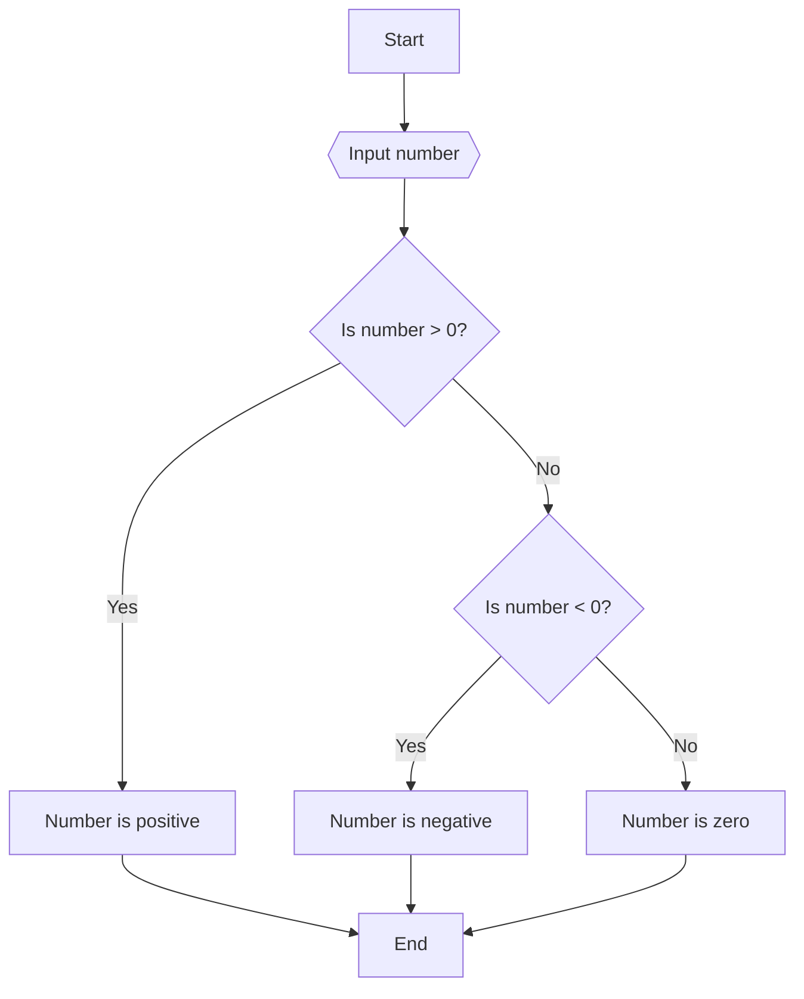
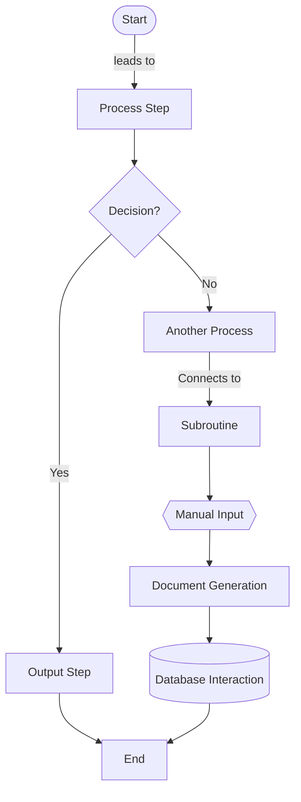
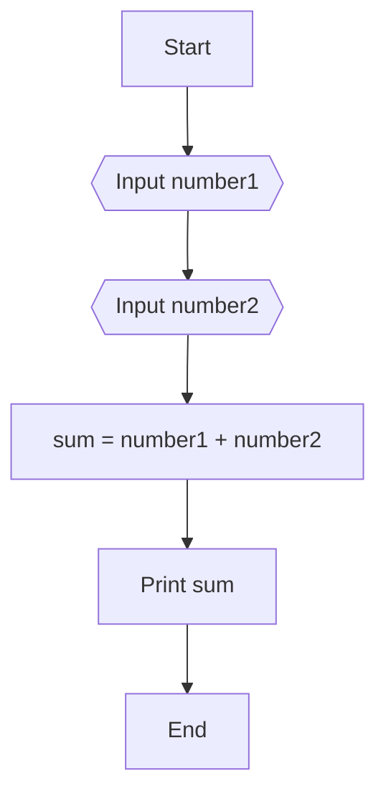

# Αλγόριθμοι

Σε αυτό το θεματική ενότητα, θα μάθουμε για τους αλγορίθμους και πώς να σχεδιάζουμε αλγορίθμους για την επίλυση προβλημάτων.

- [Αλγόριθμοι](#Αλγόριθμοι)
  - [Μαθησιακά αποτελέσματα](#Μαθησιακά-αποτελέσματαs)
  - [Τι είναι ένας αλγόριθμος;](#Τι-είναι-ένας-αλγόριθμος-;)
  - [Σχεδιασμός αλγορίθμων](#Σχεδιασμός-αλγορίθμων)
  - [Ψευδοκώδικας](#Ψευδοκώδικας)
  - [Διαγράμματα ροής](#Διαγράμματα-ροής)
  - [Ασκήσεις](#Ασκήσεις)
    - [Άσκηση 1](#Άσκηση-1)
    - [Άσκηση 2](#Άσκηση-2)
    - [Άσκηση 3](#Άσκηση-3)

## Μαθησιακά αποτελέσματα

Αφού ολοκληρώσετε αυτό τη θεματική ενότητα, θα είστε σε θέση να:

- Να ορίσετε τι είναι ένας αλγόριθμος
- Να σχεδιάζετε απλούς αλγορίθμους
- Να γράφετε απλούς αλγορίθμους σε ψευδοκώδικα
- Να σχεδιάζετε απλά διαγράμματα ροής

## Τι είναι ένας αλγόριθμος;

Πολύ συχνά, όταν πρέπει να λύσουμε ένα πρόβλημα, έχουμε την τάση να αρχίζουμε να γράφουμε κώδικα χωρίς να σκεφτόμαστε το πρόβλημα. Αυτή δεν είναι καλή προσέγγιση, διότι μπορεί να οδηγήσει σε σφάλματα και λάθη στον κώδικά μας. Είναι προτιμότερο να σκεφτούμε πρώτα το πρόβλημα και στη συνέχεια να γράψουμε κώδικα για την επίλυση του προβλήματος. Σε αυτό το σημείο έρχονται οι αλγόριθμοι. 

Ένας αλγόριθμος είναι ένα συγκεκριμένο σύνολο σαφώς καθορισμένων οδηγιών ή μια βήμα προς βήμα διαδικασία που έχει σχεδιαστεί για την εκτέλεση μιας εργασίας ή την επίλυση ενός προβλήματος. Στο πλαίσιο της επιστήμης των υπολογιστών και του προγραμματισμού, οι αλγόριθμοι χρησιμοποιούνται για τον χειρισμό δεδομένων, την πραγματοποίηση υπολογισμών, την επεξεργασία εισροών και την εκτέλεση αυτοματοποιημένης συλλογιστικής ή άλλων διαδικασιών λήψης αποφάσεων. Οι αλγόριθμοι χρησιμοποιούνται σε πολλούς διαφορετικούς τομείς, συμπεριλαμβανομένων των μαθηματικών, των θετικών επιστημών, της μηχανικής και της οικονομίας. Στην πραγματικότητα, χρησιμοποιούμε αλγόριθμους στην καθημερινή μας ζωή, για παράδειγμα, όταν ακολουθούμε μια συνταγή για να μαγειρέψουμε ένα γεύμα, όταν ακολουθούμε ένα σύνολο οδηγιών για να φτάσουμε σε έναν προορισμό ή όταν ακολουθούμε ένα σύνολο οδηγιών για να συναρμολογήσουμε ένα έπιπλο.

## Σχεδιασμός αλγορίθμων

Όταν προσπαθούμε να λύσουμε ένα πρόβλημα, τότε είναι καλή ιδέα να ακολουθούμε μια διαδικασία βήμα προς βήμα. Αυτή η διαδικασία ονομάζεται σχεδιασμός αλγορίθμου. Η διαδικασία σχεδιασμού αλγορίθμων περιλαμβάνει τα ακόλουθα βήματα:

- Κατανόηση του προβλήματος
- Προσδιορισμός των εισόδων και των εξόδων
- Προσδιορισμός των βημάτων που απαιτούνται για την επίλυση του προβλήματος
- Γράψτε τον αλγόριθμο σε ψευδοκώδικα ή σχεδιάστε ένα διάγραμμα ροής
- Δοκιμή του αλγορίθμου με διαφορετικές εισόδους
- Βελτίωση του αλγορίθμου, εάν είναι απαραίτητο

## Ψευδοκώδικας

Ο ψευδοκώδικας είναι μια απλή, ανεπίσημη γλώσσα που χρησιμοποιείται για την περιγραφή των βημάτων ενός αλγορίθμου. Δεν είναι γλώσσα προγραμματισμού, αλλά μοιάζει με γλώσσα προγραμματισμού. Χρησιμοποιείται για την περιγραφή των βημάτων ενός αλγορίθμου με τρόπο που είναι εύκολα κατανοητός.

Για παράδειγμα, ο παρακάτω ψευδοκώδικας περιγράφει τα βήματα ενός αλγορίθμου που υπολογίζει και εκτυπώνει το άθροισμα δύο αριθμών:

```
START
    READ number1
    READ number2
    sum = number1 + number2
    PRINT sum
END
```

Δεδομένου ότι ο ψευδοκώδικας δεν προορίζεται για εκτέλεση, δεν χρειάζεται να ακολουθεί τη σύνταξη μιας γλώσσας προγραμματισμού. Προορίζεται για να διαβαστεί από ανθρώπους, οπότε θα πρέπει να είναι εύκολα κατανοητός. Προορίζεται επίσης να γραφτεί από ανθρώπους, οπότε θα πρέπει να είναι εύκολο να γραφτεί. Είναι καλή ιδέα να χρησιμοποιείται ψευδοκώδικας κατά το σχεδιασμό αλγορίθμων, διότι μας επιτρέπει να επικεντρωνόμαστε στη λογική του αλγορίθμου χωρίς να χρειάζεται να ανησυχούμε για τη σύνταξη μιας γλώσσας προγραμματισμού.

Ωστόσο, υπάρχουν ορισμένες κοινές συμβάσεις που χρησιμοποιούνται συχνά στον ψευδοκώδικα:


- Βασικές δομές ελέγχου:
  - `IF`...`THEN`...`ELSE` για συνθήκες υπό όρους.
  - `FOR`...`DO`  για καθορισμένους βρόχους (βρόχοι με προκαθορισμένο αριθμό επαναλήψεων).
  - `WHILE`...`DO`  για αόριστους βρόχους (βρόχοι όπου ο αριθμός των επαναλήψεων δεν είναι προκαθορισμένος).
  - `REPEAT`...`UNTIL` για τους βρόχους πρέπει να εκτελούνται τουλάχιστον μία φορά πριν από την αξιολόγηση της συνθήκης.

- Ανάθεση και δήλωση μεταβλητών:
  - Οι μεταβλητές συνήθως δηλώνονται σιωπηρά όταν χρησιμοποιούνται για πρώτη φορά και η ανάθεσή τους δηλώνεται συχνά με ένα απλό σύμβολο `=`.

- Είσοδος και έξοδος:
  - `READ`, `INPUT`, ή παρόμοιες φράσεις για τη λήψη δεδομένων.
  - `PRINT`, `DISPLAY`, ή παρόμοιες φράσεις για την εξαγωγή αποτελεσμάτων.

- Σχόλια:
  - Συχνά επισημαίνονται με λέξεις όπως `//`, `#`, ή `REM`, ακολουθούμενες από το κείμενο σχολιασμού, αν και τα συγκεκριμένα σύμβολα μπορεί να ποικίλλουν.

- Υπορουτίνες και συναρτήσεις:
  - Ορίζονται με λέξεις όπως `FUNCTION` ή `PROCEDURE`, ακολουθούμενες από το όνομα της υπορουτίνας και ενδεχομένως παραμέτρους:
  - Το `RETURN` χρησιμοποιείται για να δηλώσει την έξοδο του υποπρογράμματος.

- Χρήση συστοιχιών και δομών δεδομένων:
  - Συστοιχίες ή λίστες μπορούν να χρησιμοποιηθούν χωρίς ρητή δήλωση του μεγέθους ή του τύπου τους.
  - Άλλες δομές δεδομένων όπως στοίβες, ουρές ή δέντρα μπορούν να αναφέρονται σύμφωνα με τις τυπικές τους λειτουργίες (π.χ. PUSH, POP για στοίβες).


- Αλγοριθμικές δηλώσεις:
  - Δηλώσεις που περιγράφουν συγκεκριμένες ενέργειες όπως `SORT`, `MERGE`, `FIND`, κ.λπ.

- Δομή ψευδοκώδικα:
  - Ο ψευδοκώδικας είναι συνήθως δομημένος και με εσοχές για να βελτιωθεί η αναγνωσιμότητα.


```
FUNCTION findMax(numbers: LIST OF INTEGER) RETURNS INTEGER
    maxNumber = numbers[0]
    FOR EACH number IN numbers DO
        IF number > maxNumber THEN
            maxNumber = number
        ENDIF
    ENDFOR
    RETURN maxNumber
END FUNCTION
```

Αυτό το παράδειγμα δείχνει μια συνάρτηση σε ψευδοκώδικα για την εύρεση του μέγιστου αριθμού σε μια λίστα. Παρατηρήστε τη χρήση της εσοχής και των απλών αγγλικών όρων για να γίνει ο αλγόριθμος σαφής και κατανοητός

## Διαγράμματα ροής

Το διάγραμμα ροής είναι ένα διάγραμμα που αναπαριστά τα βήματα ενός αλγορίθμου. Χρησιμοποιείται για την περιγραφή των βημάτων ενός αλγορίθμου με τρόπο εύληπτο. Πρόκειται για μια γραφική αναπαράσταση ενός αλγορίθμου που χρησιμοποιεί σύμβολα για την αναπαράσταση των διαφόρων βημάτων του αλγορίθμου.

Για παράδειγμα, το παρακάτω διάγραμμα ροής περιγράφει τα βήματα ενός αλγορίθμου που υπολογίζει και εκτυπώνει το άθροισμα δύο αριθμών:


Αυτό είναι ένα πολύ απλό παράδειγμα ενός διαγράμματος ροής για την περιγραφή ενός βασικού προγράμματος που ελέγχει αν ένας αριθμός είναι θετικός, αρνητικός ή μηδέν.

Στα διαγράμματα ροής, τα ακόλουθα σύμβολα χρησιμοποιούνται για την αναπαράσταση των διαφόρων βημάτων ενός αλγορίθμου:



## Ασκήσεις

Δημιουργήστε ένα διάγραμμα ροής ή γράψτε ψευδοκώδικα για τους ακόλουθους αλγορίθμους:

### Άσκηση 1

Γράψτε έναν αλγόριθμο που να δέχεται δύο αριθμούς ως είσοδο και να εκτυπώνει το άθροισμα των δύο αριθμών.

<details>
<summary>Λύση</summary>


</details>

###  Άσκηση 2

Γράψτε έναν αλγόριθμο που δέχεται δύο αριθμούς ως είσοδο και εκτυπώνει τον μεγαλύτερο από τους δύο αριθμούς.

### Άσκηση 3

Γράψτε έναν αλγόριθμο που δέχεται τρεις αριθμούς ως είσοδο και εκτυπώνει το μέσο όρο των τριών αριθμών.


