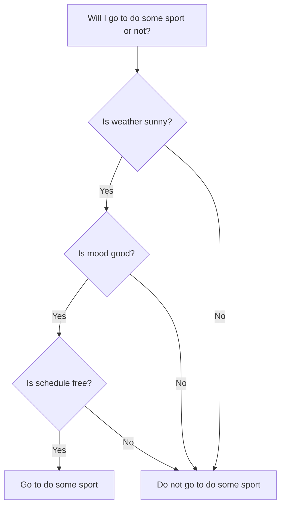
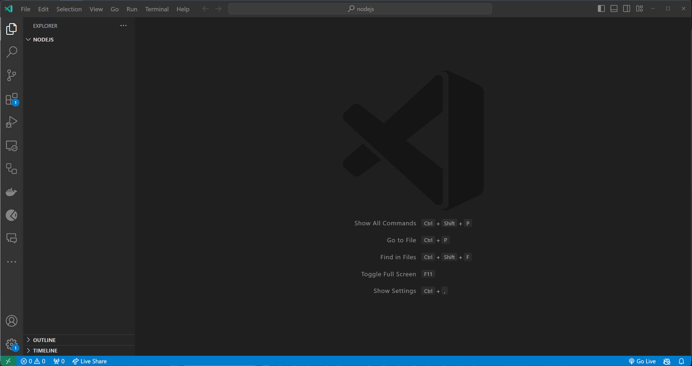

# Συνθήκες

Σε αυτό το θέμα, θα μάθουμε για τις συνθήκες στη Javascript.

- [Συνθήκες](#Συνθήκες)
  - [Μαθησιακά αποτελέσματα](#Μαθησιακά αποτελέσματα)
  - [Τι είναι μία συνθήκη;](#Τι-είναι-μία-συνθήκη-;)
  - [Κατανοώντας τις συνθήκες](#Κατανοώντας-τις-συνθήκες)
    - [Εκφράσεις Boolean](#Εκφράσεις-Boolean)
    - [Τελεστές σύγκρισης](#Τελεστές-σύγκρισης)
  - [Τύποι συνθηκών](#Τύποι-συνθηκών)
    - [if](#if)
    - [if-else](#if-else)
    - [if-else-if](#if-else-if)
    - [switch](#switch)
    - [Τριμερής τελεστής](#Τριμερής-τελεστής)
  - [Εμφωλευμένη συνθήκη](#Εμφωλευμένη-συνθήκη)
  - [Αληθοφάνεια και Ψευδοφάνεια](#Αληθοφάνεια-και-Ψευδοφάνεια)
  - [Βέλτιστες πρακτικές](#Βέλτιστες-πρακτικές)
  - [Ασκήσεις](#Ασκήσεις)
    - [ Άσκηση 1 - Βασική εντολή If](#Άσκηση-1---Βασική-εντολή-If)
    - [Άσκηση 2 - Εντολή If-Else](#Άσκηση-2---Εντολή-If---Else)
    - [Άσκηση 3 - Εμφωλευμένη εντολή If-Else](#Άσκηση-3---Εμφωλευμένη-εντολή-If---Else])

## Μαθησιακά αποτελέσματα

Αφού ολοκληρώσετε αυτό το θέμα, θα είστε σε θέση να:

- Να ορίζετε τι είναι μια συνθήκη.
- Να εξηγείτε τη διαφορά μεταξύ `==` και `===`.
- Να εξηγείτε τη διαφορά μεταξύ `!=` και `!==`.
- Να εξηγείτε τη διαφορά μεταξύ των τελεστών `if`, `if-else`, `if-else-if`, `switch` και του τεταρτοβάθμιου τελεστή.
- Εξηγήστε τι είναι η εμφωλευμένη συνθήκη.
- Εξηγήστε τι είναι το αληθές και το ψεύδος.
- Χρήση βέλτιστων πρακτικών κατά τη συγγραφή όρων.
- 
## Τι είναι μία συνθήκη;

Μια συνθήκη είναι μια δήλωση που χρησιμοποιείται για την εκτέλεση διαφορετικών ενεργειών με βάση διαφορετικές συνθήκες. Για παράδειγμα, μπορούμε να χρησιμοποιήσουμε μια συνθήκη για να ελέγξουμε αν ένας αριθμός είναι θετικός ή αρνητικός και να εκτελέσουμε διαφορετικές ενέργειες με βάση το αποτέλεσμα του ελέγχου.

Στο μυαλό μας, χρησιμοποιούμε συνεχώς όρους, όταν παίρνουμε αποφάσεις. Για παράδειγμα, όταν αποφασίζουμε αν θα πάμε να κάνουμε κάποιο άθλημα ή όχι, ελέγχουμε τον καιρό, τη διάθεσή μας, το πρόγραμμά μας κ.λπ. και με βάση το αποτέλεσμα του ελέγχου, αποφασίζουμε αν θα πάμε να κάνουμε κάποιο άθλημα ή όχι.



## Κατανοώντας τις συνθήκες

Για να κατανοήσουμε τις συνθήκες, πρέπει να κατανοήσουμε τις εκφράσεις boolean και τους τελεστές σύγκρισης.


### Εκφράσεις Boolean

Μια boolean έκφραση είναι μια έκφραση που αξιολογείται σε μια boolean τιμή. Μια boolean τιμή είναι μια τιμή που είναι είτε «αληθής» είτε «ψευδής». Για παράδειγμα, το `5 > 3` είναι μια boolean έκφραση που αποτιμάται σε `αλήθεια` επειδή το `5` είναι μεγαλύτερο από το `3`. `5 < 3` είναι μια boolean έκφραση που αξιολογείται ως `false` επειδή το `5` δεν είναι μικρότερο από το `3`.

### Τελεστές σύγκρισης

Οι τελεστές σύγκρισης χρησιμοποιούνται για τη σύγκριση δύο τιμών και την επιστροφή μιας boolean τιμής. Υπάρχουν 6 τελεστές σύγκρισης στη Javascript:

- `>`: μεγαλύτερο από
- `<`: λιγότερο από
- `>=`: μεγαλύτερη ή ίση με
- `<=`: μικρότερη ή ίση με
- `==`: ίσο  με
- `!=`: δεν είναι ίσο με

```javascript
console.log(5 > 3); // true
console.log(5 < 3); // false
console.log(5 >= 3); // true
console.log(5 <= 3); // false
console.log(5 == 3); // false
console.log(5 != 3); // true
```

## Τύποι συνθηκών

Υπάρχουν 5 τύποι όρων στη Javascript:

- `if`
- `if-else`
- `if-else-if`
- `switch`
- ternary operator

### if

Η δήλωση «if» χρησιμοποιείται για την εκτέλεση ενός μπλοκ κώδικα εάν μια συνθήκη είναι αληθής. Η δήλωση `if` έχει την ακόλουθη σύνταξη:

```javascript
if (condition) {
  // code to be executed if condition is true
}
```

Για παράδειγμα:
  
```javascript
let weather = 'sunny';

if (weather === 'sunny') {
  console.log('Im going to the beach!');
}
```

Σε αυτό το παράδειγμα, ελέγχουμε αν ο καιρός είναι ηλιόλουστος και αν είναι, εκτυπώνουμε ένα μήνυμα στην κονσόλα.

### if-else

Η δήλωση «αν-αν» χρησιμοποιείται για την εκτέλεση ενός μπλοκ κώδικα αν μια συνθήκη είναι αληθής και ενός άλλου μπλοκ κώδικα αν η συνθήκη είναι ψευδής. Η δήλωση `if-else` έχει την ακόλουθη σύνταξη:

```javascript
if (condition) {
  // code to be executed if condition is true
} else {
  // code to be executed if condition is false
}
```

Για παράδειγμα:

```javascript
let weather = 'rainy';

if (weather === 'sunny') {
  console.log('Im going to the beach!');
} else {
  console.log('Im going to the movies!');
}
```

Σε αυτό το παράδειγμα, ελέγχουμε αν ο καιρός είναι ηλιόλουστος και αν είναι, εκτυπώνουμε ένα μήνυμα στην κονσόλα. Αν ο καιρός δεν είναι ηλιόλουστος, εκτυπώνουμε ένα διαφορετικό μήνυμα στην κονσόλα.


### if-else-if

Η δήλωση `if-else-if`  χρησιμοποιείται για την εκτέλεση ενός μπλοκ κώδικα αν μια συνθήκη είναι αληθής και ενός άλλου μπλοκ κώδικα αν η συνθήκη είναι ψευδής. Η δήλωση `if-else-if` έχει την ακόλουθη σύνταξη:

```javascript
if (condition1) {
  // code to be executed if condition1 is true
} else if (condition2) {
  // code to be executed if condition2 is true
} else {
  // code to be executed if condition1 and condition2 are false
}
```

Για παράδειγμα:

```javascript
let weather = 'rainy';

if (weather === 'sunny') {
  console.log('Im going to the beach!');
} else if (weather === 'rainy') {
  console.log('Im going to the movies!');
} else {
  console.log('Im going to stay home!');
}
```
Σε αυτό το παράδειγμα, ελέγχουμε αν ο καιρός είναι ηλιόλουστος και αν είναι, θα πάμε στην παραλία. Αν ο καιρός δεν είναι ηλιόλουστος, ελέγχουμε αν ο καιρός είναι βροχερός και αν είναι, πάμε στον κινηματογράφο. Αν ο καιρός δεν είναι ηλιόλουστος και δεν βρέχει, θα μείνουμε στο σπίτι.

### switch

Η εντολή `switch` χρησιμοποιείται για την εκτέλεση ενός μπλοκ κώδικα με βάση διαφορετικές περιπτώσεις. Η δήλωση `switch` έχει την ακόλουθη σύνταξη:


```javascript
switch (expression) {
  case value1:
    // code to be executed if expression is equal to value1
    break;
  case value2:
    // code to be executed if expression is equal to value2
    break;
  default:
    // code to be executed if expression is not equal to value1 or value2
}
```

Για παράδειγμα:

```javascript
let weather = 'rainy';

switch (weather) {
  case 'sunny':
    console.log('Im going to the beach!');
    break;
  case 'rainy':
    console.log('Im going to the movies!');
    break;
  default:
    console.log('Im going to stay home!');
}
```

Το παράδειγμά του είναι ισοδύναμο με το προηγούμενο παράδειγμα με τη δήλωση `if-else-if`.


### Τριμερής τελεστής

Ο τριμερής τελεστής χρησιμοποιείται για την εκτέλεση ενός μπλοκ κώδικα με βάση μια συνθήκη. Ο τριμερής τελεστής έχει την ακόλουθη σύνταξη:


```javascript
condition ? expression1 : expression2
```

Για παράδειγμα:

```javascript
let weather = 'rainy';

weather === 'sunny' ? console.log('Im going to the beach!') : console.log('Im going to the movies!');
```

Αυτό το παράδειγμα είναι ισοδύναμο με το προηγούμενο παράδειγμα με τη δήλωση `if-else`.

## Εμφωλευμένη συνθήκη

Μια εμφωλευμένη συνθήκη είναι μια συνθήκη που βρίσκεται μέσα σε μια άλλη συνθήκη. Για παράδειγμα:


```javascript
let weather = 'rainy';

if (weather === 'sunny') {
  console.log('Im going to the beach!');
} else {
  if (weather === 'rainy') {
    console.log('Im going to the movies!');
  } else {
    console.log('Im going to stay home!');
  }
}
```

Αυτό το παράδειγμα είναι ισοδύναμο με το προηγούμενο παράδειγμα με τη δήλωση `if-else-if`, αλλά έχει περισσότερο κώδικα και είναι πιο δύσκολο να διαβαστεί, οπότε είναι προτιμότερο να χρησιμοποιείτε τη δήλωση `if-else-if` αντί για εμφωλευμένους όρους.

## Αληθοφάνεια και Ψευδοφάνεια.

Στη Javascript, υπάρχουν τιμές που θεωρούνται «αληθείς» και τιμές που θεωρούνται «ψευδείς». Αυτές οι τιμές ονομάζονται αληθείς και ψευδείς τιμές. Αυτό σημαίνει ότι αν χρησιμοποιήσουμε μια αληθινή τιμή σε μια boolean έκφραση, θα αξιολογηθεί ως `true` και αν χρησιμοποιήσουμε μια falsy τιμή σε μια boolean έκφραση, θα αξιολογηθεί ως `false`.

Οι ακόλουθες τιμές θεωρούνται ψευδείς:

- `false`
- `0`
- `''`
- `null`
- `undefined`
- `NaN`

Όλες οι άλλες τιμές θεωρούνται αληθείς.

Για παράδειγμα:

```javascript
let x = 5;

if (x) {
  console.log('x is truthy'); // this will be printed to the console, because 5 is considered to be truthy
} else {
  console.log('x is falsy');
}

x = 0;

if (x) {
  console.log('x is truthy');
} else {
  console.log('x is falsy'); // this will be printed to the console, because 0 is considered to be falsy
}
```

Σε αυτό το παράδειγμα, ελέγχουμε αν το `x` είναι αληθινό ή ψευδές και εκτυπώνουμε ένα μήνυμα στην κονσόλα με βάση το αποτέλεσμα του ελέγχου.

## Βέλτιστες πρακτικές

- Χρησιμοποιήστε `===` αντί για `==` όταν συγκρίνετε τιμές
- Χρησιμοποιήστε `!==` αντί για `!=` όταν συγκρίνετε τιμές
- Χρήση της δήλωσης `if-else-if` αντί για εμφωλευμένους όρους

## Ασκήσεις

Δημιουργήστε ένα αρχείο με όνομα `index.js` (ή άλλο όνομα της επιλογής σας) και αρχίστε να προσθέτετε λύσεις στις παρακάτω ασκήσεις.

Δοκιμάστε τον κώδικά σας εκτελώντας το αρχείο `index.js` χρησιμοποιώντας την εντολή `node index.js`.

Δοκιμάστε τον κώδικά σας με διαφορετικές τιμές.

### Άσκηση 1 - Βασική εντολή If

**Στόχος**: Ελέγξτε αν ένας αριθμός είναι θετικός.

**Περιγραφή**: Γράψτε ένα πρόγραμμα JavaScript που ορίζει μια μεταβλητή για την αποθήκευση ενός αριθμού. Χρησιμοποιήστε μια εντολή if για να εκτυπώσετε «Ο αριθμός είναι θετικός» αν ο αριθμός είναι μεγαλύτερος από το μηδέν.

<details>
  <summary>Λύση</summary>

```javascript
let number = 5;

if (number > 0) {
  console.log('The number is positive');
}
```
**Αναμενόμενο αποτέλεσμα**:

```javascript
The number is positive
```


</details>

### Άσκηση 2 - Εντολή If-Else

**Στόχος**: Ελέγξτε αν ένας αριθμός είναι ζυγός ή περιττός.

**Περιγραφή**: Γράψτε ένα πρόγραμμα JavaScript που παίρνει έναν αριθμό και ελέγχει αν ο αριθμός είναι ζυγός ή περιττός. Εκτυπώστε «Ο αριθμός είναι ζυγός» αν ο αριθμός είναι ζυγός και «Ο αριθμός είναι περιττός» αν ο αριθμός είναι περιττός.

<details>
  <summary>Solution</summary>

```javascript
let number = 5;

if (number % 2 === 0) {
  console.log('The number is even');
} else {
  console.log('The number is odd');
}
```

**Αναμενόμενο αποτέλεσμα**:

```javascript
The number is odd
```
</details>

### Άσκηση 3 - Εμφωλευμένη εντολή If-Else

**Στόχος**: Ταξινόμηση βαθμού.

**Περιγραφή**: Γράψτε ένα πρόγραμμα JavaScript που ταξινομεί τους βαθμούς των μαθητών. Το πρόγραμμα θα πρέπει να λαμβάνει έναν αριθμό (0-100) και να τον ταξινομεί ως εξής:

- `A` for 90 and above
- `B` for 80 to 89
- `C` for 70 to 79
- `D` for 60 to 69
- `F` for below 60

Εκτυπώστε την ταξινόμηση βαθμού.

