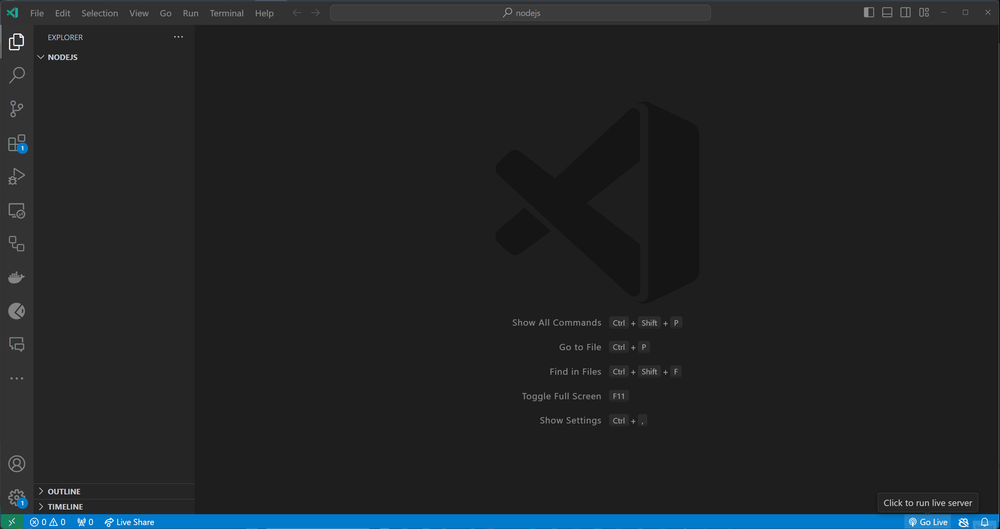

# Συναρτήσεις

Σε αυτό τη θεματική ενότητα, θα μάθουμε για τις συναρτήσεις στη Javascript.

- [Συναρτήσεις](#Συναρτήσεις)
  - [Μαθησιακά Αποτελέσματα](#Μαθησιακά-Αποτελέσματα)
  - [Τι είναι μια Συνάρτηση;](#Τι-είναι-μια-Συνάρτηση-;)
  - [Δήλωση Συνάρτησης](#Δήλωση-Συνάρτησης)
  - [Έκφραση Συνάρτησης](#Έκφραση-Συνάρτησης)
  - [Κλήση συνάρτησης ](#Κλήση-συνάρτησης)
  - [Εύρος Συνάρτησης](#Εύρος-Συνάρτησης)
  - [Hoisting Συνάρτησης](#Hoisting-Συνάρτησης)
  - [Arrow Functions](#arrow-functions)
  - [Ασκήσεις](#exercises)
    - [Άσκηση 1 - Βασικός ορισμός συνάρτησης και κλήση](#Άσκηση-1---Βασικός-ορισμός-συνάρτησης-και-κλήση)
    - [Άσκηση 2 - Συνάρτηση με Επιστρεφόμενη Τιμή](#Άσκηση-2---Συνάρτηση-με-Επιστρεφόμενη-Τιμή)
    - [Άσκηση 3 - Συνάρτηση για Χειρισμό Δεδομένων Πίνακα](#Άσκηση-3--Συνάρτηση-για-Χειρισμό-Δεδομένων-Πίνακα)

## Μαθησιακά Αποτελέσματα

Αφού ολοκληρώσετε αυτή τη θεματική ενότητα, θα είστε σε θέση:

- Ορίστε τι είναι συνάρτηση.
- Εξηγήστε τη διαφορά μεταξύ δήλωσης συνάρτησης και έκφρασης συνάρτησης.
- Εξηγήστε τι είναι η κλήση συνάρτησης.
- Εξηγήστε τι είναι το εύρος της συνάρτησης.
- Εξηγήστε τι είναι το function hoisting.
- Εξηγήστε ποιες είναι οι arrow functions.

## Τι είναι μια Συνάρτηση;

Μια συνάρτηση είναι ένα μπλοκ κώδικα που εκτελεί μια συγκεκριμένη εργασία. Οι συναρτήσεις χρησιμοποιούνται για την οργάνωση του κώδικα σε λογικές μονάδες που μπορούν να επαναχρησιμοποιηθούν σε άλλα μέρη του προγράμματος.

Η συνάρτηση αποτελείται (και μπορεί να αποτελείται) από τα ακόλουθα μέρη:

- keyword για να δηλώσετε μια συνάρτηση
- όνομα της συνάρτησης
- παράμετροι της συνάρτησης (προαιρετικό)
- σώμα συνάρτησης 
- return δήλωση (προαιρετική)
- return τιμή (προαιρετική)

```javascript
function add(a, b) {
  const sum = a + b;
  return sum;
}
```

Στο προηγούμενο παράδειγμα, δηλώσαμε μια συνάρτηση με το όνομα "add" με λέξη-κλειδί "function", η οποία λαμβάνει δύο παραμέτρους "a" και "b" και επιστρέφει το άθροισμα των "a" και "b". Το σώμα της συνάρτησης αποτελείται από δύο προτάσεις: «const sum = a + b;» και «return sum;». Η πρώτη δήλωση δηλώνει μια μεταβλητή με το όνομα «sum» και της εκχωρεί την τιμή «a + b». Η δεύτερη πρόταση επιστρέφει την τιμή της μεταβλητής «sum».

>Θα πρέπει να θυμόμαστε ότι οι παράμετροι είναι μεταβλητές που χρησιμοποιούνται για την αποθήκευση τιμών που μεταβιβάζονται στη συνάρτηση όταν καλείται. Εάν δεν χρειάζεται να περάσουμε καμία τιμή στη συνάρτηση, μπορούμε να παραλείψουμε τις παραμέτρους. Για παράδειγμα, αν θέλουμε να δηλώσουμε μια συνάρτηση με το όνομα `sayHello` που εκτυπώνει τις λέξεις "Hello World!" στην κονσόλα, μπορούμε να το δηλώσουμε ως εξής:

```javascript
function sayHello() {
  console.log('Hello World!');
}
```

> Το επόμενο σημαντικό πράγμα που πρέπει να θυμάστε είναι ότι η συνάρτηση επιστρέφει πάντα μια τιμή. Εάν δεν καθορίσουμε την τιμή επιστροφής, η συνάρτηση θα επιστρέψει `undefined`. Στην προηγούμενη συνάρτηση `sum`, καθορίσαμε την επιστρεφόμενη τιμή χρησιμοποιώντας τη λέξη-κλειδί `return`. Εάν δεν καθορίσουμε την τιμή επιστροφής (όπως στη συνάρτηση `sayHello`), η συνάρτηση θα επιστρέψει `undefined`.

Στο Javascript μπορούμε να δηλώσουμε συναρτήσεις με δύο τρόπους: δήλωση συνάρτησης και έκφραση συνάρτησης.

## Δήλωση Συνάρτησης

Για τη δήλωση συνάρτησης, χρησιμοποιούμε τη λέξη-κλειδί `function`  ακολουθούμενη από το όνομα της συνάρτησης, τις προαιρετικές παραμέτρους και το σώμα της συνάρτησης. Ομοίως με προηγούμενα παραδείγματα, δηλώνουμε συναρτήσεις όπως αυτή:

```javascript
function functionName(parameter1, parameter2) {
  // function body
  return value;
}
```

## Έκφραση Συνάρτησης

Αλλά μπορούμε επίσης να δηλώσουμε συναρτήσεις χρησιμοποιώντας εκφράσεις συναρτήσεων. Για την έκφραση συνάρτησης, χρησιμοποιούμε τη λέξη-κλειδί `const` ακολουθούμενη από το όνομα της συνάρτησης, τις προαιρετικές παραμέτρους και το σώμα της συνάρτησης. Σημαίνει ότι δηλώνουμε συνάρτηση και την εκχωρούμε σε μια μεταβλητή. Για παράδειγμα:

```javascript
const add = function(a, b) {
  const sum = a + b;
  return sum;
}
```

EΠαρόλο που χρησιμοποιούμε τη λέξη-κλειδί `const` για να δηλώσουμε τη συνάρτηση, μπορούμε να καλέσουμε τη συνάρτηση χρησιμοποιώντας το όνομα της συνάρτησης ακολουθούμενο από παρενθέσεις. Για παράδειγμα:

```javascript
const sum = add(1, 2);

console.log(sum); // 3
```

## Κλήση συνάρτησης

Για να εκτελέσουμε μια συνάρτηση, πρέπει να την καλέσουμε. Μπορούμε να καλέσουμε μια συνάρτηση χρησιμοποιώντας το όνομα της συνάρτησης ακολουθούμενο από παρενθέσεις. Για παράδειγμα, εάν θέλουμε να καλέσουμε τη συνάρτηση `add` , μπορούμε να πληκτρολογήσουμε `add(1, 2);` στον κώδικα. Αυτό θα καλέσει τη συνάρτηση `add`  με τις τιμές `1` και `2` ως ορίσματα. Η συνάρτηση θα επιστρέψει το άθροισμα των `1` και `2` και μπορούμε να αποθηκεύσουμε την επιστρεφόμενη τιμή σε μια μεταβλητή όπως αυτή:

```javascript
const sum = add(1, 2);

console.log(sum); // 3
```

Εάν δεν αποθηκεύσουμε την επιστρεφόμενη τιμή σε μια μεταβλητή, η τιμή επιστροφής θα χαθεί. Για παράδειγμα, αν καλέσουμε τη συνάρτηση `add` ως εξής:

```javascript
add(1, 2);
```

Η συνάρτηση θα επιστρέψει το άθροισμα των `1` και `2`, αλλά δεν θα μπορούμε να αποθηκεύσουμε την επιστρεφόμενη τιμή. Η επιστρεφόμενη τιμή θα χαθεί.

## Εύρος Συνάρτησης

Το εύρος μιας μεταβλητής είναι το μέρος του προγράμματος όπου μπορεί να προσπελαστεί η μεταβλητή. Στο Javascript, υπάρχουν δύο τύποι εύρους: **καθολική εμβέλεια** και **τοπική εμβέλεια**. Μια μεταβλητή που δηλώνεται εκτός συνάρτησης έχει **καθολικό εύρος** και μπορεί να προσπελαστεί οπουδήποτε στο πρόγραμμα. Μια μεταβλητή που δηλώνεται μέσα σε μια συνάρτηση έχει **τοπικό εύρος** και μπορεί να προσπελαστεί μόνο μέσα στη συνάρτηση.

Για παράδειγμα, αν δηλώσουμε μια μεταβλητή με το όνομα `x` έξω από μια συνάρτηση, μπορούμε να έχουμε πρόσβαση σε αυτήν οπουδήποτε στο πρόγραμμα. Για παράδειγμα:


```javascript
let x = 5; // declare a variable named x and assign the value 5 to it

function printX() {
  console.log(x); // print the value of the x variable to the console
}

printX(); // 5
```


Σε αυτό το παράδειγμα, δηλώσαμε μια μεταβλητή με το όνομα `x` έξω από μια συνάρτηση και της εκχωρήσαμε την τιμή `5`. Δηλώσαμε επίσης μια συνάρτηση με το όνομα «printX» που εκτυπώνει την τιμή της μεταβλητής `x` στην κονσόλα. Καλέσαμε τη συνάρτηση «printX» και εκτύπωσε την τιμή της μεταβλητής `x` στην κονσόλα.

Αλλά αν δηλώσουμε μια μεταβλητή με το όνομα `x` μέσα σε μια συνάρτηση, μπορούμε να έχουμε πρόσβαση σε αυτήν μόνο μέσα στη συνάρτηση. Για παράδειγμα:

```javascript
function printX() {
  let x = 5; // declare a variable named x and assign the value 5 to it
  console.log(x); // print the value of the x variable to the console
}

printX(); // 5

console.log(x); // ReferenceError: x is not defined
```


Σε αυτό το παράδειγμα, δηλώσαμε μια συνάρτηση με το όνομα `printX` που δηλώνει μια μεταβλητή με το όνομα `x` και της εκχωρεί την τιμή `5`. Δηλώσαμε επίσης μια συνάρτηση με το όνομα «printX» που εκτυπώνει την τιμή της μεταβλητής `x` στην κονσόλα. Καλέσαμε τη συνάρτηση `printX` και εκτύπωσε την τιμή της μεταβλητής `x` στην κονσόλα. Αλλά αν προσπαθήσουμε να αποκτήσουμε πρόσβαση στη μεταβλητή `x` εκτός της συνάρτησης `printX` », θα λάβουμε ένα `ReferenceError` επειδή η μεταβλητή `x` δεν ορίζεται εκτός της συνάρτησης `printX`.

## Function Hoisting

Function hoisting είναι ένας μηχανισμός Javascript που μετακινεί τις δηλώσεις συναρτήσεων στην κορυφή του τρέχοντος πεδίου. Αυτό σημαίνει ότι μπορούμε να καλέσουμε μια συνάρτηση πριν δηλωθεί. Για παράδειγμα:

```javascript
printX(); // 5

function printX() {
  let x = 5; // declare a variable named x and assign the value 5 to it
  console.log(x); // print the value of the x variable to the console
}
```

Σε αυτό το παράδειγμα, καλέσαμε τη συνάρτηση `printX` πριν δηλωθεί. Αυτό είναι δυνατό λόγω της λειτουργίας ανύψωσης. Η Function hoisting μετακινεί τη δήλωση συνάρτησης στην κορυφή του τρέχοντος εύρους, έτσι μπορούμε να καλέσουμε τη συνάρτηση πριν δηλωθεί.

Αλλά πρέπει να θυμόμαστε ότι η Function hoisting λειτουργεί μόνο με δηλώσεις συναρτήσεων, όχι με εκφράσεις συναρτήσεων. Για παράδειγμα:

```javascript
printX(); // TypeError: printX is not a function

const printX = function() {
  let x = 5; // declare a variable named x and assign the value 5 to it
  console.log(x); // print the value of the x variable to the console
}
```

Σε αυτό το παράδειγμα, προσπαθήσαμε να καλέσουμε τη συνάρτηση «printX» προτού δηλωθεί. Αλλά πήραμε ένα 'TypeError' επειδή η ανύψωση συναρτήσεων λειτουργεί μόνο με δηλώσεις συναρτήσεων, όχι με εκφράσεις συναρτήσεων.

Επομένως, βασικά, είναι καλή πρακτική να δηλώνουμε συναρτήσεις πριν τις καλέσουμε, αλλά μπορούμε να καλέσουμε συναρτήσεις πριν δηλωθούν λόγω ανύψωσης συναρτήσεων.

## Arrow Functions

Arrow functions είναι ένας νέος τρόπος δήλωσης συναρτήσεων σε Javascript. Μοιάζουν με τις εκφράσεις συναρτήσεων, αλλά έχουν μικρότερη σύνταξη. Για παράδειγμα, αν θέλουμε να δηλώσουμε μια συνάρτηση με το όνομα `add` που λαμβάνει δύο παραμέτρους `a` και `b` και επιστρέφει το άθροισμα των `a` και `b`, μπορούμε να τη δηλώσουμε ως εξής:

```javascript
const add = (a, b) => {
  const sum = a + b;
  return sum;
}

const result = add(1, 2);
console.log(result); // 3
```

Σε αυτό το παράδειγμα δηλώσαμε μια συνάρτηση χρησιμοποιώντας τη σύνταξη της arrow function . Μπορούμε να δούμε ότι η σύνταξη της arrow function είναι λίγο διαφορετική και πιο σύντομη, αλλά η κλήση της συνάρτησης είναι η ίδια με τις εκφράσεις συνάρτησης.

## Ασκήσεις

Δημιουργήστε ένα αρχείο με το όνομα index.js (ή άλλο όνομα της επιλογής σας) και αρχίστε να προσθέτετε λύσεις στις παρακάτω ασκήσεις.

Δοκιμάστε τον κώδικά σας εκτελώντας το αρχείο index.js χρησιμοποιώντας την εντολή node index.js.

Δοκιμάστε τον κώδικα σας με διαφορετικές τιμές.

### Άσκηση 1 - Βασικός ορισμός συνάρτησης και κλήση

**Στόχος**: Γράψτε μια λειτουργία που εκτυπώνει ένα μήνυμα χαιρετισμού.

**Περιγραφή**:Ορίστε μια συνάρτηση με το όνομα greet που παίρνει ένα όνομα ως όρισμα και εκτυπώνει"Hello, [name]!". Καλέστε αυτή τη συνάρτηση με ένα όνομα.

<details>
  <summary>Λύση</summary>

```javascript
function greet(name) {
  console.log(`Hello, ${name}!`);
}

greet('John');
```

**Αναμενόμενο αποτέλεσμα**:

```javascript
Hello, John!
```


</details>

### Άσκηση 2 - Συνάρτηση με Επιστρεφόμενη Τιμή

**Στόχος**: Δημιουργήστε μια συνάρτηση που υπολογίζει και επιστρέφει το εμβαδόν ενός ορθογωνίου.

**Περιγραφή**:Γράψτε μια συνάρτηση με το όνομα `calculateArea` που παίρνει το `length` και το `width` ενός ορθογωνίου ως ορίσματα και επιστρέφει το εμβαδόν του. Καλέστε αυτήν τη συνάρτηση με διαφορετικά σύνολα τιμών και εκτυπώστε τα αποτελέσματα.

> Συμβουλή: Μπορείτε να δώσετε πολλά ορίσματα σε μια συνάρτηση διαχωρίζοντάς τα με κόμματα.
> 
> Συμβουλή: Το εμβαδόν ενός ορθογωνίου υπολογίζεται πολλαπλασιάζοντας το μήκος του επί το πλάτος του.

<details>
  <summary>Λύση</summary>

```javascript
function calculateArea(length, width) {
  const area = length * width;
  return area;
}

const area1 = calculateArea(5, 10);
console.log(area1);

const area2 = calculateArea(2, 4);
console.log(area2);
```

**Αναμενόμενο αποτέλεσμα**:

```javascript
50
8
```
</details>

### Άσκηση 3 - Συνάρτηση για Χειρισμό Δεδομένων Πίνακα

**Στόχος**:Γράψτε μια συνάρτηση που φιλτράρει ζυγούς αριθμούς από έναν πίνακα και επιστρέφει έναν νέο πίνακα.

**Περιγραφή**:Ορίστε μια συνάρτηση με το όνομα `filterEvenNumbers` που λαμβάνει ως όρισμα έναν πίνακα αριθμών. Αυτή η συνάρτηση θα πρέπει να επιστρέψει έναν νέο πίνακα που θα περιέχει μόνο τους ζυγούς αριθμούς από τον αρχικό πίνακα.

> Συμβουλή: Μπορείτε να χρησιμοποιήσετε τον τελεστή συντελεστή (%) για να ελέγξετε εάν ένας αριθμός είναι άρτιος ή μονός. Εάν ένας αριθμός είναι άρτιος, το αποτέλεσμα της πράξης συντελεστή θα είναι 0. Εάν ένας αριθμός είναι περιττός, το αποτέλεσμα της πράξης συντελεστή θα είναι 1.
>
>Συμβουλή: Μπορείτε να χρησιμοποιήσετε τη μέθοδο push() για να προσθέσετε ένα στοιχείο στο τέλος ενός πίνακα.

**Παράδειγμα**:

```javascript
const numbers = [1, 2, 3, 4, 5, 6, 7, 8, 9];

const evenNumbers = filterEvenNumbers(numbers);

console.log(evenNumbers);
```

**Αναμενόμενο αποτέλεσμα**:

```javascript
[2, 4, 6, 8]
```
