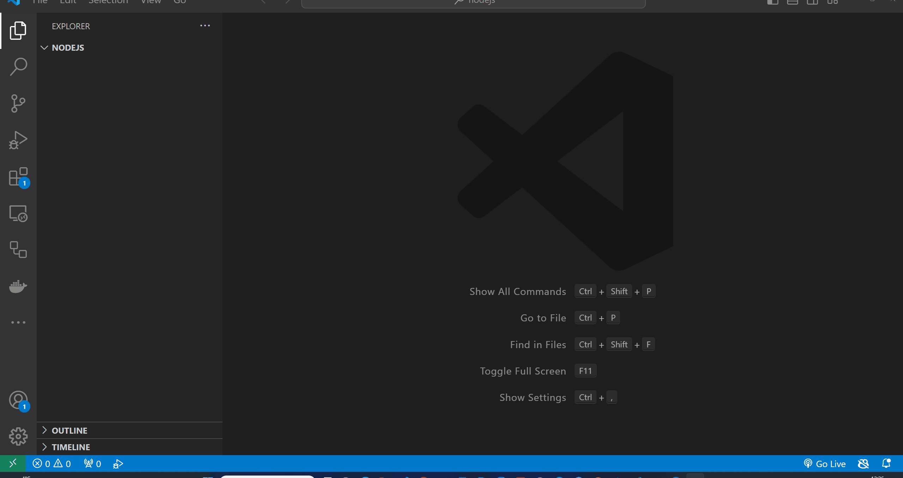

# Hello World

Σε αυτή τη θεματική ενότητα, θα μάθουμε για το Hello World σε Javascript.

- [Hello World](#hello-world)
  - [Μαθησιακά Αποτελέσματα](#Μαθησιακά-Αποτελέσματα)
  - [Τι είναι το Hello World;](#Τι-είναι-το-Hello-World-;)
  - [Πώς να γράψετε το Hello World σε Javascript;](#Πώς-να-γράψετε-το-Hello-World-σε-Javascript-;)
  - [Πώς-να-εκτελέσετε-το-Hello-World-σε-Javascript;](#Πώς-να-εκτελέσετε-το-Hello-World-σε-Javascript;)
  - [Ασκήσεις](#Ασκήσεις)

## Μαθησιακά Αποτελέσματα

Αφού ολοκληρώσετε αυτή τη θεματική, θα είστε σε θέση:

- Καθορίστε τι είναι το Hello World
- Γράψτε Hello World σε Javascript
- Εκτελέστε το Hello World σε Javascript

## Τι είναι το Hello World;

Συνήθως, όταν αρχίζουμε να μαθαίνουμε προγραμματισμό ή μια νέα γλώσσα προγραμματισμού, το πρώτο πράγμα που κάνουμε είναι να γράψουμε ένα πρόγραμμα που εκτυπώνει τις λέξεις "Hello World" στην οθόνη. Αυτό ονομάζεται πρόγραμμα "Hello World". Είναι ένα απλό πρόγραμμα που χρησιμοποιείται για να επιδείξουμε τη βασική σύνταξη μιας γλώσσας προγραμματισμού και να βεβαιωθούμε ότι μπορούμε να εκτελέσουμε το πρόγραμμα στον υπολογιστή μας. Χρησιμοποιείται επίσης για τη δοκιμή του περιβάλλοντος ανάπτυξης και για να βεβαιωθείτε ότι όλα λειτουργούν σωστά.

Σε ορισμένες γλώσσες προγραμματισμού (όπως η C), πρέπει να γράψουμε πολύ κώδικα για να εκτυπώσουμε τις λέξεις "Hello World" στην οθόνη. Στο Javascript, χρειάζεται μόνο να γράψουμε μία γραμμή κώδικα για να εκτυπώσουμε τις λέξεις "Hello World" στην οθόνη.

## Πώς να γράψετε το Hello World σε Javascript;

Για να γράψουμε το Hello World σε Javascript, πρέπει να ανοίξουμε ένα πρόγραμμα επεξεργασίας κειμένου και να πληκτρολογήσουμε τον ακόλουθο κώδικα:

```javascript
console.log('Hello World!');
```

Μπορούμε να αποθηκεύσουμε το αρχείο ως `helloWorld.js` και να το εκτελέσουμε χρησιμοποιώντας το Node JS.

Το `console.log()` είναι μια συνάρτηση που χρησιμοποιείται για την εκτύπωση ενός μηνύματος στην κονσόλα. Χρειάζεται ένα όρισμα, το οποίο είναι το μήνυμα που θέλουμε να εκτυπώσουμε στην κονσόλα. Σε αυτή την περίπτωση, το μήνυμα είναι "Hello World!".

## Πώς να εκτελέσετε το Hello World σε Javascript;

Για να εκτελέσουμε το Hello World σε Javascript, πρέπει να ανοίξουμε ένα τερματικό και να πληκτρολογήσουμε `node helloWorld.js` στο τερματικό, όπου το `helloWorld.js` είναι το όνομα του αρχείου που περιέχει το πρόγραμμα Hello World.



## Ασκήσεις

Γράψτε ένα πρόγραμμα που θα εκτυπώνει τις λέξεις "Hello World" στην οθόνη.

Εκτελέστε το πρόγραμμα χρησιμοποιώντας το Node JS.

> **Συμβουλή:** Μπορείτε να χρησιμοποιήσετε τη συνάρτηση `console.log()` για να εκτυπώσετε ένα μήνυμα στην κονσόλα.
>
> **Συμβουλή:** Μπορείτε να χρησιμοποιήσετε την εντολή `node fileName.js` για να εκτελέσετε ένα αρχείο Javascript.
> 
