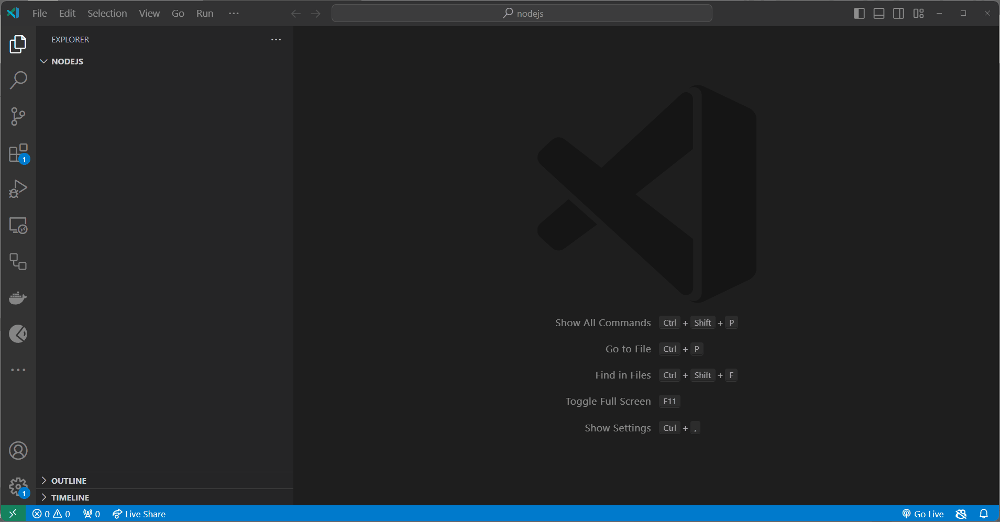

# Βρόχοι και επανάληψη

Σε αυτό τη θεματική ενότητα , θα μάθουμε για τους βρόχους και την επανάληψη.

- [Βρόχοι και επανάληψη](#loops-and-iteration)
  - [Μαθησιακά Αποτελέσματα](#Μαθησιακά-Αποτελέσματα)
  - [Τι είναι ένας βρόχος;](#Τι-είναι-ένας-βρόχος-;)
  - [Βρόχος `for` ](#Βρόχος-`for`)
  - [Βρόχος `while`](#Βρόχος-`while`)
  - [Βρόχος `do...while`](#Βρόχος-`do...while`)
  - [Βρόχος `for...in`](#Βρόχος-`for...in`)
  - [Βρόχος  `for...of`](#Βρόχος-`for...of`)
  - [Δηλώσεις ελέγχου βρόχου](#Δηλώσεις-ελέγχου-βρόχου)
    - [`continue`](#continue)
    - [`break`](#break)
  - [Ασκήσεις](#Ασκήσεις)
    - [Άσκηση 1](#Άσκηση-1)
    - [Άσκηση 2](#Άσκηση-2)
    - [Άσκηση 3](#Άσκηση-3)

## Μαθησιακά Αποτελέσματα

Αφού ολοκληρώσετε αυτή τη θεματική ενότητα, θα είστε σε θέση να:

- Ορίστε τι είναι βρόχος
- Εξηγήστε τη διαφορά μεταξύ διαφορετικών τύπων βρόχων
- Εξηγήστε τι είναι οι δηλώσεις ελέγχου βρόχου
- Εξηγήστε τι είναι η δήλωση `continue`.
- Εξηγήστε τι είναι η δήλωση `break`.
- Χρησιμοποιήστε διαφορετικούς βρόχους και δηλώσεις ελέγχου βρόχου

## Τι είναι ένας βρόχος;

Ένας βρόχος είναι μια κατασκευή προγραμματισμού που χρησιμοποιείται για την επανάληψη ενός μπλοκ κώδικα μέχρι να ικανοποιηθεί μια συγκεκριμένη συνθήκη. Οι βρόχοι χρησιμοποιούνται για την επανάληψη σε μια συλλογή δεδομένων ή για την επανάληψη ενός μπλοκ κώδικα ορισμένες φορές. Υπάρχουν διάφοροι τύποι βρόχων στο Javascript:  `for`, `while`, `do...while`, `for...in`, and `for...of`.

## Βρόχος `for` 

Ο βρόχος «for» χρησιμοποιείται για την επανάληψη ενός μπλοκ κώδικα ορισμένες φορές. Ο βρόχος `for` αποτελείται από τρία μέρη: *αρχικοποίηση*, *συνθήκη* και *αύξηση/μείωση*. Το τμήμα αρχικοποίησης χρησιμοποιείται για την προετοιμασία του μετρητή βρόχου, το τμήμα συνθήκης χρησιμοποιείται για να ελέγξει εάν ο μετρητής βρόχου είναι μικρότερος/μεγαλύτερος ή ίσος με μια συγκεκριμένη τιμή και το τμήμα αύξησης/μείωσης χρησιμοποιείται για την αύξηση ή τη μείωση του μετρητή βρόχου. Ο βρόχος `for` χρησιμοποιείται για επανάληψη σε μια συλλογή δεδομένων ή για επανάληψη ενός μπλοκ κώδικα ορισμένες φορές.

```javascript
for (let i = 0; i < 10; i++) {
  console.log(i);
}
```
Output:
```
0
1
2
3
4
5
6
7
8
9
```
Σε αυτό το παράδειγμα, δημιουργήσαμε έναν βρόχο `for` που επαναλαμβάνεται πάνω από τους αριθμούς από `0` έως `9` και τους εκτυπώνει στην κονσόλα. Στην αρχή του βρόχου, αρχικοποιούμε τον μετρητή βρόχου (`i`) σε `0` (`let i = 0`). Στη συνέχεια, ελέγχουμε αν ο μετρητής βρόχου (`i`) είναι μικρότερος από `10` (`i < 10`). Εάν ο μετρητής βρόχου είναι μικρότερος από `10`, εκτυπώνουμε την τιμή του μετρητή βρόχου στην κονσόλα και αυξάνουμε τον μετρητή βρόχου (`i`) κατά `1` (`i++`). Και μετά επαναλαμβάνουμε αυτή τη διαδικασία μέχρι ο μετρητής βρόχου να είναι μεγαλύτερος ή ίσος με `10`.

## Βρόχος `while`

Ο βρόχος `while` χρησιμοποιείται για την επανάληψη ενός μπλοκ κώδικα ενώ μια συγκεκριμένη συνθήκη είναι αληθής. Ο βρόχος `while` αποτελείται από μια *συνθήκη* και ένα *μπλοκ κώδικα*. Η συνθήκη χρησιμοποιείται για να ελέγξει εάν ο μετρητής βρόχου είναι μικρότερος/μεγαλύτερος ή ίσος με μια συγκεκριμένη τιμή και το μπλοκ κώδικα χρησιμοποιείται για την εκτέλεση του κώδικα μέσα στον βρόχο. Ο βρόχος `while` χρησιμοποιείται για επανάληψη σε μια συλλογή δεδομένων ή για επανάληψη ενός μπλοκ κώδικα ορισμένες φορές.

> **Σημείωση:** Ο βρόχος  `while` είναι παρόμοιος με τον βρόχο `for`, αλλά ο βρόχος  `while` δεν έχει ενσωματωμένο τμήμα προετοιμασίας ή τμήμα αύξησης/μείωσης. Πρέπει λοιπόν να είμαστε προσεκτικοί όταν χρησιμοποιούμε τον βρόχο `while` γιατί μπορεί εύκολα να οδηγήσει σε έναν άπειρο βρόχο αν ξεχάσουμε να αυξήσουμε/μειώσουμε τον μετρητή βρόχου.
> 
```javascript
let i = 0;

while (i < 10) {
  console.log(i);
  i++;
}
```
Output:
```
0
1
2
3
4
5
6
7
8
9
```

Μπορούμε να δούμε, ότι παρόλο που ο βρόχος `for` και ο βρόχος `while` ορίζονται διαφορετικά, και οι δύο κάνουν το ίδιο πράγμα. Σε αυτά τα παραδείγματα και τα δύο επαναλαμβάνουν τους αριθμούς από `0` έως `9` και τους εκτυπώνουν στην κονσόλα.

## Βρόχος `do...while`

Ο βρόχος «do...while» είναι ένας άλλος τύπος βρόχου που χρησιμοποιείται για την επανάληψη ενός μπλοκ κώδικα ενώ μια συγκεκριμένη συνθήκη είναι αληθής.

```javascript
let i = 0;

do {
  console.log(i);
  i++;
} while (i < 10);
```
Output:
```
0
1
2
3
4
5
6
7
8
9
```

Η βασική διαφορά μεταξύ του βρόχου «while» και του βρόχου `do...while` είναι ότι ο βρόχος `do...while` εκτελεί τον κώδικα μέσα στον βρόχο τουλάχιστον μία φορά, ακόμα κι αν η συνθήκη είναι ψευδής.

## Βρόχος `for...in`

Ο βρόχος `for...in` είναι λίγο διαφορετικός από τους προηγούμενους βρόχους. Ο βρόχος `for...in` χρησιμοποιείται για την επανάληψη των ιδιοτήτων ενός αντικειμένου. Ο βρόχος `for...in` αποτελείται από μια *μεταβλητή* και ένα *αντικείμενο*. Η μεταβλητή χρησιμοποιείται για την αποθήκευση του ονόματος της ιδιότητας και το αντικείμενο χρησιμοποιείται για την επανάληψη των ιδιοτήτων του αντικειμένου. Ο βρόχος `for...in` χρησιμοποιείται για την επανάληψη των ιδιοτήτων ενός αντικειμένου.

```javascript
const person = {
  firstName: 'John',
  lastName: 'Doe',
  age: 25,
  isMarried: false
};

for (let key in person) {
  console.log(key + ': ' + person[key]);
}
```
Output:
```
firstName: John
lastName: Doe
age: 25
isMarried: false
```
Σε αυτό το παράδειγμα, δημιουργήσαμε ένα αντικείμενο με το όνομα `person` με τέσσερις ιδιότητες: `firstName`, `lastName`, `age` και `isMarried`. Στη συνέχεια, δημιουργήσαμε έναν βρόχο `for...in`  που επαναλαμβάνει τις ιδιότητες του αντικειμένου `person` και τις εκτυπώνει στην κονσόλα.

## Βρόχος `for...of`

Ο βρόχος `for...of` είναι ένας άλλος τύπος βρόχου. Ο βρόχος `for...of` χρησιμοποιείται για επανάληψη πάνω από τις τιμές ενός επαναλήψιμου αντικειμένου. Ο βρόχος `for...of` αποτελείται από μια *μεταβλητή* και ένα *επαναληπτικό αντικείμενο*. Η μεταβλητή χρησιμοποιείται για την αποθήκευση της τιμής της τρέχουσας επανάληψης και το επαναλαμβανόμενο αντικείμενο χρησιμοποιείται για την επανάληψη πάνω από τις τιμές του επαναλαμβανόμενου αντικειμένου.

```javascript
const fruits = ['apple', 'banana', 'orange'];

for (let fruit of fruits) {
  console.log(fruit);
}
```
Output:
```
apple
banana
orange
```
Σε αυτό το παράδειγμα, δημιουργήσαμε έναν πίνακα με το όνομα `fruits` με τρεις τιμές: `apple`, `banana`,  και `orange`. Στη συνέχεια, δημιουργήσαμε έναν βρόχο `for...of` που επαναλαμβάνεται πάνω από τις τιμές του πίνακα «φρούτων» και τις εκτυπώνει στην κονσόλα.

## Δηλώσεις ελέγχου βρόχου

Οι δηλώσεις ελέγχου βρόχου χρησιμοποιούνται για τον έλεγχο της ροής ενός βρόχου. Υπάρχουν δύο τύποι δηλώσεων ελέγχου βρόχου: `continue` και `break`.

### `continue`

Η εντολή `continue` χρησιμοποιείται για να παραβλεφθεί η τρέχουσα επανάληψη ενός βρόχου. Η εντολή `continue` αποτελείται από τη λέξη-κλειδί `continue`.

```javascript
for (let i = 0; i < 10; i++) {
  if (i === 5) {
    continue;
  }
  console.log(i);
}
```
Output:
```
0
1
2
3
4
5
6
7
8
9
```

Όπως μπορούμε να δούμε, η δήλωση `continue` παρακάμπτει την τρέχουσα επανάληψη του βρόχου. Σε αυτό το παράδειγμα, δημιουργήσαμε έναν βρόχο `for` που επαναλαμβάνεται πάνω από τους αριθμούς από `0` έως `9` και τους εκτυπώνει στην κονσόλα. Αλλά αν ο μετρητής βρόχου είναι ίσος με `5`, παραλείπουμε την τρέχουσα επανάληψη του βρόχου χρησιμοποιώντας τη δήλωση `continue`.

### `break`

Η δήλωση `break` χρησιμοποιείται για έξοδο από έναν βρόχο. Η δήλωση `break` αποτελείται από τη λέξη-κλειδί `break`.

```javascript
for (let i = 0; i < 10; i++) {
  if (i === 5) {
    break;
  }
  console.log(i);
}
```
Output:
```
0
1
2
3
4
```
Όπως μπορούμε να δούμε, η δήλωση `break` εξέρχεται από τον βρόχο. Σε αυτό το παράδειγμα, δημιουργήσαμε έναν βρόχο `for` που επαναλαμβάνεται πάνω από τους αριθμούς από `0` έως `9` και τους εκτυπώνει στην κονσόλα. Αλλά αν ο μετρητής βρόχου είναι ίσος με `5`, βγαίνουμε από τον βρόχο χρησιμοποιώντας την πρόταση `break`.

## Ασκήσεις

Δημιουργήστε ένα αρχείο με το όνομα `index.js` (ή άλλο όνομα της επιλογής σας) και αρχίστε να προσθέτετε λύσεις στις παρακάτω ασκήσεις.

Δοκιμάστε τον κώδικά σας εκτελώντας το αρχείο `index.js` χρησιμοποιώντας την εντολή `node index.js`.

Μπορείτε επίσης να δοκιμάσετε τον Κώδικά σας με διαφορετικές τιμές για τις μεταβλητές.

### Άσκηση 1

Δημιουργήστε έναν βρόχο `for` που επαναλαμβάνεται πάνω από τους αριθμούς από `1` έως `10` και τους εκτυπώνει στην κονσόλα.

**Αναμενόμενο αποτέλεσμα**:

```javascript
1
2
3
4
5
6
7
8
9
10
```

> Συμβουλή: Χρησιμοποιήστε τη μέθοδο `console.log()` για να εκτυπώσετε τους αριθμούς στην κονσόλα.
>
> Δώστε προσοχή στην τιμή του μετρητή βρόχου.

<details>
  <summary>Λύση </summary>

```javascript
for (let i = 1; i <= 10; i++) {
  console.log(i);
}
```



</details>

### Άσκηση 2

Δημιουργήστε έναν βρόχο `for` που επαναλαμβάνεται πάνω από τους αριθμούς από `1` έως `10` και εκτυπώνει μόνο τους ζυγούς αριθμούς στην κονσόλα.

> Συμβουλή: Χρησιμοποιήστε τον τελεστή `%` για να ελέγξετε εάν ένας αριθμός είναι άρτιος ή μονός.

**Αναμενόμενο αποτέλεσμα**:

```javascript
2
4
6
8
10
```

<details>
  <summary>Λύση </summary>

```javascript
for (let i = 1; i <= 10; i++) {
  if (i % 2 === 0) {
    console.log(i);
  }
}
```
</details>


### Άσκηση 3

Δημιουργήστε πίνακα πολλαπλασιασμού χρησιμοποιώντας ένθετους βρόχους `for`.

**Αναμενόμενο αποτέλεσμα**:

```javascript
1 x 1 = 1
1 x 2 = 2
1 x 3 = 3
...
10 x 8 = 80
10 x 9 = 90
10 x 10 = 100
```

>Συμβουλή: Χρησιμοποιήστε ένθετους βρόχους `for` για να δημιουργήσετε τον πίνακα πολλαπλασιασμού. Ένθετο σημαίνει ότι ένας βρόχος βρίσκεται μέσα σε έναν άλλο βρόχο.
