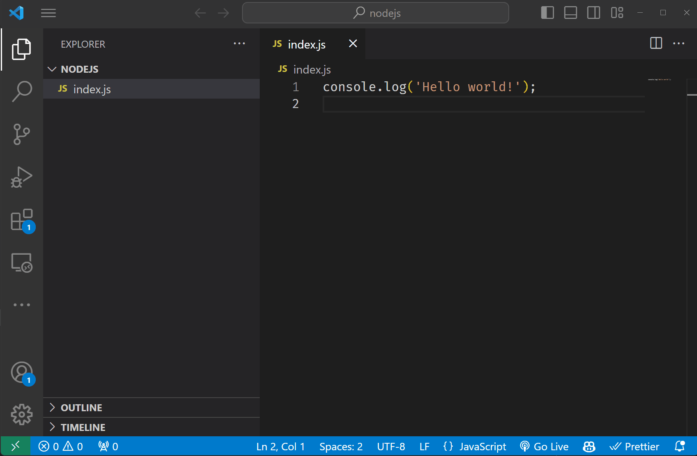

# Node JS

Σε αυτή τη θεματική ενότητα, θα μάθουμε για το Node JS.

- [Node JS](#node-js)
  - [Μαθησιακά αποτελέσματα](#learning-outcomes)
  - [Τι είναι το Node JS;](#Τι-είναι-το-Node-JS-;)
  - [Γιατί να χρησιμοποιήσετε το Node JS;](#Γιατί-να-χρησιμοποιήσετε-το-Node-JS-;)
  - [Πώς να εγκαταστήσετε το Node JS;](#Πώς-να-εγκαταστήσετε-το-Node-JS-;)
  - [Πώς να εκτελέσετε το Node JS;](#Πώς-να-εκτελέσετε-το-Node-JS-;)

## Μαθησιακά αποτελέσματα

Μετά την ολοκλήρωση αυτής της θεματικής ενότητας, θα είστε σε θέση να:

- Εξηγήσετε τι είναι το Node JS,
- Εξηγήσετε γιατί το Node JS είναι δημοφιλές,
- Εγκαταστήσετε το Node JS στον υπολογιστή σας,
- Εκτελέσετε προγραμμάτων Node JS.

## Τι είναι το Node JS;

Το **NodeJS** είναι ένα περιβάλλον εκτέλεσης JavaScript που μας επιτρέπει να εκτελούμε κώδικα JavaScript έξω από το πρόγραμμα περιήγησης ιστού. Η NodeJS είναι μια γλώσσα από την πλευρά του διακομιστή, που σημαίνει ότι εκτελείται σε έναν διακομιστή και, σε αντίθεση με τη JavaScript που εκτελείται στο πρόγραμμα περιήγησης, η NodeJS έχει πρόσβαση στο σύστημα αρχείων του υπολογιστή. Η πρόσβαση στο σύστημα αρχείων επιτρέπει στη NodeJS να διαβάζει, να δημιουργεί και να τροποποιεί αρχεία από τις συσκευές αποθήκευσης του υπολογιστή, κάτι που δεν μπορεί να γίνει με τη JavaScript που εκτελείται με το πρόγραμμα περιήγησης.

## Γιατί να χρησιμοποιήσετε το Node JS;

Το NodeJS είναι μια δημοφιλής επιλογή για τη δημιουργία εφαρμογών ιστού, επειδή είναι γρήγορο, κλιμακούμενο και εύκολο στην εκμάθηση και επιτρέπει τη χρήση της ίδιας γλώσσας (JavaScript) τόσο στην πλευρά του πελάτη όσο και στην πλευρά του διακομιστή. Το NodeJS είναι επίσης δημοφιλές επειδή διαθέτει μια μεγάλη κοινότητα προγραμματιστών και έναν τεράστιο αριθμό βιβλιοθηκών ανοικτού κώδικα που μπορούν να χρησιμοποιηθούν για τη δημιουργία εφαρμογών ιστού.

Η χρήση του NodeJS δεν περιορίζεται σε εφαρμογές ιστού. Μπορεί επίσης να χρησιμοποιηθεί για την κατασκευή: 

- **εφαρμογές υπολογιστών**
- **εφαρμογές για κινητά**
- εφαρμογές **IoT**.

## Πώς να εγκαταστήσετε το Node JS;

Για να εγκαταστήσετε το NodeJS, πρέπει να κατεβάσετε τον εγκαταστάτη NodeJS από την [επίσημη ιστοσελίδα του NodeJS](https://nodejs.org/en/download). Το πρόγραμμα εγκατάστασης θα εγκαταστήσει το NodeJS και το **NPM** (*Node Package Manager*) στον υπολογιστή σας. Το **NPM** είναι ένα εργαλείο που χρησιμοποιείται για την εγκατάσταση και τη διαχείριση των πακέτων NodeJS.

## Πώς να εκτελέσετε το Node JS;

Για να τρέξουμε το Node JS, πρέπει να ανοίξουμε ένα τερματικό και να πληκτρολογήσουμε `node` ακολουθούμενο από το όνομα του αρχείου που θέλουμε να τρέξουμε. Για παράδειγμα, αν έχουμε ένα αρχείο με όνομα `index.js`, μπορούμε να το εκτελέσουμε πληκτρολογώντας `node index.js` στο τερματικό.

Note that in this way, we can only run files that are located inside the folder opened in our terminal. If we want to run files located elsewhere, we need to navigate to the respective folder in the terminal.

