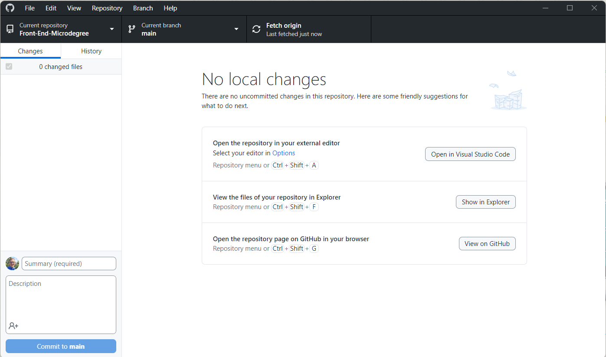

# Εργαλεία

Σε αυτή τη θεματική ενότητα, θα μάθουμε για τα εργαλεία που θα χρησιμοποιήσουμε κατά τη διάρκεια αυτού του μαθήματος.

- [Εργαλεία](#tools)
  - [Μαθησιακά αποτελέσματα](#Μαθησιακά-αποτελέσματα)
  - [Επεξεργαστής Κώδικα-Code Editor](#Επεξεργαστής-Κώδικα---Code-Editor)
  - [Πρόγραμμα Περιήγησης-Browser](#Πρόγραμμα-Περιήγησης---Browser)
  - [Τερματικό-Terminal](#Τερματικό---Terminal)
  - [Git](#git)
  - [GitHub](#github)
  - [GitHub Desktop](#github-desktop)

## Μαθησιακά αποτελέσματα

Αφού ολοκληρώσετε αυτή τη θεματική ενότητα, θα είστε σε θέση να:

- Εξηγήστε τι είναι ένας επεξεργαστής κώδικα
- Εξηγήστε τι είναι ένα πρόγραμμα περιήγησης
- Εξηγήστε τι είναι ένα τερματικό
- Εξηγήστε τι είναι το Git
- Εξηγήστε τι είναι το GitHub
- Εξηγήστε τι είναι το GitHub Desktop

## Επεξεργαστής Κώδικα-Code Editor

Ο επεξεργαστής κώδικα είναι ένα πρόγραμμα που χρησιμοποιείται για τη συγγραφή και την επεξεργασία του πηγαίου κώδικα. Υπάρχουν πολλοί διαφορετικοί επεξεργαστές κώδικα, αλλά οι πιο δημοφιλείς είναι οι εξής:
- Visual Studio Code
- Sublime Text
- Atom
- etc.

Τεχνικά, θα μπορούσαμε να γράψουμε κώδικα χρησιμοποιώντας κανονικούς επεξεργαστές κειμένου, αλλά οι επεξεργαστές κώδικα διαθέτουν πολλά χαρακτηριστικά που διευκολύνουν τη συγγραφή κώδικα, όπως η επισήμανση σύνταξης, η συμπλήρωση κώδικα και η αναδίπλωση κώδικα.

Κατά τη διάρκεια αυτού του μαθήματος, θα χρησιμοποιήσουμε [Visual Studio Code](https://code.visualstudio.com/) ως επεξεργαστή κώδικα, αλλά ο καθένας μπορεί να χρησιμοποιήσει όποιον επεξεργαστή κώδικα προτιμά. Το Visual Studio Code είναι ένας δωρεάν και ανοιχτού κώδικα επεξεργαστής κώδικα που αναπτύσσεται από τη Microsoft. Είναι διαθέσιμο για Windows, Mac και Linux και διαθέτει πολλά χαρακτηριστικά που το καθιστούν εξαιρετική επιλογή για αρχάριους.

## Πρόγραμμα Περιήγησης-Browser

Το πρόγραμμα περιήγησης είναι ένα πρόγραμμα που χρησιμοποιείται για την προβολή ιστοσελίδων. Υπάρχουν πολλά διαφορετικά προγράμματα περιήγησης, αλλά τα πιο δημοφιλή είναι τα εξής: 
- Google Chrome
- Mozilla Firefox
- Microsoft Edge

Κατά τη διάρκεια αυτού του μαθήματος, θα χρησιμοποιήσουμε [Google Chrome](https://www.google.com/chrome/) ως πρόγραμμα περιήγησης, αλλά και πάλι, ο καθένας μπορεί να χρησιμοποιήσει όποιο πρόγραμμα περιήγησης προτιμά.

## Τερματικό-Terminal

Το τερματικό είναι ένα πρόγραμμα που χρησιμοποιείται για την αλληλεπίδραση με το λειτουργικό σύστημα. Είναι επίσης γνωστό ως διεπαφή γραμμής εντολών (CLI) ή κέλυφος. Υπάρχουν πολλά διαφορετικά τερματικά διαθέσιμα, αλλά τα πιο δημοφιλή είναι τα εξής: 
- Windows Terminal
- iTerm2
- Hyper
- etc

Κατά τη διάρκεια αυτού του μαθήματος, θα χρησιμοποιήσουμε το ενσωματωμένο τερματικό του Visual Studio Code, αλλά ο καθένας μπορεί να χρησιμοποιήσει όποιο τερματικό προτιμά. Χρησιμοποιούμε τερματικά για να εκτελούμε εντολές που εκτελούν διάφορες εργασίες, όπως η δημιουργία αρχείων, η εγκατάσταση πακέτων και η εκτέλεση προγραμμάτων.

## Git

[Git](https://git-scm.com/) είναι ένα σύστημα ελέγχου εκδόσεων που χρησιμοποιείται για την παρακολούθηση των αλλαγών σε αρχεία και φακέλους. Είναι ένα κατανεμημένο σύστημα ελέγχου εκδόσεων, που σημαίνει ότι κάθε προγραμματιστής έχει ένα αντίγραφο ολόκληρου του έργου στον υπολογιστή του. Μπορούμε να χρησιμοποιήσουμε το Git από τη γραμμή εντολών ή από ένα GUI (γραφικό περιβάλλον χρήστη).
Κατά τη διάρκεια αυτού του μαθήματος, θα χρησιμοποιήσουμε το Git για να παρακολουθούμε τις αλλαγές στα έργα μας και να συνεργαζόμαστε με άλλους προγραμματιστές.
## GitHub

[GitHub](https://www.github.com) είναι μια διαδικτυακή υπηρεσία φιλοξενίας για αποθετήρια Git. Πρόκειται για μια πλατφόρμα που επιτρέπει στους προγραμματιστές να συνεργάζονται σε έργα και να μοιράζονται κώδικα μεταξύ τους. Είναι επίσης ένα κοινωνικό δίκτυο για προγραμματιστές, όπου μπορούν να ακολουθούν ο ένας τον άλλον, να κάνουν like στα έργα του άλλου και να σχολιάζουν τα έργα του άλλου. Κατά τη διάρκεια αυτού του μαθήματος, θα χρησιμοποιήσουμε το GitHub για να φιλοξενήσουμε τα έργα μας και να συνεργαστούμε με άλλους προγραμματιστές.

## GitHub Desktop

Όπως αναφέρθηκε παραπάνω, μπορούμε να χρησιμοποιήσουμε το Git από τη γραμμή εντολών ή από ένα GUI. Κατά τη διάρκεια αυτού του μαθήματος, θα χρησιμοποιήσουμε 
[GitHub Desktop](https://desktop.github.com/) ως το δικό μας GUI Git, αλλά ο καθένας μπορεί να χρησιμοποιήσει όποιο GUI Git προτιμά. Το GitHub Desktop είναι ένα δωρεάν και ανοιχτού κώδικα GUI Git που αναπτύσσεται από το GitHub. Είναι διαθέσιμο για Windows και Mac και έχει πολλά χαρακτηριστικά που το καθιστούν μια εξαιρετική επιλογή για αρχάριους.

Θα υπάρξει ένα ξεχωριστό θέμα για το Git και το GitHub αργότερα σε αυτό το μάθημα, όπου θα μάθουμε πώς να χρησιμοποιούμε το Git και το GitHub για να παρακολουθούμε τις αλλαγές στα έργα μας και να συνεργαζόμαστε με άλλους προγραμματιστές.

Επίσης, θα υπάρξουν και άλλα εργαλεία που θα χρησιμοποιήσουμε κατά τη διάρκεια αυτού του μαθήματος, αλλά θα μάθουμε γι' αυτά στην πορεία.
