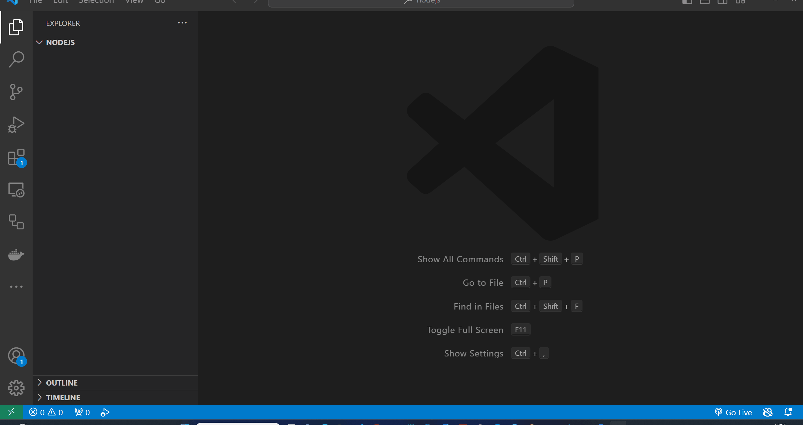

# Μεταβλητές

Σε αυτό το θέμα, θα μάθουμε για τις μεταβλητές στη Javascript.

- [Μεταβλητές](#variables)
  - [Μαθησιακά αποτελέσματα](#Μαθησιακά-αποτελέσματα)
  - [Τι είναι μια μεταβλητή;](#Τι-είναι-μια-μεταβλητή-;)
  - [Πώς να δηλώσετε μια μεταβλητή;](#Πώς-να-δηλώσετε-μια-μεταβλητή-;)
  - [Ανάθεση τιμών σε μεταβλητές](#Ανάθεση-τιμών-σε-μεταβλητές)
  - [Ασκήσεις](#Ασκήσεις)
    - [Άσκηση 1](#Άσκηση-1)
    - [Άσκηση 2](#Άσκηση-2)
    - [Άσκηση 3](#Άσκηση-3)

## Μαθησιακά αποτελέσματα

Αφού ολοκληρώσετε αυτή τη θεματική ενότητα, θα είστε σε θέση να:

- Καθορίσετε τι είναι μια μεταβλητή
- Δηλώσετε μεταβλητές
- Αναθέσετε τιμές σε μεταβλητές
- Εξηγήσετε τη διαφορά μεταξύ `var`, `let` και `const`

##Τι είναι μια μεταβλητή;

Μια μεταβλητή είναι μια ονομαστική θέση αποθήκευσης στη μνήμη ενός υπολογιστή που μπορεί να χρησιμοποιηθεί για την αποθήκευση δεδομένων. Οι μεταβλητές χρησιμοποιούνται για την αποθήκευση τιμών που μπορούν να αλλάξουν κατά τη διάρκεια της εκτέλεσης ενός προγράμματος. Για παράδειγμα, μια μεταβλητή με όνομα `x` μπορεί να χρησιμοποιηθεί για την αποθήκευση της τιμής `5`. Η τιμή του `x` μπορεί να αλλάξει σε `10` αναθέτοντας την τιμή `10` στο `x`. Οι μεταβλητές χρησιμοποιούνται για την αποθήκευση δεδομένων που μπορούν να χρησιμοποιηθούν αργότερα στο πρόγραμμα.

Μπορούμε να φανταστούμε μια μεταβλητή ως ένα κουτί με μια ετικέτα (`variable name`) που μπορεί να περιέχει κάτι (`value`). Μπορούμε να βάλουμε κάτι μέσα στο κουτί (`assign a value`) και μπορούμε να πάρουμε κάτι από το κουτί  (`use the value`).  Αν θέλουμε να μάθουμε τι υπάρχει μέσα στο κουτί, μπορούμε να κοιτάξουμε την ετικέτα  (`variable name`) για να αναγνωρίσουμε το κουτί και στη συνέχεια να ανοίξουμε το κουτί για να δούμε τι υπάρχει μέσα  (`access the value`).

Για παράδειγμα, θα μπορούσαμε να έχουμε τη μεταβλητή `apples`, η οποία περιέχει μερικά μήλα. Αν θέλουμε να μάθουμε πόσα μήλα έχουμε στη μεταβλητή `apples`, μπορούμε να κοιτάξουμε την ετικέτα (`apples`) για να αναγνωρίσουμε το κουτί και στη συνέχεια να ανοίξουμε το κουτί για να δούμε πόσα μήλα υπάρχουν μέσα (`access the value`).

Σε Javascript θα ήταν κάπως έτσι:

```javascript
let apples = 5; // declare a variable named apples and assign the value 5 to it (put 5 apples in the box)
console.log(apples); // print the value of the apples variable to the console (open the box, see how many apples are inside and print the value to the console)
```

## How to Declare a Variable?

In order to use a variable in a program, we must first declare it. In Javascript, we can declare a variable using the `var`, `let`, or `const` keywords.
- The `var` keyword is used to declare a variable that can be reassigned, but we should avoid using `var` nowadays and use `let` instead.
- The `let` keyword is used to declare a variable that can be reassigned.
- The `const` keyword is used to declare a variable that cannot be reassigned.

```javascript
let firstName; // declare a variable named x
let age, lastName; // declare multiple variables 
```

In previous example, we declared variables named `firstName`, `age`, and `lastName`. We can also declare variables and assign values to them at the same time.

## Assigning Values to Variables

We can assign values to variables using the assignment operator `=`. The value on the right side of the assignment operator is assigned to the variable on the left side of the assignment operator.

```javascript
let firstName = 'John'; // declare a variable named firstName and assign the value 'John' to it
let age = 25, lastName = 'Doe'; // declare multiple variables and assign values to them
const PI = 3.14; // declare a constant named PI and assign the value 3.14 to it
```

## Exercises

Create a file named `index.js` (or another name of your choice) and start adding solutions to the exercises below.

Test your code by running the `index.js` file using the `node index.js` command.

You can also test Your code with different values for the variables.

### Exercise 1

Declare a variable named `firstName` and assign the value `John` to it.

Print the value of the `firstName` variable to the console.

Test your code by running the `index.js` file using the `node index.js` command.

<details>
  <summary>Solution</summary>

```javascript
let firstName = 'John'; // declare a variable named firstName and assign the value 'John' to it

console.log(firstName); // print the value of the firstName variable to the console
```


</details>

### Exercise 2

In the same file, declare a variable named `lastName` and assign the value `Doe` to it.

Print out values of the `firstName` and `lastName` variables in a single line. Output should look like this: `John Doe`.

Test your code by running the `index.js` file using the `node index.js` command.

> Hint: Use the `+` operator to concatenate the values of the `firstName` and `lastName` variables.

<details>
  <summary>Solution</summary>

```javascript
let firstName = 'John'; // declare a variable named firstName and assign the value 'John' to it
let lastName = 'Doe'; // declare a variable named lastName and assign the value 'Doe' to it

console.log(firstName + ' ' + lastName); // print out values of the firstName and lastName variables in a single line
```

</details>

### Exercise 3

In the same file, declare a variable named `age` and assign the value `25` to it.

Print out text `John is 25 years old.` using the `firstName` and `age` variables.
