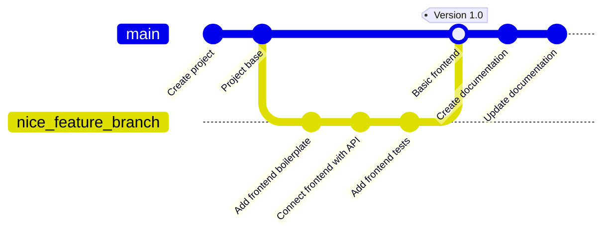
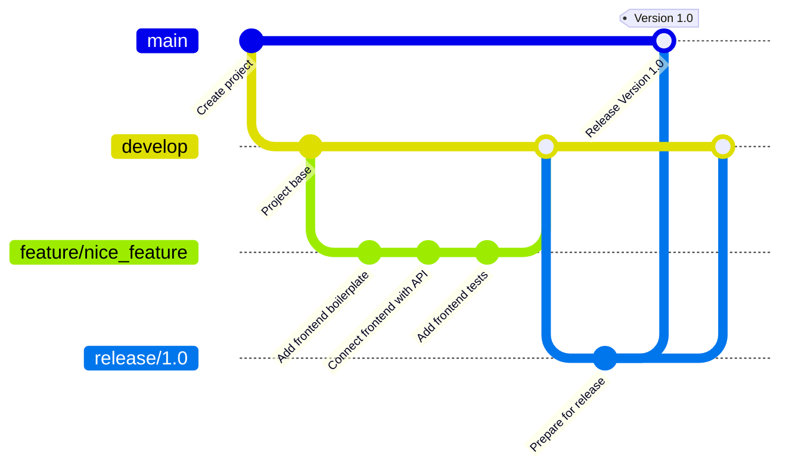

# Git

Σε αυτό το θέμα, θα μάθουμε τα βασικά για το Git και τον έλεγχο εκδόσεων. Θα καλύψουμε τη σημασία των συστημάτων ελέγχου εκδόσεων, τα βασικά στοιχεία του Git και τη διαδικασία ροής του Git.

- [Git](#git)
  - [Μαθησιακά αποτελέσματα](#Μαθησιακά-αποτελέσματα)
  - [Τι είναι το Git;](#Τι-είναι-το-Git-;)
  - [Βασική αρχιτεκτονική του Git](#Βασική-αρχιτεκτονική-του-Git)
  - [Εγκαθιστώντας το Git](#Εγκαθιστώντας-το-Git)
  - [Βασικό λεξιλόγιο Git](#Βασικό-λεξιλόγιο-Git)
  - [Βασικές εντολές του Git](#Βασικές-εντολές-του-Git)
  - [Graphical Git Clients](#graphical-git-clients)
    - [Μερικοί δημοφιλείς Graphical Clients για το Git:](#Μερικοί-δημοφιλείς-Graphical-Clients-για-το-Git-:)
    - [Λόγοι χρήσης Graphical Git Clients:](#Λόγοι-χρήσης-Graphical-Git-Clients-:)
  - [Git flow](#git-flow)
    - [1. **Main Branches**:](#1-main-branches)
    - [2. **Supporting Branches**:](#2-supporting-branches)
    - [**Basic Git Flow Process**:](#basic-git-flow-process)
  - [Git hosting Πλατφόρμες](#Git-hosting-Πλατφόρμες)
  - [Ασκήσεις](#Ασκήσεις)

## Μαθησιακά αποτελέσματα

Αφού ολοκληρώσετε αυτή τη θεματική ενότητα, θα είστε σε θέση να:

- κατανοήσετε τη σημασία των συστημάτων ελέγχου εκδόσεων,
- περιγράψετε τα βασικά στοιχεία του Git και του ελέγχου εκδόσεων,
- να περιγράψετε τη βασική αρχιτεκτονική του Git,
- περιγράψτε τη βασική ορολογία του Git.
- περιγράφουν τη βασική ροή του Git.

## Τι είναι το Git;



**Git** είναι ένα κατανεμημένο σύστημα ελέγχου εκδόσεων (_DVCS_) που χρησιμοποιείται για την παρακολούθηση των αλλαγών στον πηγαίο κώδικα κατά την ανάπτυξη λογισμικού. Έχει σχεδιαστεί για να χειρίζεται από μικρά έως πολύ μεγάλα έργα με ταχύτητα και αποτελεσματικότητα. **Git** παρέχει έναν τρόπο σε πολλούς προγραμματιστές να συνεργάζονται στην ίδια βάση κώδικα χωρίς να αλληλοεπηρεάζονται.

Το Git δημιουργήθηκε από τον Linus Torvalds το 2005 για την ανάπτυξη του πυρήνα του Linux. Η υιοθέτησή του αυξήθηκε ραγδαία και είναι πλέον το κυρίαρχο σύστημα ελέγχου εκδόσεων στη βιομηχανία λογισμικού. Χρησιμοποιείται από εταιρείες όπως η Google, το Facebook, η Microsoft και το Twitter για τη διαχείριση των βάσεων κώδικά τους.

Ακολουθούν οι βασικές πτυχές και τα χαρακτηριστικά του **Git**:

- **Κατανεμημένο σύστημα**: Σε αντίθεση με τα συγκεντρωτικά συστήματα ελέγχου εκδόσεων όπου υπάρχει ένα μοναδικό κεντρικό αποθετήριο, στο **Git**, το αντίγραφο του κώδικα κάθε 
   προγραμματιστή είναι επίσης ένα αποθετήριο που μπορεί να περιέχει ολόκληρο το ιστορικό και τις δυνατότητες παρακολούθησης εκδόσεων. Αυτό εξασφαλίζει πλεονασμό και καθιστά λειτουργίες      όπως η διακλάδωση και η συγχώνευση εξαιρετικά αποτελεσματικές.
- **Διακλάδωση και συγχώνευση**: Το μοντέλο διακλάδωσης του **Git**επιτρέπει στους προγραμματιστές να δημιουργούν απομονωμένους κλάδους για την ανάπτυξη χαρακτηριστικών ή τη διόρθωση         σφαλμάτων. Αυτοί οι κλάδοι μπορούν στη συνέχεια να συγχωνευθούν πίσω στον κύριο κλάδο, συνήθως γνωστό ως «master».
- **Ιστορικό**: **Git** παρακολουθεί ολόκληρο το ιστορικό του έργου. Κάθε δέσμευση ελέγχεται και ανακτάται, εξασφαλίζοντας ακεραιότητα και δυνατότητα εντοπισμού.
- **Staging Area**: **Git** εισάγει μια μοναδική έννοια της  _staging area_ ή _index_. Πρόκειται για μια ενδιάμεση περιοχή όπου οι δεσμεύσεις μπορούν να μορφοποιηθούν και να       
    επανεξεταστούν πριν από την ολοκλήρωση της δέσμευσης.
- **Απόδοση**: **Git** οι λειτουργίες εκτελούνται τοπικά, καθιστώντας το ταχύτερο από πολλά συστήματα ελέγχου εκδόσεων που βασίζονται σε λειτουργίες δικτύου.
- **Ακεραιότητα**: **Git** χρησιμοποιεί έναν αλγόριθμο κατακερματισμού που ονομάζεται SHA-1 για τον έλεγχο των δεδομένων του. Αυτό εξασφαλίζει την ακεραιότητα του ιστορικού εκδόσεων.
- **Ευελιξία**: **Git** υποστηρίζει διάφορες ροές εργασίας, από συγκεντρωτικές έως πλήρως κατανεμημένες, καθιστώντας το προσαρμόσιμο σε διαφορετικές ανάγκες έργων.
- **Πλατφόρμες συνεργασίας**: Πλατφόρμες όπως _GitHub_, _GitLab_, and _Bitbucket_ ενισχύει τις συνεργατικές δυνατότητες του **Git**, παρέχοντας την υποστήριξη κώδικα, των pull requests,       των αξιολογήσεων κώδικα και του εντοπισμού προβλημάτων.
- **Free and Open Source**: **Git** είναι ελεύθερο λογισμικό που διανέμεται υπό τους όρους της Γενικής Άδειας Δημόσιας Χρήσης GNU έκδοση 2.

## Βασική αρχιτεκτονική του Git

Το Git έχει μια μοναδική αρχιτεκτονική και ένα μοναδικό μοντέλο δεδομένων που το καθιστά αποτελεσματικό και ισχυρό. Ακολουθεί μια ανάλυση των βασικών στοιχείων της αρχιτεκτονικής του Git:

- **Blobs**:
  - Αντιπροσωπεύει το περιεχόμενο ενός αρχείου στο Git.
  - Ένα blob περιέχει τα δεδομένα του αρχείου, αλλά δεν περιέχει μεταδεδομένα σχετικά με το αρχείο.
  - Είναι ένα δυαδικό μεγάλο αντικείμενο και ταυτοποιείται από έναν κατακερματισμό SHA-1 του περιεχομένου του.
- **(Δέντρα)Trees**:
  - Αντιπροσωπεύει έναν κατάλογο ή φάκελο στο Git.
  - Ένα αντικείμενο tree αντιστοιχίζει ονόματα σε blobs ή δέντρα (ουσιαστικά, μπορεί να παραπέμπει σε άλλα δέντρα για υποκαταλόγους).
  - Όπως και τα blobs, τα δέντρα αναγνωρίζονται από έναν κατακερματισμό SHA-1.
- **Δεσμεύσεις (Commits)**:
  - Αντιπροσωπεύει ένα συγκεκριμένο σημείο στο ιστορικό του αποθετηρίου.
  - Μια δέσμευση παραπέμπει σε ένα δέντρο που αποτυπώνει την κατάσταση του αποθετηρίου σε μια συγκεκριμένη χρονική στιγμή.
  - Περιέχει μεταδεδομένα όπως:
    - Συγγραφέας
    - Επιμελητής (Committer)
    - Ημερομηνία
    - Μήνυμα δέσμευσης
  - Κάθε δέσμευση παραπέμπει επίσης στις γονικές της δεσμεύσεις, σχηματίζοντας μια συνδεδεμένη λίστα. Αυτό είναι που δημιουργεί το «ιστορικό» στο Git. Οι δεσμεύσεις συγχώνευσης μπορούν να 
    παραπέμπουν σε πολλαπλούς γονείς.
  - Αναγνωρίζεται από έναν κατακερματισμό SHA-1.
- **Κλάδοι (Branches)**:
  - Ένας κινούμενος δείκτης σε μια δέσμευση.
  - Όταν δημιουργείτε έναν κλάδο, το Git δημιουργεί έναν δείκτη στη δέσμευση στην οποία βρίσκεστε αυτή τη στιγμή.
  - Καθώς δημιουργούνται νέες δεσμεύσεις, ο δείκτης κλάδου μετακινείται αυτόματα ώστε να δείχνει στην τελευταία δέσμευση.
  - Ο προεπιλεγμένος κλάδος στα περισσότερα αποθετήρια ονομάζεται «master» (αν και πρόσφατα παρατηρήθηκε μια στροφή προς την ονομασία «main»).
  - Οι διακλαδώσεις επιτρέπουν την αποκλίνουσα ανάπτυξη, όπου χαρακτηριστικά ή πειράματα μπορούν να αναπτυχθούν μεμονωμένα πριν από τη συγχώνευσή τους πίσω στην κύρια βάση κώδικα.

Αυτή η αρχιτεκτονική, που βασίζεται σε έναν κατευθυνόμενο ακυκλοειδή γράφο αντικειμένων, επιτρέπει στο Git να παρακολουθεί αποτελεσματικά τις αλλαγές, να δημιουργεί κλάδους και να συγχωνεύει ιστορικά. Η χρήση των κατακερματισμών SHA-1 εξασφαλίζει την ακεραιότητα και τη συνέπεια του αποθετηρίου σε κλώνους και εκδόσεις.

## Εγκαθιστώντας το Git

Την τελευταία έκδοση του Git και οδηγίες για την εγκατάσταση μπορείτε να βρείτε στο [git-scm.com](https://git-scm.com/book/en/v2/Getting-Started-Installing-Git).

## Βασικό λεξιλόγιο Git

Το Git έχει το δικό του μοναδικό λεξιλόγιο και η κατανόηση αυτών των όρων είναι το κλειδί για την αποτελεσματική εργασία με το Git. Ακολουθεί μια βασική επισκόπηση ορισμένων βασικών όρων της ορολογίας του Git:
- **Αποθετήριο - Repository (Repo)**:
  - Ένας φάκελος(directory) ή χώρος αποθήκευσης όπου βρίσκεται το έργο σας. Περιέχει όλα τα αρχεία του έργου και ολόκληρο το ιστορικό αναθεωρήσεων.
  - Μπορεί να είναι τοπικό (στον υπολογιστή σας) ή απομακρυσμένο (π.χ. σε διακομιστή ή υπηρεσία όπως το GitHub).
- **Δέσμευση (Commit)**:
  - Ένα σύνολο αλλαγών ή τροποποιήσεων σε αρχεία. Κάθε δέσμευση αναγνωρίζεται μοναδικά από έναν κωδικό κατακερματισμού SHA-1.
  - Αντιπροσωπεύει ένα στιγμιότυπο της δομής των αρχείων και των καταλόγων του αποθετηρίου σε μια συγκεκριμένη χρονική στιγμή.
- **Κλάδος (Branch)**:
  - Μια παράλληλη έκδοση ενός αποθετηρίου. Αποκλίνει από το κύριο έργο εργασίας σε μια ξεχωριστή περιοχή όπου μπορείτε να εργαστείτε χωρίς να επηρεάσετε τον κύριο (main ή "master") κλάδο.
  - Χρήσιμο για την ανάπτυξη νέων λειτουργιών ή τη δοκιμή ιδεών.
- **Master or main**:
  - Ο προεπιλεγμένος κλάδος ανάπτυξης. Κάθε φορά που δημιουργείτε ένα αποθετήριο Git, δημιουργείται ένας κλάδος που ονομάζεται «master» ή «main» και γίνεται ο ενεργός κλάδος.
  - Σημείωση: Υπάρχει μια τάση στη βιομηχανία να μετονομάζεται αυτός ο προεπιλεγμένος κλάδος σε «main» για λόγους συνοχής.
- **Κλωνοποίηση (Clone)**:
  - Ένα αντίγραφο ενός αποθετηρίου που βρίσκεται στον υπολογιστή σας αντί σε έναν διακομιστή αλλού ή στην αρχική τοποθεσία του αποθετηρίου.
  - `git clone [URL]` είναι η εντολή που χρησιμοποιείται για να κλωνοποιήσετε (ή να αντιγράψετε) ένα αποθετήριο από μια υπάρχουσα διεύθυνση URL.
- **Fork**:
  - Ένα προσωπικό αντίγραφο του αποθετηρίου ενός άλλου χρήστη. Το Forking χρησιμοποιείται για να προτείνετε αλλαγές στο έργο κάποιου άλλου ή για να χρησιμοποιήσετε το έργο κάποιου άλλου 
    ως αφετηρία για τη δική σας ιδέα.
- **Pull**:
  - Αναφέρεται όταν μεταφέρετε αλλαγές από ένα απομακρυσμένο αποθετήριο ή κλάδο και τις συγχωνεύετε στον τρέχοντα κλάδο σας.
  - `git pull [remote] [branch_name]` είναι η εντολή που χρησιμοποιείται για την ανάσυρση(pull) αλλαγών.
- **Push**:
  - Αποστολή των τροποποιημένων αλλαγών σας σε ένα απομακρυσμένο αποθετήριο.
  - `git push [remote] [branch_name]` είναι η εντολή που χρησιμοποιείται για να προωθήσετε(push) τις αλλαγές σας.
- **HEAD**:
  - A special pointer or reference to a specific commit in the repository. By default, it points to the latest commit in the branch you're currently on.
- **Merge**:
  - The process of integrating changes from one branch into another.
- **Merge Conflict**:
  - Occurs when competing changes are made to the same line of a file, or when one person edits a file and another person deletes the same file.
  - Git will highlight the differences and require you to choose which changes to keep.
- **Pull Request (PR)**:
  - On platforms like GitHub, a pull request is a way to propose changes from a fork or a branch which can then be merged into another branch, typically the master/main branch.
- **Remote**:
  - A version of your project that is hosted on the internet or network somewhere. You can have multiple remotes, and they are handy for collaborating with others.
- **Staging Area (or Index)**:
  - An intermediate area where commits can be formatted and reviewed before completing the commit.
  - `git add [file_name]` is used to add changes to the staging area.
- **Fetch**:
  - The act of downloading new data from a remote repository. Unlike `pull`, `fetch` gets the data but does not merge it.
- **Tag**:
  - A reference or pointer to a specific commit, often used to capture a point in history that is significant, such as a release version.

This overview covers the basic terms you'll encounter when starting with Git. As you delve deeper, you'll naturally come across more advanced concepts and terms.

## Basic Git Commands

Here's a basic overview of some essential Git commands and their descriptions:

- **`git init`**:
  - Initializes a new Git repository and starts tracking an existing directory.
  - Adds a hidden subfolder within the existing directory that houses the internal data structure required for version control.
- **`git clone [url]`**:
  - Creates a local copy of a project that already exists remotely.
  - The clone includes all the project’s files, history, and branches.
- **`git add [file-name.txt]`**:
  - Adds changes in the file to the staging area.
  - Prepares and packages up changes for a commit.
- **`git add .`**:
  - Adds all the changes in the current directory to the staging area (useful for tracking several changes across different files).
- **`git commit -m "[commit message]"`**:
  - Captures a snapshot of the project's currently staged changes.
- **`git status`**:
  - Shows the status of changes as untracked, modified, or staged.
- **`git branch`**:
  - Lists all local branches in the repository.
  - If you need to see all branches (including remote), use `git branch -a`.
- **`git branch [branch-name]`**:
  - Creates a new branch.
- **`git checkout [branch-name]`**:
  - Switches to the specified branch and updates the working directory.
  - Note: The command has evolved. You can now use `git switch [branch-name]` in newer versions of Git.
- **`git merge [branch-name]`**:
  - Merges the specified branch’s history into the current branch.
- **`git pull`**:
  - Updates your current local working branch with all new commits from the corresponding remote branch on GitHub.
- **`git push [remote-name] [branch-name]`**:
  - Pushes your local branch updates to the corresponding remote branch on GitHub.
- **`git log`**:
  - Displays an ordered list of all the commits which lead up to the current state of the branch.
  - There are many options to tailor the output format, like `git log --oneline` for a condensed view.
- **`git diff`**:
  - Shows the file differences that are not yet staged.
- **`git diff --staged`**:
  - Shows file differences when comparing the staged changes to the last commit.
- **`git remote add [alias] [url]`**:
  - Adds a remote repository to your local project.
- **`git remote -v`**:
  - Lists all remote repositories connected to the local project.
- **`git fetch`**:
  - Fetches all the updates from the remote repository (does not merge them).
- **`git revert [commit]`**:
  - Undoes all the changes made in a particular commit with a new commit.
- **`git reset`**:
  - Resets your staging area to match the most recent commit, but leaves the working directory unchanged. Useful for undoing `git add`.

This list covers the basics to get you started. Git is a deep tool with a variety of commands, and as you gain more experience, you'll discover many more advanced commands and options that can be used in various scenarios.

## Graphical Git Clients

**Graphical Git Clients** are applications that provide a visual interface to interact with Git, rather than relying solely on the command-line. They visually represent the version history, branches, and other aspects of a Git repository.

While graphical clients can be incredibly helpful, especially for those not comfortable with the command line, they do abstract away some of the intricacies of Git. For deeper, more complex operations, or to truly understand the inner workings of Git, familiarity with the command line is beneficial. Both approaches have their advantages, and many developers find a hybrid approach (using both command line and GUI) to be the most efficient.

### Some Popular Graphical Clients for Git:

- [**GitHub Desktop**](https://desktop.github.com/): This is the official GUI for GitHub. It’s open-source and cross-platform (available for macOS and Windows).
- [**Sourcetree**](https://www.sourcetreeapp.com/): Developed by Atlassian, it's a free tool available for macOS and Windows. It offers visual interaction with your repositories and supports Mercurial as well as Git.
- [**GitKraken**](https://www.gitkraken.com/): This cross-platform tool (available for Windows, macOS, and Linux) offers a vibrant and interactive interface. It's known for its graph visualization and has integrations with GitHub, GitLab, Bitbucket, and more.
- [**TortoiseGit**](https://tortoisegit.org/): Primarily for Windows, TortoiseGit integrates directly into the Windows shell, so you can right-click on a folder to access its features.

### Reasons to Use Graphical Git Clients:

- **User-Friendly**: For beginners, the command line can be intimidating. Graphical clients offer a more approachable and intuitive interface to interact with Git.
- **Visualization**: They provide a clear visual representation of branches, commits, merges, and more. This is especially helpful in understanding the flow and structure of commits in a repository.
- **Simplifies Complex Tasks**: Some Git tasks can be complex and verbose on the command line. GUI clients often simplify these processes into more manageable steps or provide a drag-and-drop interface.
- **Conflict Resolution**: Many graphical clients offer a visual way to resolve merge conflicts, making it clearer and sometimes easier than manually editing conflict markers in a text editor.
- **Integrated Tooling**: Graphical clients might come with built-in tools or integrations, such as Git blame, repository hosting services, and more.
- **Multitasking**: GUIs usually allow you to work on multiple repositories in separate tabs/windows, making context switching easier.
- **Immediate Feedback**: Many GUIs provide immediate visual feedback for most operations, such as the result of a merge or the changes introduced in a particular commit.
- **Support for Non-Git Operations**: Some GUIs offer features that aren't strictly Git operations, like the ability to open a file in a preferred editor, view the command history, or even run custom scripts.

## Git flow

Git Flow is a popular workflow methodology in Git that defines a structured approach to branching and merging. It provides a solid framework for managing larger projects and can simplify the process of collaborating with other developers on a shared repository. Below, I'll outline the Git Flow process, focusing on the role of branching:

### 1. **Main Branches**:

- **`main` (formerly `master`)**:
  - This branch contains the official release history.
  - All commits in the `main` branch represent a version of the software that is fully tested and deployable.
- **`develop`**:
  - Serves as an integration branch for features.
  - All the changes destined for the next release are integrated into this branch.

### 2. **Supporting Branches**:

These branches are used to aid parallel development, easily track features, prepare for releases, and quickly fix live issues.

- **Feature Branches**:
  - Branch off from: `develop`
  - Merge back into: `develop`
  - Naming convention: anything except `main`, `develop`, `release-*`, or `hotfix-*`
  - Purpose: Used to develop new features or enhancements. They exist as long as the feature is in development.

    ```mermaid
    graph LR
        A[develop] --> B[feature/feature_name]
        B --> A
    ```

- **Release Branches**:
  - Branch off from: `develop`
  - Merge back into: `main` and `develop`
  - Naming convention: `release-*`
  - Purpose: Used to prepare a new product version. This is where we tag our versions before they go into production. Bug fixes can be applied in this branch.

    ```mermaid
    graph LR
        A[develop] --> B[release/version_number]
        B --> C[main]
        B --> A
    ```

- **Hotfix Branches**:
  - Branch off from: `main`
  - Merge back into: `main` and `develop`
  - Naming convention: `hotfix-*`
  - Purpose: They arise from the necessity to act immediately upon an undesired state of the `main` branch. Used to quickly patch production releases.

    ```mermaid
    graph LR
        A[main] --> B[hotfix/issue]
        B --> A
        B --> C[develop]
    ```

### **Basic Git Flow Process**:



1. **Initialization**:
   Initialize a Git repository and then set up an empty `main` and `develop` branch.
2. **Start a New Feature**:
   For every new feature, create a new branch from `develop`, and name it according to the feature you're working on.
3. **Incorporate a Finished Feature**:
   Once the feature is complete and tested, it is merged back into `develop`. It awaits the next release cycle for integration into `main`.
4. **Release Time**:
   When enough features are ready, or a predetermined release point is reached, `develop` is branched off to a release branch, where final testing happens.
5. **Merge with Main**:
   Once the release branch is thoroughly tested, it is merged into `main` and tagged with a version number. It then also needs to be merged back into `develop` to ensure features added in the next cycle have the hotfixes and updates.
6. **Hotfixes**:
   If an issue is detected in the `main` branch and needs an immediate fix, a hotfix branch is created. Once the hotfix is complete, it's merged both into `main` (and tagged) and into `develop`.

Git Flow offers a rigorous framework for large-scale projects, but it might be overkill for smaller projects or teams. Some teams opt for simpler workflows, like GitHub flow or GitLab flow. Still, understanding Git Flow provides a solid foundation for how branching can be used in complex scenarios.

## Git hosting platforms

We could use Git locally, but it's more common to use a remote Git hosting platform. These platforms provide a centralized location for storing and collaborating on Git repositories. They also offer additional features like issue tracking, pull requests, code reviews, and more.

Here are some popular Git hosting platforms:

- [**GitHub**](https://github.com)
- [**GitLab**](https://gitlab.com)
- [**Bitbucket**](https://bitbucket.org)
- etc.

## Excercises

Try to explain the following concepts in your own words:
- What is Git and Version Control?
- Name at least four terms from the git vocabulary
- Name at least one Git hosting platform

Next steps:
- install `git` on your computer
