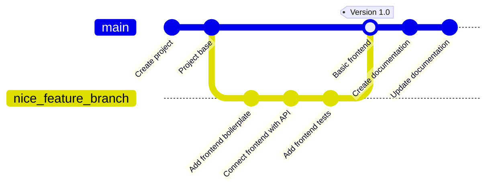
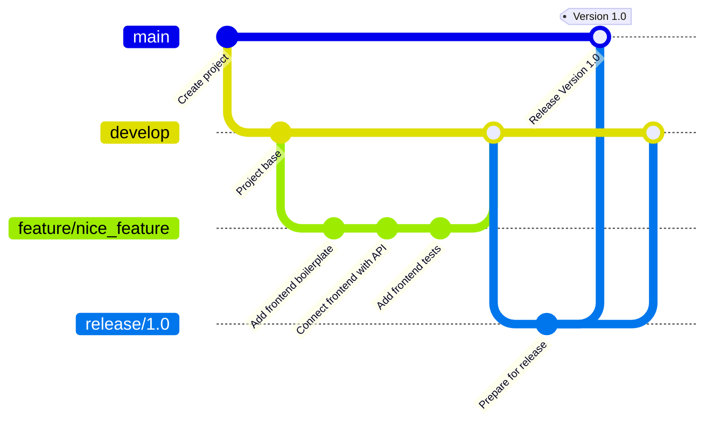

 # Git

Σε αυτό το θέμα, θα μάθουμε τα βασικά για το Git και τον έλεγχο εκδόσεων. Θα καλύψουμε τη σημασία των συστημάτων ελέγχου εκδόσεων, τα βασικά στοιχεία του Git και τη διαδικασία ροής του Git.

- [Git](#git)
  - [Μαθησιακά αποτελέσματα](#Μαθησιακά-αποτελέσματα)
  - [Τι είναι το Git;](#Τι-είναι-το-Git-;)
  - [Βασική αρχιτεκτονική του Git](#Βασική-αρχιτεκτονική-του-Git)
  - [Εγκαθιστώντας το Git](#Εγκαθιστώντας-το-Git)
  - [Βασικό λεξιλόγιο Git](#Βασικό-λεξιλόγιο-Git)
  - [Βασικές εντολές του Git](#Βασικές-εντολές-του-Git)
  - [Graphical Git Clients](#graphical-git-clients)
    - [Μερικοί δημοφιλείς Graphical Clients για το Git:](#Μερικοί-δημοφιλείς-Graphical-Clients-για-το-Git-:)
    - [Λόγοι χρήσης Graphical Git Clients:](#Λόγοι-χρήσης-Graphical-Git-Clients-:)
  - [Git flow](#git-flow)
    - [1. **Main Branches**:](#1-main-branches)
    - [2. **Supporting Branches**:](#2-supporting-branches)
    - [**Basic Git Flow Process**:](#basic-git-flow-process)
  - [Git hosting Πλατφόρμες](#Git-hosting-Πλατφόρμες)
  - [Ασκήσεις](#Ασκήσεις)

## Μαθησιακά αποτελέσματα

Αφού ολοκληρώσετε αυτή τη θεματική ενότητα, θα είστε σε θέση να:

- κατανοήσετε τη σημασία των συστημάτων ελέγχου εκδόσεων,
- περιγράψετε τα βασικά στοιχεία του Git και του ελέγχου εκδόσεων,
- να περιγράψετε τη βασική αρχιτεκτονική του Git,
- περιγράψτε τη βασική ορολογία του Git.
- περιγράφουν τη βασική ροή του Git.

## Τι είναι το Git;



**Git** είναι ένα κατανεμημένο σύστημα ελέγχου εκδόσεων (_DVCS_) που χρησιμοποιείται για την παρακολούθηση των αλλαγών στον πηγαίο κώδικα κατά την ανάπτυξη λογισμικού. Έχει σχεδιαστεί για να χειρίζεται από μικρά έως πολύ μεγάλα έργα με ταχύτητα και αποτελεσματικότητα. **Git** παρέχει έναν τρόπο σε πολλούς προγραμματιστές να συνεργάζονται στην ίδια βάση κώδικα χωρίς να αλληλοεπηρεάζονται.

Το Git δημιουργήθηκε από τον Linus Torvalds το 2005 για την ανάπτυξη του πυρήνα του Linux. Η υιοθέτησή του αυξήθηκε ραγδαία και είναι πλέον το κυρίαρχο σύστημα ελέγχου εκδόσεων στη βιομηχανία λογισμικού. Χρησιμοποιείται από εταιρείες όπως η Google, το Facebook, η Microsoft και το Twitter για τη διαχείριση των βάσεων κώδικά τους.

Ακολουθούν οι βασικές πτυχές και τα χαρακτηριστικά του **Git**:

- **Κατανεμημένο σύστημα**: Σε αντίθεση με τα συγκεντρωτικά συστήματα ελέγχου εκδόσεων όπου υπάρχει ένα μοναδικό κεντρικό αποθετήριο, στο **Git**, το αντίγραφο του κώδικα κάθε 
   προγραμματιστή είναι επίσης ένα αποθετήριο που μπορεί να περιέχει ολόκληρο το ιστορικό και τις δυνατότητες παρακολούθησης εκδόσεων. Αυτό εξασφαλίζει πλεονασμό και καθιστά λειτουργίες      όπως η διακλάδωση και η συγχώνευση εξαιρετικά αποτελεσματικές.
- **Διακλάδωση και συγχώνευση**: Το μοντέλο διακλάδωσης του **Git**επιτρέπει στους προγραμματιστές να δημιουργούν απομονωμένους κλάδους για την ανάπτυξη χαρακτηριστικών ή τη διόρθωση         σφαλμάτων. Αυτοί οι κλάδοι μπορούν στη συνέχεια να συγχωνευθούν πίσω στον κύριο κλάδο, συνήθως γνωστό ως «master».
- **Ιστορικό**: **Git** παρακολουθεί ολόκληρο το ιστορικό του έργου. Κάθε δέσμευση ελέγχεται και ανακτάται, εξασφαλίζοντας ακεραιότητα και δυνατότητα εντοπισμού.
- **Staging Area**: **Git** εισάγει μια μοναδική έννοια της  _staging area_ ή _index_. Πρόκειται για μια ενδιάμεση περιοχή όπου οι δεσμεύσεις μπορούν να μορφοποιηθούν και να       
    επανεξεταστούν πριν από την ολοκλήρωση της δέσμευσης.
- **Απόδοση**: **Git** οι λειτουργίες εκτελούνται τοπικά, καθιστώντας το ταχύτερο από πολλά συστήματα ελέγχου εκδόσεων που βασίζονται σε λειτουργίες δικτύου.
- **Ακεραιότητα**: **Git** χρησιμοποιεί έναν αλγόριθμο κατακερματισμού που ονομάζεται SHA-1 για τον έλεγχο των δεδομένων του. Αυτό εξασφαλίζει την ακεραιότητα του ιστορικού εκδόσεων.
- **Ευελιξία**: **Git** υποστηρίζει διάφορες ροές εργασίας, από συγκεντρωτικές έως πλήρως κατανεμημένες, καθιστώντας το προσαρμόσιμο σε διαφορετικές ανάγκες έργων.
- **Πλατφόρμες συνεργασίας**: Πλατφόρμες όπως _GitHub_, _GitLab_, and _Bitbucket_ ενισχύει τις συνεργατικές δυνατότητες του **Git**, παρέχοντας την υποστήριξη κώδικα, των pull requests,       των αξιολογήσεων κώδικα και του εντοπισμού προβλημάτων.
- **Free and Open Source**: **Git** είναι ελεύθερο λογισμικό που διανέμεται υπό τους όρους της Γενικής Άδειας Δημόσιας Χρήσης GNU έκδοση 2.

## Βασική αρχιτεκτονική του Git

Το Git έχει μια μοναδική αρχιτεκτονική και ένα μοναδικό μοντέλο δεδομένων που το καθιστά αποτελεσματικό και ισχυρό. Ακολουθεί μια ανάλυση των βασικών στοιχείων της αρχιτεκτονικής του Git:

- **Blobs**:
  - Αντιπροσωπεύει το περιεχόμενο ενός αρχείου στο Git.
  - Ένα blob περιέχει τα δεδομένα του αρχείου, αλλά δεν περιέχει μεταδεδομένα σχετικά με το αρχείο.
  - Είναι ένα δυαδικό μεγάλο αντικείμενο και ταυτοποιείται από έναν κατακερματισμό SHA-1 του περιεχομένου του.
- **(Δέντρα)Trees**:
  - Αντιπροσωπεύει έναν κατάλογο ή φάκελο στο Git.
  - Ένα αντικείμενο tree αντιστοιχίζει ονόματα σε blobs ή δέντρα (ουσιαστικά, μπορεί να παραπέμπει σε άλλα δέντρα για υποκαταλόγους).
  - Όπως και τα blobs, τα δέντρα αναγνωρίζονται από έναν κατακερματισμό SHA-1.
- **Δεσμεύσεις (Commits)**:
  - Αντιπροσωπεύει ένα συγκεκριμένο σημείο στο ιστορικό του αποθετηρίου.
  - Μια δέσμευση παραπέμπει σε ένα δέντρο που αποτυπώνει την κατάσταση του αποθετηρίου σε μια συγκεκριμένη χρονική στιγμή.
  - Περιέχει μεταδεδομένα όπως:
    - Συγγραφέας
    - Επιμελητής (Committer)
    - Ημερομηνία
    - Μήνυμα δέσμευσης
  - Κάθε δέσμευση παραπέμπει επίσης στις γονικές της δεσμεύσεις, σχηματίζοντας μια συνδεδεμένη λίστα. Αυτό είναι που δημιουργεί το «ιστορικό» στο Git. Οι δεσμεύσεις συγχώνευσης μπορούν να 
    παραπέμπουν σε πολλαπλούς γονείς.
  - Αναγνωρίζεται από έναν κατακερματισμό SHA-1.
- **Κλάδοι (Branches)**:
  - Ένας κινούμενος δείκτης σε μια δέσμευση.
  - Όταν δημιουργείτε έναν κλάδο, το Git δημιουργεί έναν δείκτη στη δέσμευση στην οποία βρίσκεστε αυτή τη στιγμή.
  - Καθώς δημιουργούνται νέες δεσμεύσεις, ο δείκτης κλάδου μετακινείται αυτόματα ώστε να δείχνει στην τελευταία δέσμευση.
  - Ο προεπιλεγμένος κλάδος στα περισσότερα αποθετήρια ονομάζεται «master» (αν και πρόσφατα παρατηρήθηκε μια στροφή προς την ονομασία «main»).
  - Οι διακλαδώσεις επιτρέπουν την αποκλίνουσα ανάπτυξη, όπου χαρακτηριστικά ή πειράματα μπορούν να αναπτυχθούν μεμονωμένα πριν από τη συγχώνευσή τους πίσω στην κύρια βάση κώδικα.

Αυτή η αρχιτεκτονική, που βασίζεται σε έναν κατευθυνόμενο ακυκλοειδή γράφο αντικειμένων, επιτρέπει στο Git να παρακολουθεί αποτελεσματικά τις αλλαγές, να δημιουργεί κλάδους και να συγχωνεύει ιστορικά. Η χρήση των κατακερματισμών SHA-1 εξασφαλίζει την ακεραιότητα και τη συνέπεια του αποθετηρίου σε κλώνους και εκδόσεις.

## Εγκαθιστώντας το Git

Την τελευταία έκδοση του Git και οδηγίες για την εγκατάσταση μπορείτε να βρείτε στο [git-scm.com](https://git-scm.com/book/en/v2/Getting-Started-Installing-Git).

## Βασικό λεξιλόγιο Git

Το Git έχει το δικό του μοναδικό λεξιλόγιο και η κατανόηση αυτών των όρων είναι το κλειδί για την αποτελεσματική εργασία με το Git. Ακολουθεί μια βασική επισκόπηση ορισμένων βασικών όρων της ορολογίας του Git:
- **Αποθετήριο - Repository (Repo)**:
  - Ένας φάκελος(directory) ή χώρος αποθήκευσης όπου βρίσκεται το έργο σας. Περιέχει όλα τα αρχεία του έργου και ολόκληρο το ιστορικό αναθεωρήσεων.
  - Μπορεί να είναι τοπικό (στον υπολογιστή σας) ή απομακρυσμένο (π.χ. σε διακομιστή ή υπηρεσία όπως το GitHub).
- **Δέσμευση (Commit)**:
  - Ένα σύνολο αλλαγών ή τροποποιήσεων σε αρχεία. Κάθε δέσμευση αναγνωρίζεται μοναδικά από έναν κωδικό κατακερματισμού SHA-1.
  - Αντιπροσωπεύει ένα στιγμιότυπο της δομής των αρχείων και των καταλόγων του αποθετηρίου σε μια συγκεκριμένη χρονική στιγμή.
- **Κλάδος (Branch)**:
  - Μια παράλληλη έκδοση ενός αποθετηρίου. Αποκλίνει από το κύριο έργο εργασίας σε μια ξεχωριστή περιοχή όπου μπορείτε να εργαστείτε χωρίς να επηρεάσετε τον κύριο (main ή "master") κλάδο.
  - Χρήσιμο για την ανάπτυξη νέων λειτουργιών ή τη δοκιμή ιδεών.
- **Master or main**:
  - Ο προεπιλεγμένος κλάδος ανάπτυξης. Κάθε φορά που δημιουργείτε ένα αποθετήριο Git, δημιουργείται ένας κλάδος που ονομάζεται «master» ή «main» και γίνεται ο ενεργός κλάδος.
  - Σημείωση: Υπάρχει μια τάση στη βιομηχανία να μετονομάζεται αυτός ο προεπιλεγμένος κλάδος σε «main» για λόγους συνοχής.
- **Κλωνοποίηση (Clone)**:
  - Ένα αντίγραφο ενός αποθετηρίου που βρίσκεται στον υπολογιστή σας αντί σε έναν διακομιστή αλλού ή στην αρχική τοποθεσία του αποθετηρίου.
  - `git clone [URL]` είναι η εντολή που χρησιμοποιείται για να κλωνοποιήσετε (ή να αντιγράψετε) ένα αποθετήριο από μια υπάρχουσα διεύθυνση URL.
- **Fork**:
  - Ένα προσωπικό αντίγραφο του αποθετηρίου ενός άλλου χρήστη. Το Forking χρησιμοποιείται για να προτείνετε αλλαγές στο έργο κάποιου άλλου ή για να χρησιμοποιήσετε το έργο κάποιου άλλου 
    ως αφετηρία για τη δική σας ιδέα.
- **Pull**:
  - Αναφέρεται όταν μεταφέρετε αλλαγές από ένα απομακρυσμένο αποθετήριο ή κλάδο και τις συγχωνεύετε στον τρέχοντα κλάδο σας.
  - `git pull [remote] [branch_name]` είναι η εντολή που χρησιμοποιείται για την ανάσυρση(pull) αλλαγών.
- **Push**:
  - Αποστολή των τροποποιημένων αλλαγών σας σε ένα απομακρυσμένο αποθετήριο.
  - `git push [remote] [branch_name]` είναι η εντολή που χρησιμοποιείται για να προωθήσετε(push) τις αλλαγές σας.
- **HEAD**:
  - Ένας ειδικός δείκτης ή αναφορά σε μια συγκεκριμένη δέσμευση στο αποθετήριο. Από προεπιλογή, παραπέμπει στην πιο πρόσφατη δέσμευση του κλάδου στον οποίο βρίσκεστε αυτή τη στιγμή.
- **Συγχώνευση (Merge)**:
  - Η διαδικασία ενσωμάτωσης αλλαγών από έναν κλάδο σε έναν άλλο.
- **Σύγκρουση συγχώνευσης (Merge Conflict)**:
  - Συμβαίνει όταν γίνονται πολλαπλές αλλαγές στην ίδια γραμμή ενός αρχείου ή όταν ένα άτομο επεξεργάζεται ένα αρχείο και ένα άλλο άτομο διαγράφει το ίδιο αρχείο.
  - Το Git θα επισημάνει τις διαφορές και θα σας ζητήσει να επιλέξετε ποιες αλλαγές θα διατηρήσετε.
- **Pull Request (PR)**:
  - Σε πλατφόρμες όπως το GitHub, ένα pull request είναι ένας τρόπος να προτείνετε αλλαγές από ένα fork ή ένα branch, οι οποίες μπορούν στη συνέχεια να συγχωνευθούν σε ένα άλλο branch, 
    συνήθως το master/main branch.
- **Remote**:
  - Μια έκδοση του έργου σας που φιλοξενείται στο διαδίκτυο ή σε κάποιο δίκτυο. Μπορείτε να έχετε πολλαπλές απομακρυσμένες εκδόσεις και είναι χρήσιμες για τη συνεργασία με άλλους.
- **Περιοχή στάθμευσης (ή δείκτης)- Staging Area (or Index)**:
  - Μια ενδιάμεση περιοχή όπου οι δεσμεύσεις μπορούν να μορφοποιηθούν και να επανεξεταστούν πριν από την ολοκλήρωση της δέσμευσης.
  - Το `git add [όνομα_αρχείου]` χρησιμοποιείται για την προσθήκη αλλαγών στην περιοχή σταδιοποίησης.
- **Fetch**:
  - Η πράξη λήψης νέων δεδομένων από ένα απομακρυσμένο αποθετήριο. Σε αντίθεση με το `pull`, το `fetch` παίρνει τα δεδομένα αλλά δεν τα συγχωνεύει.
- **Ετικέτα (Tag)**:
  - Μια αναφορά ή ένας δείκτης σε μια συγκεκριμένη δέσμευση, που χρησιμοποιείται συχνά για να αποτυπώσει ένα σημαντικό σημείο της ιστορίας, όπως μια έκδοση έκδοσης.

Αυτή η επισκόπηση καλύπτει τους βασικούς όρους που θα συναντήσετε ξεκινώντας με το Git. Καθώς θα εμβαθύνετε, θα συναντήσετε φυσικά πιο προχωρημένες έννοιες και όρους.

## Βασικές εντολές του Git

Ακολουθεί μια βασική επισκόπηση ορισμένων βασικών εντολών του Git και των περιγραφών τους:

- **`git init`**:
  - Αρχικοποιεί ένα νέο αποθετήριο Git και ξεκινά την παρακολούθηση ενός υπάρχοντος καταλόγου.
  - Προσθέτει έναν κρυφό υποφάκελο εντός του υπάρχοντος καταλόγου(directory) που φιλοξενεί την εσωτερική δομή δεδομένων που απαιτείται για τον έλεγχο εκδόσεων.
- **`git clone [url]`**:
  - Δημιουργεί ένα τοπικό αντίγραφο ενός έργου που υπάρχει ήδη απομακρυσμένα.
  - Ο κλώνος περιλαμβάνει όλα τα αρχεία, το ιστορικό και τους κλάδους του έργου.
- **`git add [file-name.txt]`**:
  - Προσθέτει τις αλλαγές στο αρχείο στην περιοχή σταδιοποίησης.
  - Προετοιμάζει και ομαδοποιεί τις αλλαγές για μια μεταβίβαση(commit).
- **`git add .`**:
  - Προσθέτει όλες τις αλλαγές στον τρέχοντα κατάλογο στην περιοχή σταδιοποίησης (χρήσιμο για την παρακολούθηση πολλών αλλαγών σε διαφορετικά αρχεία).
- **`git commit -m "[commit message]"`**:
  - Καταγράφει ένα στιγμιότυπο των τρεχουσών αλλαγών του έργου.
- **`git status`**:
  - Εμφανίζει την κατάσταση των αλλαγών ως μη παρακολουθούμενες, τροποποιημένες ή σταδιακές.
- **`git branch`**:
  - Εμφανίζει όλους τους τοπικούς κλάδους του αποθετηρίου.
  - Αν θέλετε να δείτε όλους τους κλάδους (συμπεριλαμβανομένων των απομακρυσμένων), χρησιμοποιήστε `git branch -a`.
- **`git branch [branch-name]`**:
  - Δημιουργεί έναν νέο κλάδο(branch).
- **`git checkout [branch-name]`**:
  - Μεταβαίνει στον καθορισμένο κλάδο και ενημερώνει τον κατάλογο εργασίας.
  - Σημείωση: Η εντολή έχει εξελιχθεί. Μπορείτε τώρα να χρησιμοποιήσετε την εντολή `git switch [branch-name]` σε νεότερες εκδόσεις του Git.
- **`git merge [branch-name]`**:
  - Συγχωνεύει το ιστορικό του καθορισμένου κλάδου στον τρέχοντα κλάδο.
- **`git pull`**:
  - Ενημερώνει τον τρέχοντα τοπικό κλάδο εργασίας σας με όλες τις νέες δεσμεύσεις από τον αντίστοιχο απομακρυσμένο κλάδο στο GitHub.
- **`git push [remote-name] [branch-name]`**:
  - Μεταφέρει τις ενημερώσεις του τοπικού σας κλάδου στον αντίστοιχο απομακρυσμένο κλάδο στο GitHub.
- **`git log`**:
  - Εμφανίζει μια ταξινομημένη λίστα όλων των μεταβιβάσεων που οδήγησαν στην τρέχουσα κατάσταση του κλάδου.
  - Υπάρχουν πολλές επιλογές για να προσαρμόσετε τη μορφή εξόδου, όπως `git log --oneline` για μια συμπυκνωμένη προβολή.
- **`git diff`**:
  - Εμφανίζει τις διαφορές αρχείων που δεν έχουν ακόμη σταδιοποιηθεί.
- **`git diff --staged`**:
  - Εμφανίζει τις διαφορές αρχείων κατά τη σύγκριση των σταδιακών αλλαγών με την τελευταία δέσμευση.
- **`git remote add [alias] [url]`**:
  - Προσθέτει ένα απομακρυσμένο αποθετήριο στο τοπικό σας έργο.
- **`git remote -v`**:
  -Εμφανίζει όλα τα απομακρυσμένα αποθετήρια που είναι συνδεδεμένα με το τοπικό έργο.
- **`git fetch`**:
  - Λαμβάνει όλες τις ενημερώσεις από το απομακρυσμένο αποθετήριο (δεν τις συγχωνεύει).
- **`git revert [commit]`**:
  - Αναιρεί όλες τις αλλαγές που έγιναν σε μια συγκεκριμένη δέσμευση με μια νέα δέσμευση.
- **`git reset`**:
  - Επαναφέρει την περιοχή σταδιοποίησης ώστε να ταιριάζει με την πιο πρόσφατη δέσμευση, αλλά αφήνει τον κατάλογο εργασίας αμετάβλητο. Χρήσιμο για την αναίρεση του `git add`.

Αυτός ο κατάλογος καλύπτει τα βασικά για να ξεκινήσετε. Το Git είναι ένα εκτενές εργαλείο με μια ποικιλία εντολών και καθώς αποκτάτε περισσότερη εμπειρία, θα ανακαλύψετε πολλές πιο προηγμένες εντολές και επιλογές που μπορούν να χρησιμοποιηθούν σε διάφορα σενάρια.

## Graphical Git Clients

**Graphical Git Clients** είναι εφαρμογές που παρέχουν μια οπτική διεπαφή για την αλληλεπίδραση με το Git, αντί να βασίζονται αποκλειστικά στη γραμμή εντολών. Αναπαριστούν οπτικά το ιστορικό εκδόσεων, τα κλαδιά και άλλες πτυχές ενός αποθετηρίου Git.

Παρόλο που οι γραφικοί πελάτες μπορούν να είναι εξαιρετικά χρήσιμοι, ειδικά για όσους δεν είναι άνετοι με τη γραμμή εντολών, αφαιρούν κάποιες από τις περιπλοκές του Git. Για βαθύτερες, πιο σύνθετες λειτουργίες ή για να κατανοήσετε πραγματικά τις εσωτερικές λειτουργίες του Git, η εξοικείωση με τη γραμμή εντολών είναι επωφελής. Και οι δύο προσεγγίσεις έχουν τα πλεονεκτήματά τους και πολλοί προγραμματιστές βρίσκουν μια υβριδική προσέγγιση (χρησιμοποιώντας τόσο τη γραμμή εντολών όσο και το GUI) ως την πιο αποτελεσματική.

### Μερικοί δημοφιλείς Graphical Clients για το Git:

- [**GitHub Desktop**](https://desktop.github.com/): Αυτό είναι το επίσημο γραφικό περιβάλλον για το GitHub. Είναι ανοιχτού κώδικα και cross-platform (διαθέσιμο για macOS και Windows).
- [**Sourcetree**](https://www.sourcetreeapp.com/): Αναπτύχθηκε από την Atlassian και είναι ένα δωρεάν εργαλείο διαθέσιμο για macOS και Windows. Προσφέρει οπτική αλληλεπίδραση με τα αποθετήριά σας και υποστηρίζει το Mercurial καθώς και το Git.
- [**GitKraken**](https://www.gitkraken.com/): Αυτό το εργαλείο πολλαπλών πλατφορμών (διαθέσιμο για Windows, macOS και Linux) προσφέρει ένα ζωντανό και διαδραστικό περιβάλλον εργασίας. Είναι γνωστό για την οπτικοποίηση γραφημάτων και διαθέτει ενσωματώσεις με το GitHub, το GitLab, το Bitbucket και άλλα.
- [**TortoiseGit**](https://tortoisegit.org/): Κατά κύριο λόγο για τα Windows, το TortoiseGit ενσωματώνεται απευθείας στο κέλυφος των Windows, ώστε να μπορείτε να κάνετε δεξί κλικ σε έναν φάκελο για να αποκτήσετε πρόσβαση στις λειτουργίες του.

### Λόγοι χρήσης Graphical Git Clients:

- **Φιλική προς το χρήστη**: Για τους αρχάριους, η γραμμή εντολών μπορεί να είναι εκφοβιστική. Οι γραφικοί πελάτες προσφέρουν μια πιο προσιτή και διαισθητική διεπαφή για την αλληλεπίδραση     με το Git.
- **Οπτικοποίηση**: Παρέχουν μια σαφή οπτική αναπαράσταση των κλάδων, των δεσμεύσεων, των συγχωνεύσεων και άλλων. Αυτό είναι ιδιαίτερα χρήσιμο για την κατανόηση της ροής και της δομής των     commits σε ένα αποθετήριο.
- **Simplifies Complex Tasks**: Ορισμένες εργασίες του Git μπορεί να είναι πολύπλοκες και μακροσκελείς στη γραμμή εντολών. Οι πελάτες GUI συχνά απλοποιούν αυτές τις διαδικασίες σε πιο         εύχρηστα βήματα ή παρέχουν μια διεπαφή drag-and-drop.
- **Επίλυση συγκρούσεων**: Πολλά προγράμματα-πελάτες γραφικών προσφέρουν έναν οπτικό τρόπο επίλυσης συγκρούσεων συγχώνευσης, καθιστώντας την πιο ξεκάθαρη και μερικές φορές ευκολότερη από      τη χειροκίνητη επεξεργασία των δεικτών σύγκρουσης σε έναν επεξεργαστή κειμένου.
- **Ενσωματωμένα εργαλεία**: Οι γραφικοί πελάτες ενδέχεται να διαθέτουν ενσωματωμένα εργαλεία ή ενσωματώσεις, όπως το Git blame, υπηρεσίες φιλοξενίας αποθετηρίων και άλλα.
- **Multitasking**: Τα γραφικά περιβάλλοντα συνήθως σας επιτρέπουν να εργάζεστε σε πολλαπλά αποθετήρια σε ξεχωριστές καρτέλες/παράθυρα, διευκολύνοντας την εναλλαγή περιβάλλοντος.
- **Immediate Feedback**: Many GUIs provide immediate visual feedback for most operations, such as the result of a merge or the changes introduced in a particular commit.
- **Support for Non-Git Operations**: Some GUIs offer features that aren't strictly Git operations, like the ability to open a file in a preferred editor, view the command history, or even run custom scripts.

## Git flow

Git Flow is a popular workflow methodology in Git that defines a structured approach to branching and merging. It provides a solid framework for managing larger projects and can simplify the process of collaborating with other developers on a shared repository. Below, I'll outline the Git Flow process, focusing on the role of branching:

### 1. **Main Branches**:

- **`main` (formerly `master`)**:
  - This branch contains the official release history.
  - All commits in the `main` branch represent a version of the software that is fully tested and deployable.
- **`develop`**:
  - Serves as an integration branch for features.
  - All the changes destined for the next release are integrated into this branch.

### 2. **Supporting Branches**:

These branches are used to aid parallel development, easily track features, prepare for releases, and quickly fix live issues.

- **Feature Branches**:
  - Branch off from: `develop`
  - Merge back into: `develop`
  - Naming convention: anything except `main`, `develop`, `release-*`, or `hotfix-*`
  - Purpose: Used to develop new features or enhancements. They exist as long as the feature is in development.

    ```mermaid
    graph LR
        A[develop] --> B[feature/feature_name]
        B --> A
    ```

- **Release Branches**:
  - Branch off from: `develop`
  - Merge back into: `main` and `develop`
  - Naming convention: `release-*`
  - Purpose: Used to prepare a new product version. This is where we tag our versions before they go into production. Bug fixes can be applied in this branch.

    ```mermaid
    graph LR
        A[develop] --> B[release/version_number]
        B --> C[main]
        B --> A
    ```

- **Hotfix Branches**:
  - Branch off from: `main`
  - Merge back into: `main` and `develop`
  - Naming convention: `hotfix-*`
  - Purpose: They arise from the necessity to act immediately upon an undesired state of the `main` branch. Used to quickly patch production releases.

    ```mermaid
    graph LR
        A[main] --> B[hotfix/issue]
        B --> A
        B --> C[develop]
    ```

### **Basic Git Flow Process**:



1. **Initialization**:
   Initialize a Git repository and then set up an empty `main` and `develop` branch.
2. **Start a New Feature**:
   For every new feature, create a new branch from `develop`, and name it according to the feature you're working on.
3. **Incorporate a Finished Feature**:
   Once the feature is complete and tested, it is merged back into `develop`. It awaits the next release cycle for integration into `main`.
4. **Release Time**:
   When enough features are ready, or a predetermined release point is reached, `develop` is branched off to a release branch, where final testing happens.
5. **Merge with Main**:
   Once the release branch is thoroughly tested, it is merged into `main` and tagged with a version number. It then also needs to be merged back into `develop` to ensure features added in the next cycle have the hotfixes and updates.
6. **Hotfixes**:
   If an issue is detected in the `main` branch and needs an immediate fix, a hotfix branch is created. Once the hotfix is complete, it's merged both into `main` (and tagged) and into `develop`.

Git Flow offers a rigorous framework for large-scale projects, but it might be overkill for smaller projects or teams. Some teams opt for simpler workflows, like GitHub flow or GitLab flow. Still, understanding Git Flow provides a solid foundation for how branching can be used in complex scenarios.

## Git hosting platforms

We could use Git locally, but it's more common to use a remote Git hosting platform. These platforms provide a centralized location for storing and collaborating on Git repositories. They also offer additional features like issue tracking, pull requests, code reviews, and more.

Here are some popular Git hosting platforms:

- [**GitHub**](https://github.com)
- [**GitLab**](https://gitlab.com)
- [**Bitbucket**](https://bitbucket.org)
- etc.

## Excercises

Try to explain the following concepts in your own words:
- What is Git and Version Control?
- Name at least four terms from the git vocabulary
- Name at least one Git hosting platform

Next steps:
- install `git` on your computer
