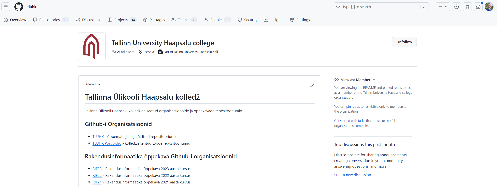

# Github

Σε αυτό το θέμα, θα μάθουμε για το GitHub, μια από τις πιο δημοφιλείς πλατφόρμες φιλοξενίας κώδικα στον κόσμο. Θα εξερευνήσουμε τα χαρακτηριστικά του, θα μάθουμε πώς να το χρησιμοποιούμε και θα ανακαλύψουμε πώς μπορεί να χρησιμοποιηθεί για τη συνεργασία μεταξύ των μελών μίας ομάδας σε έργα λογισμικού.

- [Github](#github)
  - [Μαθησιακά αποτελέσματα](#Μαθησιακά-αποτελέσματα)
  - [Τι είναι το Github;](#Τι-είναι-το-Github-;)
  - [Δημιουργώντας ένα λογαριασμό](#Δημιουργώντας-ένα-λογαριασμό)
  - [Github Desktop](#Github-Desktop)
  - [Ασκήσεις](#Ασκήσεις)

## Μαθησιακά αποτελέσματα

Αφού ολοκληρώσετε αυτό το θέμα, θα είστε σε θέση να:

- περιγράψετε τι είναι το GitHub και γιατί είναι δημοφιλές,
- δημιουργήσετε έναν λογαριασμό στο GitHub,
- περιηγηθείτε στο περιβάλλον εργασίας του GitHub.
- χρησιμοποιείτε το Github Desktop για να κλωνοποιήσετε, να δεσμεύσετε, να στείλετε και να αποσύρετε αλλαγές σε ένα αποθετήριο.
- χρησιμοποιήστε το Github Desktop για να δημιουργήσετε ένα branch, να κάνετε αλλαγές και να τον συγχωνεύσετε.

## Τι είναι το Github;

**GitHub** είναι μια διαδικτυακή πλατφόρμα που προσφέρει φιλοξενία για την ανάπτυξη λογισμικού και τον έλεγχο εκδόσεων με τη χρήση του Git. Παρέχει τις δυνατότητες κατανεμημένου ελέγχου εκδόσεων του Git μαζί με πρόσθετες λειτουργίες από το GitHub.

είναι μια διαδικτυακή πλατφόρμα που προσφέρει φιλοξενία για την ανάπτυξη λογισμικού και τον έλεγχο εκδόσεων με τη χρήση του Git. Παρέχει τις δυνατότητες κατανεμημένου ελέγχου εκδόσεων του Git μαζί με πρόσθετες λειτουργίες από το GitHub.

Ακολουθούν ορισμένες βασικές πτυχές και χαρακτηριστικά του GitHub:

- **Αποθετήρια**: Στην καρδιά του GitHub βρίσκεται το "repository" (συχνά συντομογραφούμενο ως "repo"). Ένα αποθετήριο περιέχει όλα τα αρχεία του έργου, συμπεριλαμβανομένου του ιστορικού των αλλαγών. Τα αποθετήρια μπορεί να είναι δημόσια (προσβάσιμα σε όλους), ιδιωτικά (περιορισμένη πρόσβαση) ή εσωτερικά του οργανισμού (ορατά στα μέλη ενός οργανισμού).
- **Forking**: Οι χρήστες μπορούν να «διακλαδώσουν» ένα αποθετήριο, δηλαδή να δημιουργήσουν ένα προσωπικό αντίγραφο του έργου ενός άλλου χρήστη. Αυτό επιτρέπει στους χρήστες να κάνουν αλλαγές χωρίς να επηρεάζουν το αρχικό έργο. Εάν γίνουν αλλαγές σε ένα fork, οι χρήστες μπορούν να στείλουν ένα pull request στον αρχικό ιδιοκτήτη του αποθετηρίου για να προτείνουν την ενσωμάτωση αυτών των αλλαγών.
- **Pull Requests (PRs)**: Οι Pull requests επιτρέπουν την ειδοποίηση άλλων για τις αλλαγές που έγιναν σε ένα αποθετήριο. Όταν αποστέλλεται ένα pull request, οι συντηρητές του έργου μπορούν να επανεξετάσουν το σύνολο των αλλαγών, να συζητήσουν πιθανές τροποποιήσεις και ακόμη και να προβούν σε επακόλουθες τροποποιήσεις πριν από τη συγχώνευση των αλλαγών στο αποθετήριο (repository).
- **Θέματα**: Το GitHub προσφέρει ένα σύστημα παρακολούθησης προβλημάτων, όπου οι χρήστες μπορούν να αναφέρουν σφάλματα, να ζητούν χαρακτηριστικά ή να συζητούν άλλες ερωτήσεις που σχετίζονται με το έργο. Επιπλέον, τα θέματα του GitHub χρησιμοποιούνται συχνά για την κατανομή/παρακολούθηση εργασιών και τη διαχείριση έργων.
- **Ενέργειες του GitHub**: Αυτή η λειτουργία επιτρέπει τη δημιουργία αυτοματοποιημένων ροών εργασίας για CI/CD (Continuous Integration/Continuous Deployment) και άλλες εργασίες που ενεργοποιούνται από συμβάντα απευθείας μέσα σε ένα αποθετήριο GitHub.
- **Σελίδες GitHub**: Οι χρήστες μπορούν να φιλοξενήσουν στατικούς ιστότοπους απευθείας από τα αποθετήριά τους στο GitHub. Αυτό είναι δημοφιλές για προσωπικά χαρτοφυλάκια, τεκμηρίωση έργων κ.λπ.
- **Gists**: Το gist είναι μια υπηρεσία που παρέχεται από το GitHub για την ανταλλαγή αποσπασμάτων κώδικα. Ενώ τα αποθετήρια προορίζονται για μεγαλύτερα έργα, τα gists προορίζονται για την ανταλλαγή μικρότερων κομματιών κώδικα.
- **Συνεργασία**: Το GitHub προσφέρει μια ποικιλία εργαλείων, όπως ανασκοπήσεις κώδικα, πίνακες διαχείρισης έργων και εκτεταμένες δυνατότητες συνεργασίας που διευκολύνουν την ομαδική εργασία.
- **Marketplace**: Η αγορά του GitHub προσφέρει μια σειρά εργαλείων και ενοποιήσεων που επεκτείνουν και βελτιώνουν τη λειτουργικότητα του GitHub, από υπηρεσίες συνεχούς ολοκλήρωσης έως ελεγκτές ποιότητας κώδικα και πολλά άλλα.
- **Ασφάλεια**: Το GitHub διαθέτει διάφορα χαρακτηριστικά ασφαλείας, όπως αυτοματοποιημένους ελέγχους ασφαλείας για γνωστές ευπάθειες στις εξαρτήσεις και το «Dependabot», το οποίο μπορεί να δημιουργήσει αυτόματα pull requests για την ενημέρωση των εξαρτήσεων σε νεότερες, ασφαλέστερες εκδόσεις.
- **Χορηγία**: Το GitHub εισήγαγε τη λειτουργία « Sponsor », η οποία επιτρέπει στους χρήστες να υποστηρίζουν οικονομικά τους αγαπημένους τους προγραμματιστές και έργα ανοικτού κώδικα στο GitHub.
- **Ενσωματώσεις**: Το GitHub μπορεί να ενσωματωθεί με ένα ευρύ φάσμα εργαλείων και πλατφορμών τρίτων, ενισχύοντας τη λειτουργικότητά του.
- **Έργα GitHub**: Αυτή η λειτουργία επιτρέπει στους χρήστες να δημιουργούν πίνακες τύπου Kanban για τη διαχείριση έργων και εργασιών.

## Δημιουργώντας ένα λογαριασμό

Για να δημιουργήσετε έναν λογαριασμό στο GitHub, μεταβείτε στη διεύθυνση [github.com](https://github.com/signup) και ακολουθήστε τις οδηγίες.

## Github Desktop

Το GitHub Desktop είναι μια γραφική διεπαφή χρήστη (GUI) για το Git, που δημιουργήθηκε από το GitHub. Στόχος του είναι να απλοποιήσει τη διαδικασία διαχείρισης των αποθετηρίων Git και των έργων σας στο GitHub με έναν πιο φιλικό προς το χρήστη τρόπο σε σύγκριση με τη χρήση του Git αποκλειστικά μέσω της γραμμής εντολών. Ακολουθούν ορισμένες βασικές πτυχές του GitHub Desktop:

- **Διαχείριση αποθετηρίου**:
  - Το GitHub Desktop επιτρέπει στους χρήστες να δημιουργούν νέα αποθετήρια, να κλωνοποιούν υπάρχοντα αποθετήρια και να διαχειρίζονται τοπικά αποθετήρια.
  - Παρέχει μια οπτική αναπαράσταση των αποθετηρίων σας, διευκολύνοντας την κατανόηση της δομής και των αλλαγών με την πάροδο του χρόνου.

- **Διακλάδωση και συγχώνευση**:
  - Οι χρήστες μπορούν να δημιουργούν, να αλλάζουν και να συγχωνεύουν κλάδους (branches) απευθείας από το περιβάλλον εργασίας, καθιστώντας τη διαδικασία διακλάδωσης πιο διαισθητική.
  - Παρέχει οπτικοποιήσεις για τις συγκρούσεις συγχώνευσης και βοηθά στην επίλυσή τους.

- **Ιστορικό δεσμεύσεων**:
  - Η εφαρμογή παρέχει ένα οπτικό ιστορικό των μεταβιβάσεων, το οποίο μπορεί να είναι χρήσιμο για την κατανόηση της εξέλιξης ενός έργου.
  - Οι χρήστες μπορούν εύκολα να δουν ποιος έκανε αλλαγές, ποιες αλλαγές έγιναν και πότε έγιναν αυτές οι αλλαγές.

- **Easy Commits and Pushes**:
  - GitHub Desktop simplifies the process of staging changes, committing them, and pushing them to GitHub.
  - It provides a simple form for entering commit messages and choosing which changes to include in a commit.

- **Ενσωμάτωση με το GitHub**:
  - Η εφαρμογή είναι στενά ενσωματωμένη με το GitHub, επιτρέποντας τον εύκολο συγχρονισμό μεταξύ των τοπικών αποθετηρίων και των αποθετηρίων του GitHub.
  - Οι χρήστες μπορούν να ανοίγουν αιτήματα έλξης, να προβάλλουν ζητήματα και πολλά άλλα, όλα μέσα από το περιβάλλον εργασίας του GitHub Desktop.

- **Cross-Platform**:
  - Το GitHub Desktop είναι διαθέσιμο για Windows και macOS, καθιστώντας το ένα ευέλικτο εργαλείο για ομάδες με μικτά λειτουργικά συστήματα.

- **Ανοιχτός κώδικας**:
  - Το GitHub Desktop είναι ανοικτού κώδικα, επιτρέποντας σε οποιονδήποτε να συμβάλει στην ανάπτυξή του ή να εξετάσει τον κώδικά του.

- **Βοήθεια για προχωρημένες λειτουργίες του Git**:
  - Ενώ το GitHub Desktop επικεντρώνεται στην απλοποίηση των βασικών λειτουργιών του Git, παρέχει επίσης βοήθεια για πιο προηγμένα χαρακτηριστικά του Git, λειτουργώντας ως γέφυρα μεταξύ της γραμμής εντολών και των λειτουργιών GUI.

Συνολικά, το GitHub Desktop έχει σχεδιαστεί για προγραμματιστές που προτιμούν ένα γραφικό περιβάλλον εργασίας και μπορεί να είναι ιδιαίτερα χρήσιμο για όσους είναι νέοι στο Git ή προτιμούν τις οπτικές αλληλεπιδράσεις από τις αλληλεπιδράσεις της γραμμής εντολών.

## Ασκήσεις

Πηγαίνετε στο [github.com](https://www.github.com), δημιουργήστε έναν λογαριασμό (αν δεν έχετε ακόμα) ή συνδεθείτε (αν έχετε ήδη).

Εξερευνήστε το περιβάλλον εργασίας του GitHub. Εξοικειωθείτε με τα διάφορα χαρακτηριστικά και τις ενότητες του ιστότοπου.

Στη συνέχεια, κάντε τα ακόλουθα:

- εγκαταστήστε το `Github Desktop` στον υπολογιστή σας
- δημιουργήστε ένα νέο αποθετήριο στο `Github`
- κλωνοποιήστε το αποθετήριο στον υπολογιστή σας
- να προσθέσετε ένα νέο αρχείο στο αποθετήριο
- δεσμεύστε τις αλλαγές
- προώθηση των αλλαγών στο απομακρυσμένο αποθετήριο
- δημιουργήστε ένα νέο `Issue` στο αποθετήριο σας στο `Github` και αναθέστε το στον εαυτό σας

