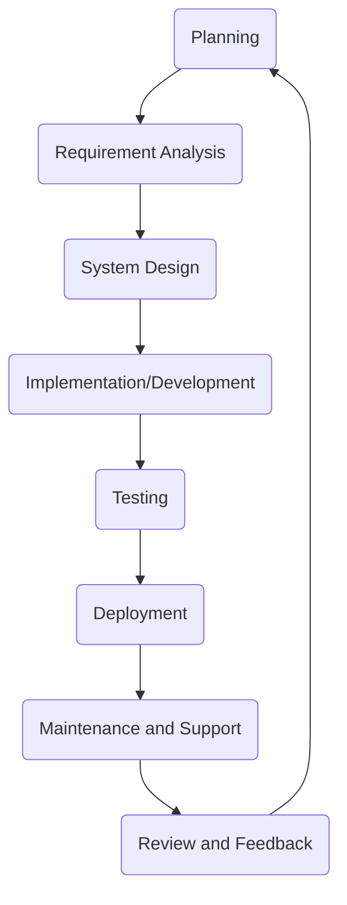

# Κύκλος ζωής ανάπτυξης λογισμικού (SDLC):

- [Κύκλος ζωής ανάπτυξης λογισμικού (SDLC):](#Κύκλος-ζωής-ανάπτυξης-λογισμικού-sdlc)
  - [Μαθησιακά αποτελέσματα:](#Μαθησιακά-αποτελέσματα)
  - [Χαρακτηριστικές φάσεις SDLC:](#Χαρακτηριστικές-φάσεις-SDLC)
  - [Σπουδαιότητα του SDLC:](#Σπουδαιότητα-του-SDLC)
  - [Συνήθη μοντέλα SDLC:](#Συνήθη-μοντέλα-SDLC)
    - [**Waterfall Μοντέλο:**](#Waterfall-Μοντέλο)
    - [**Lean**](#lean)
    - [**Spiral Μοντέλο:**](#Spiral-Μοντέλο)
    - [**Agile Μοντέλο:**](#agile-Μοντέλο)
    - [**Ανάπτυξη με γνώμονα τα χαρακτηριστικά  (FDD)**](#Ανάπτυξη-με-γνώμονα-τα-χαρακτηριστικά-fdd)
    - [**Extreme Προγραμματισμός (XP)**](#Extreme-Προγραμματισμός-(XP))
    - [**Kanban:**](#kanban)
    - [**Scrum:**](#scrum)
  - [Ασκήσεις και εργασίες](#Ασκήσεις-και-εργασίες)

## Μαθησιακά αποτελέσματα:

Αφού ολοκληρώσετε αυτή τη θεματική ενότητα, θα είστε σε θέση να:

- κατανοήσετε τον κύκλο ζωής της ανάπτυξης λογισμικού (SDLC),
- να προσδιορίσετε τις διάφορες φάσεις του SDLC, 
- περιγράψετε τη σημασία του SDLC,
- προσδιορίσετε τα κοινά μοντέλα SDLC,
- εφαρμόζουν τις αρχές του SDLC στην ανάπτυξη λογισμικού.

Ο κύκλος ζωής ανάπτυξης λογισμικού (SDLC) είναι μια συστηματική διαδικασία για τον σχεδιασμό, τη δημιουργία, τη δοκιμή, την ανάπτυξη και τη συντήρηση λογισμικού. Καθορίζει τα στάδια και τις εργασίες που εμπλέκονται στην παραγωγή λογισμικού από την αρχή μέχρι την απόσυρση.

## Χαρακτηριστικές φάσεις SDLC:

Ο Κύκλος Ζωής Ανάπτυξης Λογισμικού (SDLC) είναι μια δομημένη διαδικασία που ορίζει τις φάσεις ή τα βήματα που εμπλέκονται στην παραγωγή λογισμικού. Αν και υπάρχουν διαφορετικά μοντέλα ή πλαίσια για το SDLC, πολλά μοιράζονται κοινές φάσεις. Ακολουθεί μια επισκόπηση των τυπικών βημάτων που εμπλέκονται:

1. **Σχεδιασμός:**
   - Καθορίστε το πεδίο εφαρμογής του έργου.
   - Προσδιορισμός πιθανών κινδύνων, περιορισμών και πόρων.
   - Ανάπτυξη σχεδίου έργου, συμπεριλαμβανομένων χρονοδιαγραμμάτων, ορόσημων και εκτιμήσεων προϋπολογισμού.
   - Έρευνα χρηστών για την κατανόηση των αναγκών και των προσδοκιών των χρηστών.
2. **Ανάλυση απαιτήσεων:**
   - Συγκέντρωση και τεκμηρίωση των αναγκών και των προδιαγραφών των ενδιαφερομένων μερών (* τελικοί χρήστες, πελάτες κ.λπ.*).
   - Αναλύστε τη δυνατότητα υλοποίησης των απαιτήσεων.
   - Ιεράρχηση και οριστικοποίηση της λίστας των απαιτήσεων.
3. **Σχεδιασμός συστήματος:**
   - Μετατροπή των απαιτήσεων σε προδιαγραφές συστήματος.
   - Σχεδιασμός της αρχιτεκτονικής και του πλαισίου του συστήματος.
   - Δημιουργία εγγράφων σχεδιασμού υψηλού επιπέδου και αναλυτικής μελέτης.
   - Επιλογή των κατάλληλων τεχνολογιών, πλατφορμών και εργαλείων.
4. **Υλοποίηση/Ανάπτυξη:**
   - Γράψτε τον πραγματικό κώδικα για το λογισμικό.
   - Μεταφράστε την τεκμηρίωση σχεδιασμού σε λειτουργικό λογισμικό.
   - Ενσωμάτωση διαφόρων στοιχείων και διασφάλιση της ομαλής τους λειτουργίας.
5. **Testing:**
   - Επαληθεύστε ότι το λογισμικό πληρεί τις απαιτήσεις.
   - Εντοπίστε και διορθώστε σφάλματα, λάθη και ασυνέπειες.
   - Χρήση διαφόρων μεθόδων δοκιμών, όπως δοκιμές μονάδας, δοκιμές ενσωμάτωσης, δοκιμές συστήματος, δοκιμές αποδοχής κ.λπ.
   - Επικυρώστε τη λειτουργικότητα, τις επιδόσεις, την ασφάλεια και τη χρηστικότητα του λογισμικού.
6. **Εφαρμογή:**
   - Προετοιμάστε το περιβάλλον για την εκκίνηση του λογισμικού.
   - Εγκαταστήστε και ρυθμίστε το λογισμικό στο περιβάλλον λειτουργίας.
   - Παροχή της απαραίτητης κατάρτισης στους τελικούς χρήστες, εάν απαιτείται.
   - Παρακολουθήστε την απόδοση του λογισμικού και διασφαλίστε την ομαλή λειτουργία.
7. **Συντήρηση και υποστήριξη:**
   - Αντιμετώπιση τυχόν ζητημάτων ή σφαλμάτων που προκύπτουν μετά την ανάπτυξη.
   - Παρέχετε ενημερώσεις, διορθώσεις ή βελτιώσεις με βάση τα σχόλια των χρηστών.
   - Διασφαλίστε ότι το λογισμικό παραμένει λειτουργικό, αποτελεσματικό και σχετικό με την πάροδο του χρόνου.
   - Αντιμετώπιση τυχόν τρωτών σημείων ασφαλείας ή ζητημάτων συμβατότητας που ενδέχεται να προκύψουν.
8. **Ανασκόπηση και ανατροφοδότηση:**
   - Συγκεντρώστε ανατροφοδότηση από τα ενδιαφερόμενα μέρη και τους τελικούς χρήστες.
   - Αναλύστε τις επιδόσεις του λογισμικού και εντοπίστε περιοχές για βελτίωση.
   - Σχεδιάστε την επόμενη επανάληψη ή έκδοση του λογισμικού.

Καθεμία από αυτές τις φάσεις μπορεί να είναι επαναληπτική, ιδίως σε ευέλικτα ή σπειροειδή μοντέλα, όπου το λογισμικό αναπτύσσεται σε κύκλους ή επαναλήψεις. Τα ακριβή βήματα και η αλληλουχία τους μπορεί να ποικίλλουν ανάλογα με το μοντέλο SDLC που επιλέγεται, τις οργανωτικές διαδικασίες και τη φύση του έργου. Ωστόσο, ο στόχος παραμένει σταθερός: η παραγωγή λογισμικού υψηλής ποιότητας που ευθυγραμμίζεται με τις ανάγκες και τις προσδοκίες των χρηστών με οργανωμένο και αποτελεσματικό τρόπο.

## Σπουδαιότητα του SDLC:

- **Δομημένη διαδικασία:** Το SDLC προσφέρει μια δομημένη προσέγγιση στην ανάπτυξη λογισμικού, διασφαλίζοντας ότι δεν παραλείπονται κρίσιμα βήματα.
- **Διασφάλιση ποιότητας:** Κάθε φάση του SDLC έχει συγκεκριμένα παραδοτέα και διαδικασίες αναθεώρησης, που οδηγούν σε καλύτερη ποιότητα λογισμικού.
- **Διαχείριση κινδύνων:** Ο έγκαιρος εντοπισμός ζητημάτων ή κινδύνων επιτρέπει τον έγκαιρο μετριασμό τους.
- **Διαχείριση έργου:** Το SDLC προσφέρει ένα σαφές πλαίσιο για τους διαχειριστές έργων ώστε να παρακολουθούν την πρόοδο, να κατανέμουν τους πόρους και να τηρούν τους προϋπολογισμούς.
- **Επικοινωνία με τα ενδιαφερόμενα μέρη:** Καθορίζοντας σαφείς φάσεις και παραδοτέα, τα ενδιαφερόμενα μέρη διατηρούνται ενήμερα σχετικά με την πρόοδο και τα αναμενόμενα αποτελέσματα.
- **Αποδοτικότητα και σχέση κόστους-αποτελεσματικότητας:** Με τη συστηματική αντιμετώπιση της διαδικασίας ανάπτυξης λογισμικού, ελαχιστοποιείται η σπατάλη και βελτιώνεται η αποδοτικότητα.
- **Τεκμηρίωση:** Η σωστή τεκμηρίωση αποτελεί αναπόσπαστο μέρος του SDLC, διασφαλίζοντας τη διατήρηση της γνώσης και την κατανόηση των λεπτομερειών του συστήματος.

## Συνήθη μοντέλα SDLC:

### **Waterfall Μοντέλο:**

- **Περιγραφή:** A linear and sequential approach where each phase must be completed before the next one starts. It's the earliest SDLC approach.
- **Πλεονεκτήματα:** Clear structure, simple to understand, well-defined stages.
- **Μειονεκτήματα:** Δύσκολο να γίνουν αλλαγές μετά την ολοκλήρωση της φάσης, ακατάλληλο για πολύπλοκα έργα.
  
### **Lean**

- **Περιγραφή:** Προερχόμενη από τη μεταποίηση, εστιάζει στη βελτιστοποίηση των πόρων και την παράδοση αξίας στον πελάτη. Στοχεύει στην αποκοπή κάθε «σπατάλης» από τη διαδικασία.
- **Πλεονεκτήματα:** Αποτελεσματική χρήση των πόρων, επικεντρώνεται στην παροχή αξίας.
- **Μειονεκτήματα:** Μπορεί να παραβλέψει τις απαραίτητες εργασίες ως «σπατάλη», απαιτεί βαθιά κατανόηση για τη σωστή εφαρμογή.

### **Spiral Μοντέλο:**

- **Περιγραφή:** Συνδυάζει τη φάση σχεδιασμού του μοντέλου καταρράκτη (Waterfall) με την επαναληπτική φιλοσοφία της δημιουργίας πρωτοτύπων. Επικεντρώνεται στην αξιολόγηση του κινδύνου σε κάθε σπειροειδή πορεία.
- **Πλεονεκτήματα:** Focus on risk management, flexibility in design and requirements.
- **Μειονεκτήματα:** Can be expensive, requires risk assessment expertise.

### **Agile Μοντέλο:**

- **Περιγραφή:** Μια επαναληπτική προσέγγιση στην παράδοση λογισμικού που δημιουργεί λογισμικό σταδιακά, με έμφαση στην ανατροφοδότηση από τον πελάτη και στις γρήγορες επαναλήψεις.
- **Πλεονεκτήματα:** Ευέλικτη, προωθεί την επαναληπτική ανατροφοδότηση, ενθαρρύνει τη συμμετοχή του πελάτη.
- **Μειονεκτήματα:** Λιγότερη προβλεψιμότητα, μπορεί να είναι δύσκολο να κατανοήσουν όσοι έχουν συνηθίσει τις παραδοσιακές μεθόδους.

### **Ανάπτυξη με γνώμονα τα χαρακτηριστικά (FDD)**

- **Περιγραφή:** Μια επαναληπτική και σταδιακή διαδικασία ανάπτυξης λογισμικού που καθοδηγείται από λίστες χαρακτηριστικών.
- **Πλεονεκτήματα:** Επικεντρωθείτε στην οικοδόμηση και την παροχή απτών λειτουργιών με αξία για τον πελάτη.
- **Μειονεκτήματα:** Δεν είναι τόσο ευέλικτη όσο άλλες ευέλικτες μεθοδολογίες, απαιτεί λεπτομερή τεκμηρίωση.

### **Extreme Programming (XP)**

- **Περιγραφή:** Ένα ευέλικτο πλαίσιο που δίνει έμφαση στην ικανοποίηση του πελάτη, με συχνές «κυκλοφορίες» σε σύντομους κύκλους ανάπτυξης που αποσκοπούν στη βελτίωση της παραγωγικότητας και στην εισαγωγή σημείων ελέγχου.
- **Πλεονεκτήματα:** Δίνει έμφαση στην ποιότητα του κώδικα, ενθαρρύνει τη συμμετοχή του πελάτη.
- **Μειονεκτήματα::** Απαιτεί εκτεταμένη συμμετοχή του πελάτη, μπορεί να είναι έντονη για τους προγραμματιστές.
- 
### **Kanban:**

- **Περιγραφή:** Μια οπτική προσέγγιση για τη διαχείριση διαδικασιών, που λαμβάνει στοιχεία από την λιτή παραγωγή και δίνει έμφαση στην παράδοση just-in-time.
- **Πλεονεκτήματα:** Ευελιξία, συνεχής παράδοση, οπτικός χαρακτήρας που βοηθά στον εντοπισμό σημείων συμφόρησης.
- **Μειονεκτήματα:** Λιγότερο δομημένο, μπορεί να οδηγήσει σε « συρρίκνωση» του πεδίου εφαρμογής αν δεν γίνει σωστή διαχείριση.

### **Scrum:**

- **Περιγραφή:** Ένας τύπος ευέλικτης μεθοδολογίας που οργανώνει την εργασία σε κύκλους γνωστούς ως «Sprints», οι οποίοι συνήθως διαρκούν 2-4 εβδομάδες.
- **Πλεονεκτήματα:** Τακτικές παραδόσεις προϊόντων, υψηλή προβολή, προσαρμοστικότητα.
- **Μειονεκτήματα:** Απαιτεί έμπειρα μέλη της ομάδας, το πεδίο εφαρμογής μπορεί μερικές φορές να είναι πολύ ευέλικτο.

Συμπερασματικά, η επιλογή του πλαισίου SDLC εξαρτάται συχνά από τη φύση του έργου, τις οργανωτικές προτιμήσεις, το μέγεθος της ομάδας, το πεδίο εφαρμογής του έργου και άλλους παράγοντες. Απώτερος στόχος είναι η παραγωγή λογισμικού υψηλής ποιότητας που ανταποκρίνεται στις προσδοκίες των χρηστών, διατηρώντας παράλληλα ένα χρονικό και δημοσιονομικό πλαίσιο.

## Ασκήσεις και εργασίες

