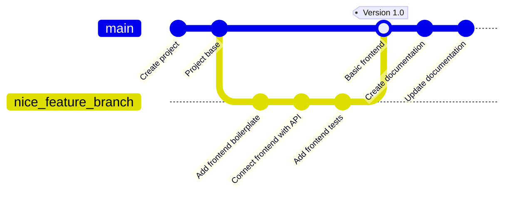

# Έλεγχος εκδόσεων (Version Control)

- [Version Control](#version-control)
  - [Μαθησιακά αποτελέσματα](#Μαθησιακά-αποτελέσματα)
  - [Τι είναι ο έλεγχος εκδόσεων (Version Control);](#Τι-είναι-το-Version-Control)
  - [Γιατί είναι σημαντικός ο έλεγχος εκδόσεων;](#why-is-version-control-important)
  - [Σύντομη ιστορία του ελέγχου εκδόσεων](#Σύντομη-ιστορία-του-ελέγχου-εκδόσεων)
  - [Centralized vs. Distributed version control systems](#centralized-vs-distributed-version-control-systems)
    - [Centralized Version Control Systems (CVCS):](#centralized-version-control-systems-cvcs)
    - [Distributed Version Control Systems (DVCS):](#distributed-version-control-systems-dvcs)
    - [Comparison:](#comparison)
  - [Exercises and Assignments](#exercises-and-assignments)

## Μαθησιακά αποτελέσματα

Αφού ολοκληρώσετε αυτό το θέμα, θα είστε σε θέση να:

- να περιγράψετε τι είναι ο έλεγχος εκδόσεων και γιατί είναι σημαντικός,
- να περιγράψετε διαφορετικούς τύπους συστημάτων ελέγχου εκδόσεων,
- να συγκρίνετε και να αντιπαραβάλλετε κεντρικά και κατανεμημένα συστήματα ελέγχου εκδόσεων,

## Τι είναι ο έλεγχος εκδόσεων (Version Control);

Το να γράφετε μόνοι σας σε ένα έγγραφο και να κάνετε αλλαγές μπορεί να μην είναι απαραίτητο να παρακολουθείτε πότε και ποιες αλλαγές έγιναν. Ωστόσο, η συνεργασία με άλλους που κάνουν αλλαγές στο ίδιο έγγραφο μπορεί να γίνει ζωτικής σημασίας. Ειδικά αν το έγγραφο μεταβιβάζεται μπρος-πίσω και μπορεί να τροποποιηθεί από πολλούς διαφορετικούς ανθρώπους. Πώς γνωρίζουμε **ποια είναι η τελευταία έκδοση; ** Πώς γνωρίζουμε **ποιος έκανε την τελευταία αλλαγή; ** Πώς γνωρίζουμε **τι άλλαξε; ** Οι εφαρμογές συχνά αποτελούνται από πολλά αρχεία και οι αλλαγές στον κώδικα μπορεί να είναι πολύ περίπλοκες. Η διατήρηση μιας επισκόπησης των αλλαγών και του ιστορικού σε αυτά τα αρχεία είναι ζωτικής σημασίας για τη διασφάλιση της ποιότητας και της σταθερότητας του λογισμικού.

Ψάχνοντας στο διαδίκτυο για τον έλεγχο εκδόσεων βρίσκει κανείς συχνά μια παρόμοια εικόνα που απεικονίζει το ιστορικό και τις αλλαγές του κώδικα:

Ο **Έλεγχος εκδόσεων**, επίσης γνωστός ως **Διαχείριση πηγαίου κώδικα** (*SCM*), είναι ένα σύστημα που παρακολουθεί και διαχειρίζεται τις αλλαγές σε αρχεία, καταλόγους και βάσεις κώδικα με την πάροδο του χρόνου. Επιτρέπει σε πολλά άτομα να εργάζονται σε ένα ενιαίο έργο χωρίς να συγκρούονται μεταξύ τους και διατηρεί το ιστορικό κάθε τροποποίησης.

Στις μέρες μας, ο έλεγχος εκδόσεων αποτελεί ουσιαστικό μέρος της διαδικασίας ανάπτυξης λογισμικού. Χρησιμοποιείται από τους προγραμματιστές για να συνεργάζονται σε έργα, να παρακολουθούν τις αλλαγές και να διατηρούν το ιστορικό της εργασίας τους. Χρησιμοποιείται επίσης από εταιρείες για να διαχειρίζονται τις βάσεις κωδικών τους και να διασφαλίζουν ότι οι αλλαγές γίνονται με ελεγχόμενο και ασφαλή τρόπο.

## Γιατί είναι σημαντικός ο έλεγχος εκδόσεων;

Ο έλεγχος εκδόσεων είναι σημαντικός για διάφορους λόγους:

- **Ιστορικό & διαδρομή ελέγχου**: Ο έλεγχος εκδόσεων παρέχει ένα λεπτομερές ιστορικό των αλλαγών που έγιναν στον κώδικα. Αυτό βοηθά στην κατανόηση του τρόπου με τον οποίο ο κώδικας έχει εξελιχθεί με την πάροδο του χρόνου, προσδιορίζοντας πότε έγινε μια συγκεκριμένη αλλαγή και από ποιον.
- **Συνεργασία**: Πολλοί προγραμματιστές μπορούν να εργάζονται ταυτόχρονα στο ίδιο έργο χωρίς να ενοχλούν ο ένας τον άλλον. Διαφορετικοί προγραμματιστές μπορούν να εργάζονται σε ξεχωριστά χαρακτηριστικά ή διορθώσεις σφαλμάτων και στη συνέχεια να συγχωνεύουν τις αλλαγές τους πίσω στην κύρια βάση κώδικα χωρίς συγκρούσεις.
- **Επαναφορά**: Λάθη συμβαίνουν. Με τον έλεγχο εκδόσεων, εάν μια νέα αλλαγή προκαλέσει σφάλμα ή πρόβλημα, οι προγραμματιστές μπορούν εύκολα να επανέλθουν σε μια προηγούμενη κατάσταση του κώδικα, ουσιαστικά «επαναφέροντας» την προβληματική αλλαγή.
- **Διακλάδωση & συγχώνευση**: Οι προγραμματιστές μπορούν να δημιουργούν κλάδους για να εργάζονται σε νέα χαρακτηριστικά, διορθώσεις σφαλμάτων ή πειράματα χωρίς να επηρεάζουν την κύρια ή σταθερή έκδοση του λογισμικού. Μόλις είναι έτοιμες, αυτές οι αλλαγές μπορούν να συγχωνευθούν πίσω στον κύριο κλάδο.
- **Backup**: Αν και δεν αντικαθιστούν ένα κατάλληλο σύστημα δημιουργίας αντιγράφων ασφαλείας, τα συστήματα ελέγχου εκδόσεων μπορούν να λειτουργήσουν ως ένα πρόσθετο επίπεδο δημιουργίας αντιγράφων ασφαλείας. Εάν συμβεί κάτι στον τοπικό υπολογιστή ενός προγραμματιστή, ο κώδικας μπορεί εύκολα να ανακτηθεί από το αποθετήριο ελέγχου εκδόσεων.
- **Τεκμηρίωση (Documentation)**: Τα μηνύματα δέσμευσης στον έλεγχο εκδόσεων παρέχουν μια χρονολογική διαδρομή τεκμηρίωσης. Μπορούν να δώσουν ένα πλαίσιο σχετικά με το γιατί ορισμένες αποφάσεις ελήφθησαν σε συγκεκριμένες χρονικές στιγμές.
- **Ανασκόπηση κώδικα**: Τα συστήματα ελέγχου εκδόσεων, ειδικά όταν συνδυάζονται με πλατφόρμες όπως το *GitHub* ή το *GitLab*, διευκολύνουν τις αναθεωρήσεις κώδικα επιτρέποντας σε άλλους προγραμματιστές να αναθεωρούν, να σχολιάζουν και να προτείνουν τροποποιήσεις στον κώδικα πριν από τη συγχώνευσή του.
- **Διαχείριση έκδοσης**: Ο έλεγχος εκδόσεων βοηθά στη διαχείριση των εκδόσεων και των διορθώσεων. Οι προγραμματιστές μπορούν να επισημάνουν ορισμένα σημεία στο ιστορικό του κώδικά τους ως συγκεκριμένες εκδόσεις του προϊόντος. Αυτό διευκολύνει την παρακολούθηση των ενημερώσεων και των διορθώσεων.
- **Υπευθυνότητα**: Με μια σωστή καταγραφή του ποιος έκανε ποιες αλλαγές και πότε, υπάρχει μια σαφής καταγραφή της λογοδοσίας. Αυτό είναι ιδιαίτερα χρήσιμο σε ομαδικές ρυθμίσεις για την κατανόηση των συνεισφορών και για να διασφαλιστεί ότι οι αλλαγές στον κώδικα μπορούν να εντοπιστούν σε συγκεκριμένα άτομα.
- **Παράλληλη ανάπτυξη**: Τα συστήματα ελέγχου εκδόσεων επιτρέπουν τη δυνατότητα παράλληλης ανάπτυξης, όπου πολλαπλές εκδόσεις μιας εφαρμογής λογισμικού μπορούν να αναπτυχθούν ταυτόχρονα.

Συνοψίζοντας, ο έλεγχος εκδόσεων αποτελεί ακρογωνιαίο λίθο των σύγχρονων πρακτικών ανάπτυξης λογισμικού. Εξασφαλίζει την ομαλότερη συνεργασία, παρέχει δικλείδες ασφαλείας για λάθη και διατηρεί ένα σαφές και ελέγξιμο αρχείο του τρόπου με τον οποίο εξελίσσεται ένα έργο λογισμικού με την πάροδο του χρόνου. Είτε είστε σόλο προγραμματιστής είτε μέλος μιας μεγάλης ομάδας, η χρήση του ελέγχου εκδόσεων είναι απαραίτητη σήμερα.

## Σύντομη ιστορία του ελέγχου εκδόσεων

Ο έλεγχος εκδόσεων έχει εξελιχθεί με την πάροδο των ετών από απλές χειροκίνητες μεθόδους σε εξελιγμένα κατανεμημένα συστήματα. Ακολουθεί μια σύντομη επισκόπηση της ιστορίας του:

1. **Χειροκίνητος έλεγχος εκδόσεων (πριν από τη δεκαετία του 1970)**:
   - Πριν από τα κατάλληλα συστήματα ελέγχου εκδόσεων (VCS), οι προγραμματιστές έφτιαχναν αντίγραφα του κώδικά τους και τα αποθήκευαν σε ξεχωριστούς καταλόγους, επισημαίνοντάς τα συχνά με ημερομηνίες ή αριθμούς εκδόσεων.
   - Όπως μπορεί κανείς να φανταστεί, η μέθοδος αυτή ήταν επιρρεπής σε σφάλματα, δεν είχε δυνατότητα κλιμάκωσης και καθιστούσε δύσκολη τη συνεργασία.

2. **Κεντρικά συστήματα ελέγχου εκδόσεων (CVCS, δεκαετία 1970-1990)**:
   - Η βασική ιδέα πίσω από το CVCS είναι η ύπαρξη ενός ενιαίου κεντρικού αποθετηρίου όπου παρακολουθούνται όλες οι αλλαγές.
   - **RCS (Σύστημα ελέγχου αναθεώρησης)**: Το RCS παρουσιάστηκε στα τέλη της δεκαετίας του 1970 και ήταν ένα από τα πρώτα εργαλεία για τη διαχείριση και την παρακολούθηση των αναθεωρήσεων μεμονωμένων αρχείων. Χρησιμοποιούσε έναν απλό μηχανισμό αποθήκευσης της τελευταίας έκδοσης και των διαφορών μεταξύ των εκδόσεων.
   - **SCCS (Σύστημα ελέγχου πηγαίου κώδικα)**: Ένα άλλο πρώιμο σύστημα, παράλληλο χρονικά με το RCS, αλλά με κάποια διαφορετικά χαρακτηριστικά.
   - **CVS (Σύστημα ταυτόχρονων εκδόσεων)**: Το CVS εμφανίστηκε τη δεκαετία του 1980, ήταν μια βελτίωση σε σχέση με το RCS και επέτρεπε σε πολλούς προγραμματιστές να εργάζονται ταυτόχρονα σε ένα έργο.
   - **Perforce**: Ιδιόκτητο λογισμικό που έγινε δημοφιλές σε πολλούς μεγάλους οργανισμούς τη δεκαετία του 1990.
   - **Subversion (SVN)**: Παρουσιάστηκε το 2000 ως βελτίωση του CVS, προσφέροντας καλύτερη διαχείριση κλάδων, ατομικές δεσμεύσεις και ένα πιο συνεπές μοντέλο δεδομένων.

3. **Κατανεμημένα συστήματα ελέγχου εκδόσεων (DVCS, δεκαετία 2000-σήμερα)**:
   - Στο DVCS, κάθε προγραμματιστής έχει το δικό του τοπικό αντίγραφο ολόκληρου του αποθετηρίου, όχι μόνο των αρχείων εργασίας. Αυτό διευκολύνει πιο ευέλικτες ροές εργασίας.
   - **BitKeeper**: Στις αρχές της δεκαετίας του 2000, το BitKeeper ήταν ένα από τα πρώτα DVCS. Ήταν ιδιόκτητο, αλλά χρησιμοποιήθηκε από τους προγραμματιστές του πυρήνα του Linux για ένα διάστημα.
   - **Git**: Το Git δημιουργήθηκε από τον Linus Torvalds το 2005 και αναπτύχθηκε από την ανάγκη για ένα ελεύθερο DVCS ανοιχτού κώδικα μετά τη διάλυση της σχέσης μεταξύ της κοινότητας ανάπτυξης του Linux και του BitKeeper. Το Git δίνει έμφαση στην ταχύτητα, την ακεραιότητα των δεδομένων και την υποστήριξη κατανεμημένων, μη γραμμικών ροών εργασίας.
   - **Mercurial**: Το Mercurial εμφανίστηκε επίσης το 2005 και ήταν μια άλλη απάντηση στην ανάγκη για ένα DVCS ανοιχτού κώδικα. Συχνά επαινείται για την απλότητα και την ευκολία χρήσης του.
   - **Bazaar**: Αναπτύχθηκε από την Canonical και διέθετε μια ευέλικτη αρχιτεκτονική που επέτρεπε τόσο τον κεντρικό όσο και τον κατανεμημένο έλεγχο εκδόσεων.
   - **Fossil**: Όχι μόνο ένα DVCS, αλλά και ολοκληρωμένη παρακολούθηση σφαλμάτων και ένα wiki, τυλιγμένο σε ένα ενιαίο συνεκτικό πακέτο.

4. **Σύγχρονη εποχή (δεκαετία 2010-σήμερα)**:
   - Πλατφόρμες όπως το **GitHub, το GitLab και το Bitbucket** έχουν ενισχύσει τις συνεργατικές πτυχές του ελέγχου εκδόσεων, εισάγοντας χαρακτηριστικά όπως τα Pull Requests, οι Code Reviews, η συνεχής ενσωμάτωση και ο κοινωνικός προγραμματισμός.
   - Η άνοδος αυτών των πλατφορμών έχει καταστήσει το Git το κυρίαρχο σύστημα ελέγχου εκδόσεων, δεδομένης της ενσωμάτωσης και του κεντρικού του ρόλου σε αυτές τις πλατφόρμες.

Αν και αυτή είναι μια συνοπτική επισκόπηση, η ιστορία του ελέγχου εκδόσεων είναι μια απόδειξη των συνεχών προσπαθειών της κοινότητας λογισμικού για τη βελτιστοποίηση της συνεργατικής ανάπτυξης, τη διασφάλιση της ακεραιότητας των δεδομένων και τον εξορθολογισμό των ροών εργασίας.

## Κεντρικοποιημένα vs. Κατανεμημένα συστήματα ελέγχου εκδόσεων

Στη συνέχεια, ας εμβαθύνουμε σε μια επισκόπηση και σύγκριση των Κεντρικών και Κατανεμημένων Συστημάτων Ελέγχου Έκδοσης (VCS):

### Συστήματα κεντρικού ελέγχου εκδόσεων (CVCS):

**Σύνοψη**:
1. **Ενιαίο αποθετήριο**: Στο CVCS, υπάρχει ένα ενιαίο, κεντρικό αποθετήριο σε έναν διακομιστή. Οι προγραμματιστές λαμβάνουν την τελευταία έκδοση από αυτό το κεντρικό αποθετήριο και δεσμεύουν τις αλλαγές σε αυτό.
2. **Αντίγραφο εργασίας**: Οι προγραμματιστές λαμβάνουν μόνο το τελευταίο στιγμιότυπο (ή αντίγραφο εργασίας) της βάσης κώδικα, όχι ολόκληρο το ιστορικό εκδόσεων.
3. **Κεντρική Αρχή**: Όλες οι λειτουργίες όπως η διακλάδωση και η συγχώνευση γίνονται κεντρικά στο αποθετήριο.
4. **Παραδείγματα**: Subversion (SVN), Concurrent Versions System (CVS), Perforce.

**Πλεονεκτήματα**:
1. **Διοικητικός έλεγχος**: Ευκολότερη επιβολή ελέγχων πρόσβασης και δικαιωμάτων.
2. **Γραμμική ιστορία**: Η διατήρηση ενός γραμμικού ιστορικού αλλαγών είναι απλή.
3. **Ευκολότερη εγκατάσταση**: Γενικά απλούστερο στη ρύθμιση και τη διαμόρφωση από το DVCS.
4. **Κεντρικό εφεδρικό αντίγραφο ασφαλείας**: Ο κεντρικός διακομιστής μπορεί να δημιουργήσει αντίγραφα ασφαλείας για την αποφυγή απώλειας δεδομένων.

**Μειονεκτήματα**:
1. **Μοναδικό σημείο αποτυχίας**: Εάν ο κεντρικός διακομιστής καταρρεύσει και δεν υπάρχουν αντίγραφα ασφαλείας, το ιστορικό του κώδικα μπορεί να χαθεί.
2. **Εξάρτηση από το δίκτυο**: Οι περισσότερες λειτουργίες, όπως η δέσμευση αλλαγών, απαιτούν σύνδεση με το κεντρικό αποθετήριο, επιβραδύνοντας ενδεχομένως τις ροές εργασίας.
3. **Συγκρούσεις συγχώνευσης**: Καθώς όλοι δεσμεύουν στο κεντρικό αποθετήριο, η πιθανότητα συγκρούσεων συγχώνευσης μπορεί να είναι μεγαλύτερη, ειδικά σε μεγάλες ομάδες.

### Κατανεμημένα συστήματα ελέγχου εκδόσεων (DVCS):

**Επισκόπηση**:
1. **Πολλαπλά αποθετήρια**: Κάθε προγραμματιστής έχει το δικό του τοπικό αποθετήριο που περιέχει ολόκληρη την κωδικοποιημένη βάση και το πλήρες ιστορικό της.
2. **Ιστορικό πλήρους έκδοσης**: Οι προγραμματιστές κλωνοποιούν ολόκληρο το αποθετήριο, όχι μόνο το τελευταίο στιγμιότυπο.
3. **Peer-to-Peer**: Η συγχώνευση και η διακλάδωση μπορούν να γίνουν τοπικά. Οι δεσμεύσεις γίνονται στο τοπικό αποθετήριο και στη συνέχεια συγχρονίζονται (προωθούνται) σε ένα κεντρικό ή απομακρυσμένο αποθετήριο.
4. **Παραδείγματα**: Git, Mercurial, Bazaar, Fossil.

**Πλεονεκτήματα**:
1. **Γρήγορη λειτουργία**: Δεδομένου ότι οι περισσότερες λειτουργίες (commit, branch, merge) είναι τοπικές, είναι ταχύτερες και δεν βασίζονται σε σύνδεση δικτύου.
2. **Εφεδρικός πλεονασμός**: Κάθε κλώνος του αποθετηρίου λειτουργεί ως πλήρες αντίγραφο ασφαλείας, μειώνοντας τον κίνδυνο απώλειας δεδομένων.
3. **Ευέλικτες ροές εργασίας**: Οι προγραμματιστές μπορούν να δεσμεύουν αλλαγές τοπικά, επιτρέποντας πιο ευέλικτες ροές εργασίας και συχνές δεσμεύσεις χωρίς να διαταράσσεται η κύρια βάση κώδικα.
4. **Διαχείριση υποκλάδων**: Η διακλάδωση και η συγχώνευση είναι συνήθως πιο εξελιγμένες και ευκολότερες στο χειρισμό στο DVCS.
5. **Ενθαρρύνει τη συνεργασία**: Χαρακτηριστικά όπως τα forks και τα pull requests (ειδικά σε πλατφόρμες όπως το GitHub και το GitLab) προωθούν τη συνεργατική κωδικοποίηση.

**Μειονεκτήματα**:
1. **Πολυπλοκότητα**: Η ευελιξία και η ισχύς του DVCS μπορεί επίσης να επιφέρει πολυπλοκότητα, ειδικά για όσους είναι νέοι στην έννοια.
2. **Μεγάλα αποθετήρια**: Η αποθήκευση ολόκληρου του ιστορικού εκδόσεων μπορεί να είναι προβληματική αν το αποθετήριο είναι πολύ μεγάλο.

### Σύγκριση:

| Χαρακτηριστικό γνώρισμα/παράμετρος    | Κεντρικός έλεγχος εκδόσεων (CVCS) | Κατανεμημένος έλεγχος εκδόσεων (DVCS) |
|--------------------------|------------------------------------|------------------------------------|
| **Δομή αποθετηρίου** | Ενιαίο κεντρικό αποθετήριο          | Κάθε προγραμματιστής έχει ένα πλήρες τοπικό αποθετήριο |
| **Εξάρτηση δικτύου**   | Απαιτείται για τις περισσότερες λειτουργίες       | Most operations can be done offline |
| **Data Redundancy**      | Centralized backup                 | Every clone is a complete backup   |
| **Learning Curve**       | Generally simpler                  | Can be more complex due to added capabilities |
| **Scalability**          | Better suited for smaller teams    | Suited for large projects and teams |
| **Version History**      | Latest snapshot on local machine   | Full version history on local machine |
| **Performance**          | Slower due to network dependency   | Faster for most operations as they are local |
| **Backup & Recovery**    | Single point of failure            | Redundancy reduces risk of data loss |
| **Collaboration**        | Linear, centralized collaboration  | Flexible, peer-to-peer collaboration |

In summary, while both CVCS and DVCS have their own strengths and weaknesses, the choice largely depends on the project's requirements, team size, and preferred workflow. However, it's worth noting that DVCS, especially Git, has seen widespread adoption in recent years due to its flexibility and the collaborative features offered by platforms like GitHub and GitLab.

## Exercises and Assignments
- Provide examples from everyday life that illustrate version control.
- Describe in your own words the difference between centralized and distributed version control systems.
- Consider some advantages and disadvantages you might experience using centralized and distributed version control systems.
